# Marcos Cap 14

**1** 	E DALI a dois dias era a páscoa, e a festa dos pães ázimos; e os principais dos sacerdotes e os escribas buscavam como o prenderiam com dolo, e o matariam.

 

**2** 	Mas eles diziam: Não na festa, para que porventura não se faça alvoroço entre o povo.

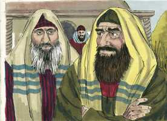 

**3** 	E, estando ele em Betânia, assentado à mesa, em casa de Simão, o leproso, veio uma mulher, que trazia um vaso de alabastro, com ungüento de nardo puro, de muito preço, e quebrando o vaso, lho derramou sobre a cabeça.

 

**4** 	E alguns houve que em si mesmos se indignaram, e disseram: Para que se fez este desperdício de ungüento?

**5** 	Porque podia vender-se por mais de trezentos dinheiros, e dá-lo aos pobres. E bramavam contra ela.

**6** 	Jesus, porém, disse: Deixai-a, por que a molestais? Ela fez-me boa obra.

**7** 	Porque sempre tendes os pobres convosco, e podeis fazer-lhes bem, quando quiserdes; mas a mim nem sempre me tendes.

**8** 	Esta fez o que podia; antecipou-se a ungir o meu corpo para a sepultura.

**9** 	Em verdade vos digo que, em todas as partes do mundo onde este evangelho for pregado, também o que ela fez será contado para sua memória.

**10** 	E Judas Iscariotes, um dos doze, foi ter com os principais dos sacerdotes para lho entregar.

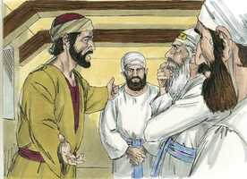 

**11** 	E eles, ouvindo-o, folgaram, e prometeram dar-lhe dinheiro; e buscava como o entregaria em ocasião oportuna.

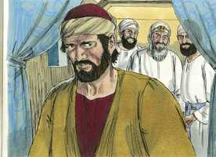 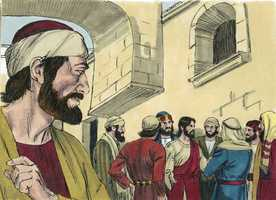 

**12** 	E, no primeiro dia dos pães ázimos, quando sacrificavam a páscoa, disseram-lhe os discípulos: Aonde queres que vamos fazer os preparativos para comer a páscoa?

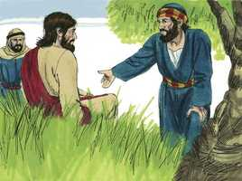 

**13** 	E enviou dois dos seus discípulos, e disse-lhes: Ide à cidade, e um homem, que leva um cântaro de água, vos encontrará; segui-o.

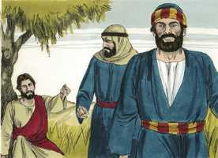 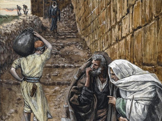 

**14** 	E, onde quer que entrar, dizei ao senhor da casa: O Mestre diz: Onde está o aposento em que hei de comer a páscoa com os meus discípulos?

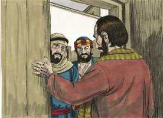 

**15** 	E ele vos mostrará um grande cenáculo mobilado e preparado; preparai-a ali.

 

**16** 	E, saindo os seus discípulos, foram à cidade, e acharam como lhes tinha dito, e prepararam a páscoa.

 

**17** 	E, chegada a tarde, foi com os doze.

**18** 	E, quando estavam assentados a comer, disse Jesus: Em verdade vos digo que um de vós, que comigo come, há de trair-me.

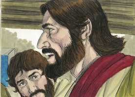 

**19** 	E eles começaram a entristecer-se e a dizer-lhe um após outro: Sou eu? E outro disse: Sou eu?

 

**20** 	Mas ele, respondendo, disse-lhes: É um dos doze, que põe comigo a mão no prato.

**21** 	Na verdade o Filho do homem vai, como dele está escrito, mas ai daquele homem por quem o Filho do homem é traído! Bom seria para o tal homem não haver nascido.

**22** 	E, comendo eles, tomou Jesus pão e, abençoando-o, o partiu e deu-lho, e disse: Tomai, comei, isto é o meu corpo.

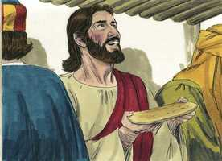 

**23** 	E, tomando o cálice, e dando graças, deu-lho; e todos beberam dele.

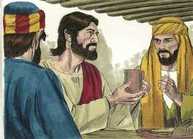 

**24** 	E disse-lhes: Isto é o meu sangue, o sangue do novo testamento, que por muitos é derramado.

**25** 	Em verdade vos digo que não beberei mais do fruto da vide, até àquele dia em que o beber, novo, no reino de Deus.

 

**26** 	E, tendo cantado o hino, saíram para o Monte das Oliveiras.

**27** 	E disse-lhes Jesus: Todos vós esta noite vos escandalizareis em mim; porque está escrito: Ferirei o pastor, e as ovelhas se dispersarão.

 

**28** 	Mas, depois que eu houver ressuscitado, irei adiante de vós para a Galiléia.

**29** 	E disse-lhe Pedro: Ainda que todos se escandalizem, nunca, porém, eu.

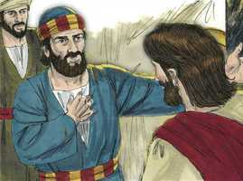 

**30** 	E disse-lhe Jesus: Em verdade te digo que hoje, nesta noite, antes que o galo cante duas vezes, três vezes me negarás.

 

**31** 	Mas ele disse com mais veemência: Ainda que me seja necessário morrer contigo, de modo nenhum te negarei. E da mesma maneira diziam todos também.

 

**32** 	E foram a um lugar chamado Getsêmani, e disse aos seus discípulos: Assentai-vos aqui, enquanto eu oro.

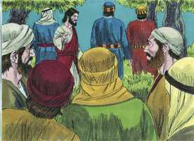 

**33** 	E tomou consigo a Pedro, e a Tiago, e a João, e começou a ter pavor, e a angustiar-se.

 

**34** 	E disse-lhes: A minha alma está profundamente triste até a morte; ficai aqui, e vigiai.

**35** 	E, tendo ido um pouco mais adiante, prostrou-se em terra; e orou para que, se fosse possível, passasse dele aquela hora.

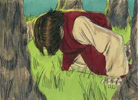 

**36** 	E disse: Aba, Pai, todas as coisas te são possíveis; afasta de mim este cálice; não seja, porém, o que eu quero, mas o que tu queres.

**37** 	E, chegando, achou-os dormindo; e disse a Pedro: Simão, dormes? não podes vigiar uma hora?

 

**38** 	Vigiai e orai, para que não entreis em tentação; o espírito, na verdade, está pronto, mas a carne é fraca.

**39** 	E foi outra vez e orou, dizendo as mesmas palavras.

**40** 	E, voltando, achou-os outra vez dormindo, porque os seus olhos estavam pesados, e não sabiam o que responder-lhe.

**41** 	E voltou terceira vez, e disse-lhes: Dormi agora, e descansai. Basta; é chegada a hora. Eis que o Filho do homem vai ser entregue nas mãos dos pecadores.

 

**42** 	Levantai-vos, vamos; eis que está perto o que me trai.

**43** 	E logo, falando ele ainda, veio Judas, que era um dos doze, da parte dos principais dos sacerdotes, e dos escribas e dos anciãos, e com ele uma grande multidão com espadas e varapaus.

**44** 	Ora, o que o traía, tinha-lhes dado um sinal, dizendo: Aquele que eu beijar, esse é; prendei-o, e levai-o com segurança.

 

**45** 	E, logo que chegou, aproximou-se dele, e disse-lhe: Rabi, Rabi. E beijou-o.

**46** 	E lançaram-lhe as mãos, e o prenderam.

**47** 	E um dos que ali estavam presentes, puxando da espada, feriu o servo do sumo sacerdote, e cortou-lhe uma orelha.

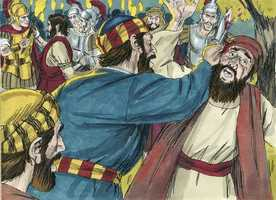 

**48** 	E, respondendo Jesus, disse-lhes: Saístes com espadas e varapaus a prender-me, como a um salteador?

**49** 	Todos os dias estava convosco ensinando no templo, e não me prendestes; mas isto é para que as Escrituras se cumpram.

**50** 	Então, deixando-o, todos fugiram.

**51** 	E um certo jovem o seguia, envolto em um lençol sobre o corpo nu. E lançaram-lhe a mão.

**52** 	Mas ele, largando o lençol, fugiu nu.

**53** 	E levaram Jesus ao sumo sacerdote, e ajuntaram-se todos os principais dos sacerdotes, e os anciãos e os escribas.

**54** 	E Pedro o seguiu de longe até dentro do pátio do sumo sacerdote, e estava assentado com os servidores, aquentando-se ao lume.

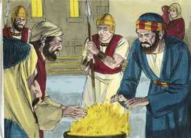 

**55** 	E os principais dos sacerdotes e todo o concílio buscavam algum testemunho contra Jesus, para o matar, e não o achavam.

 

**56** 	Porque muitos testificavam falsamente contra ele, mas os testemunhos não eram coerentes.

**57** 	E, levantando-se alguns, testificaram falsamente contra ele, dizendo:

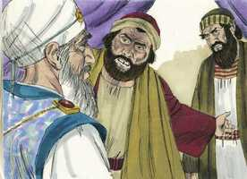 

**58** 	Nós ouvimos-lhe dizer: Eu derrubarei este templo, construído por mãos de homens, e em três dias edificarei outro, não feito por mãos de homens.

**59** 	E nem assim o seu testemunho era coerente.

**60** 	E, levantando-se o sumo sacerdote no Sinédrio, perguntou a Jesus, dizendo: Nada respondes? Que testificam estes contra ti?

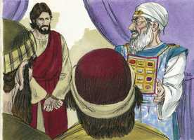 

**61** 	Mas ele calou-se, e nada respondeu. O sumo sacerdote lhe tornou a perguntar, e disse-lhe: És tu o Cristo, Filho do Deus Bendito?

**62** 	E Jesus disse-lhe: Eu o sou, e vereis o Filho do homem assentado à direita do poder de Deus, e vindo sobre as nuvens do céu.

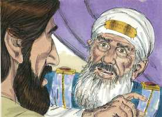 

**63** 	E o sumo sacerdote, rasgando as suas vestes, disse: Para que necessitamos de mais testemunhas?

 

**64** 	Vós ouvistes a blasfêmia; que vos parece? E todos o consideraram culpado de morte.

**65** 	E alguns começaram a cuspir nele, e a cobrir-lhe o rosto, e a dar-lhe punhadas, e a dizer-lhe: Profetiza. E os servidores davam-lhe bofetadas.

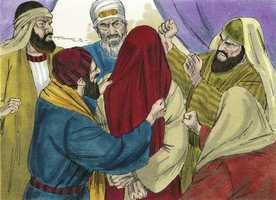 

**66** 	E, estando Pedro embaixo, no átrio, chegou uma das criadas do sumo sacerdote;

**67** 	E, vendo a Pedro, que se estava aquentando, olhou para ele, e disse: Tu também estavas com Jesus, o Nazareno.

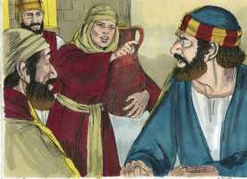 

**68** 	Mas ele negou-o, dizendo: Não o conheço, nem sei o que dizes. E saiu fora ao alpendre, e o galo cantou.

**69** 	E a criada, vendo-o outra vez, começou a dizer aos que ali estavam: Este é um dos tais.

 

**70** 	Mas ele o negou outra vez. E pouco depois os que ali estavam disseram outra vez a Pedro: Verdadeiramente tu és um deles, porque és também galileu, e tua fala é semelhante.

**71** 	E ele começou a praguejar, e a jurar: Não conheço esse homem de quem falais.

 

**72** 	E o galo cantou segunda vez. E Pedro lembrou-se da palavra que Jesus lhe tinha dito: Antes que o galo cante duas vezes, três vezes me negarás. E, retirando-se dali, chorou.

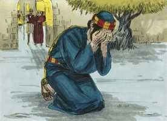 

> **Cmt MHenry** Intro: A negação de Cristo por parte de Pedro começou por mantê-lo afastado dEle. Os que se envergonham da santidade estão bem avançados no caminho de negar a Cristo. os que pensam que é perigoso andar em companhia dos discípulos de Cristo, porque daí podem ser levados a *sofrer* por Ele, encontrarão muito mais perigoso estar na companhia de seus inimigos, porque aí serão levados a *pecar* contra Ele. Quando Cristo era admirado e o seguiam, Pedro o confessou com prontidão; mas não reconhece sua relação com Ele agora que é abandonado e desprezado. Contudo, observe-se que o arrependimento de Pedro foi muito rápido. Quem pensa estar firme, olhe que não caia; e o que caiu, pense nestas coisas, e em suas próprias ofensas, e volte ao Senhor com choro e suplicas, buscando o perdão para ser levantado pelo Espírito Santo.> Aqui temos a condena de Cristo ante o grande conselho dos judeus. Pedro os seguiu, mas o fogo da casa do Sumo Sacerdote não era o lugar apropriado, nem seus servos eram companhia adequada para Pedro: era uma entrada na tentação. Empregou-se grande diligência para conseguir testemunhas falsas contra Jesus, porque o testemunho deles não era equivalente a uma acusação de delito capital, por muito que eles esticassem a lei. Foi-lhe perguntado: Você é o Filho do Bendito? Isto é, o Filho de Deus. Ele se refere a sua segunda vinda para provar que é o Filho de Deus. Temos nestas afrontas muitas provas da inimizade do homem para com Deus, e do amor gratuito e indizível de Deus pelo homem.> Devido a que Cristo não se manifestou como um príncipe temporal, senão que pregou o arrependimento, a reforma e a vida santa, e dirigiu os pensamentos, afetos e propósitos dos homens a outro mundo, por isso, os dirigentes judeus procuraram destruí-lo.\> \ Pedro feriu a um da partida. É mais fácil pelejar por Cristo que morrer por Ele. mas existe uma enorme diferença entre os discípulos falíveis e os hipócritas. Estes últimos chamam a Cristo de Mestre, pressurosos e sem pensar, e expressam grande afeto por Ele, mas o entregam a seus inimigos. Assim aceleram sua própria destruição.> Os sofrimentos de Cristo começaram com os mais dolorosos, os de sua alma. Começou a entristecer-se e a angustiar-se; palavras não utilizadas em Mateus, porém muito cheias de sentido. Os terrores de Deus o combateram, e Ele lhe permitiu contemplá-los. Nunca houve dor como sua dor até agora. Ele foi feito maldição por nós; as maldições da lei foram lançadas sobre Ele como nossa prenda. Agora Ele saboreou a morte em toda sua amargura. Isto era esse medo do que fala o apóstolo, o medo natural à dor e à morte, ante o qual se sobressalta a natureza humana. Poderemos alguma vez ter pensamentos favoráveis ou sequer levianos sobre o pecado, quando vemos os penosos sofrimentos que o pecado trouxe ao Senhor Jesus, ainda que lhe foram reconhecidos? Será leve para nossas almas o que foi tão gravoso para a Sua? Esteve Cristo em tal agonia por nossos pecados, e nós nunca agonizaremos por eles? Como deveríamos olhar para Aquele que traspassamos, e como deveríamos doer-nos! Nos corresponde excessivamente entristecer-nos pelo pecado, porque Ele esteve assim e nunca riu disso. Cristo, como *Homem* rogou que, se possível, passassem dEle seus sofrimentos. Como *Mediador* se submeteu à vontade de Deus, dizendo: Mas não o que eu quero, senão o que tu queres, eu aceito. Veja-se como volta a pecaminosa debilidade dos discípulos de Cristo e os vence. Que lastres tão pesados são nossos corpos para nossas almas! Mas quando vejamos o problema na porta, devemos preparar-nos para isso. Ai, até os crentes costumam olhar de forma turva os sofrimentos do Redentor, e em lugar de estar prontos para morrer com Cristo, nem sequer estão preparados para vigiar com Ele durante uma hora.> A Ceia do Senhor é alimento para a alma, portanto, basta com muito pouco em comparação com o que é para o corpo em tanto sirva de sinal. Foi instituída pelo exemplo e a prática de nosso Mestre para que seguisse vigente até sua segunda vinda. Foi instituída com bênção e ação de graças para ser um memorial da morte de Cristo. Menciona-se freqüentemente seu precioso sangue como o preço de nossa redenção. Quão consolador é isto para os coitados pecadores arrependidos, que o sangue de Cristo seja derramado por muitos! Sem por muitos, por que não por mim? Foi sinal do traspasso dos benefícios adquiridos para nós por sua morte. Apliquem-se à doutrina de Cristo crucificado a vocês mesmos; que seja a carne e a bebida para vossas almas, fortalecendo e refrescando vossa vida espiritual. seria uma primícia e um sabor antecipado da felicidade do céu e, por isso, nos tira o gosto dos prazeres e deleites dos sentidos. Todo o que tem saboreado as delicias espirituais, diretamente deseja as eternas. Embora o grande Pastor passou por seus sofrimentos sem dar um passo em falso, seus seguidores têm sido, contudo, espalhados freqüentemente pela pequena medida dos sofrimentos designados a eles. Quão dados somos a pensar bem de nós mesmos e a confiar em nossos corações! Foi mau que Pedro respondesse assim a seu Senhor, sem temor nem tremor. Senhor, dá-me graça para evitar que te negue.> Nada poderia ser menos resultado da previsão humana que os acontecimentos aqui relatados. Mas nosso Senhor conhece todas as coisas sobre nós antes que aconteçam. Se o recebemos, habitará em nossos corações. O Filho do Homem vai, como está escrito dEle, como cordeiro ao matadouro; porém, ai daquele homem por quem é entregue! Se Deus permite os pecados dos homens, e se glorifica neles, não os obriga a pecar; nem é escusa para sua culpa, nem diminuirá o castigo.> Derramou Cristo até morrer por nós, e pensaremos que há algo demasiado precioso para Ele? Damos-lhe o ungüento precioso de nossos melhores fetos? Amemo-lo com todo o coração embora é comum que o zelo e o afeto sejam mal-entendidos e culpados; e lembremos que a caridade para com o pobre não será escusa de nenhum ato particular de piedade para com o Senhor Jesus. Cristo elogiou a piedosa atenção desta mulher para que o saibam os crentes de todas as épocas. Aos que honram a Cristo, Ele os honrará. A cobiça era a luxúria principal de Judas e isso o traiu para que pecasse traindo a seu Mestre; o diabo adaptou sua tentação a isso e, assim, o venceu. Veja-se quantas tretas enganosas têm muitos em seus esforços pecaminosos; mas o que parece progredir em seus planos, afinal resultará ser maldição.