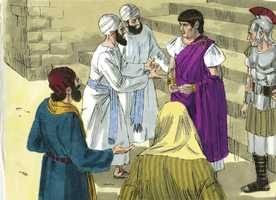
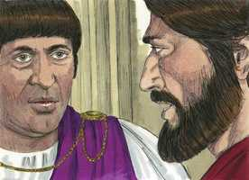
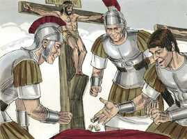
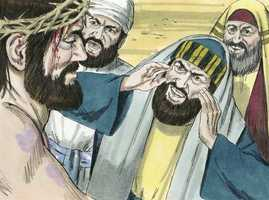
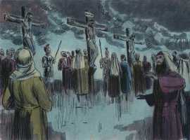
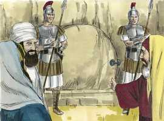
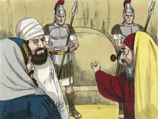

# Marcos Cap 15

**1** 	E, LOGO ao amanhecer, os principais dos sacerdotes, com os anciãos, e os escribas, e todo o Sinédrio, tiveram conselho; e, ligando Jesus, o levaram e entregaram a Pilatos.

 

**2** 	E Pilatos lhe perguntou: Tu és o Rei dos Judeus? E ele, respondendo, disse-lhe: Tu o dizes.

  

**3** 	E os principais dos sacerdotes o acusavam de muitas coisas; porém ele nada respondia.

 

**4** 	E Pilatos o interrogou outra vez, dizendo: Nada respondes? Vê quantas coisas testificam contra ti.

**5** 	Mas Jesus nada mais respondeu, de maneira que Pilatos se maravilhava.

**6** 	Ora, no dia da festa costumava soltar-lhes um preso qualquer que eles pedissem.

**7** 	E havia um chamado Barrabás, que, preso com outros amotinadores, tinha num motim cometido uma morte.

**8** 	E a multidão, dando gritos, começou a pedir que fizesse como sempre lhes tinha feito.

**9** 	E Pilatos lhes respondeu, dizendo: Quereis que vos solte o Rei dos Judeus?

**10** 	Porque ele bem sabia que por inveja os principais dos sacerdotes o tinham entregado.

**11** 	Mas os principais dos sacerdotes incitaram a multidão para que fosse solto antes Barrabás.

**12** 	E Pilatos, respondendo, lhes disse outra vez: Que quereis, pois, que faça daquele a quem chamais Rei dos Judeus?

**13** 	E eles tornaram a clamar: Crucifica-o.

**14** 	Mas Pilatos lhes disse: Mas que mal fez? E eles cada vez clamavam mais: Crucifica-o.

**15** 	Então Pilatos, querendo satisfazer a multidão, soltou-lhe Barrabás e, açoitado Jesus, o entregou para ser crucificado.

**16** 	E os soldados o levaram dentro à sala, que é a da audiência, e convocaram toda a coorte.

**17** 	E vestiram-no de púrpura, e tecendo uma coroa de espinhos, lha puseram na cabeça.

**18** 	E começaram a saudá-lo, dizendo: Salve, Rei dos Judeus!

 

**19** 	E feriram-no na cabeça com uma cana, e cuspiram nele e, postos de joelhos, o adoraram.

**20** 	E, havendo-o escarnecido, despiram-lhe a púrpura, e o vestiram com as suas próprias vestes; e o levaram para fora a fim de o crucificarem.

 

**21** 	E constrangeram um certo Simão, cireneu, pai de Alexandre e de Rufo, que por ali passava, vindo do campo, a que levasse a cruz.

 

**22** 	E levaram-no ao lugar do Gólgota, que se traduz por lugar da Caveira.

 

**23** 	E deram-lhe a beber vinho com mirra, mas ele não o tomou.

**24** 	E, havendo-o crucificado, repartiram as suas vestes, lançando sobre elas sortes, para saber o que cada um levaria.

 

**25** 	E era a hora terceira, e o crucificaram.

**26** 	E por cima dele estava escrita a sua acusação: O REI DOS JUDEUS.

 

**27** 	E crucificaram com ele dois salteadores, um à sua direita, e outro à esquerda.

**28** 	E cumprindo-se a escritura que diz: E com os malfeitores foi contado.

**29** 	E os que passavam blasfemavam dele, meneando as suas cabeças, e dizendo: Ah! tu que derrubas o templo, e em três dias o edificas,

 

**30** 	Salva-te a ti mesmo, e desce da cruz.

**31** 	E da mesma maneira também os principais dos sacerdotes, com os escribas, diziam uns para os outros, zombando: Salvou os outros, e não pode salvar-se a si mesmo.

 

**32** 	O Cristo, o Rei de Israel, desça agora da cruz, para que o vejamos e acreditemos. Também os que com ele foram crucificados o injuriavam.

**33** 	E, chegada a hora sexta, houve trevas sobre toda a terra até a hora nona.

 

**34** 	E, à hora nona, Jesus exclamou com grande voz, dizendo: Eloí, Eloí, lamá sabactâni? que, traduzido, é: Deus meu, Deus meu, por que me desamparaste?

**35** 	E alguns dos que ali estavam, ouvindo isto, diziam: Eis que chama por Elias.

**36** 	E um deles correu a embeber uma esponja em vinagre e, pondo-a numa cana, deu-lho a beber, dizendo: Deixai, vejamos se virá Elias tirá-lo.

**37** 	E Jesus, dando um grande brado, expirou.

 

**38** 	E o véu do templo se rasgou em dois, de alto a baixo.

**39** 	E o centurião, que estava defronte dele, vendo que assim clamando expirara, disse: Verdadeiramente este homem era o Filho de Deus.

 

**40** 	E também ali estavam algumas mulheres, olhando de longe, entre as quais também Maria Madalena, e Maria, mãe de Tiago, o menor, e de José, e Salomé;

 

**41** 	As quais também o seguiam, e o serviam, quando estava na Galiléia; e muitas outras, que tinham subido com ele a Jerusalém.

**42** 	E, chegada a tarde, porquanto era o dia da preparação, isto é, a véspera do sábado,

**43** 	Chegou José de Arimatéia, senador honrado, que também esperava o reino de Deus, e ousadamente foi a Pilatos, e pediu o corpo de Jesus.

 

**44** 	E Pilatos se maravilhou de que já estivesse morto. E, chamando o centurião, perguntou-lhe se já havia muito que tinha morrido.

**45** 	E, tendo-se certificado pelo centurião, deu o corpo a José;

**46** 	O qual comprara um lençol fino, e, tirando-o da cruz, o envolveu nele, e o depositou num sepulcro lavrado numa rocha; e revolveu uma pedra para a porta do sepulcro.

   

**47** 	E Maria Madalena e Maria, mãe de José, observavam onde o punham.

> **Cmt MHenry** Intro: Aqui assistimos ao enterro de nosso Senhor Jesus. oh, que nós possamos, pela graça, sermos plantados em sua semelhança! José de Arimatéia foi um dos que esperava o Reino de Deus. os que esperam por uma quota de seus privilégios devem confessar a causa de Cristo quando parece estar esmagada. A este homem levantou Deus para seu serviço. Houve uma providência especial: que Pilatos fosse tão estrito em sua pesquisa para que não houvesse pretensão de dizer que Jesus estava vivo. Pilatos deu a José permissão para descer o corpo, e fazer o que melhor achasse com ele. algumas das mulheres viram onde foi colocado Jesus, para poder ir depois do dia do repouso a ungir o corpo morto, pois não tiveram tempo de fazê-lo antes. Olharam especialmente no sepulcro de Cristo porque Ele ia levantar-se de novo. Ele não abandonará os que confiam nEle, e o invocam. A morte, privada de seu aguilhão, logo terminará as penas do crente, como terminou as do Salvador.> Houve uma densa escuridão sobre a terra, desde o meio-dia até as três da tarde. Os judeus estavam fazendo o mais que podiam para apagar o Sol de Justiça. As trevas significavam a nuvem sob a qual estava a alma humana de Cristo quando a estava apresentando como oferta pelo pecado. ele não se queixou de que seus discípulos o abandonassem, senão de que seu Pai o desamparasse. Especialmente nisso foi Ele feito pecado por nós. Quando Paulo ia ser oferecido como sacrifício no serviço dos santos, se gozava e se regozijava ([Fp 2.17](../50N-Fp/02.md#17)); mas é outra coisa ser oferecido como sacrifício pelo pecado dos pecadores. No mesmo instante em que Jesus morreu, foi rasgado de alto a baixo o véu do templo. Isto provocou terror aos judeus incrédulos, e foi sinal da destruição de sua igreja e nação. Expressa consolo para todos os cristãos crente, porque significava abrir um caminho novo e vivo ao Lugar Santíssimo pelo sangue de Jesus. A confiança com que Cristo tinha tratado francamente a Deus como seu Pai, encomendando sua alma em suas mãos, parece ter afetado muito o centurião. Os pontos de vista corretos sobre Cristo crucificado reconciliam o crente com o pensamento da morte; anela contemplar, amar e louvar, como devido, a esse Salvador que foi ferido e traspassado para salvá-lo da ira vindoura.> O lugar onde foi crucificado nosso Senhor Jesus era chamado o lugar da Caveira; era o lugar comum para as execuções, porque Ele foi em todo aspecto contados entre os transgressores. Cada vez que olhemos a Cristo crucificado, devemos lembrar o escrito colocado sobre sua cabeça: Ele é um Rei e nós devemos render-nos para sermos seus súbditos, sem dúvida, como israelitas. Crucificaram a dois ladrões com Ele, e Ele no meio; com isso pretendiam desonrá-lo muito, porém estava profetizado que seria contado com os transgressores, porque Ele foi feito pecado por nós.\> \ Ainda os que passavam por ali o insultavam. Diziam-lhe que descesse da cruz, e que acreditariam, mas não creram ainda que lhes deu o sinal mais convincente quando se levantou de seu túmulo. Com que fervor buscará a salvação o homem que crê firmemente na verdade, como é dada a conhecer pelos sofrimentos de Cristo! com quanta gratidão receberá a esperança nascente do perdão e da vida eterna, adquiridos pelos sofrimentos e a morte do Filho de Deus! e com que piedosa tristeza se doerá pelos pecados que crucificaram o Senhor da glória!> Cristo encontrou a morte em seu aspecto mais terrífico. Foi a morte dos malfeitores mais vis. Assim, se reúnem a cruz e a vergonha. Deus tinha sido desonrado pelo pecado do homem, Cristo deu satisfação submetendo-se à maior desgraça com que a natureza humana podia ser carregada. Era uma morte maldita; assim foi marcada pela lei judaica ([Dt 21.23](../05A-Dt/21.md#23)). os soldados romanos zombaram de nosso Senhor Jesus como Rei; como os servos tinham caçoado dEle como Profeta e Salvador no pátio do sumo sacerdote. Será um manto púrpura ou escarlate uma questão de orgulho para um cristão, se foi questão de repreensão e vergonha para Cristo? Ele levou a coroa de espinhos que nós merecíamos, para que nós pudéssemos levar a coroa de glória que Ele merece. Nós fomos, pelo pecado, condenados à vergonha e o desprezo eternos. Ele foi levado com os executores de iniqüidade, ainda que Ele não pecou. Os sofrimentos do manso e santo Redentor são sempre uma fonte de instrução para o crente, da qual não pode esgotar-se em suas melhores horas. Sofreu Jesus assim e eu, vil pecador, me esforçarei ou ficarei descontente? Consentirei com a ira ou emitirei recriminações e ameaças devido aos problemas e injúrias?> Eles amarraram a Cristo. bem é para mundo lembrar freqüentemente as ataduras do Senhor Jesus, como que estamos amarrados com o que foi atado por nós. Ao entregar o Rei, de fato, eles entregaram o Reino de Deus que, portanto, lhes foi tirado como por próprio consentimento deles, e foi entregue e outra nação. Cristo deu uma resposta direta a Pilatos, mas não quis responder às testemunhas porque se sabia que as coisas que alegaram eram falsas, até o próprio Pilatos estava convencido que era assim. Ele pensou que podia apelar desde os sacerdotes ao povo, e que eles libertariam a Jesus das mãos dos sacerdotes, porém eles foram mais e mais pressionados pelos sacerdotes, e gritaram: Crucifica-o! Crucifica-o! Julguemos as pessoas e coisas por seus méritos e a norma da palavra de Deus, e não pelo saber comum. O pensamento de que nunca ninguém foi tratado tão vergonhosamente como a única Pessoa que é perfeitamente excelente, santa e sábia e que tenha aparecido sobre a terra, leva à mente séria a formar-se uma firme opinião da maldade do homem e sua inimizade com Deus. Aborreçamos mais e mais as disposições ruins que marcaram a conduta desses perseguidores.