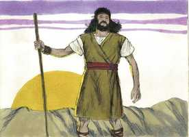

# Lucas Cap 01

**1** 	TENDO, pois, muitos empreendido pôr em ordem a narração dos fatos que entre nós se cumpriram,

**2** 	Segundo nos transmitiram os mesmos que os presenciaram desde o princípio, e foram ministros da palavra,

**3** 	Pareceu-me também a mim conveniente descrevê-los a ti, ó excelente Teófilo, por sua ordem, havendo-me já informado minuciosamente de tudo desde o princípio;

**4** 	Para que conheças a certeza das coisas de que já estás informado.

**5** 	Existiu, no tempo de Herodes, rei da Judéia, um sacerdote chamado Zacarias, da ordem de Abias, e cuja mulher era das filhas de Arão; e o seu nome era Isabel.

 

**6** 	E eram ambos justos perante Deus, andando sem repreensão em todos os mandamentos e preceitos do Senhor.

**7** 	E não tinham filhos, porque Isabel era estéril, e ambos eram avançados em idade.

**8** 	E aconteceu que, exercendo ele o sacerdócio diante de Deus, na ordem da sua turma,

**9** 	Segundo o costume sacerdotal, coube-lhe em sorte entrar no templo do Senhor para oferecer o incenso.

**10** 	E toda a multidão do povo estava fora, orando, à hora do incenso.

**11** 	E um anjo do Senhor lhe apareceu, posto em pé, à direita do altar do incenso.

 

**12** 	E Zacarias, vendo-o, turbou-se, e caiu temor sobre ele.

**13** 	Mas o anjo lhe disse: Zacarias, não temas, porque a tua oração foi ouvida, e Isabel, tua mulher, dará à luz um filho, e lhe porás o nome de João.

 

**14** 	E terás prazer e alegria, e muitos se alegrarão no seu nascimento,

**15** 	Porque será grande diante do Senhor, e não beberá vinho, nem bebida forte, e será cheio do Espírito Santo, já desde o ventre de sua mãe.

**16** 	E converterá muitos dos filhos de Israel ao Senhor seu Deus,

 

**17** 	E irá adiante dele no espírito e virtude de Elias, para converter os corações dos pais aos filhos, e os rebeldes à prudência dos justos, com o fim de preparar ao Senhor um povo bem disposto.

**18** 	Disse então Zacarias ao anjo: Como saberei isto? pois eu já sou velho, e minha mulher avançada em idade.

 

**19** 	E, respondendo o anjo, disse-lhe: Eu sou Gabriel, que assisto diante de Deus, e fui enviado a falar-te e dar-te estas alegres novas.

**20** 	E eis que ficarás mudo, e não poderás falar até ao dia em que estas coisas aconteçam; porquanto não creste nas minhas palavras, que a seu tempo se hão de cumprir.

**21** 	E o povo estava esperando a Zacarias, e maravilhava-se de que tanto se demorasse no templo.

**22** 	E, saindo ele, não lhes podia falar; e entenderam que tinha tido uma visão no templo. E falava por acenos, e ficou mudo.

 

**23** 	E sucedeu que, terminados os dias de seu ministério, voltou para sua casa.

**24** 	E, depois daqueles dias, Isabel, sua mulher, concebeu, e por cinco meses se ocultou, dizendo:

**25** 	Assim me fez o Senhor, nos dias em que atentou em mim, para destruir o meu opróbrio entre os homens.

**26** 	E, no sexto mês, foi o anjo Gabriel enviado por Deus a uma cidade da Galiléia, chamada Nazaré,

**27** 	A uma virgem desposada com um homem, cujo nome era José, da casa de Davi; e o nome da virgem era Maria.

**28** 	E, entrando o anjo aonde ela estava, disse: Salve, agraciada; o Senhor é contigo; bendita és tu entre as mulheres.

 

**29** 	E, vendo-o ela, turbou-se muito com aquelas palavras, e considerava que saudação seria esta.

**30** 	Disse-lhe, então, o anjo: Maria, não temas, porque achaste graça diante de Deus.

 

**31** 	E eis que em teu ventre conceberás e darás à luz um filho, e pôr-lhe-ás o nome de Jesus.

**32** 	Este será grande, e será chamado filho do Altíssimo; e o Senhor Deus lhe dará o trono de Davi, seu pai;

**33** 	E reinará eternamente na casa de Jacó, e o seu reino não terá fim.

**34** 	E disse Maria ao anjo: Como se fará isto, visto que não conheço homem algum?

**35** 	E, respondendo o anjo, disse-lhe: Descerá sobre ti o Espírito Santo, e a virtude do Altíssimo te cobrirá com a sua sombra; por isso também o Santo, que de ti há de nascer, será chamado Filho de Deus.

 

**36** 	E eis que também Isabel, tua prima, concebeu um filho em sua velhice; e é este o sexto mês para aquela que era chamada estéril;

**37** 	Porque para Deus nada é impossível.

**38** 	Disse então Maria: Eis aqui a serva do Senhor; cumpra-se em mim segundo a tua palavra. E o anjo ausentou-se dela.

 

**39** 	E, naqueles dias, levantando-se Maria, foi apressada às montanhas, a uma cidade de Judá,

**40** 	E entrou em casa de Zacarias, e saudou a Isabel.

 

**41** 	E aconteceu que, ao ouvir Isabel a saudação de Maria, a criancinha saltou no seu ventre; e Isabel foi cheia do Espírito Santo.

**42** 	E exclamou com grande voz, e disse: Bendita és tu entre as mulheres, e bendito o fruto do teu ventre.

 

**43** 	E de onde me provém isto a mim, que venha visitar-me a mãe do meu Senhor?

**44** 	Pois eis que, ao chegar aos meus ouvidos a voz da tua saudação, a criancinha saltou de alegria no meu ventre.

**45** 	Bem-aventurada a que creu, pois hão de cumprir-se as coisas que da parte do Senhor lhe foram ditas.

**46** 	Disse então Maria: A minha alma engrandece ao Senhor,

**47** 	E o meu espírito se alegra em Deus meu Salvador;

**48** 	Porque atentou na baixeza de sua serva; Pois eis que desde agora todas as gerações me chamarão bem-aventurada,

**49** 	Porque me fez grandes coisas o Poderoso; E santo é seu nome.

**50** 	E a sua misericórdia é de geração em geração Sobre os que o temem.

**51** 	Com o seu braço agiu valorosamente; Dissipou os soberbos no pensamento de seus corações.

**52** 	Depôs dos tronos os poderosos, E elevou os humildes.

**53** 	Encheu de bens os famintos, E despediu vazios os ricos.

**54** 	Auxiliou a Israel seu servo, Recordando-se da sua misericórdia;

**55** 	Como falou a nossos pais, Para com Abraão e a sua posteridade, para sempre.

**56** 	E Maria ficou com ela quase três meses, e depois voltou para sua casa.

 

**57** 	E completou-se para Isabel o tempo de dar à luz, e teve um filho.

 

**58** 	E os seus vizinhos e parentes ouviram que tinha Deus usado para com ela de grande misericórdia, e alegraram-se com ela.

**59** 	E aconteceu que, ao oitavo dia, vieram circuncidar o menino, e lhe chamavam Zacarias, o nome de seu pai.

 

**60** 	E, respondendo sua mãe, disse: Não, porém será chamado João.

**61** 	E disseram-lhe: Ninguém há na tua parentela que se chame por este nome.

**62** 	E perguntaram por acenos ao pai como queria que lhe chamassem.

**63** 	E, pedindo ele uma tabuinha de escrever, escreveu, dizendo: O seu nome é João. E todos se maravilharam.

 

**64** 	E logo a boca se lhe abriu, e a língua se lhe soltou; e falava, louvando a Deus.

**65** 	E veio temor sobre todos os seus vizinhos, e em todas as montanhas da Judéia foram divulgadas todas estas coisas.

**66** 	E todos os que as ouviam as conservavam em seus corações, dizendo: Quem será, pois, este menino? E a mão do Senhor estava com ele.

**67** 	E Zacarias, seu pai, foi cheio do Espírito Santo, e profetizou, dizendo:

**68** 	Bendito o Senhor Deus de Israel, Porque visitou e remiu o seu povo,

**69** 	E nos levantou uma salvação poderosa Na casa de Davi seu servo.

**70** 	Como falou pela boca dos seus santos profetas, desde o princípio do mundo;

**71** 	Para nos livrar dos nossos inimigos e da mão de todos os que nos odeiam;

**72** 	Para manifestar misericórdia a nossos pais, E lembrar-se da sua santa aliança,

**73** 	E do juramento que jurou a Abraão nosso pai,

**74** 	De conceder-nos que, Libertados da mão de nossos inimigos, o serviríamos sem temor,

**75** 	Em santidade e justiça perante ele, todos os dias da nossa vida.

**76** 	E tu, ó menino, serás chamado profeta do Altíssimo, Porque hás de ir ante a face do Senhor, a preparar os seus caminhos;

**77** 	Para dar ao seu povo conhecimento da salvação, Na remissão dos seus pecados;

**78** 	Pelas entranhas da misericórdia do nosso Deus, Com que o oriente do alto nos visitou;

**79** 	Para iluminar aos que estão assentados em trevas e na sombra da morte; A fim de dirigir os nossos pés pelo caminho da paz.

**80** 	E o menino crescia, e se robustecia em espírito. E esteve nos desertos até ao dia em que havia de mostrar-se a Israel.

 

> **Cmt MHenry** Intro: Zacarias pronuncia uma profecia acerca do reino e a salvação do Messias. O Evangelho traz luz consigo: nele clareia o dia. Em João Batista começou a nascer e sua luz foi aumentando até que o dia foi perfeito. O evangelho é *conhecimento*; mostra aquilo no qual estávamos completamente em trevas; é para dar luz aos que se sentem a escuras, a luz do conhecimento da glória de Deus na face de Jesus Cristo. *Revive*; traz luz aos que se sentam em sombra de morte, como prisioneiros condenados na masmorra. *Conduz*, encaminha nossos passos pelo caminho da paz, a esse caminho que nos trará finalmente a paz ([Rm 3.17](../45N-Rm/03.md#17)). João deu provas de fé firme, afetos fortes e piedosos e de estar acima do medo e do amor pelo mundo. Assim, ele amadureceu para o serviço, mas levou uma vida retirada, até que sai à cena, abertamente, como o precursor do Messias. Continuemos a paz com todos os homens, e procuremos a paz com Deus e com nossas próprias consciências. Se é a vontade de Deus que vivamos desconhecidos para o mundo, ainda assim busquemos diligentemente crescer firmes na graça de Jesus Cristo.> " Nestes versículos temos um relato do nascimento de João Batista, e do grande gozo de todos os familiares. Se chamaria João ou "cheio de graça", pois introduziria o evangelho de Cristo, no qual brilha mais a graça de Deus. Zacarias recuperou a fala. A incredulidade fechou sua boca e ao crer voltou a ser aberta: crê, portanto fala. Quando Deus abre nossos lábios, as bocas devem mostrar seu louvor; e melhor estar mudo que não usar a fala para louvar a Deus. diz-se que a mão do Senhor estava operando em João. Deus tem formas de operar nas crianças, em sua infância, que nós não podemos entender. Devemos observar os tratos de Deus e esperar o acontecimento. "> Muito bom é que aqueles em cujas almas tem começado a obra da graça se comuniquem entre si. Isabel estava ciente, quando chegou Maria, de que se aproximava a que seria a mãe do grande Redentor. Ao mesmo tempo, foi cheia do Espírito Santo, e sob sua influência declarou que Maria e ela esperavam filhos que seriam altamente abençoados e felizes, e particularmente honrados e queridos pelo Deus Altíssimo. Maria, animada pelo discurso de Isabel, e também sob a influência do Espírito Santo, prorrompeu em gozo, admiração e gratidão. Sabia-se pecadora que necessitava uma Salvador, e que, caso contrário, não poderia regozijar-se em Deus mais que como interessada em sua salvação por meio do Messias prometido. Os que captam sua necessidade de Cristo, e que estão desejosos de ter justiça e vida nEle, a estes enche com coisas boas, com as coisas melhores; e são abundantemente satisfeitos com as bênçãos que dá. Ele satisfará os desejos do pobre de espírito que anseia bênçãos espirituais, enquanto que os auto-suficientes serão lançados longe.> " Aqui temos um relato da mãe de nosso Senhor; embora não devamos orar a ela, de todos modos devemos louvar a Deus por ela. Cristo devia nascer miraculosamente. O discurso do anjo somente significa: "Salve, tu que és a escolhida e favorecida especial do Altíssimo para ter a honra que as mães judias desejaram por tanto tempo". Esta aparição e saúdo prodigiosos atordoaram a Maria. O anjo lhe assegurou então que ela tinha achado favor com Deus e que seria a mãe de um filho cujo nome ela devia chamar de Jesus, o Filho do Altíssimo, um em natureza e perfeição com o Senhor Deus. Jesus! o nome que refresca os espíritos desfalecentes dos pecadores humilhados; doce para pronunciar e doce para ouvir, Jesus, o Salvador. Não conhecemos sua riqueza e nossa pobreza, portanto, não corremos a Ele; não percebemos que estamos perdidos e perecendo, em conseqüência, Salvador é palavra de pouco deleite. Se estivermos convencidos da imensa massa de culpa que há em nós, e a ira que pende sobre nossas cabeças, preste a cair sobre nós, seria nosso pensamento contínuo: É meu o Salvador? Para que possamos achá-lo, devemos pisotear todo o que estorva nosso caminho a Ele. A resposta de Maria ao anjo foi a linguagem da fé e humilde admiração, e ela não pediu sinal para confirmar sua fé. Sem controvérsia, grande foi o mistério da santidade, Deus manifestado em carne ([1 Tm 3.16](../54N-1Tm/03.md#16)). A natureza humana de Cristo devia produzir-se dessa forma, para que fosse adequada para Aquele que seria unido com a natureza divina. Devemos, como Maria aqui, guiar nossos desejos pela palavra de Deus. em todos os conflitos devemos lembrar que nada é impossível para Deus; e ao lermos e ouvirmos suas promessas, convertamo-las em orações: *"Eis aqui a serva do Senhor; cumpra-se em mim segundo a tua palavra".* "> O pai e a mãe de Jesus Cristo eram pecadores como todos somos e foram justificados e salvos da mesma forma que os outros, mas foram eminentes por sua piedade e integridade. Não tinham filhos, e não podia esperar-se que Isabel os tivesse em sua avançada idade. Enquanto Zacarias queimava o incenso no templo, toda a multidão orava fora. Todas as orações que oferecemos a Deus são aceitas e bem-sucedidas somente pela intercessão de Cristo no templo de Deus no alto. Não podemos ter a expectativa de possuir um interesse ali se não oramos, se não oramos com nosso espírito, e se não oramos com fervor. Tampouco podemos esperar que o melhor de nossas orações sejam aceitas e tragam uma resposta de paz, se não é a mediação de Cristo, que sempre vive fazendo intercessão. As orações que Zacarias oferecia freqüentemente receberam uma resposta de paz. As orações de fé são arquivadas no céu e não se esquecem. As orações feitas quando éramos jovens e entravamos no mundo, podem ser respondidas quando sejamos velhos e estejamos saindo do mundo. As misericórdias são duplamente doces quando são dadas como respostas à oração. Zacarias terá um filho em idade avançada, o qual será instrumento para a conversão de muitas almas a Deus, e para sua preparação para receber o evangelho de Cristo. Se apresentará ante Ele com coragem, zelo, santidade e uma mente morta aos interesses e prazeres mundanos. Os desobedientes e os rebeldes seriam convertidos à sabedoria de seus antepassados justos, ou melhor, levados a atentar à sabedoria do Justo que viria a eles. Zacarias ouviu tudo o que disse o anjo, mas falou com incredulidade. Deus o tratou *justamente* ao deixá-lo mudo, pois ele tinha objetado a palavra de Deus. podemos admirar a paciência de Deus para conosco. Deus o tratou *amavelmente*, porque assim lhe impediu de falar mais coisas afastadas da fé e em incredulidade. Assim, também, Deus confirmou sua fé. Se pelas repreensões a que estamos submetidos por nosso pecado, somos guiados a dar mais crédito à palavra de Deus, não temos razão para queixar-nos. Ainda os crentes verdadeiros são dados a desonrar a Deus com incredulidade; e suas bocas são fechadas com silêncio e confissão, quando pelo contrário, teriam devido estar louvando a Deus com gozo e gratidão. Nos tratos da graça de Deus devemos observar suas considerações bondosas para conosco. Ele nos olhou com compaixão e favor e, portanto, assim nos tratou.> Lucas não escreve sobre coisas acerca das quais possam diferir entre si os cristãos, e ter vacilações, senão das coisas que são e devem ser cridas com toda certeza. A doutrina de Cristo é no que os mais sábios e melhores homens têm aventurado suas almas com confiança e satisfação. Os grandes acontecimentos dos que dependem nossas esperanças, foram narrados por escrito pelos que, desde o começo, foram testemunhas visuais e ministros da Palavra, e foram aperfeiçoados em seu entendimento por meio da inspiração divina.