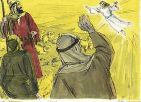
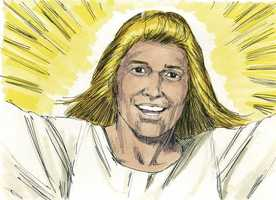
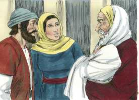
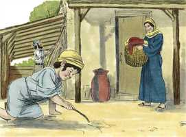
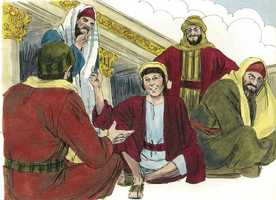

# Lucas Cap 02

**1** 	E ACONTECEU naqueles dias que saiu um decreto da parte de César Augusto, para que todo o mundo se alistasse

**2** 	(Este primeiro alistamento foi feito sendo Quirino presidente da Síria).

**3** 	E todos iam alistar-se, cada um à sua própria cidade.

**4** 	E subiu também José da Galiléia, da cidade de Nazaré, à Judéia, à cidade de Davi, chamada Belém (porque era da casa e família de Davi),

 

**5** 	A fim de alistar-se com Maria, sua esposa, que estava grávida.

**6** 	E aconteceu que, estando eles ali, se cumpriram os dias em que ela havia de dar à luz.

**7** 	E deu à luz a seu filho primogênito, e envolveu-o em panos, e deitou-o numa manjedoura, porque não havia lugar para eles na estalagem.

 

**8** 	Ora, havia naquela mesma comarca pastores que estavam no campo, e guardavam, durante as vigílias da noite, o seu rebanho.

**9** 	E eis que o anjo do Senhor veio sobre eles, e a glória do Senhor os cercou de resplendor, e tiveram grande temor.

 

**10** 	E o anjo lhes disse: Não temais, porque eis aqui vos trago novas de grande alegria, que será para todo o povo:

 

**11** 	Pois, na cidade de Davi, vos nasceu hoje o Salvador, que é Cristo, o Senhor.

**12** 	E isto vos será por sinal: Achareis o menino envolto em panos, e deitado numa manjedoura.

**13** 	E, no mesmo instante, apareceu com o anjo uma multidão dos exércitos celestiais, louvando a Deus, e dizendo:

**14** 	Glória a Deus nas alturas, Paz na terra, boa vontade para com os homens.

**15** 	E aconteceu que, ausentando-se deles os anjos para o céu, disseram os pastores uns aos outros: Vamos, pois, até Belém, e vejamos isso que aconteceu, e que o Senhor nos fez saber.

**16** 	E foram apressadamente, e acharam Maria, e José, e o menino deitado na manjedoura.

 

**17** 	E, vendo-o, divulgaram a palavra que acerca do menino lhes fora dita;

**18** 	E todos os que a ouviram se maravilharam do que os pastores lhes diziam.

**19** 	Mas Maria guardava todas estas coisas, conferindo-as em seu coração.

 

**20** 	E voltaram os pastores, glorificando e louvando a Deus por tudo o que tinham ouvido e visto, como lhes havia sido dito.

**21** 	E, quando os oito dias foram cumpridos, para circuncidar o menino, foi-lhe dado o nome de Jesus, que pelo anjo lhe fora posto antes de ser concebido.

**22** 	E, cumprindo-se os dias da purificação dela, segundo a lei de Moisés, o levaram a Jerusalém, para o apresentarem ao Senhor

 

**23** 	(Segundo o que está escrito na lei do Senhor: Todo o macho primogênito será consagrado ao Senhor);

**24** 	E para darem a oferta segundo o disposto na lei do Senhor: Um par de rolas ou dois pombinhos.

**25** 	Havia em Jerusalém um homem cujo nome era Simeão; e este homem era justo e temente a Deus, esperando a consolação de Israel; e o Espírito Santo estava sobre ele.

 

**26** 	E fora-lhe revelado, pelo Espírito Santo, que ele não morreria antes de ter visto o Cristo do Senhor.

**27** 	E pelo Espírito foi ao templo e, quando os pais trouxeram o menino Jesus, para com ele procederem segundo o uso da lei,

 

**28** 	Ele, então, o tomou em seus braços, e louvou a Deus, e disse:

**29** 	Agora, Senhor, despedes em paz o teu servo, Segundo a tua palavra;

 

**30** 	Pois já os meus olhos viram a tua salvação,

**31** 	A qual tu preparaste perante a face de todos os povos;

**32** 	Luz para iluminar as nações, E para glória de teu povo Israel.

**33** 	E José, e sua mãe, se maravilharam das coisas que dele se diziam.

**34** 	E Simeão os abençoou, e disse a Maria, sua mãe: Eis que este é posto para queda e elevação de muitos em Israel, e para sinal que é contraditado

 

**35** 	(E uma espada traspassará também a tua própria alma); para que se manifestem os pensamentos de muitos corações.

**36** 	E estava ali a profetisa Ana, filha de Fanuel, da tribo de Aser. Esta era já avançada em idade, e tinha vivido com o marido sete anos, desde a sua virgindade;

**37** 	E era viúva, de quase oitenta e quatro anos, e não se afastava do templo, servindo a Deus em jejuns e orações, de noite e de dia.

**38** 	E sobrevindo na mesma hora, ela dava graças a Deus, e falava dele a todos os que esperavam a redenção em Jerusalém.

**39** 	E, quando acabaram de cumprir tudo segundo a lei do Senhor, voltaram à Galiléia, para a sua cidade de Nazaré.

**40** 	E o menino crescia, e se fortalecia em espírito, cheio de sabedoria; e a graça de Deus estava sobre ele.

 

**41** 	Ora, todos os anos iam seus pais a Jerusalém à festa da páscoa;

**42** 	E, tendo ele já doze anos, subiram a Jerusalém, segundo o costume do dia da festa.

 

**43** 	E, regressando eles, terminados aqueles dias, ficou o menino Jesus em Jerusalém, e não o soube José, nem sua mãe.

 

**44** 	Pensando, porém, eles que viria de companhia pelo caminho, andaram caminho de um dia, e procuravam-no entre os parentes e conhecidos;

 

**45** 	E, como o não encontrassem, voltaram a Jerusalém em busca dele.

 

**46** 	E aconteceu que, passados três dias, o acharam no templo, assentado no meio dos doutores, ouvindo-os, e interrogando-os.

 

**47** 	E todos os que o ouviam admiravam a sua inteligência e respostas.

 

**48** 	E quando o viram, maravilharam-se, e disse-lhe sua mãe: Filho, por que fizeste assim para conosco? Eis que teu pai e eu ansiosos te procurávamos.

 

**49** 	E ele lhes disse: Por que é que me procuráveis? Não sabeis que me convém tratar dos negócios de meu Pai?

 

**50** 	E eles não compreenderam as palavras que lhes dizia.

**51** 	E desceu com eles, e foi para Nazaré, e era-lhes sujeito. E sua mãe guardava no seu coração todas estas coisas.

 

**52** 	E crescia Jesus em sabedoria, e em estatura, e em graça para com Deus e os homens.

 

> **Cmt MHenry** Intro: Pela honra de Cristo é que as crianças devem assistir ao serviço público de adoração. Seus pais não voltaram até que tivessem permanecido os sete dias da festa. Bom e permanecer até o fim de uma ordenança como corresponde aos que dizem: Bom é estarmos aqui. Os que perderam suas consolações em Cristo, e as provas de que tinham parte nEle, devem refletir onde e quando e como as perderam, e devem voltar. Os que recuperem sua perdida familiaridade com Cristo devem ir ao lugar em que Ele tem colocado seu nome; ali podem esperar achá-lo. Eles o acharam em alguma parte do templo, onde os doutores da lei tinham suas escolas; estava sentado ali, ouvindo sua instrução, apresentando perguntas e respondendo interrogantes, com tal sabedoria que os que o ouviam se deleitavam com Ele. as pessoas jovens devem procurar o conhecimento da verdade divina, assistir ao ministério do evangelho e fazer tais perguntas a seus anciãos e mestres que tendam a incrementar seu conhecimento. Os que buscam a Cristo com choro, o acharão com o gozo maior. Não sabiam que devia ocupar-me dos negócios de meu Pai? Devo estar na casa de meu Pai; na obra de meu Pai; devo ocupar-me no negócio de meu Pai. Eis aqui um exemplo, pois convém aos filhos de Deus, de conformidade com Cristo, assistir o negócio de seu Pai celestial e fazer que todos os outros interesses lhe cedam o lugar. Ainda que era o Filho de Deus, contudo, esteve submetido a seus pais terrenos;então, como responderão os filhos dos homens, fracos e néscios, que desobedecem a seus pais? Como seja que rejeitemos os ditados dos homens, porque são escuros, não devemos pensar assim dos ditados de Deus. o que ao princípio é escuro pode, depois, voltar-se claro e fácil. Os maiores e mais sábios, os mais eminentes, podem aprender deste admirável Menino Divino, que conhecer nosso lugar e ofício é a grandeza mais verdadeira da alma; para negar-nos as diversões e prazeres que não condizem com nosso estado e vocação.> Então havia muito mal na Igreja, e contudo, Deus não ficou sem testemunho. Ana sempre estava ali ou, pelo menos ia ao templo. Estava sim sempre em espírito de oração; entregava-se à oração e em todas as coisas servia a Deus. Aqueles aos que Cristo se dá a conhecer, têm muitos motivos para dar graças ao Senhor. Ela ensinava aos outros acerca dEle. Que o exemplo dos veneráveis santos, Simeão e Ana, dêem valor àqueles cujas cabeças brancas, como as deles, são coroa de glória, caso se encontrem no caminho da justiça. Os lábios que logo se silenciarão no túmulo, devem dar louvores ao Redentor. Em todas as coisas conveio a Cristo ser feito semelhante a seus irmãos, portanto, passou a infância e a meninice como as outras crianças, porém sem pecado e com provas evidentes da natureza divina nEle. Pelo Espírito de Deus todas suas faculdades desempenharam os ofícios de uma forma não vista em mais ninguém. Outras crianças têm abundante torpeza em seus corações, o que se adverte no que dizem ou fazem, mas Ele estava cheio de sabedoria pelo poder do Espírito Santo; tudo o que disse ou fez foi dito e feito sabiamente, por acima de sua idade. Outros meninos mostram a corrupção de sua natureza; nada senão a graça de Deus estava sobre Ele.> O mesmo Espírito que proveu para sustentar a esperança de Simeão, proveu para seu gozo. os que desejam ver a Cristo devem ir a seu templo. Eis aqui uma confissão de sua fé, que o Menino que tem nos braços era o Salvador, a salvação mesma, a salvação planificada por Deus. despede-se deste mundo. Quão pobre lhe parece este mundo ao que tem a Cristo em seus braços, e a salvação à vista! Veja-se aqui quão consoladora é a morte de um homem bom; vai-se em paz com Deus, em paz com sua consciência, em paz com a morte. Os que deram as boas-vindas a Cristo, podem dar as boas-vindas à morte. José e Maria se maravilhavam ante as coisas que se diziam do Menino. Simeão lhes mostra igualmente quanta razão tinham para regozijar-se com tremor. Ainda se fala contra Jesus, sua doutrina e seu povo; ainda se nega e se blasfema sua verdade e sua santidade; sua palavra pregada continua sendo a pedra de toque do caráter dos homens. os bons afetos secretos das mentes de alguns serão revelados ao abraçar a Cristo; as corrupções secretas dos outros serão reveladas por sua inimizade com Cristo. os homens serão julgados pelos pensamentos de seus corações em relação a Cristo. Ele será um Jesus sofredor; sua mãe sofrerá com Ele devido à proximidade da relação e ao afeto dela.> Nosso Senhor Jesus não nasceu em pecado e não necessitou a mortificação de uma natureza corrupta ou a renovação para santidade, que significava a circuncisão. Esta ordenança foi, em seu caso, uma prenda de sua futura obediência perfeita de toda a lei, em meio de sofrimentos e tentações, ainda até a morte por nós. No final dos quarenta dias,Maria foi ao templo a oferecer os sacrifícios estabelecidos para sua purificação. José apresenta também ao santo menino Jesus, porque como primogênito, devia ser apresentado ao Senhor, e ser remido conforme com a lei. Apresentemos nossos filhos ao Senhor que nos o deu, rogando-lhe que os resgate do pecado e da morte, e os faça santos para Ele.> Os anjos foram arautos do recém-nascido Salvador, mas foram enviados somente a uns pastores pobres, humildes, piedosos, trabalhadores, que estavam ocupados em sua vocação, vigiando seus rebanhos. Não estamos fora do caminho das visitas divinas quando estamos empregados em uma vocação honesta e permanecemos com Deus nisso. Que Deus tenha a honra desta obra; glória a Deus nas alturas. A boa vontade de Deus para com os homens, manifestada no envio do Messias, redunda para sua glória. Outras obras de Deus são para sua glória, mas a redenção do mundo é para sua glória no alto. A boa vontade de Deus ao enviar o Messias trouxe a paz a este mundo inferior. A paz é aqui colocada para tudo o de bom que flui a nós desde que Cristo assumiu nossa natureza. Ditado fiel é este, avaliado por uma companhia incontável de anjos, e bem digno de toda aceitação: que a boa vontade de Deus para com os homens é glória para Deus no alto, e paz na terra. Os pastores não perderam tempo; partiram pressurosos para o lugar. ficaram satisfeitos e deram a conhecer por todas partes acerca deste menino, que era o Salvador, Cristo o Senhor. Maria observa cuidadosamente e pensa em todas estas coisas, que eram tão boas para vivificar seus piedosos afetos. Deveremos ser mais livrados dos erros de juízo e prática se sopesarmos mais plenamente estas coisas em nossos corações. Ainda se proclama em nossos ouvidos que *nos* nasceu um Salvador, Cristo o Senhor. Esta deve ser a boa nova para todos.> A plenitude do tempo estava agora para chegar, quando Deus enviaria seu Filho, nascido de mulher e submetido à lei. As circunstâncias de seu nascimento foram muito vis. Cristo nasceu numa pousada; veio ao mundo a estar aqui por um tempo, como numa pousada, e a ensinar-nos a fazer o mesmo. o pecado nos faz como um infante abandonado, indefeso e solitário; e assim foi Cristo. Ele soube bem quão pouca vontade há para que nos alojem, nos vistam, nos alimentem pobremente; quanto desejamos ter nossos filhos ataviados e consentidos; quão dados são os pobres a invejar o rico, e quanto tendem os ricos a desprezar os pobres. Mas quando pela fé vemos o Filho de Deus que é feito homem e jaz numa manjedoura, nossa vaidade, ambição e inveja são freadas. Não podemos buscar grandes coisas para nós mesmos ou para nossos filhos tendo este objeto justo diante de nós.