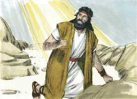
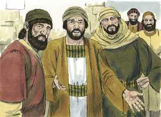
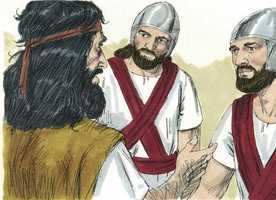
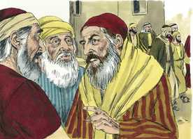

# Lucas Cap 03

**1** 	E NO ano quinze do império de Tibério César, sendo Pôncio Pilatos presidente da Judéia, e Herodes tetrarca da Galiléia, e seu irmão Filipe tetrarca da Ituréia e da província de Traconites, e Lisânias tetrarca de Abilene,

 

**2** 	Sendo Anás e Caifás sumos sacerdotes, veio no deserto a palavra de Deus a João, filho de Zacarias.

 

**3** 	E percorreu toda a terra ao redor do Jordão, pregando o batismo de arrependimento, para o perdão dos pecados;

  

**4** 	Segundo o que está escrito no livro das palavras do profeta Isaías, que diz: Voz do que clama no deserto: Preparai o caminho do Senhor; Endireitai as suas veredas.

**5** 	Todo o vale se encherá, E se abaixará todo o monte e outeiro; E o que é tortuoso se endireitará, E os caminhos escabrosos se aplanarão;

**6** 	E toda a carne verá a salvação de Deus.

**7** 	Dizia, pois, João à multidão que saía para ser batizada por ele: Raça de víboras, quem vos ensinou a fugir da ira que está para vir?

 

**8** 	Produzi, pois, frutos dignos de arrependimento, e não comeceis a dizer em vós mesmos: Temos Abraão por pai; porque eu vos digo que até destas pedras pode Deus suscitar filhos a Abraão.

**9** 	E também já está posto o machado à raiz das árvores; toda a árvore, pois, que não dá bom fruto, corta-se e lança-se no fogo.

**10** 	E a multidão o interrogava, dizendo: Que faremos, pois?

 

**11** 	E, respondendo ele, disse-lhes: Quem tiver duas túnicas, reparta com o que não tem, e quem tiver alimentos, faça da mesma maneira.

**12** 	E chegaram também uns publicanos, para serem batizados, e disseram-lhe: Mestre, que devemos fazer?

 

**13** 	E ele lhes disse: Não peçais mais do que o que vos está ordenado.

**14** 	E uns soldados o interrogaram também, dizendo: E nós que faremos? E ele lhes disse: A ninguém trateis mal nem defraudeis, e contentai-vos com o vosso soldo.

 

**15** 	E, estando o povo em expectação, e pensando todos de João, em seus corações, se porventura seria o Cristo,

 

**16** 	Respondeu João a todos, dizendo: Eu, na verdade, batizo-vos com água, mas eis que vem aquele que é mais poderoso do que eu, do qual não sou digno de desatar a correia das alparcas; esse vos batizará com o Espírito Santo e com fogo.

 

**17** 	Ele tem a pá na sua mão; e limpará a sua eira, e ajuntará o trigo no seu celeiro, mas queimará a palha com fogo que nunca se apaga.

**18** 	E assim, admoestando-os, muitas outras coisas também anunciava ao povo.

**19** 	Sendo, porém, o tetrarca Herodes repreendido por ele por causa de Herodias, mulher de seu irmão Filipe, e por todas as maldades que Herodes tinha feito,

 

**20** 	Acrescentou a todas as outras ainda esta, a de encerrar João num cárcere.

**21** 	E aconteceu que, como todo o povo se batizava, sendo batizado também Jesus, orando ele, o céu se abriu;

 

**22** 	E o Espírito Santo desceu sobre ele em forma corpórea, como pomba; e ouviu-se uma voz do céu, que dizia: Tu és o meu Filho amado, em ti me comprazo.

**23** 	E o mesmo Jesus começava a ser de quase trinta anos, sendo (como se cuidava) filho de José, e José de Heli,

**24** 	E Heli de Matã, e Matã de Levi, e Levi de Melqui, e Melqui de Janai, e Janai de José,

**25** 	E José de Matatias, e Matatias de Amós, e Amós de Naum, e Naum de Esli, e Esli de Nagaí,

**26** 	E Nagaí de Máate, e Máate de Matatias, e Matatias de Semei, e Semei de José, e José de Jodá,

**27** 	E Jodá de Joanã, e Joanã de Resá, e Resá de Zorobabel, e Zorobabel de Salatiel, e Salatiel de Neri,

**28** 	E Neri de Melqui, e Melqui de Adi, e Adi de Cosã, e Cosã de Elmadã, e Elmadã de Er,

**29** 	E Er de Josué, e Josué de Eliézer, e Eliézer de Jorim, e Jorim de Matã, e Matã de Levi,

**30** 	E Levi de Simeão, e Simeão de Judá, e Judá de José, e José de Jonã, e Jonã de Eliaquim,

**31** 	E Eliaquim de Meleá, e Meleá de Mená, e Mená de Matatá, e Matatá de Natã, e Natã de Davi,

**32** 	E Davi de Jessé, e Jessé de Obede, e Obede de Boaz, e Boaz de Salá, e Salá de Naassom,

**33** 	E Naassom de Aminadabe, e Aminadabe de Arão, e Arão de Esrom, e Esrom de Perez, e Perez de Judá,

**34** 	E Judá de Jacó, e Jacó de Isaque, e Isaque de Abraão, e Abraão de Terá, e Terá de Nacor,

**35** 	E Nacor de Seruque, e Seruque de Ragaú, e Ragaú de Fáleque, e Fáleque de Éber, e Éber de Salá,

**36** 	E Salá de Cainã, e Cainã de Arfaxade, e Arfaxade de Sem, e Sem de Noé, e Noé de Lameque,

**37** 	E Lameque de Matusalém, e Matusalém de Enoque, e Enoque de Jarete, e Jarete de Maleleel, e Maleleel de Cainã,

**38** 	E Cainã de Enos, e Enos de Sete, e Sete de Adão, e Adão de Deus.

> **Cmt MHenry** Intro: " A lista que dá Mateus dos antepassados de Jesus mostra que Cristo era o filho de Abraão, em quem são abençoadas todas as famílias da terra, e herdeiro do trono de Davi; porém Lucas demonstra que Jesus era a Semente da mulher que esmagaria a cabeça da serpente, e remonta sua linhagem a Adão, começando com Eli, o pai, não de José, senão de Maria. As evidentes diferenças entre ambos evangelistas nas listas de nomes foram solucionadas por homens doutos. Mas nossa salvação não depende de que sejamos capazes de resolver estas dificuldades, nem a autoridade divina dos evangelhos é enfraquecida por elas. A lista de nomes termina assim: *"...e Sete de Adão, e Adão de Deus"*, isto é, a prole de Deus por criação. Cristo foi o filho de Adão e Filho de Deus, para que fosse o Mediador apropriado entre Deus e os filhos de Adão, e pudesse levar os filhos de Adão, por meio dEle, a serem filhos de Deus. toda carne, por descender do primeiro Adão, é como erva, e murcha como a flor do campo, mas o que participa do Espírito Santo da vida do Segundo Adão tem esse gozo eterno que, pelo evangelho, nos é pregado. "> Cristo não confessou pecado, como os outros, pois não tinha nada a confessar; senão que orou, como o resto, e manteve a comunhão com seu Pai.\ Veja-se que as três palavras do céu, pelas quais o Pai deu testemunho de seu Filho, foram pronunciadas enquanto orava ou pouco depois ([Lc 9.35](../42N-Lc/09.md#35); [Jo 12.28](../43N-Joa/12.md#28)). O Espírito Santo desceu sobre Ele em forma corpórea como uma pomba, e veio uma voz do céu, desde Deus Pai, desde a magnífica glória. Assim, no batismo de Cristo se deu prova da Santa Trindade, das Três Pessoas da Divindade.> João Batista reconhece que não é o Cristo; mas confirma as expectativas da gente sobre o tão longamente prometido Messias. Somente podia exortá-los a arrepender-se e assegurar o perdão pelo arrependimento, mas não podia operar o arrependimento neles nem conferi-lhes a remissão. Assim nos corresponde falar elevadamente de Cristo e humildemente de nós mesmos. João não podia fazer mais que batizar com água, como sinal de que deviam purificar-se e limpar-se, mas Cristo pode e quer batizar com o Espírito Santo; Ele pode dar o Espírito para que limpe e purifique o coração, não somente como a água lava a imundícia por fora, senão como o fogo limpa a escoria interna e funde o metal para que seja jogado num novo molde. João era um pregador *afetuoso*: suplicava, ia direto ao coração dos ouvintes. Era um pregador *prático*: os despertava para cumprir com seu dever e os dirigia a eles. Era um pregador *popular*: dirigia-se as pessoas segundo a capacidade deles. Era um pregador *evangélico*: em todas suas exortações guiava a gente a Cristo. quando pressionamos a gente com o dever, devemos conduzi-los a Cristo, por justiça e por força. Foi um pregador *abundante*: não deixava de declarar todo o conselho de Deus, mas quando estava na metade de sua vida útil, foi dado um repentino final à pregação de João. sendo Herodes, por suas muitas maldades, reprovado por ele, encarcerou a João. Os que fazem dano aos servos fiéis de Deus, agregam culpa maior ainda a seus outros pecados.> O alcance e desígnio do ministério de João eram levar o povo desde seus pecados a seu Salvador. Veio a pregar, não uma seita nem um partido político, senão uma profissão de fé; o sinal ou cerimônia era o lavamento com água. Pelas palavras aqui utilizadas, João pregou a necessidade do arrependimento para a remissão dos pecados, e que o batismo de água era um sinal externo da purificação interna e a renovação do coração que acompanha, ou são os efeitos do arrependimento verdadeiro e profissão de arrependimento. Aqui no ministério de João está o cumprimento das Escrituras ([Isaias 40.3](../23A-Is/40.md#3)). quando no com se faz caminho para o evangelho, abatendo os pensamentos altivos e levando-os à obediência de Cristo, aplanando a alma e eliminando todo o que nos estorve no caminho de Cristo e de sua graça, então se efetuam os preparativos para dar as boas-vindas à salvação de Deus. Aqui há advertências e exortações gerais que deu João. A culpável raça corrupta da humanidade chegou a ser uma geração de víboras; odiavam a Deus e se odiavam uns a outros. Não há maneira de fugir da ira vindoura, senão pelo arrependimento, e a mudança de nossa conduta deve demonstrar a mudança de nossa mentalidade. Se não formos igualmente santos, de coração e de vida, nossa profissão de religião e relação com Deus e sua Igreja não nos servirá para nada em absoluto; mais penosa será nossa destruição se não darmos frutos dignos de arrependimento. João Batista deu instruções a várias classes de pessoas. Os que professam e prometem arrependimento devem demonstrá-lo por sua reforma, segundo sua ocupação e sua condição. O evangelho requer misericórdia, não sacrifício; e seu objetivo é comprometer-nos a todos a fazer todo o bem que pudermos, e a sermos justos com todos os homens. O mesmo princípio que leva os homens a renunciar aos ganhos injustos, os leva a restaurar o lucrado em forma errada. João indica seu dever aos soldados. Deve-se advertir aos homens contra as tentações de seus empregos. As respostas declaram o dever presente dos que perguntavam e, de imediato, se constituíam em uma prova de sua sinceridade. Como ninguém pode ou quer aceitar a salvação de Cristo sem arrependimento verdadeiro, assim de indicam aqui a evidência e os efeitos do arrependimento.