# Lucas Cap 04

**1** 	E JESUS, cheio do Espírito Santo, voltou do Jordão e foi levado pelo Espírito ao deserto;

 

**2** 	E quarenta dias foi tentado pelo diabo, e naqueles dias não comeu coisa alguma; e, terminados eles, teve fome.

**3** 	E disse-lhe o diabo: Se tu és o Filho de Deus, dize a esta pedra que se transforme em pão.

 

**4** 	E Jesus lhe respondeu, dizendo: Está escrito que nem só de pão viverá o homem, mas de toda a palavra de Deus.

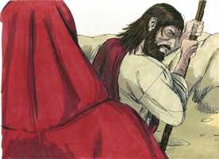 

**5** 	E o diabo, levando-o a um alto monte, mostrou-lhe num momento de tempo todos os reinos do mundo.

 

**6** 	E disse-lhe o diabo: Dar-te-ei a ti todo este poder e a sua glória; porque a mim me foi entregue, e dou-o a quem quero.

**7** 	Portanto, se tu me adorares, tudo será teu.

**8** 	E Jesus, respondendo, disse-lhe: Vai-te para trás de mim, Satanás; porque está escrito: Adorarás o Senhor teu Deus, e só a ele servirás.

**9** 	Levou-o também a Jerusalém, e pô-lo sobre o pináculo do templo, e disse-lhe: Se tu és o Filho de Deus, lança-te daqui abaixo;

 

**10** 	Porque está escrito: Mandará aos seus anjos, acerca de ti, que te guardem,

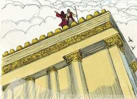 

**11** 	E que te sustenham nas mãos, Para que nunca tropeces com o teu pé em alguma pedra.

**12** 	E Jesus, respondendo, disse-lhe: Dito está: Não tentarás ao Senhor teu Deus.

 

**13** 	E, acabando o diabo toda a tentação, ausentou-se dele por algum tempo.

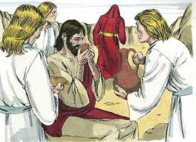 

**14** 	Então, pela virtude do Espírito, voltou Jesus para a Galiléia, e a sua fama correu por todas as terras em derredor.

**15** 	E ensinava nas suas sinagogas, e por todos era louvado.

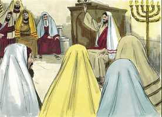 

**16** 	E, chegando a Nazaré, onde fora criado, entrou num dia de sábado, segundo o seu costume, na sinagoga, e levantou-se para ler.

**17** 	E foi-lhe dado o livro do profeta Isaías; e, quando abriu o livro, achou o lugar em que estava escrito:

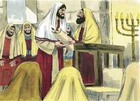 

**18** 	O Espírito do Senhor é sobre mim, Pois que me ungiu para evangelizar os pobres. Enviou-me a curar os quebrantados de coração,

 

**19** 	A pregar liberdade aos cativos, E restauração da vista aos cegos, A pôr em liberdade os oprimidos, A anunciar o ano aceitável do Senhor.

 

**20** 	E, cerrando o livro, e tornando-o a dar ao ministro, assentou-se; e os olhos de todos na sinagoga estavam fitos nele.

**21** 	Então começou a dizer-lhes: Hoje se cumpriu esta Escritura em vossos ouvidos.

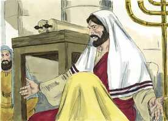 

**22** 	E todos lhe davam testemunho, e se maravilhavam das palavras de graça que saíam da sua boca; e diziam: Não é este o filho de José?

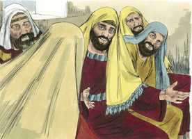 

**23** 	E ele lhes disse: Sem dúvida me direis este provérbio: Médico, cura-te a ti mesmo; faze também aqui na tua pátria tudo que ouvimos ter sido feito em Cafarnaum.

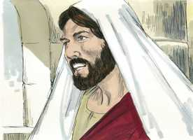 

**24** 	E disse: Em verdade vos digo que nenhum profeta é bem recebido na sua pátria.

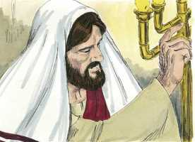 

**25** 	Em verdade vos digo que muitas viúvas existiam em Israel nos dias de Elias, quando o céu se cerrou por três anos e seis meses, de sorte que em toda a terra houve grande fome;

**26** 	E a nenhuma delas foi enviado Elias, senão a Sarepta de Sidom, a uma mulher viúva.

**27** 	E muitos leprosos havia em Israel no tempo do profeta Eliseu, e nenhum deles foi purificado, senão Naamã, o sírio.

**28** 	E todos, na sinagoga, ouvindo estas coisas, se encheram de ira.

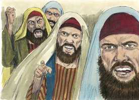 

**29** 	E, levantando-se, o expulsaram da cidade, e o levaram até ao cume do monte em que a cidade deles estava edificada, para dali o precipitarem.

 

**30** 	Ele, porém, passando pelo meio deles, retirou-se.

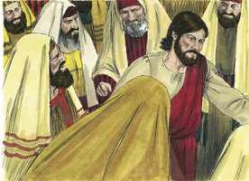 

**31** 	E desceu a Cafarnaum, cidade da Galiléia, e os ensinava nos sábados.

 

**32** 	E admiravam a sua doutrina porque a sua palavra era com autoridade.

**33** 	E estava na sinagoga um homem que tinha o espírito de um demônio imundo, e exclamou em alta voz,

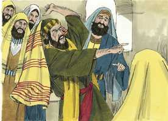 

**34** 	Dizendo: Ah! que temos nós contigo, Jesus Nazareno? Vieste a destruir-nos? Bem sei quem és: O Santo de Deus.

**35** 	E Jesus o repreendeu, dizendo: Cala-te, e sai dele. E o demônio, lançando-o por terra no meio do povo, saiu dele sem lhe fazer mal.

 

**36** 	E veio espanto sobre todos, e falavam uns com os outros, dizendo: Que palavra é esta, que até aos espíritos imundos manda com autoridade e poder, e eles saem?

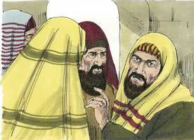 

**37** 	E a sua fama divulgava-se por todos os lugares, em redor daquela comarca.

**38** 	Ora, levantando-se Jesus da sinagoga, entrou em casa de Simão; e a sogra de Simão estava enferma com muita febre, e rogaram-lhe por ela.

 

**39** 	E, inclinando-se para ela, repreendeu a febre, e esta a deixou. E ela, levantando-se logo, servia-os.

 

**40** 	E, ao pôr do sol, todos os que tinham enfermos de várias doenças lhos traziam; e, pondo as mãos sobre cada um deles, os curava.

 

**41** 	E também de muitos saíam demônios, clamando e dizendo: Tu és o Cristo, o Filho de Deus. E ele, repreendendo-os, não os deixava falar, pois sabiam que ele era o Cristo.

**42** 	E, sendo já dia, saiu, e foi para um lugar deserto; e a multidão o procurava, e chegou junto dele; e o detinham, para que não se ausentasse deles.

 

**43** 	Ele, porém, lhes disse: Também é necessário que eu anuncie a outras cidades o evangelho do reino de Deus; porque para isso fui enviado.

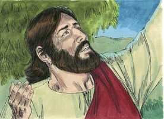 

**44** 	E pregava nas sinagogas da Galiléia.

> **Cmt MHenry** Intro: A pregação de Cristo afetava muito as pessoas; e um poder que operava ia com ela à consciência dos homens. os milagres demonstravam que Cristo é quem domina e vence a Satanás, e o que cura as doenças. Onde Cristo dá vida nova, na recuperação de uma doença, deve ser uma vida nova dedicada mais que nunca a seu serviço, a sua glória. Nossa ocupação deve ser difundir amplamente a fama de Cristo em todo lugar, buscá-lo por conta dos doentes de corpo e mente, e usar nossa influência para conduzir a Ele os pecadores, para que suas mãos possam ser impostas sobre eles, a fim que sejam sarados. Ele expulsa os demônios de muitos que estavam possuídos. Não fomos enviados ao mundo para viver somente para nós, senão para glorificar a Deus e fazer o bem à nossa geração. A gente o buscava e ia a Ele. um deserto não é deserto se estamos com Cristo. Ele continuará conosco, por sua palavra e seu Espírito, e estenderá as mesmas bênçãos a outras nações até que, por toda a terra, os servos e adoradores de Satanás sejam levados a lembrá-lo como o Cristo, o Filho de Deus, e achem redenção por meio de seu sangue, o perdão dos pecados.> Cristo ensinou nas sinagogas, os lugares de adoração pública, onde se reuniam a ler, expor e aplicar a palavra, a orar e louvar. Todos os dons e as graças do Espírito estavam sem medida sobre Ele e nEle. Por Cristo os pecadores podem ser livrados das ataduras da culpa e, por seu Espírito e sua graça, das ataduras da corrupção. Ele veio pela palavra de seu Evangelho a trazer luz aos que estavam nas trevas e, pelo poder de sua graça, a dar vista aos que estavam cegos. Pregou o ano aceitável do Senhor. Os pecadores devem ouvir o convite do Senhor quando se proclama a liberdade. O nome de Cristo era Maravilhoso; em nada o foi mais que na Palavra de sua graça, e o poder que ia com ela. Bem podemos maravilhar-nos que dissesse as palavras de graça a infelizes desditados como a humanidade. Algum prejuízo costuma apresentar uma objeção contra a doutrina da cruz que humilha; e ainda que seja a Palavra de Deus que incita à inimizade dos homens, eles culparão a conduta ou as maneiras do orador. A doutrina da soberania de Deus, seu direito a fazer sua vontade, provoca os homens orgulhosos. Eles não procuram seu favor a sua maneira; e ficam irados quando os outros têm os favores que eles rejeitam. Ainda continua sendo Jesus rejeitado pelas multidões que ouvem a mesma mensagem de suas palavras. Embora o crucificam de novo em seus pecados, podemos honrá-lo como Filho de Deus, o Salvador dos homens, e procurar mostrar por nossa obediência que assim o fazemos.> Ao ser levado ao deserto, Cristo deu vantagem ao tentador; porque estava sozinho, ninguém estava com Ele para que, pelas orações e conselhos deles, tivesse recebido ajuda na hora da tentação. Ele, que conhecia sua força, podia dar vantagem a Satanás, mas não assim nós, que conhecemos nossa fraqueza. Sendo em todas as coisas semelhante a seus irmãos, Jesus como os outros filhos de Deus, viveria em dependência da providência e a promessa divina. A palavra de Deus é a nossa espada, e a fé na palavra, o nosso escudo. Deus tem muitas formas de prover a seu povo e, portanto, devemos depender dEle em todo tempo no caminho do dever. Todas as promessas de Satanás são mentirosas; e se lhe é permitido o poder de dispor dos reinos do mundo e a glória deles, os usa como isca para capturar homens para destruí-los. Devemos rejeitar de imediato, e com aborrecimento, toda oportunidade de lucro ou avanço pecaminoso, como preço oferecido por nossa alma; devemos procurar as riquezas, as honras e a felicidade somente na adoração e o serviço a Deus. Cristo não adora a Satanás; nem tolera que restem vestígios da adoração ao diabo para quando seu Pai lhe entregue o reino do mundo. Satanás também tentou a Jesus para que fosse seu próprio assassino por uma confiança incorreta na proteção de seu Pai, da qual não tinha garantia.\> \ Nenhum mal da Escritura de parte de Satanás ou dos homens abata a nossa estima, ou no faça abandonar sua utilidade; continuemos estudando-a, procurando conhecê-la, e buscando nossa defesa nela contra toda classe de ataques. A palavra habite em nós em abundância, pois é a nossa vida. Nosso Redentor vitorioso venceu, não somente por Ele, senão também por nós. O diabo terminou toda tentação. Cristo o deixou provar toda sua força e o derrotou. Satanás viu que não fazia sentido atacar a Cristo, que nada havia nEle onde se pregassem seus dardos de fogo. Se resistirmos ao diabo, ele fugirá de nós. Apesar de ter ido embora, o fez temporalmente até quando de novo seria solto sobre Jesus, não como tentador para levá-lo ao pecado, senão como perseguidor para conduzir a Cristo a sofrer, e assim ferir seu calcanhar, que foi o que lhe disseram que deveria fazer, e desejaria fazer, ainda que significasse ferir sua própria cabeça ([Gn 3.15](../01A-Gn/03.md#15)). Ainda que Satanás vá embora por uma temporada, nunca estaremos fora de seu alcance até que seja tirado deste presente mundo malvado.