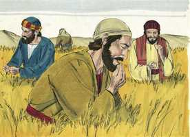
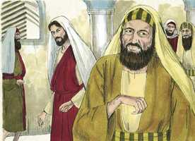
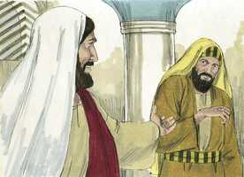
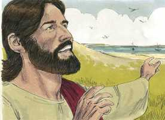
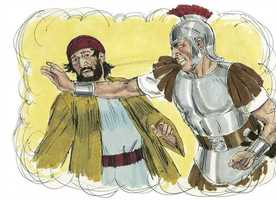
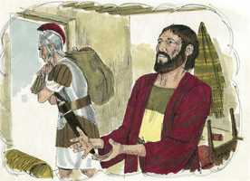
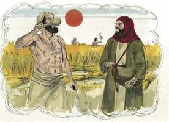

# Lucas Cap 06

**1** 	E ACONTECEU que, no segundo sábado após o primeiro, passou pelas searas, e os seus discípulos iam arrancando espigas e, esfregando-as com as mãos, as comiam.

 

**2** 	E alguns dos fariseus lhes disseram: Por que fazeis o que não é lícito fazer nos sábados?

 

**3** 	E Jesus, respondendo-lhes, disse: Nunca lestes o que fez Davi quando teve fome, ele e os que com ele estavam?

 

**4** 	Como entrou na casa de Deus, e tomou os pães da proposição, e os comeu, e deu também aos que estavam com ele, os quais não é lícito comer senão só aos sacerdotes?

**5** 	E dizia-lhes: O Filho do homem é Senhor até do sábado.

 

**6** 	E aconteceu também noutro sábado, que entrou na sinagoga, e estava ensinando; e havia ali um homem que tinha a mão direita mirrada.

 

**7** 	E os escribas e fariseus observavam-no, se o curaria no sábado, para acharem de que o acusar.

 

**8** 	Mas ele bem conhecia os seus pensamentos; e disse ao homem que tinha a mão mirrada: Levanta-te, e fica em pé no meio. E, levantando-se ele, ficou em pé.

 

**9** 	Então Jesus lhes disse: Uma coisa vos hei de perguntar: É lícito nos sábados fazer bem, ou fazer mal? salvar a vida, ou matar?

 

**10** 	E, olhando para todos em redor, disse ao homem: Estende a tua mão. E ele assim o fez, e a mão lhe foi restituída sã como a outra.

 

**11** 	E ficaram cheios de furor, e uns com os outros conferenciavam sobre o que fariam a Jesus.

**12** 	E aconteceu que naqueles dias subiu ao monte a orar, e passou a noite em oração a Deus.

**13** 	E, quando já era dia, chamou a si os seus discípulos, e escolheu doze deles, a quem também deu o nome de apóstolos:

 

**14** 	Simão, ao qual também chamou Pedro, e André, seu irmão; Tiago e João; Filipe e Bartolomeu;

 

**15** 	Mateus e Tomé; Tiago, filho de Alfeu, e Simão, chamado Zelote;

 

**16** 	E Judas, irmão de Tiago, e Judas Iscariotes, que foi o traidor.

**17** 	E, descendo com eles, parou num lugar plano, e também um grande número de seus discípulos, e grande multidão de povo de toda a Judéia, e de Jerusalém, e da costa marítima de Tiro e de Sidom; os quais tinham vindo para o ouvir, e serem curados das suas enfermidades,

**18** 	Como também os atormentados dos espíritos imundos; e eram curados.

**19** 	E toda a multidão procurava tocar-lhe, porque saía dele virtude, e curava a todos.

**20** 	E, levantando ele os olhos para os seus discípulos, dizia: Bem-aventurados vós, os pobres, porque vosso é o reino de Deus.

 

**21** 	Bem-aventurados vós, que agora tendes fome, porque sereis fartos. Bem-aventurados vós, que agora chorais, porque haveis de rir.

 

**22** 	Bem-aventurados sereis quando os homens vos odiarem e quando vos separarem, e vos injuriarem, e rejeitarem o vosso nome como mau, por causa do Filho do homem.

**23** 	Folgai nesse dia, exultai; porque eis que é grande o vosso galardão no céu, pois assim faziam os seus pais aos profetas.

**24** 	Mas ai de vós, ricos! porque já tendes a vossa consolação.

**25** 	Ai de vós, os que estais fartos, porque tereis fome. Ai de vós, os que agora rides, porque vos lamentareis e chorareis.

**26** 	Ai de vós quando todos os homens de vós disserem bem, porque assim faziam seus pais aos falsos profetas.

**27** 	Mas a vós, que isto ouvis, digo: Amai a vossos inimigos, fazei bem aos que vos odeiam;

**28** 	Bendizei os que vos maldizem, e orai pelos que vos caluniam.

**29** 	Ao que te ferir numa face, oferece-lhe também a outra; e ao que te houver tirado a capa, nem a túnica recuses;

 

**30** 	E dá a qualquer que te pedir; e ao que tomar o que é teu, não lho tornes a pedir.

 

**31** 	E como vós quereis que os homens vos façam, da mesma maneira lhes fazei vós, também.

**32** 	E se amardes aos que vos amam, que recompensa tereis? Também os pecadores amam aos que os amam.

**33** 	E se fizerdes bem aos que vos fazem bem, que recompensa tereis? Também os pecadores fazem o mesmo.

**34** 	E se emprestardes àqueles de quem esperais tornar a receber, que recompensa tereis? Também os pecadores emprestam aos pecadores, para tornarem a receber outro tanto.

**35** 	Amai, pois, a vossos inimigos, e fazei bem, e emprestai, sem nada esperardes, e será grande o vosso galardão, e sereis filhos do Altíssimo; porque ele é benigno até para com os ingratos e maus.

**36** 	Sede, pois, misericordiosos, como também vosso Pai é misericordioso.

**37** 	Não julgueis, e não sereis julgados; não condeneis, e não sereis condenados; soltai, e soltar-vos-ão.

**38** 	Dai, e ser-vos-á dado; boa medida, recalcada, sacudida e transbordando, vos deitarão no vosso regaço; porque com a mesma medida com que medirdes também vos medirão de novo.

 

**39** 	E dizia-lhes uma parábola: Pode porventura o cego guiar o cego? Não cairão ambos na cova?

 

**40** 	O discípulo não é superior a seu mestre, mas todo o que for perfeito será como o seu mestre.

**41** 	E por que atentas tu no argueiro que está no olho de teu irmão, e não reparas na trave que está no teu próprio olho?

**42** 	Ou como podes dizer a teu irmão: Irmão, deixa-me tirar o argueiro que está no teu olho, não atentando tu mesmo na trave que está no teu olho? Hipócrita, tira primeiro a trave do teu olho, e então verás bem para tirar o argueiro que está no olho de teu irmão.

**43** 	Porque não há boa árvore que dê mau fruto, nem má árvore que dê bom fruto.

**44** 	Porque cada árvore se conhece pelo seu próprio fruto; pois não se colhem figos dos espinheiros, nem se vindimam uvas dos abrolhos.

**45** 	O homem bom, do bom tesouro do seu coração tira o bem, e o homem mau, do mau tesouro do seu coração tira o mal, porque da abundância do seu coração fala a boca.

**46** 	E por que me chamais, Senhor, Senhor, e não fazeis o que eu digo?

**47** 	Qualquer que vem a mim e ouve as minhas palavras, e as observa, eu vos mostrarei a quem é semelhante:

**48** 	É semelhante ao homem que edificou uma casa, e cavou, e abriu bem fundo, e pôs os alicerces sobre a rocha; e, vindo a enchente, bateu com ímpeto a corrente naquela casa, e não a pôde abalar, porque estava fundada sobre a rocha.

**49** 	Mas o que ouve e não pratica é semelhante ao homem que edificou uma casa sobre terra, sem alicerces, na qual bateu com ímpeto a corrente, e logo caiu; e foi grande a ruína daquela casa.

> **Cmt MHenry** Intro: Cristo usava amiúde todos estes ditados e era fácil aplicá-los. Devemos ser muito cuidadosos quando culpamos o próximo; porque nós mesmos necessitamos fiança. Se formos de espírito que dá e perdoa, colheremos o benefício. Embora no outro mundo se paga com medida cheia e exata, não é assim neste mundo; não obstante, a Providência faz o que deve estimular-nos para fazer o bem. Os que seguem a gente para fazer o mal, vão pelo caminho largo que leva à perdição. A árvore se conhece por seus frutos; que a palavra de Cristo seja enxertada de tal modo em nossos corações que possamos ser frutíferos em toda boa palavra e obra. O que a boca fala comumente concorda com o que abunda no coração. Fazem um trabalho seguro para suas almas e para a eternidade, e seguem o rumo que lhes será de benefício no tempo de provação, somente os que pensam, falam e agem conforme às palavras de Cristo. Os que se esforçam na religião, encontram sua esperança em Cristo, que é a Rocha dos séculos, e ninguém pode colocar outro fundamento. Na morte e no juízo, eles estão a salvo se são sustentados pelo poder de Cristo, por meio da fé para salvação, e nunca perecerão.> Estas são lições duras para carne e sangue, mas se estamos bem fundados na fé do amor de Cristo, isto fará que seus mandamentos nos sejam fáceis. Todo aquele que vai a Ele para lavar-se em seu sangue e conhecer a grandeza da misericórdia e do amor que há nEle, pode dizer, veraz e sinceramente: Senhor, que queres que faça? Então, seja nosso propósito sermos misericordiosos segundo a misericórdia de nosso Pai celestial para conosco.> Aqui começa um sermão de Cristo, cuja maior parte está também em [Mateus 5 a 6](../40N-Mt/05.md#6). contudo, alguns pensam que este foi pregado em outro tempo e outro lugar. todos os crentes que tomam os *preceitos* do evangelho para sim e vivem por eles, podem tomas as *promessas* do evangelho para sim e viver sobre a base delas. Pronunciam-se ais contra pecadores prósperos, dado que são gente miserável, embora o mundo os inveja. Sem dúvida abençoados são os que Cristo abençoa, mas devem ser horrorosamente miseráveis os que caem sob seu ai e sua maldição! E que definição ampla haverá em suas recompensas, por muito que aqui possa prosperar o pecador e o santo ser afligido!> Freqüentemente pensamos que meia hora é muito tempo para passar meditando e orando em secreto, mas Cristo passava noites inteiras dedicado a estes deveres. Ao servir a Deus nossa maior preocupação deve ser não perder o tempo, senão fazer que o final de um bom dever seja o começo de outro. Aqui se mencionam os doze apóstolos; nunca houve homens tão privilegiados, mas um deles tinha um demônio, e resultou ser traidor.\> \ Os que não têm perto deles uma pregação fiel, é melhor que viagem uma longa distância, mas que não fiquem sem ela. Indubitavelmente tem valor ir a grande distância para ouvir a palavra de Cristo, e sair-se do caminho de outras ocupações para isso. Vieram ser curados por Ele e os curou. Há graça plena e virtude curadora em Cristo, dispostas a sair dEle, que bastam para todos, e bastam para cada um. Os homens consideram que as doenças do corpo são males maiores que os da alma; porém a Escritura nos ensina de forma diferente.> Cristo não se envergonha nem teme reconhecer os propósitos de sua graça. Sara o pobre ainda que sabia que seus inimigos iam utilizá-lo em sua contra. Nenhuma oposição nos afaste de nosso dever ou de sermos úteis. Bem poderemos assombrar-nos de que os filhos dos homens sejam ta maus.> Cristo justifica a seus discípulos em uma obra necessária para eles mesmos no dia de repouso; era tirar trigo quando tinham fome, mas devemos cuidar de não confundir esta liberdade com uma permissão para pecar. Cristo quer que saibamos e lembremos que este é seu dia e, portanto, deve dedicar-se a seu serviço e a sua honra.