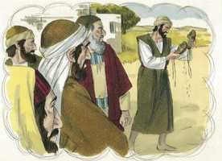
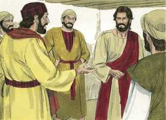
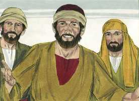
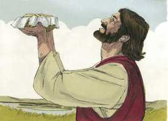
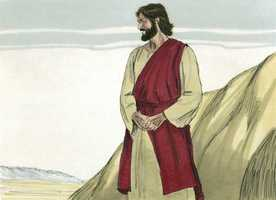
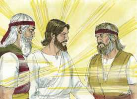
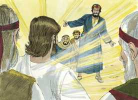
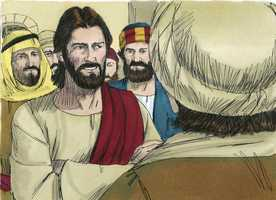
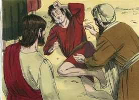

# Lucas Cap 09

**1** 	E, CONVOCANDO os seus doze discípulos, deu-lhes virtude e poder sobre todos os demônios, para curarem enfermidades.

 

**2** 	E enviou-os a pregar o reino de Deus, e a curar os enfermos.

**3** 	E disse-lhes: Nada leveis convosco para o caminho, nem bordões, nem alforje, nem pão, nem dinheiro; nem tenhais duas túnicas.

 

**4** 	E em qualquer casa em que entrardes, ficai ali, e de lá saireis.

 

**5** 	E se em qualquer cidade vos não receberem, saindo vós dali, sacudi o pó dos vossos pés, em testemunho contra eles.

 

**6** 	E, saindo eles, percorreram todas as aldeias, anunciando o evangelho, e fazendo curas por toda a parte.

**7** 	E o tetrarca Herodes ouviu todas as coisas que por ele foram feitas, e estava em dúvida, porque diziam alguns que João ressuscitara dentre os mortos; e outros que Elias tinha aparecido;

**8** 	E outros que um profeta dos antigos havia ressuscitado.

**9** 	E disse Herodes: A João mandei eu degolar; quem é, pois, este de quem ouço dizer tais coisas? E procurava vê-lo.

**10** 	E, regressando os apóstolos, contaram-lhe tudo o que tinham feito. E, tomando-os consigo, retirou-se para um lugar deserto de uma cidade chamada Betsaida.

  

**11** 	E, sabendo-o a multidão, o seguiu; e ele os recebeu, e falava-lhes do reino de Deus, e sarava os que necessitavam de cura.

 

**12** 	E já o dia começava a declinar; então, chegando-se a ele os doze, disseram-lhe: Despede a multidão, para que, indo aos lugares e aldeias em redor, se agasalhem, e achem o que comer; porque aqui estamos em lugar deserto.

 

**13** 	Mas ele lhes disse: Dai-lhes vós de comer. E eles disseram: Não temos senão cinco pães e dois peixes, salvo se nós próprios formos comprar comida para todo este povo.

  

**14** 	Porquanto estavam ali quase cinco mil homens. Disse, então, aos seus discípulos: Fazei-os assentar, em ranchos de cinqüenta em cinqüenta.

 

**15** 	E assim o fizeram, fazendo-os assentar a todos.

**16** 	E, tomando os cinco pães e os dois peixes, e olhando para o céu, abençoou-os, e partiu-os, e deu-os aos seus discípulos para os porem diante da multidão.

  

**17** 	E comeram todos, e saciaram-se; e levantaram, do que lhes sobejou, doze alcofas de pedaços.

 

**18** 	E aconteceu que, estando ele só, orando, estavam com ele os discípulos; e perguntou-lhes, dizendo: Quem diz a multidão que eu sou?

 

**19** 	E, respondendo eles, disseram: João o Batista; outros, Elias, e outros que um dos antigos profetas ressuscitou.

**20** 	E disse-lhes: E vós, quem dizeis que eu sou? E, respondendo Pedro, disse: O Cristo de Deus.

  

**21** 	E, admoestando-os, mandou que a ninguém referissem isso,

 

**22** 	Dizendo: É necessário que o Filho do homem padeça muitas coisas, e seja rejeitado dos anciãos e dos escribas, e seja morto, e ressuscite ao terceiro dia.

 

**23** 	E dizia a todos: Se alguém quer vir após mim, negue-se a si mesmo, e tome cada dia a sua cruz, e siga-me.

 

**24** 	Porque, qualquer que quiser salvar a sua vida, perdê-la-á; mas qualquer que, por amor de mim, perder a sua vida, a salvará.

**25** 	Porque, que aproveita ao homem granjear o mundo todo, perdendo-se ou prejudicando-se a si mesmo?

**26** 	Porque, qualquer que de mim e das minhas palavras se envergonhar, dele se envergonhará o Filho do homem, quando vier na sua glória, e na do Pai e dos santos anjos.

**27** 	E em verdade vos digo que, dos que aqui estão, alguns há que não provarão a morte até que vejam o reino de Deus.

**28** 	E aconteceu que, quase oito dias depois destas palavras, tomou consigo a Pedro, a João e a Tiago, e subiu ao monte a orar.

 

**29** 	E, estando ele orando, transfigurou-se a aparência do seu rosto, e a sua roupa ficou branca e mui resplandecente.

 

**30** 	E eis que estavam falando com ele dois homens, que eram Moisés e Elias,

 

**31** 	Os quais apareceram com glória, e falavam da sua morte, a qual havia de cumprir-se em Jerusalém.

**32** 	E Pedro e os que estavam com ele estavam carregados de sono; e, quando despertaram, viram a sua glória e aqueles dois homens que estavam com ele.

**33** 	E aconteceu que, quando aqueles se apartaram dele, disse Pedro a Jesus: Mestre, bom é que nós estejamos aqui, e façamos três tendas: uma para ti, uma para Moisés, e uma para Elias, não sabendo o que dizia.

 

**34** 	E, dizendo ele isto, veio uma nuvem que os cobriu com a sua sombra; e, entrando eles na nuvem, temeram.

 

**35** 	E saiu da nuvem uma voz que dizia: Este é o meu amado Filho; a ele ouvi.

**36** 	E, tendo soado aquela voz, Jesus foi achado só; e eles calaram-se, e por aqueles dias não contaram a ninguém nada do que tinham visto.

**37** 	E aconteceu, no dia seguinte, que, descendo eles do monte, lhes saiu ao encontro uma grande multidão;

 

**38** 	E eis que um homem da multidão clamou, dizendo: Mestre, peço-te que olhes para meu filho, porque é o único que eu tenho.

 

**39** 	Eis que um espírito o toma e de repente clama, e o despedaça até espumar; e só o larga depois de o ter quebrantado.

 

**40** 	E roguei aos teus discípulos que o expulsassem, e não puderam.

**41** 	E Jesus, respondendo, disse: Ó geração incrédula e perversa! até quando estarei ainda convosco e vos sofrerei? Traze-me aqui o teu filho.

 

**42** 	E, quando vinha chegando, o demônio o derrubou e convulsionou; porém, Jesus repreendeu o espírito imundo, e curou o menino, e o entregou a seu pai.

  

**43** 	E todos pasmavam da majestade de Deus. E, maravilhando-se todos de todas as coisas que Jesus fazia, disse aos seus discípulos:

**44** 	Ponde vós estas palavras em vossos ouvidos, porque o Filho do homem será entregue nas mãos dos homens.

**45** 	Mas eles não entendiam esta palavra, que lhes era encoberta, para que a não compreendessem; e temiam interrogá-lo acerca desta palavra.

**46** 	E suscitou-se entre eles uma discussão sobre qual deles seria o maior.

**47** 	Mas Jesus, vendo o pensamento de seus corações, tomou um menino, pô-lo junto a si,

**48** 	E disse-lhes: Qualquer que receber este menino em meu nome, recebe-me a mim; e qualquer que me receber a mim, recebe o que me enviou; porque aquele que entre vós todos for o menor, esse mesmo será grande.

**49** 	E, respondendo João, disse: Mestre, vimos um que em teu nome expulsava os demônios, e lho proibimos, porque não te segue conosco.

**50** 	E Jesus lhe disse: Não o proibais, porque quem não é contra nós é por nós.

**51** 	E aconteceu que, completando-se os dias para a sua assunção, manifestou o firme propósito de ir a Jerusalém.

**52** 	E mandou mensageiros adiante de si; e, indo eles, entraram numa aldeia de samaritanos, para lhe prepararem pousada,

**53** 	Mas não o receberam, porque o seu aspecto era como de quem ia a Jerusalém.

**54** 	E os seus discípulos, Tiago e João, vendo isto, disseram: Senhor, queres que digamos que desça fogo do céu e os consuma, como Elias também fez?

**55** 	Voltando-se, porém, repreendeu-os, e disse: Vós não sabeis de que espírito sois.

**56** 	Porque o Filho do homem não veio para destruir as almas dos homens, mas para salvá-las. E foram para outra aldeia.

**57** 	E aconteceu que, indo eles pelo caminho, lhe disse um: Senhor, seguir-te-ei para onde quer que fores.

**58** 	E disse-lhe Jesus: As raposas têm covis, e as aves do céu, ninhos, mas o Filho do homem não tem onde reclinar a cabeça.

**59** 	E disse a outro: Segue-me. Mas ele respondeu: Senhor, deixa que primeiro eu vá a enterrar meu pai.

**60** 	Mas Jesus lhe observou: Deixa aos mortos o enterrar os seus mortos; porém tu vai e anuncia o reino de Deus.

**61** 	Disse também outro: Senhor, eu te seguirei, mas deixa-me despedir primeiro dos que estão em minha casa.

**62** 	E Jesus lhe disse: Ninguém, que lança mão do arado e olha para trás, é apto para o reino de Deus.

> **Cmt MHenry** Intro: Aqui há um que se apresenta para seguir a Cristo, mas parece ter-se apressado e precipitado sem calcular o custo. Se quisermos seguir a Cristo, devemos deixar de lado os pensamentos de grandes coisas do mundo. Não tentemos fazer profissão de cristianismo quando andamos em busca de vantagens mundanas. Temos um outro que parece resolvido em seguir a Cristo, mas pede uma curta postergação. Cristo lhe deu primeiro a este homem o chamado: Segue-me. A religião nos ensina a ser benignos e misericordiosos, a mostrar piedade em casa e respeitar a nossos pais, mas não devemos convertê-los em desculpa para descuidar nossos deveres para com Deus. Outrossim aqui há um outro disposto a seguir a Cristo, mas pede tempo para falar com seus amigos a esse respeito, pôr em ordem seus assuntos domésticos, e dar ordens a esse respeito. Parecia ter mais preocupações do mundo em seu coração do que deveria, e estava disposto a aceder à tentação que o afastaria de seu propósito de seguir a Cristo. ninguém pode fazer algo em devida forma se estiver atentando a outras coisas. Os que entram na obra de Deus devem estar dispostos a seguir ou de nada servirão. Olhar *para trás* conduz a *recuar*, e retroceder é a perdição. Somente o que persevera até o fim será salvo.> Os discípulos não consideravam que a conduta dos samaritanos fosse mais efeito do prejuízo e fanatismo nacional do que da inimizade contra a Palavra e a adoração de Deus; embora se negaram a receber a Cristo e seus discípulos, não os maltrataram nem injuriaram, assim que o caso era completamente diferente do de Acazias e Elias. Também não perceberam que a dispensação do Evangelho seria marcada por milagres de misericórdia. Mas, por sobre tudo, ignoravam os motivos dominantes em seus próprios corações, que eram o orgulho e a ambição carnal. Nosso Senhor os advertiu a esse respeito. Nos resulta fácil dizer: Venham, vejam nosso zelo pelo Senhor!, e pensar que somos muito fiéis em sua causa, quando estamos seguindo nossos próprios objetivos e até fazendo mal e não bem ao próximo.> Esta predição dos sofrimentos de Cristo era bastante clara, porém os discípulos não a entenderam pois não concordava com únicas idéias. Um pequenino é o símbolo pelo qual Cristo nos ensina a simplicidade e a humildade. Que honra maior pode obter um homem neste mundo que a de ser recebido pelos homens como mensageiro de Deus e Cristo, e que Deus e Cristo se reconheçam recebidos e bem-vindos nele? Se alguma sociedade de cristãos deste mundo teve motivos para silenciar os que não são de sua própria comunhão, a tiveram os doze discípulos nesse tempo; mas Cristo os advertiu que não o fizessem de novo. ainda que não sigam conosco, podem ser achados seguidores fiéis de Cristo e ser aceitos por Ele.> Quão deplorável é o caso deste menino! Estava sob o poder de um espírito maligno. As doenças dessa natureza são mais aterradoras que as que surgem de simples causas naturais. Quanta maldade faz Satanás quando toma possessão de uma pessoa! Porém, bem-aventurados são os que tem acesso a Cristo! Ele pode fazer por nós o que não podem os discípulos. Uma palavra de Cristo sarou um menino e quando nossos filhos se recuperam da enfermidade, consola recebê-los como curados pela mão de Cristo.> A transfiguração de Cristo foi uma amostra da glória com que virá a julgar o mundo; e foi um chamado a seus discípulos a sofrerem por Ele. a oração é um dever transfigurador, transformador, que faz brilhar o rosto. Nosso Senhor Jesus, em sua transfiguração, estava disposto a falar de sua morte e de seus sofrimentos. Nas glórias maiores na terra lembremos que neste mundo não temos cidade permanente. Quanta necessidade temos de orar a Deus pedindo a graça vivificadora! Embora os discípulos poderiam ser as testemunhas de este sinal do céu, depois de um momento foram despertados para dar um relato completo do que acontecera. Não sabem o que dizem os que falam em fazer tabernáculos na terra para os santos glorificados no céu.> Consolo indizível é que nosso Senhor Jesus seja o Ungido de Deus; isto significa que foi designado para ser o Messias e que está qualificado para isso. Jesus fala de seus sofrimentos e morte. Tão longe como devem estar seus discípulos de pensar em evitar seus sofrimentos, assim devem preparar-se para sofrer eles mesmos. Amiúde nos encontramos com cruzes no caminho do dever; e ainda que não devamos lançá-las sobre nossas cabeças, quando estão colocadas para nós devemos tomá-las e levá-las como Cristo. Algo é bom ou ruim para nós segundo seja bom ou ruim para nossas almas. O corpo não pode estar feliz se a alma estará infeliz no outro mundo, mas a alma pode estar feliz ainda que o corpo esteja sumamente afligido e oprimido neste mundo. Nunca devemos envergonhar-nos de Cristo e seu evangelho.> A gente seguiu a Jesus e embora era inoportuno naquele momento, lhes deu o que necessitavam. Ele lhes falou do Reino de Deus. Sarou os que necessitavam saúde. Com cinco pães e dois peixes, Cristo alimentou a cinco mil homens. Ele cuida que nada de bom falte aos que o temem e o servem fielmente. Quando recebemos consolo por meio de criaturas, devemos reconhecer que o recebemos de Deus, e que somos indignos de recebê-lo; que tudo, e todo o consolo que tenhamos nisso, o devemos à mediação de Cristo, por quem tem sido tirada a maldição. A bênção de Cristo fará que pouco serva para muito. Ele satisfaz a toda alma faminta, a satisfaz abundantemente com a abundância de sua casa. Foram recolhidas as sobras: na casa de nosso Pai há pão suficiente e para guardar. Não estamos limitados nem escassos em Cristo.> Cristo enviou a seus doze discípulos, aos que então já eram capazes de ensinar ao próximo o que tinham recebido do Senhor. Não devem estar ansiosos por esperar a estima da gente pela aparência externa. Devem ir como estão. O Senhor Jesus é a fonte de poder e autoridade à qual devem submeter-se todas as criaturas de uma ou outra forma; e se Ele vai com a palavra de seus ministros em poder, para livrar pecadores da escravidão de Satanás, podem ter certeza de que Ele se ocupará de suas necessidades. Quando a verdade e o amor vão unidos, e ainda assim a gente rejeita e despreza a mensagem de Deus, deixa sem escusa os homens e se torna testemunho contra eles. A consciência culpável de Herodes estava pronta para concluir que Jesus foi levantado dos mortos. Desejava ver a Jesus, e por que não foi e o viu? Provavelmente por pensar que estava por embaixo dEle ou porque não desejava ter mais repreensões por seu pecado. ao postergá-lo se endureceu seu coração e quando viu a Jesus, estava tão prejudicado contra Ele como o resto ([Lc 23.11](../42N-Lc/23.md#11)).