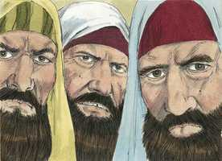
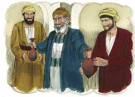
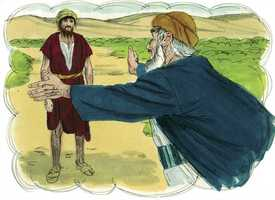
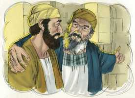

# Lucas Cap 15

**1** 	E CHEGAVAM-SE a ele todos os publicanos e pecadores para o ouvir.

**2** 	E os fariseus e os escribas murmuravam, dizendo: Este recebe pecadores, e come com eles.

 

**3** 	E ele lhes propôs esta parábola, dizendo:

**4** 	Que homem dentre vós, tendo cem ovelhas, e perdendo uma delas, não deixa no deserto as noventa e nove, e vai após a perdida até que venha a achá-la?

**5** 	E achando-a, a põe sobre os seus ombros, jubiloso;

**6** 	E, chegando a casa, convoca os amigos e vizinhos, dizendo-lhes: Alegrai-vos comigo, porque já achei a minha ovelha perdida.

**7** 	Digo-vos que assim haverá alegria no céu por um pecador que se arrepende, mais do que por noventa e nove justos que não necessitam de arrependimento.

**8** 	Ou qual a mulher que, tendo dez dracmas, se perder uma dracma, não acende a candeia, e varre a casa, e busca com diligência até a achar?

**9** 	E achando-a, convoca as amigas e vizinhas, dizendo: Alegrai-vos comigo, porque já achei a dracma perdida.

**10** 	Assim vos digo que há alegria diante dos anjos de Deus por um pecador que se arrepende.

**11** 	E disse: Um certo homem tinha dois filhos;

**12** 	E o mais moço deles disse ao pai: Pai, dá-me a parte dos bens que me pertence. E ele repartiu por eles a fazenda.

 

**13** 	E, poucos dias depois, o filho mais novo, ajuntando tudo, partiu para uma terra longínqua, e ali desperdiçou os seus bens, vivendo dissolutamente.

 

**14** 	E, havendo ele gastado tudo, houve naquela terra uma grande fome, e começou a padecer necessidades.

**15** 	E foi, e chegou-se a um dos cidadãos daquela terra, o qual o mandou para os seus campos, a apascentar porcos.

 

**16** 	E desejava encher o seu estômago com as bolotas que os porcos comiam, e ninguém lhe dava nada.

**17** 	E, tornando em si, disse: Quantos jornaleiros de meu pai têm abundância de pão, e eu aqui pereço de fome!

 

**18** 	Levantar-me-ei, e irei ter com meu pai, e dir-lhe-ei: Pai, pequei contra o céu e perante ti;

**19** 	Já não sou digno de ser chamado teu filho; faze-me como um dos teus jornaleiros.

**20** 	E, levantando-se, foi para seu pai; e, quando ainda estava longe, viu-o seu pai, e se moveu de íntima compaixão e, correndo, lançou-se-lhe ao pescoço e o beijou.

 

**21** 	E o filho lhe disse: Pai, pequei contra o céu e perante ti, e já não sou digno de ser chamado teu filho.

 

**22** 	Mas o pai disse aos seus servos: Trazei depressa a melhor roupa; e vesti-lho, e ponde-lhe um anel na mão, e alparcas nos pés;

 

**23** 	E trazei o bezerro cevado, e matai-o; e comamos, e alegremo-nos;

**24** 	Porque este meu filho estava morto, e reviveu, tinha-se perdido, e foi achado. E começaram a alegrar-se.

**25** 	E o seu filho mais velho estava no campo; e quando veio, e chegou perto de casa, ouviu a música e as danças.

**26** 	E, chamando um dos servos, perguntou-lhe que era aquilo.

 

**27** 	E ele lhe disse: Veio teu irmão; e teu pai matou o bezerro cevado, porque o recebeu são e salvo.

**28** 	Mas ele se indignou, e não queria entrar.

 

**29** 	E saindo o pai, instava com ele. Mas, respondendo ele, disse ao pai: Eis que te sirvo há tantos anos, sem nunca transgredir o teu mandamento, e nunca me deste um cabrito para alegrar-me com os meus amigos;

 

**30** 	Vindo, porém, este teu filho, que desperdiçou os teus bens com as meretrizes, mataste-lhe o bezerro cevado.

**31** 	E ele lhe disse: Filho, tu sempre estás comigo, e todas as minhas coisas são tuas;

 

**32** 	Mas era justo alegrarmo-nos e folgarmos, porque este teu irmão estava morto, e reviveu; e tinha-se perdido, e achou-se.

> **Cmt MHenry** Intro: Na última parte desta parábola temos o caráter dos fariseus, embora não deles sozinhos. Estabelece a bondade do Senhor e a soberba com que se recebe sua bondade de graça. Os judeus, em geral, mostraram o mesmo espírito para os gentios convertidos; e quantidades de eles em toda época objetam o evangelho e seus pregadores sobre a mesma base. Como será esse temperamento que incita o homem a desprezar e aborrecer aqueles por quem derramou seu precioso sangue o Salvador, esses que são objetos da eleição do Pai, e templos do Espírito Santo! Isso brota do orgulho, a preferência do si mesmo e a ignorância própria do coração do homem. A misericórdia e a graça de nosso Deus em Cristo brilham quase com tanto fulgor em sua tenra e gentil tolerância para com os santos beligerantes como para receber os pecadores pródigos que se arrependem. Gozo indizível de todos os filhos de Deus, que se mantêm perto da casa de seu Pai, e que estão e estarão sempre com Ele. deleite será para os que aceitem agradecidos o convite de Cristo.> Tendo visto o filho pródigo em seu abjeto estado de miséria, devemos considerar em seguida sua recuperação. Isto começa quando volta em si. Esse é um ponto de retorno na conversão do pecador. O Senhor abre seus olhos e o convence de pecado; então, se vê a si mesmo, e a todo objeto, embaixo de uma luz diferente da anterior. Assim, o pecador convicto percebe que o servo mais pobre de Deus é mais ditoso que ele. olhar a Deus como Pai, e nosso Pai, será muito útil para nosso arrependimento e regresso a Ele. o filho pródigo se levantou e não se deteve até que chegou em sua casa. Assim, o pecador arrependido deixa resolutamente a atadura de Satanás e suas luxúrias, e regressa a Deus por meio da oração, apesar de seus temores e desalentos. O Senhor sai a encontrá-lo com mostras inesperadas de seu amor perdoador. Novamente, a recepção do pecador humilhado é como a do pródigo. É vestido com o manto da justiça do Redentor, feito participe do Espírito de adoção, preparado pela paz de consciência e a graça do evangelho para andar nos caminhos da piedade, e festejado com consolações divinas. Os princípios da graça e a santidade operam nele, para fazer e para querer.> A parábola do filho pródigo mostra a natureza do arrependimento e a prontidão do Senhor para acolher bem e abençoar a todos os que voltam a Ele. expõe plenamente as riquezas da graça do evangelho; e tem sido e será, enquanto durar o mundo, de utilidade indizível para os coitados pecadores, para guiá-los e alentá-los a arrepender-se e a voltar a Deus. Ruim é, e é o pior começo, quando os homens consideram os dons de Deus como dívida. A grande tolice dos pecadores, e o que os estraga, é ficarem felizes com receber suas coisas boas durante sua vida. Nossos primeiros pais se destruíram, a si mesmos e a toda a raça, pela néscia ambição de serem independentes, e isto está no fundo da persistência dos pecadores em seu pecado. Todos podemos discernir alguns rasgos de nosso próprio caráter nos do filho pródigo. Um estado pecaminoso é um estado de separação e afastamento de Deus. um estado pecaminoso é um estado de desperdiço: os pecadores voluntários empregam mal seus pensamentos e os poderes de sua alma, gastam mal seu tempo e todas as oportunidades. Um estado pecaminoso é um estado de necessidade. Os pecadores carecem das coisas necessárias para suas almas; não têm comida nem roupa para eles, nem nenhuma perversão para o além. Um estado pecaminoso é um vil estado de escravidão. O negócio dos servos do domínio é fazer provisão para a carne, cumprir suas luxúrias e isso não é melhor que alimentar os porcos. Um estado pecaminoso é um estado de descontentamento constante. A riqueza do mundo e os prazeres dos sentidos nem sequer satisfazem nossos corpos, mas que são em comparação com o valor das almas! Um estado pecaminoso é um estado que não pode buscar alívio de nenhuma criatura. Em vão choramos o mundo e a carne; têm o que envenena a alma, mas que nada têm que a alimente e nutra. Um estado pecaminoso é um estado de morte. O pecador está morto em delitos e pecados, desprovido de vida espiritual. um estado pecaminoso é um estado perdido. As almas que estão separadas de Deus, se sua misericórdia não o evitar, logo estarão perdidas para sempre. O desgraçado estado do filho pródigo somente é uma pálida sombra da horrorosa ruína do homem pelo pecado, mas quão poucos são sensíveis a seu próprio estado e caráter!> A parábola da ovelha perdida é muito aplicável à grande obra da redenção do homem. A ovelha perdida representa o pecador afastado de Deus e exposto a uma ruína segura se não for conduzido de volta a Ele, embora não deseje regressar. Cristo é ardoroso para levar a casa os pecadores. Na parábola da peça de prata perdida, o que está perdido é uma peça de pequeno valor, comparada com o resto. Porém, a mulher procura diligentemente até achá-la. Isto representa os variados meios e métodos que usa Deus para levar as almas perdidas a casa, a si mesmo, e o gozo do Salvador pelo retorno daqueles a Ele. quão cuidadosos devemos ser então com nosso arrependimento, que seja para salvação!