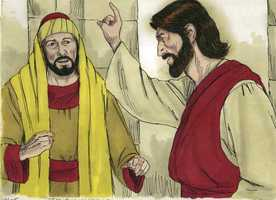
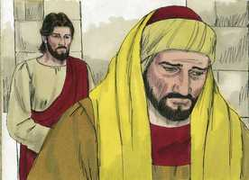
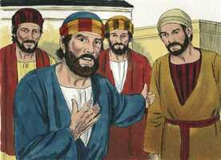
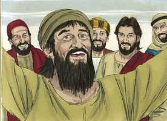

# Lucas Cap 18

**1** 	E CONTOU-LHES também uma parábola sobre o dever de orar sempre, e nunca desfalecer,

**2** 	Dizendo: Havia numa cidade um certo juiz, que nem a Deus temia, nem respeitava o homem.

**3** 	Havia também, naquela mesma cidade, uma certa viúva, que ia ter com ele, dizendo: Faze-me justiça contra o meu adversário.

**4** 	E por algum tempo não quis atendê-la; mas depois disse consigo: Ainda que não temo a Deus, nem respeito os homens,

**5** 	Todavia, como esta viúva me molesta, hei de fazer-lhe justiça, para que enfim não volte, e me importune muito.

**6** 	E disse o Senhor: Ouvi o que diz o injusto juiz.

**7** 	E Deus não fará justiça aos seus escolhidos, que clamam a ele de dia e de noite, ainda que tardio para com eles?

**8** 	Digo-vos que depressa lhes fará justiça. Quando porém vier o Filho do homem, porventura achará fé na terra?

**9** 	E disse também esta parábola a uns que confiavam em si mesmos, crendo que eram justos, e desprezavam os outros:

 

**10** 	Dois homens subiram ao templo, para orar; um, fariseu, e o outro, publicano.

 

**11** 	O fariseu, estando em pé, orava consigo desta maneira: Ó Deus, graças te dou porque não sou como os demais homens, roubadores, injustos e adúlteros; nem ainda como este publicano.

 

**12** 	Jejuo duas vezes na semana, e dou os dízimos de tudo quanto possuo.

 

**13** 	O publicano, porém, estando em pé, de longe, nem ainda queria levantar os olhos ao céu, mas batia no peito, dizendo: Ó Deus, tem misericórdia de mim, pecador!

 

**14** 	Digo-vos que este desceu justificado para sua casa, e não aquele; porque qualquer que a si mesmo se exalta será humilhado, e qualquer que a si mesmo se humilha será exaltado.

 

**15** 	E traziam-lhe também meninos, para que ele lhes tocasse; e os discípulos, vendo isto, repreendiam-nos.

**16** 	Mas Jesus, chamando-os para si, disse: Deixai vir a mim os meninos, e não os impeçais, porque dos tais é o reino de Deus.

**17** 	Em verdade vos digo que, qualquer que não receber o reino de Deus como menino, não entrará nele.

**18** 	E perguntou-lhe um certo príncipe, dizendo: Bom Mestre, que hei de fazer para herdar a vida eterna?

 

**19** 	Jesus lhe disse: Por que me chamas bom? Ninguém há bom, senão um, que é Deus.

 

**20** 	Sabes os mandamentos: Não adulterarás, não matarás, não furtarás, não dirás falso testemunho, honra a teu pai e a tua mãe.

**21** 	E disse ele: Todas essas coisas tenho observado desde a minha mocidade.

 

**22** 	E quando Jesus ouviu isto, disse-lhe: Ainda te falta uma coisa; vende tudo quanto tens, reparte-o pelos pobres, e terás um tesouro no céu; vem, e segue-me.

 

**23** 	Mas, ouvindo ele isto, ficou muito triste, porque era muito rico.

 

**24** 	E, vendo Jesus que ele ficara muito triste, disse: Quão dificilmente entrarão no reino de Deus os que têm riquezas!

 

**25** 	Porque é mais fácil entrar um camelo pelo fundo de uma agulha do que entrar um rico no reino de Deus.

**26** 	E os que ouviram isto disseram: Logo quem pode salvar-se?

 

**27** 	Mas ele respondeu: As coisas que são impossíveis aos homens são possíveis a Deus.

 

**28** 	E disse Pedro: Eis que nós deixamos tudo e te seguimos.

 

**29** 	E ele lhes disse: Na verdade vos digo que ninguém há, que tenha deixado casa, ou pais, ou irmãos, ou mulher, ou filhos, pelo reino de Deus,

 

**30** 	Que não haja de receber muito mais neste mundo, e na idade vindoura a vida eterna.

**31** 	E, tomando consigo os doze, disse-lhes: Eis que subimos a Jerusalém, e se cumprirá no Filho do homem tudo o que pelos profetas foi escrito;

**32** 	Pois há de ser entregue aos gentios, e escarnecido, injuriado e cuspido;

**33** 	E, havendo-o açoitado, o matarão; e ao terceiro dia ressuscitará.

**34** 	E eles nada disto entendiam, e esta palavra lhes era encoberta, não percebendo o que se lhes dizia.

**35** 	E aconteceu que chegando ele perto de Jericó, estava um cego assentado junto do caminho, mendigando.

**36** 	E, ouvindo passar a multidão, perguntou que era aquilo.

**37** 	E disseram-lhe que Jesus Nazareno passava.

**38** 	Então clamou, dizendo: Jesus, Filho de Davi, tem misericórdia de mim.

  

**39** 	E os que iam passando repreendiam-no para que se calasse; mas ele clamava ainda mais: Filho de Davi, tem misericórdia de mim!

**40** 	Então Jesus, parando, mandou que lho trouxessem; e, chegando ele, perguntou-lhe,

 

**41** 	Dizendo: Que queres que te faça? E ele disse: Senhor, que eu veja.

**42** 	E Jesus lhe disse: Vê; a tua fé te salvou.

 

**43** 	E logo viu, e seguia-o, glorificando a Deus. E todo o povo, vendo isto, dava louvores a Deus.

 

> **Cmt MHenry** Intro: Este coitado cego estava a um lado do caminho, mendigando. Não só era cego, senão pobre, digno símbolo da humanidade que Cristo veio curar e salvar. A oração de fé é guiada pelas alentadoras promessas de Cristo e, baseada nelas, não são em vão. A graça de Cristo deve reconhecer-se com gratidão para a glória de Deus. é para a glória de Deus se seguimos a Jesus, como o farão aqueles cujos olhos sejam abertos. Devemos louvar a Deus por suas misericórdias com o próximo, e pelas nossas. Se desejarmos entender com justiça estas coisas, devemos ir a Cristo, como o cego, rogando fervorosamente que nos abra os olhos, e nos mostre claramente a excelência de seus preceitos e o valor de sua salvação.> O Espírito de Cristo nos profetas do Antigo Testamento testificava de antemão de seus sofrimentos, e da glória que seguiria ([1 Pe 1.11](../60N-1Pe/01.md#11)). Os prejuízos dos discípulos eram tão fortes que na entendiam literalmente estas coisas. Estavam tão concentrados nas profecias que falavam da glória de Cristo, que esqueceram das que falavam de seus sofrimentos. A gente comete erros porque lêem suas Bíblias parcialmente, e somente gostam das coisas lindas. Somos tão resistentes a aprender a lições dos sofrimentos, a crucifixão e a ressurreição de Cristo como o eram os discípulos aos que lhes disse sobre estes fatos; e, pela mesma razão, o amor próprio e o desejo de objetos mundanos nos fecham o entendimento.> Muitos têm muitas coisas elogiáveis em si, mas perecem por falta de uma coisa; este rico não podia aceitar as condições de Cristo que o separariam de seu patrimônio. Muitos que detestam deixar a Cristo, contudo, o deixam. Depois de longa luta com suas convicções e suas corrupções, ganham as corrupções. Lamentam-se muito de não poder servir ambos, mas se devem deixar a um, deixarão a seu Deus, ao seu lucro mundano. A obediência de que se jactam resulta ser puro espetáculo; o amor ao mundo está, de um ou de outro jeito, na raiz disto. Os homens são dados a falar demais do que deixaram e perderam, do que fizeram e sofreram por Cristo, como fez Pedro. Antes, devemos envergonhar-nos que exista alguma dificuldade para fazê-lo.> Ninguém é demasiado pequeno, demasiado jovem para ser levado a Cristo. Ele sabe mostrar bondade aos incapazes de fazê-lhe um serviço. A idéia de Cristo é que os pequenos sejam levados a Ele. a promessa é para nós e para nossa descendência; portanto, Ele os receberá bem conosco. Devemos receber seu reino como crianças, não comprá-lo, e devemos considerá-lo um presente de nosso Pai.> Esta parábola era para convencer a alguns que confiavam em si mesmos como justos e desprezavam o próximo. Deus vê com que disposição e propósito vamos a Ele nas santas ordenanças. O que disse o fariseu demonstra que ele tinha confiança em si mesmo de ser justo. Podemos supor que estava isento de pecados grosseiros e escandalosos. Tudo isso era muito bom e elogiável. Miserável é a condição dos que não alcançam a justiça desse fariseu, embora ele não foi aceito e, por que não? Ia orar no templo, mas estava cheio de si mesmo e de sua própria bondade; não pensava que valia a pena pedir o favor e a graça de Deus. Cuidemo-nos de apresentar orações orgulhosas ao Senhor e de desprezar ao próximo. A oração do publicano estava cheia de humildade e de arrependimento pelo pecado, e desejo de Deus. sua oração foi breve, mas com um objetivo: Deus, sé propício a mim, pecador. Bendito seja Deus, que temos registrada esta oração curta como oração respondida; e que temos a certeza de que aquele que a disse voltou justificada a casa; assim será conosco sem orarmos como ele por meio de Jesus Cristo. Reconheceu-se pecador por natureza e costume, culpável diante de Deus. Não dependia de nada senão da misericórdia de Deus, somente nela confiava. Glória a Deus é resistir o soberbo e dar graça ao humilde. A justificação é de Deus em Cristo; portanto, o que se condena a si mesmo, não o que se justifica a si mesmo, é justificado ante Deus.> Todo o povo de Deus é povo de oração. Aqui se ensina a fervorosa constância para orar pedindo misericórdias espirituais. O fervor da viúva prevaleceu com o juiz injusto: ela podia temer que se tornasse mais em sua contra; porém nossa oração fervorosa agrada a nosso Deus. ainda até o fim haverá base para a mesma queixa de debilidade da fé.