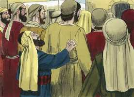
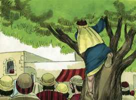
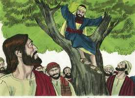
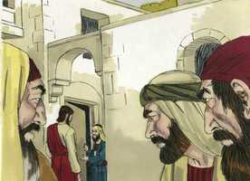
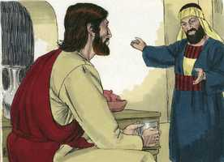
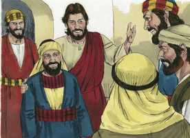
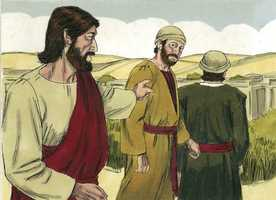
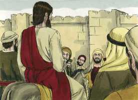
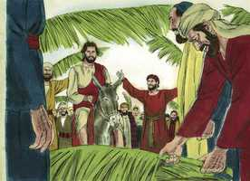
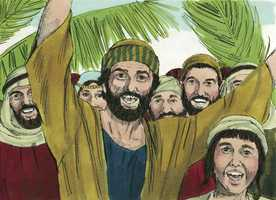

# Lucas Cap 19

**1** 	E, TENDO Jesus entrado em Jericó, ia passando.

**2** 	E eis que havia ali um homem chamado Zaqueu; e era este um chefe dos publicanos, e era rico.

**3** 	E procurava ver quem era Jesus, e não podia, por causa da multidão, pois era de pequena estatura.

 

**4** 	E, correndo adiante, subiu a um sicômoro para o ver; porque havia de passar por ali.

 

**5** 	E quando Jesus chegou àquele lugar, olhando para cima, viu-o e disse-lhe: Zaqueu, desce depressa, porque hoje me convém pousar em tua casa.

 

**6** 	E, apressando-se, desceu, e recebeu-o alegremente.

**7** 	E, vendo todos isto, murmuravam, dizendo que entrara para ser hóspede de um homem pecador.

 

**8** 	E, levantando-se Zaqueu, disse ao Senhor: Senhor, eis que eu dou aos pobres metade dos meus bens; e, se nalguma coisa tenho defraudado alguém, o restituo quadruplicado.

 

**9** 	E disse-lhe Jesus: Hoje veio a salvação a esta casa, pois também este é filho de Abraão.

 

**10** 	Porque o Filho do homem veio buscar e salvar o que se havia perdido.

**11** 	E, ouvindo eles estas coisas, ele prosseguiu, e contou uma parábola; porquanto estava perto de Jerusalém, e cuidavam que logo se havia de manifestar o reino de Deus.

**12** 	Disse pois: Certo homem nobre partiu para uma terra remota, a fim de tomar para si um reino e voltar depois.

**13** 	E, chamando dez servos seus, deu-lhes dez minas, e disse-lhes: Negociai até que eu venha.

**14** 	Mas os seus concidadãos odiavam-no, e mandaram após ele embaixadores, dizendo: Não queremos que este reine sobre nós.

**15** 	E aconteceu que, voltando ele, depois de ter tomado o reino, disse que lhe chamassem aqueles servos, a quem tinha dado o dinheiro, para saber o que cada um tinha ganhado, negociando.

**16** 	E veio o primeiro, dizendo: Senhor, a tua mina rendeu dez minas.

**17** 	E ele lhe disse: Bem está, servo bom, porque no mínimo foste fiel, sobre dez cidades terás autoridade.

**18** 	E veio o segundo, dizendo: Senhor, a tua mina rendeu cinco minas.

**19** 	E a este disse também: Sê tu também sobre cinco cidades.

**20** 	E veio outro, dizendo: Senhor, aqui está a tua mina, que guardei num lenço;

**21** 	Porque tive medo de ti, que és homem rigoroso, que tomas o que não puseste, e segas o que não semeaste.

**22** 	Porém, ele lhe disse: Mau servo, pela tua boca te julgarei. Sabias que eu sou homem rigoroso, que tomo o que não pus, e sego o que não semeei;

**23** 	Por que não puseste, pois, o meu dinheiro no banco, para que eu, vindo, o exigisse com os juros?

**24** 	E disse aos que estavam com ele: Tirai-lhe a mina, e dai-a ao que tem dez minas.

**25** 	(E disseram-lhe eles: Senhor, ele tem dez minas.)

**26** 	Pois eu vos digo que a qualquer que tiver ser-lhe-á dado, mas ao que não tiver, até o que tem lhe será tirado.

**27** 	E quanto àqueles meus inimigos que não quiseram que eu reinasse sobre eles, trazei-os aqui, e matai-os diante de mim.

**28** 	E, dito isto, ia caminhando adiante, subindo para Jerusalém.

**29** 	E aconteceu que, chegando perto de Betfagé, e de Betânia, ao monte chamado das Oliveiras, mandou dois dos seus discípulos,

 

**30** 	Dizendo: Ide à aldeia que está defronte, e aí, ao entrar, achareis preso um jumentinho em que nenhum homem ainda montou; soltai-o e trazei-o.

**31** 	E, se alguém vos perguntar: Por que o soltais? assim lhe direis: Porque o Senhor o há de mister.

**32** 	E, indo os que haviam sido mandados, acharam como lhes dissera.

**33** 	E, quando soltaram o jumentinho, seus donos lhes disseram: Por que soltais o jumentinho?

 

**34** 	E eles responderam: O Senhor o há de mister.

**35** 	E trouxeram-no a Jesus; e, lançando sobre o jumentinho as suas vestes, puseram Jesus em cima.

 

**36** 	E, indo ele, estendiam no caminho as suas vestes.

 

**37** 	E, quando já chegava perto da descida do Monte das Oliveiras, toda a multidão dos discípulos, regozijando-se, começou a dar louvores a Deus em alta voz, por todas as maravilhas que tinham visto,

**38** 	Dizendo: Bendito o Rei que vem em nome do Senhor; paz no céu, e glória nas alturas.

 

**39** 	E disseram-lhe de entre a multidão alguns dos fariseus: Mestre, repreende os teus discípulos.

**40** 	E, respondendo ele, disse-lhes: Digo-vos que, se estes se calarem, as próprias pedras clamarão.

**41** 	E, quando ia chegando, vendo a cidade, chorou sobre ela,

**42** 	Dizendo: Ah! se tu conhecesses também, ao menos neste teu dia, o que à tua paz pertence! Mas agora isto está encoberto aos teus olhos.

**43** 	Porque dias virão sobre ti, em que os teus inimigos te cercarão de trincheiras, e te sitiarão, e te estreitarão de todos os lados;

**44** 	E te derrubarão, a ti e aos teus filhos que dentro de ti estiverem, e não deixarão em ti pedra sobre pedra, pois que não conheceste o tempo da tua visitação.

**45** 	E, entrando no templo, começou a expulsar todos os que nele vendiam e compravam,

  

**46** 	Dizendo-lhes: Está escrito: A minha casa é casa de oração; mas vós fizestes dela covil de salteadores.

 

**47** 	E todos os dias ensinava no templo; mas os principais dos sacerdotes, e os escribas, e os principais do povo procuravam matá-lo.

 

**48** 	E não achavam meio de o fazer, porque todo o povo pendia para ele, escutando-o.

 

> **Cmt MHenry** Intro: Quem pode contemplar o santo Jesus olhando antecipadamente as misérias que aguardavam a seus assassinos, chorando pela cidade onde se derramaria seu sangue precioso, e não ver que a imagem de Deus no crente consiste em grande medida em boa vontade e compaixão? Certamente não podem ser bons os que tomam as doutrinas da verdade em forma tal que se endurecem até seu próximo pecador. Cada um lembre que, apesar de que Jesus chorou por Jerusalém, vai executar uma vingança espantosa nela. Embora não se goze na morte do pecador, com toda certeza fará que se concretizem suas ameaças temíveis nos que rejeitaram sua salvação. O Filho de Deus não chorou com lágrimas vãs e sem causa, por um assunto leviano nem por si mesmo. Ele conhece o valor das lágrimas, o peso da culpa e quanto oprime e afunda à humanidade. Venha então Ele e limpe nossos corações por Seu Espírito, de todo aquilo que o contamina. Que os pecadores em todo lugar prestem atenção às palavras de verdade e salvação.> Cristo tem domínio sobre todas as criaturas e pode usá-las como lhe apraz. Tem os corações de todos os homens sob seu olho e em sua mão. Os triunfos de Cristo, e os jubilosos louvores de seus discípulos, afligem os orgulhosos fariseus que são inimigos seus e de seu reino. Como Cristo despreza o desdém dos soberbos, aceita os louvores do humilde. Os fariseus quiseram silenciar os louvores a Cristo, mas não podem já que Deus pode levantar filhos de Abraão ainda das pedras, e voltar o coração de pedra para Ele, para obter louvor das bocas das crianças. Como serão os sentimentos dos homens quando o Senhor regresse em glória a julgar o mundo!> Esta parábola é como a dos talentos ([Mateus 25](../40N-Mt/25.md#0)). Os que são chamados a Cristo, são providos dos dons necessários para sua atividade; e espera serviço daqueles aos que dá poder. A manifestação do Espírito é dada a todo homem para que a aproveite ([1 Co 12.7](../46N-1Co/12.md#7)). Como cada um tem recebido o dom, que o ministre ([1 Pe 4.10](../60N-1Pe/04.md#10)). O relato requerido lembra o da parábola dos talentos; e indica o castigo dos inimigos jurados de Cristo, e o dos falsos professantes. A diferença principal está em que a mina dada a cada um parece apontar à dádiva do Evangelho, que é a mesma para todos os que o ouvem; mas os talentos repartidos em mais e em menos, parecem indicar que Deus dá diferentes capacidades e vantagens aos homens, pelas quais possam melhorar de forma diferente este dom único do evangelho.> Os que, como Zaqueu, desejam sinceramente ver a Cristo, vencerão qualquer obstáculo e se esforçarão para vê-lo.\> \ Cristo oferece visitar a casa de Zaqueu. Aonde Cristo vai, abre o coração e o inclina para recebê-lo. quem quer conhecer a Cristo, será conhecido dEle. Aqueles aos que Cristo chama, devem humilhar-se e descer. Bem podemos receber com gozo ao que traz todo o bom com ele. Zaqueu publicamente deu provas de ter chegado a ser um verdadeiro converso. Não busca ser justificado por suas obras como o fariseu, mas por suas boas obras demonstrará a sinceridade de sua fé e o arrependimento pela graça de Deus. Zaqueu é considerado feliz, agora que se voltou do pecado a Deus. agora que é salvo de seus pecados, de sua culpa, do poder deles, são seus todos os benefícios da salvação. Cristo veio a sua casa, e aonde Cristo vai, leva consigo a salvação. Veio a este mundo perdido a buscá-lo e salvá-lo. seu objetivo era salvar, onde não havia salvação em nenhum outro. Ele busca os que não o buscam e nem perguntam por Ele.