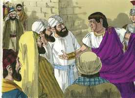
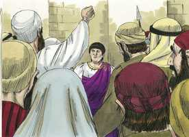
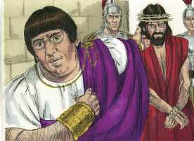
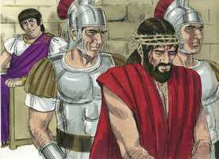
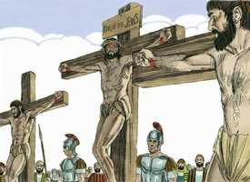
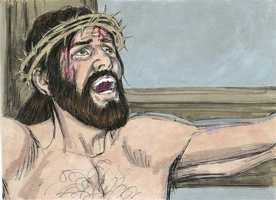
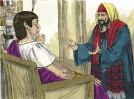

# Lucas Cap 23

**1** 	E, LEVANTANDO-SE toda a multidão deles, o levaram a Pilatos.

 

**2** 	E começaram a acusá-lo, dizendo: Havemos achado este pervertendo a nação, proibindo dar o tributo a César, e dizendo que ele mesmo é Cristo, o rei.

**3** 	E Pilatos perguntou-lhe, dizendo: Tu és o Rei dos Judeus? E ele, respondendo, disse-lhe: Tu o dizes.

  

**4** 	E disse Pilatos aos principais dos sacerdotes, e à multidão: Não acho culpa alguma neste homem.

 

**5** 	Mas eles insistiam cada vez mais, dizendo: Alvoroça o povo ensinando por toda a Judéia, começando desde a Galiléia até aqui.

 

**6** 	Então Pilatos, ouvindo falar da Galiléia perguntou se aquele homem era galileu.

**7** 	E, sabendo que era da jurisdição de Herodes, remeteu-o a Herodes, que também naqueles dias estava em Jerusalém.

**8** 	E Herodes, quando viu a Jesus, alegrou-se muito; porque havia muito que desejava vê-lo, por ter ouvido dele muitas coisas; e esperava que lhe veria fazer algum sinal.

**9** 	E interrogava-o com muitas palavras, mas ele nada lhe respondia.

**10** 	E estavam os principais dos sacerdotes, e os escribas, acusando-o com grande veemência.

**11** 	E Herodes, com os seus soldados, desprezou-o e, escarnecendo dele, vestiu-o de uma roupa resplandecente e tornou a enviá-lo a Pilatos.

**12** 	E no mesmo dia, Pilatos e Herodes entre si se fizeram amigos; pois dantes andavam em inimizade um com o outro.

**13** 	E, convocando Pilatos os principais dos sacerdotes, e os magistrados, e o povo,

**14** 	Disse-lhes: Haveis-me apresentado este homem como pervertedor do povo; e eis que, examinando-o na vossa presença, nenhuma culpa, das de que o acusais, acho neste homem.

**15** 	Nem mesmo Herodes, porque a ele vos remeti, e eis que não tem feito coisa alguma digna de morte.

**16** 	Castigá-lo-ei, pois, e soltá-lo-ei.

 

**17** 	E era-lhe necessário soltar-lhes um pela festa.

**18** 	Mas toda a multidão clamou a uma, dizendo: Fora daqui com este, e solta-nos Barrabás.

**19** 	O qual fora lançado na prisão por causa de uma sedição feita na cidade, e de um homicídio.

**20** 	Falou, pois, outra vez Pilatos, querendo soltar a Jesus.

**21** 	Mas eles clamavam em contrário, dizendo: Crucifica-o, crucifica-o.

 

**22** 	Então ele, pela terceira vez, lhes disse: Mas que mal fez este? Não acho nele culpa alguma de morte. Castigá-lo-ei pois, e soltá-lo-ei.

 

**23** 	Mas eles instavam com grandes gritos, pedindo que fosse crucificado. E os seus gritos, e os dos principais dos sacerdotes, prevaleciam.

**24** 	Então Pilatos julgou que devia fazer o que eles pediam.

**25** 	E soltou-lhes o que fora lançado na prisão por uma sedição e homicídio, que era o que pediam; mas entregou Jesus à vontade deles.

 

**26** 	E quando o iam levando, tomaram um certo Simão, cireneu, que vinha do campo, e puseram-lhe a cruz às costas, para que a levasse após Jesus.

 

**27** 	E seguia-o grande multidão de povo e de mulheres, as quais batiam nos peitos, e o lamentavam.

**28** 	Jesus, porém, voltando-se para elas, disse: Filhas de Jerusalém, não choreis por mim; chorai antes por vós mesmas, e por vossos filhos.

**29** 	Porque eis que hão de vir dias em que dirão: Bem-aventuradas as estéreis, e os ventres que não geraram, e os peitos que não amamentaram!

**30** 	Então começarão a dizer aos montes: Caí sobre nós, e aos outeiros: Cobri-nos.

**31** 	Porque, se ao madeiro verde fazem isto, que se fará ao seco?

**32** 	E também conduziram outros dois, que eram malfeitores, para com ele serem mortos.

**33** 	E, quando chegaram ao lugar chamado a Caveira, ali o crucificaram, e aos malfeitores, um à direita e outro à esquerda.

 

**34** 	E dizia Jesus: Pai, perdoa-lhes, porque não sabem o que fazem. E, repartindo as suas vestes, lançaram sortes.

 

**35** 	E o povo estava olhando. E também os príncipes zombavam dele, dizendo: Aos outros salvou, salve-se a si mesmo, se este é o Cristo, o escolhido de Deus.

  

**36** 	E também os soldados o escarneciam, chegando-se a ele, e apresentando-lhe vinagre.

**37** 	E dizendo: Se tu és o Rei dos Judeus, salva-te a ti mesmo.

**38** 	E também por cima dele, estava um título, escrito em letras gregas, romanas, e hebraicas: ESTE É O REI DOS JUDEUS.

**39** 	E um dos malfeitores que estavam pendurados blasfemava dele, dizendo: Se tu és o Cristo, salva-te a ti mesmo, e a nós.

**40** 	Respondendo, porém, o outro, repreendia-o, dizendo: Tu nem ainda temes a Deus, estando na mesma condenação?

**41** 	E nós, na verdade, com justiça, porque recebemos o que os nossos feitos mereciam; mas este nenhum mal fez.

**42** 	E disse a Jesus: Senhor, lembra-te de mim, quando entrares no teu reino.

 

**43** 	E disse-lhe Jesus: Em verdade te digo que hoje estarás comigo no Paraíso.

**44** 	E era já quase a hora sexta, e houve trevas em toda a terra até à hora nona, escurecendo-se o sol;

 

**45** 	E rasgou-se ao meio o véu do templo.

**46** 	E, clamando Jesus com grande voz, disse: Pai, nas tuas mãos entrego o meu espírito. E, havendo dito isto, expirou.

 

**47** 	E o centurião, vendo o que tinha acontecido, deu glória a Deus, dizendo: Na verdade, este homem era justo.

 

**48** 	E toda a multidão que se ajuntara a este espetáculo, vendo o que havia acontecido, voltava batendo nos peitos.

**49** 	E todos os seus conhecidos, e as mulheres que juntamente o haviam seguido desde a Galiléia, estavam de longe vendo estas coisas.

 

**50** 	E eis que um homem por nome José, senador, homem de bem e justo,

 

**51** 	Que não tinha consentido no conselho e nos atos dos outros, de Arimatéia, cidade dos judeus, e que também esperava o reino de Deus;

**52** 	Esse, chegando a Pilatos, pediu o corpo de Jesus.

**53** 	E, havendo-o tirado, envolveu-o num lençol, e pô-lo num sepulcro escavado numa penha, onde ninguém ainda havia sido posto.

 

**54** 	E era o dia da preparação, e amanhecia o sábado.

**55** 	E as mulheres, que tinham vindo com ele da Galiléia, seguiram também e viram o sepulcro, e como foi posto o seu corpo.

**56** 	E, voltando elas, prepararam especiarias e ungüentos; e no sábado repousaram, conforme o mandamento.

> **Cmt MHenry** Intro: Embora não se vangloriem de uma profissão de fé externa, há muitos que, como José de Arimatéia, quando se apresenta a ocasião estão mais dispostos que outros que fazem muito barulho a efetuar um serviço verdadeiro.\> \ Cristo foi sepultado com pressa, pois se aproximava o dia de descanso. Chorar não deve incomodar o semear. Embora estavam chorando a morte de seu Senhor, ainda assim deviam preparar-se para manter santo o dia do repouso. Quando se aproxima o dia do repouso deve haver preparativos. Nossos assuntos mundanos devem ser ordenados de forma tal que não nos impeçam fazer a obra do dia do descanso; e nossos afetos santos devem ser tão estimulados que nos conduzam a cumpri-la. Qualquer seja a obra que empreendamos, ou como sejam afetados nossos corações, não falhemos em preparar-nos para o santo dia do repouso e para mantê-lo santo, pois é o dia do Senhor.> Aqui temos a morte de Cristo magnificada pelos prodígios que a acompanharam, e sua morte explicada pelas palavras com que expirou sua alma. estava disposto a oferecer-se. Procuremos glorificar a Deus pelo arrependimento verdadeiro e a conversão; protestando contra os que crucificaram o Salvador; por uma vida santa, justa e sóbria; e utilizando nossos talentos no serviço dAquele que morreu e ressuscitou por nós.> " Tão pronto como Cristo foi pregado na cruz, orou pelos que o crucificaram. Ele morreu para comprar-nos e conseguir-nos a grande coisa que é o perdão dos pecados. Por isso orou. Jesus foi crucificado entre dois ladrões; neles se mostram os diferentes efeitos que a cruz de Cristo tem sobre os filhos dos homens pela pregação do evangelho. Um malfeitor se endureceu até o fim. Nenhuma aflição mudará de por sim um coração endurecido. O outro amoleceu finalmente: foi tirado como brasa da figueira e foi feito monumento à misericórdia divina. Isto não estimula a ninguém a postergar o arrependimento até o leito de morte, ou esperar achar então misericórdia. Certo é que o arrependimento *verdadeiro* nunca acontece *demasiado tarde*, mas também é certo que o arrependimento *tardio* rara vez é *verdadeiro*. Ninguém pode estar seguro de ter tempo para arrepender-se na morte, mas ninguém pode ter a certeza de ter as vantagens que teve este ladrão penitente. Veremos que este caso é único se observamos os efeitos nada comuns da graça de Deus neste homem. Ele repreendeu o outro por rir de Cristo. reconheceu que merecia o que lhe faziam. Creu que Jesus sofria injustamente. Observe sua fé nesta oração. Cristo estava sumido no profundo da desgraça, sofrendo como um enganador sem ser livrado por seu Pai. O ladrão fez esta profissão antes de ver os prodígios que deram honra aos sofrimentos de Cristo, e assombraram o centurião. Acreditou numa vida vindoura, e desejou ser feliz nessa vida; não como o outro ladrão, que somente queria ser salvado da cruz. Veja-se sua humildade nesta oração. Todo o que pede é "Senhor, lembra-te de mim", deixando inteiramente em mãos de Jesus o como lembrá-lo. Assim foi humilhado no arrependimento verdadeiro, e deu todos os frutos do arrependimento que permitiram suas circunstâncias. Cristo na cruz mostra será como Cristo no trono. Embora estava na luta e agonia maiores, ainda assim teve piedade de um pobre penitente. Por esta aliança de graça temos que compreender que Jesus Cristo morreu para abrir o céu a todos os crentes penitentes e obedientes. É um único caso na Escritura; deve ensinar-nos a não desesperar de nada, e que ninguém deveria desesperar; porém, para que não se cometa abuso, é colocado em contraste com o estado espantoso do outro ladrão, que se endureceu na incredulidade, mesmo que tinha tão perto dele o Salvador crucificado. Pode-se ter a certeza de que, em geral, os homens morrem como vivem. "> Aqui temos o bendito Jesus, o Cordeiro de Deus, levado como cordeiro ao matadouro, ao sacrifício. Embora muitos o censuraram e xingaram, alguns se compadeceram, mas a morte de Cristo foi sua vitória e triunfo sobre seus inimigos: foi nossa liberação, a compra da vida eterna para nós. Assim sendo, não choremos por Ele senão por nossos próprios pecados, e os pecados de nossos filhos, que causaram sua morte; e choremos por temos às misérias que nos acarretamos se tomarmos seu amor com leviandade, e rejeitamos sua graça. Se Deus o deixou livrado a sofrimentos como estes, pois era o sacrifício pelo pecado, que fará com os pecadores mesmos que se fizeram árvore seca, geração corrupta e má, e boa para nada! Os amargos sofrimentos de nosso Senhor Jesus devem deixar-nos pasmados ante a justiça de Deus. os melhores santos, comparados com Cristo, são árvores secas; sem Ele sofreu, por que eles teriam a expectativa de não sofrer? Como será, então, a condenação dos pecadores! Até os sofrimentos de Cristo pregam terror aos transgressores obstinados.> O temor ao homem mete a muitos na armadilha de fazer algo injusto ainda contra sua consciência, para não encrencar-se. Pilatos declara inocente a Jesus e tem a intenção de deixá-lo livre, porém, para comprazer o povo, o castiga como a malfeitor. Se não achou falta nEle, por que castigá-lo? Pilatos se rendeu, finalmente; não teve o valor de ir contra uma corrente tão forte. Deixou a Jesus livrado à vontade deles para ser crucificado.> Herodes tinha ouvido muitas coisas de Jesus na Galiléia e, por curiosidade, anelava vê-lo. o mendigo mais pobre que tenha pedido um milagre para alívio de sua necessidade, nunca foi rejeitado; mas este príncipe orgulhoso, que pedia um milagre só para satisfazer sua curiosidade, é rejeitado. Poderia ter visto a Cristo e seus prodígios na Galiléia e não Quis; portanto, se diz que justiça: Agora que deseja vê-los, não os verá. Herodes mandou a Cristo de volta a Pilatos: as amizades dos homens ímpios se formam comumente da união na maldade. Em pouco estavam de acordo, salvo na inimizade contra Deus e no desprezo por Cristo.> Pilatos tinha bem clara a diferença entre suas forças armadas e os seguidores de nosso Senhor. Mas, em vez de suavizar-se pela declaração de inocência dada por Pilatos, e de considerar se não estavam lançando sobre sim a culpa de sangue inocente, os judeus se iraram mais. O Senhor leva seus desígnios a um glorioso final, ainda por meio dos que seguem as invenções de seu próprio coração. Assim, todos os partidos se uniram, como para provar a inocência de Jesus, que era o sacrifício expiatório por nossos pecados.