# João Cap 01

**1** 	NO princípio era o Verbo, e o Verbo estava com Deus, e o Verbo era Deus.

**2** 	Ele estava no princípio com Deus.

**3** 	Todas as coisas foram feitas por ele, e sem ele nada do que foi feito se fez.

**4** 	Nele estava a vida, e a vida era a luz dos homens.

**5** 	E a luz resplandece nas trevas, e as trevas não a compreenderam.

**6** 	Houve um homem enviado de Deus, cujo nome era João.

**7** 	Este veio para testemunho, para que testificasse da luz, para que todos cressem por ele.

**8** 	Não era ele a luz, mas para que testificasse da luz.

**9** 	Ali estava a luz verdadeira, que ilumina a todo o homem que vem ao mundo.

**10** 	Estava no mundo, e o mundo foi feito por ele, e o mundo não o conheceu.

**11** 	Veio para o que era seu, e os seus não o receberam.

**12** 	Mas, a todos quantos o receberam, deu-lhes o poder de serem feitos filhos de Deus, aos que crêem no seu nome;

**13** 	Os quais não nasceram do sangue, nem da vontade da carne, nem da vontade do homem, mas de Deus.

**14** 	E o Verbo se fez carne, e habitou entre nós, e vimos a sua glória, como a glória do unigênito do Pai, cheio de graça e de verdade.

**15** 	João testificou dele, e clamou, dizendo: Este era aquele de quem eu dizia: O que vem após mim é antes de mim, porque foi primeiro do que eu.

 

**16** 	E todos nós recebemos também da sua plenitude, e graça por graça.

**17** 	Porque a lei foi dada por Moisés; a graça e a verdade vieram por Jesus Cristo.

**18** 	Deus nunca foi visto por alguém. O Filho unigênito, que está no seio do Pai, esse o revelou.

**19** 	E este é o testemunho de João, quando os judeus mandaram de Jerusalém sacerdotes e levitas para que lhe perguntassem: Quem és tu?

**20** 	E confessou, e não negou; confessou: Eu não sou o Cristo.

**21** 	E perguntaram-lhe: Então quê? És tu Elias? E disse: Não sou. És tu profeta? E respondeu: Não.

**22** 	Disseram-lhe pois: Quem és? para que demos resposta àqueles que nos enviaram; que dizes de ti mesmo?

**23** 	Disse: Eu sou a voz do que clama no deserto: Endireitai o caminho do Senhor, como disse o profeta Isaías.

 

**24** 	E os que tinham sido enviados eram dos fariseus.

**25** 	E perguntaram-lhe, e disseram-lhe: Por que batizas, pois, se tu não és o Cristo, nem Elias, nem o profeta?

**26** 	João respondeu-lhes, dizendo: Eu batizo com água; mas no meio de vós está um a quem vós não conheceis.

**27** 	Este é aquele que vem após mim, que é antes de mim, do qual eu não sou digno de desatar a correia da alparca.

**28** 	Estas coisas aconteceram em Betabara, do outro lado do Jordão, onde João estava batizando.

**29** 	No dia seguinte João viu a Jesus, que vinha para ele, e disse: Eis o Cordeiro de Deus, que tira o pecado do mundo.

**30** 	Este é aquele do qual eu disse: Após mim vem um homem que é antes de mim, porque foi primeiro do que eu.

**31** 	E eu não o conhecia; mas, para que ele fosse manifestado a Israel, vim eu, por isso, batizando com água.

**32** 	E João testificou, dizendo: Eu vi o Espírito descer do céu como pomba, e repousar sobre ele.

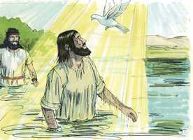 

**33** 	E eu não o conhecia, mas o que me mandou a batizar com água, esse me disse: Sobre aquele que vires descer o Espírito, e sobre ele repousar, esse é o que batiza com o Espírito Santo.

**34** 	E eu vi, e tenho testificado que este é o Filho de Deus.

**35** 	No dia seguinte João estava outra vez ali, e dois dos seus discípulos;

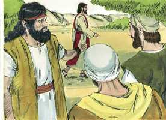 

**36** 	E, vendo passar a Jesus, disse: Eis aqui o Cordeiro de Deus.

**37** 	E os dois discípulos ouviram-no dizer isto, e seguiram a Jesus.

**38** 	E Jesus, voltando-se e vendo que eles o seguiam, disse-lhes: Que buscais? E eles disseram: Rabi (que, traduzido, quer dizer Mestre), onde moras?

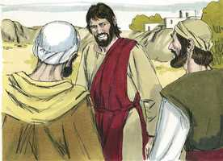 

**39** 	Ele lhes disse: Vinde, e vede. Foram, e viram onde morava, e ficaram com ele aquele dia; e era já quase a hora décima.

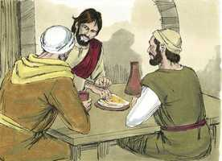 

**40** 	Era André, irmão de Simão Pedro, um dos dois que ouviram aquilo de João, e o haviam seguido.

**41** 	Este achou primeiro a seu irmão Simão, e disse-lhe: Achamos o Messias (que, traduzido, é o Cristo).

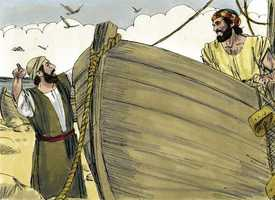 

**42** 	E levou-o a Jesus. E, olhando Jesus para ele, disse: Tu és Simão, filho de Jonas; tu serás chamado Cefas (que quer dizer Pedro).

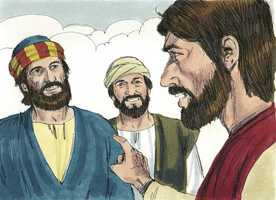 

**43** 	No dia seguinte quis Jesus ir à Galiléia, e achou a Filipe, e disse-lhe: Segue-me.

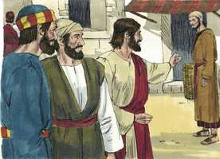 

**44** 	E Filipe era de Betsaida, cidade de André e de Pedro.

**45** 	Filipe achou Natanael, e disse-lhe: Havemos achado aquele de quem Moisés escreveu na lei, e os profetas: Jesus de Nazaré, filho de José.

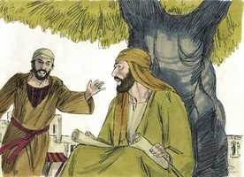 

**46** 	Disse-lhe Natanael: Pode vir alguma coisa boa de Nazaré? Disse-lhe Filipe: Vem, e vê.

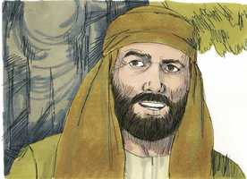 

**47** 	Jesus viu Natanael vir ter com ele, e disse dele: Eis aqui um verdadeiro israelita, em quem não há dolo.

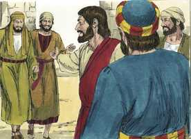 

**48** 	Disse-lhe Natanael: De onde me conheces tu? Jesus respondeu, e disse-lhe: Antes que Filipe te chamasse, te vi eu, estando tu debaixo da figueira.

 

**49** 	Natanael respondeu, e disse-lhe: Rabi, tu és o Filho de Deus; tu és o Rei de Israel.

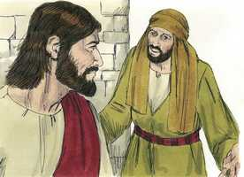 

**50** 	Jesus respondeu, e disse-lhe: Porque te disse: Vi-te debaixo da figueira, crês? Coisas maiores do que estas verás.

**51** 	E disse-lhe: Na verdade, na verdade vos digo que daqui em diante vereis o céu aberto, e os anjos de Deus subindo e descendo sobre o Filho do homem.

> **Cmt MHenry** Intro: Veja-se a natureza do cristianismo verdadeiro: seguir a Jesus, dedicar-nos a Ele e seguir suas pegadas. Olhem para a objeção que fez Natanael. Todos os que desejam aproveitar a palavra de Deus devem cuidar-se dos prejuízos contra lugares ou denominações dos homens. devem examinar-se por si mesmos e, às vezes, acharão o bem onde não o procuraram. Muita gente se mantém fora dos caminhos da religião pelos prejuízos irracionais que concebem. A melhor maneira de eliminar as falsas noções da religião é julgá-la. Não havia engano em Natanael. Sua profissão não era hipócrita. Não era um simulador nem desonesto; era um caráter sadio, um homem realmente reto e piedoso. Cristo sabe, sem dúvida, o que são os homens. Nos conhece? Desejemos conhecê-lo. Procuremos e oremos para sermos um verdadeiro israelita no qual não há engano, cristãos verdadeiramente aprovados pelo próprio Cristo. Algumas coisas débeis, imperfeitas e pecaminosas encontram-se em todos, mas a hipocrisia não corresponde ao caráter do crente. Jesus deu testemunho do que aconteceu quando Natanael estava embaixo da figueira. Provavelmente, então, estavam orando com fervor, buscando direção acerca da Esperança e do Consolo de Israel, onde nenhum olho humano o visse. Isto demonstrou que nosso Senhor conhecia os segredos de seu coração. Por meio de Cristo temos comunhão com os santos anjos e nos beneficiamos deles; e se reconciliam e unem as coisas do céu e as coisas da terra.> " O argumento mais forte e dominante de uma alma vivificada para seguir a Cristo é que Ele é o único que tira o pecado. Qualquer seja a comunhão que exista entre nossas almas e Cristo, Ele é quem começa a conversação. Perguntou, "Que buscam?" A pergunta que lhes faz Jesus é a que deveríamos fazer-nos todos quando começamos a segui-lo: que queremos e que desejamos? Ao seguir a Cristo, buscamos o favor de Deus e a vida eterna? Os convida a acudir sem demora. Agora é o tempo aceitável ([2 Co 6.2](../47N-2Co/06.md#2)). Bom é para nós estar onde esteja Cristo, onde quer que seja. Devemos trabalhar pelo bem-estar espiritual de nossos parentes, e procurar levá-los a Ele. os que vão a Cristo devem ir com a resolução fixa de ser firmes e constantes nEle, como pedra, sólida e firme; e é por sua graça que são assim. "> João viu a Jesus que vinha a ele, e o indicou como o Cordeiro de Deus. o cordeiro pascoal, no derramamento e no aspergir de seu sangue, o assar e comer sua carne e todas as demais circunstâncias da ordenança, representavam a salvação dos pecadores por fé em Cristo. os cordeiros sacrificados a cada manhã e cada tarde podem referir-se somente a Cristo morto como sacrifício para redimir-nos para Deus por seu sangue. João veio como pregador de arrependimento, apesar de que disse a seus seguidores que deviam buscar o perdão de seus pecados somente em Jesus e em sua morte. Concorda com a glória de Deus perdoar a todos os que dependem do sacrifício expiatório de Cristo. Ele tira o pecado do mundo; adquire perdão para todos os que se arrependem e crêem no evangelho. Isto estimula nossa fé; se Cristo tira o pecado do mundo, então, por quê não *meu* pecado? Ele levou o pecado *por* nós, e, assim, o tira Notas Bíblia de Estudo NVI-out_images.txt Simple_Bible_Reader_v2.9-bible_converter.exe nós. Deus poderia ter tirado o pecado eliminando o pecador, como tirou o pecado do velho mundo, porém eis aqui uma maneira de tirar o pecado salvando o pecador, fazendo pecado a seu Filho, isto é, fazendo-o oferta pelo pecado por nós. Vejamos a Jesus tirando o pecado, e que isso nos faça odiar o pecado e decidir-nos em sua contra. Não nos aferremos daquilo que o Cordeiro de Deus veio eliminar. Para confirmar seu testemunho de Cristo, João declara suas aparição em ocasião de seu batismo, coisa que o próprio Deus testificou. Viu e tomou nota de que era o Filho de Deus. este é o fim e o objetivo do testemunho de João: que Jesus era o Messias prometido. João aproveitou toda oportunidade que lhe foi oferecida para guiar a gente a Cristo.> João nega ser o Cristo esperado. Veio no espírito e o poder de Elias, mas não era a pessoa de Elias. João não era *aquele* Profeta do qual Moisés falou, que o Senhor levantaria de seus irmãos como para Ele. não era o profeta que eles esperavam os resgataria dos romanos. Se apresentou de tal modo que poderia tê-los despertado e estimulado para que o ouvissem. Batizou a gente com água como profissão de arrependimento e como sinal externo das bênçãos espirituais que lhes conferiria o Messias, que estava em meio deles, embora não o reconhecessem, Aquele ao qual ele era indigno de prestar o serviço mais vil.> " Cronologicamente e na entrada em sua obra, Cristo veio depois de João, mas em toda outra forma, foi antes dele. A expressão mostra claramente que Jesus tinha existência antes de aparecer na terra como homem. NEle habita toda plenitude, de quem só os pecadores caídos têm, e receberão por fé, todo o que os faz sábios, fortes, santos, úteis e ditosos. Todo o que recebemos por Cristo se resume nesta só palavra: graça. Recebemos "graça sobre graça", um dom tão grande, tão rico, tão inapreciável; a boa vontade de Deus para conosco, e a boa obra de Deus em nós. A lei de Deus é santa, justa e boa; e devemos fazer uso apropriado dela. Mas não podemos derivar dela o perdão, a justiça ou a força. Nos ensina a enfeitar a doutrina de Deus nosso Salvador, mas não pode tomar o lugar dessa doutrina. Como nenhuma misericórdia procede de Deus para os pecadores senão por meio de Jesus Cristo, nenhum homem pode ir ao Pai senão por Ele; ninguém pode conhecer a Deus salvo que Ele o dê a conhecer no Filho unigênito e amado. "> João Batista veio dar testemunho de Jesus. nada revela com maior plenitude as trevas da mente dos homens que quando apareceu a Luz que houve necessidade de uma testemunha para chamar a atenção a ela. Cristo era a Luz verdadeira; essa grande Luz que merece ser assim chamada. Por seu Espírito e graça ilumina a todos os que estão iluminados para salvação; e os que não estão iluminados por Ele, perecem nas trevas. Cristo esteve no mundo quando assumiu nossa natureza e habitou conosco. O Filho do Altíssimo esteve aqui neste mundo inferior. Esteve *no* mundo, mas não era bible_markdown.sh markdown2html.sh Notas Bíblia de Estudo NVI-out_images.txt mundo. Veio salvar um mundo perdido, porque era um mundo de Sua própria feitura. Contudo, o mundo não o conheceu. Quando venha como Juiz, o mundo o conhecerá. Muitos dizem que são de Cristo, embora não o recebem porque não deixam seus pecados nem permitem que Ele reine sobre eles. Todos os filhos de Deus são nascidos de novo. este novo nascimento é por meio da palavra de Deus ([1 Pe 1.23](../60N-1Pe/01.md#23)), e pelo Espírito de Deus Enquanto a Autor. Por sua presença divina, Cristo sempre esteve no mundo, porém, agora que chegaria o cumprimento do tempo, Ele foi, de outra forma, Deus manifestado na carne. Observem-se, não obstante, os raios de sua glória divina que perfuraram este véu de carne. Embora esteve na forma de servo, no que diz respeito às circunstâncias externas, a respeito da graça sua forma foi a do Filho de Deus cuja glória divina se revela na santidade de sua doutrina e em seus milagres. Foi cheio de graça, completamente aceitável a seu Pai, portanto, apto para interceder por nós; e cheio de verdade, plenamente ciente das coisas que revelaria.> A razão mais simples do por quê se chama Verbo ao Filho de Deus parece ser que como nossas palavras explicam nossas idéias aos outros, assim foi enviado o Filho de Deus para revelar o pensamento de Seu Pai ao mundo.\> \ O que diz o evangelista acerca de Cristo prova que Ele é Deus. afirma sua existência no começo; sua co-existência com o Pai. O Verbo estava com Deus. Todas as coisas foram feitas por Ele, e não como instrumento. Sem Ele nada do que existe foi feito, desde o anjo mais elevado até o verme mais baixo. Isto mostra quão bem qualificado estava para a obra de nossa redenção e salvação. A luz da razão, e a vida dos sentidos, deriva dEle, e depende dEle. Este Verbo eterno, esta Luz verdadeira, resplandece, mas as trevas não a compreenderam. Oremos sem cessar para que nossos olhos sejam abertos para contemplar esta luz, para que andemos nEle; e assim sejamos feitos sábios para salvação por fé em Jesus Cristo.