# João Cap 02

**1** 	E, AO terceiro dia, fizeram-se umas bodas em Caná da Galiléia; e estava ali a mãe de Jesus.

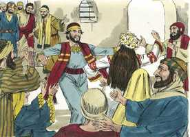 

**2** 	E foi também convidado Jesus e os seus discípulos para as bodas.

**3** 	E, faltando vinho, a mãe de Jesus lhe disse: Não têm vinho.

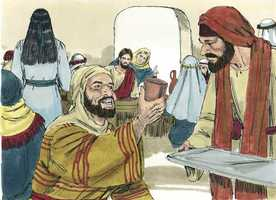 

**4** 	Disse-lhe Jesus: Mulher, que tenho eu contigo? Ainda não é chegada a minha hora.

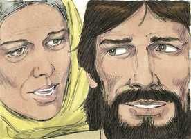 

**5** 	Sua mãe disse aos serventes: Fazei tudo quanto ele vos disser.

**6** 	E estavam ali postas seis talhas de pedra, para as purificações dos judeus, e em cada uma cabiam dois ou três almudes.

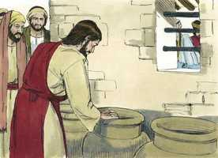 

**7** 	Disse-lhes Jesus: Enchei de água essas talhas. E encheram-nas até em cima.

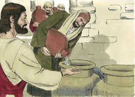 

**8** 	E disse-lhes: Tirai agora, e levai ao mestre-sala. E levaram.

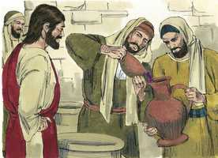 

**9** 	E, logo que o mestre-sala provou a água feita vinho (não sabendo de onde viera, se bem que o sabiam os serventes que tinham tirado a água), chamou o mestre-sala ao esposo,

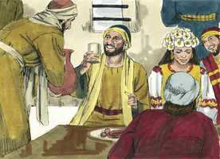 

**10** 	E disse-lhe: Todo o homem põe primeiro o vinho bom e, quando já têm bebido bem, então o inferior; mas tu guardaste até agora o bom vinho.

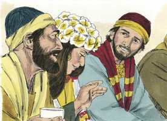  

**11** 	Jesus principiou assim os seus sinais em Caná da Galiléia, e manifestou a sua glória; e os seus discípulos creram nele.

**12** 	Depois disto desceu a Cafarnaum, ele, e sua mãe, e seus irmãos, e seus discípulos; e ficaram ali não muitos dias.

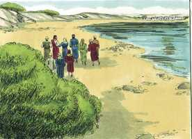 

**13** 	E estava próxima a páscoa dos judeus, e Jesus subiu a Jerusalém.

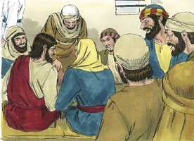 

**14** 	E achou no templo os que vendiam bois, e ovelhas, e pombos, e os cambiadores assentados.

 

**15** 	E tendo feito um azorrague de cordéis, lançou todos fora do templo, também os bois e ovelhas; e espalhou o dinheiro dos cambiadores, e derribou as mesas;

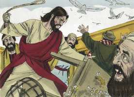 

**16** 	E disse aos que vendiam pombos: Tirai daqui estes, e não façais da casa de meu Pai casa de venda.

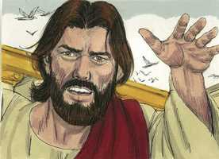 

**17** 	E os seus discípulos lembraram-se do que está escrito: O zelo da tua casa me devorou.

**18** 	Responderam, pois, os judeus, e disseram-lhe: Que sinal nos mostras para fazeres isto?

**19** 	Jesus respondeu, e disse-lhes: Derribai este templo, e em três dias o levantarei.

**20** 	Disseram, pois, os judeus: Em quarenta e seis anos foi edificado este templo, e tu o levantarás em três dias?

**21** 	Mas ele falava do templo do seu corpo.

**22** 	Quando, pois, ressuscitou dentre os mortos, os seus discípulos lembraram-se de que lhes dissera isto; e creram na Escritura, e na palavra que Jesus tinha dito.

**23** 	E, estando ele em Jerusalém pela páscoa, durante a festa, muitos, vendo os sinais que fazia, creram no seu nome.

**24** 	Mas o mesmo Jesus não confiava neles, porque a todos conhecia;

**25** 	E não necessitava de que alguém testificasse do homem, porque ele bem sabia o que havia no homem.

> **Cmt MHenry** Intro: Nosso Senhor conhecia a todos os homens, sua natureza, suas disposições, seus afetos e suas intenções, de uma maneira que nós não conhecemos a ninguém, nem sequer a nós mesmos. Conhece seus astutos inimigos, e todos seus projetos secretos; a seus falsos amigos e seu verdadeiro caráter. Ele sabe quem são verdadeiramente seus, conhece sua retidão, e conhece suas fraquezas. Sabemos o que os homens fazem; Cristo sabe o que há neles, Ele prova seu coração. Cuidado com uma fé morta ou uma profissão de fé formal: Não se deve confiar nos professantes carnais e vazios, e não obstante que os homens se imponham a outros ou a si mesmos, não podem impor-se ao Deus que esquadrinha o coração.> A primeira obra pública na que achamos a Cristo é expulsar do templo os cambistas que os cobiçosos sacerdotes e dirigentes apoiavam para que convertessem em mercado seus átrios. Os que agora fazem da casa de Deus um mercado são os que têm suas mentes cheias com o interesse pelos negócios do mundo quando assistem aos exercícios religiosos, ou os que desempenham ofícios divinos por amor a um lucro. Tendo purificado o templo, Cristo deu um sinal aos que lhe pediram que provasse sua autoridade para agir: Anuncia sua morte pela maldade dos judeus. Destruam este templo. Eu permitirei que o destruam. Anuncia sua ressurreição por seu próprio poder: em três dias o levantarei. Cristo voltou à vida por seu poder. Os homens erram quando entendem literalmente nos casos em que as Escrituras falam figuradamente. Quando Jesus ressuscitou dentre os mortos, seus discípulos lembraram que tinha falado isso. muita ajuda a nosso entendimento da palavra divina é que observemos o cumprimento das Escrituras.> É muito desejável que quando haja um matrimônio Cristo o reconheça e abençoe. Os que queiram ter a Cristo com eles em seu matrimônio devem convidá-lo por meio da oração e Ele virá. Enquanto estamos neste mundo nos encontramos, às vezes, em aperto ainda quando cremos estar na abundância. Havia uma necessidade na festa de bodas. Os que são dados a preocupar-se pelas coisas do mundo devem esperar problemas e contar com o desencanto. Quando falamos a Cristo devemos expor com humildade nosso caso ante Ele e, depois, encomendar-nos a Ele para que faça como lhe apraz. Não houve desrespeito na resposta de Cristo a sua mãe. Usou a mesma palavra quando lhe falou com afeto desde a cruz, mas é testemunho presente contra a idolatria das épocas posteriores que rende honras indevidas a sua mãe. Sua hora chega quando não sabemos que fazer. A demora da misericórdia não é uma negação das orações. Os que esperam os favores de Cristo devem obedecer suas ordens com prontidão. O caminho do dever é o caminho à misericórdia, e não se devem objetar os métodos de Cristo. O primeiro dos milagres de Moisés foi converter água em sangue ([Êx 7.20](../02A-Ex/07.md#20)); o começo dos milagres de Cristo foi converter água em vinho, o qual pode fazer-nos lembrar a diferença que existe entre a lei de Moisés e o evangelho de Cristo. Ele demonstra que beneficia com consolos da criação a todos os crentes verdadeiros e que a eles converte em verdadeiro consolo. As obras de Cristo são todas para bem. Tem convertido tua água em vinho, te deu conhecimento e graça? É para aproveitá-lo; portanto, tira agora e usa dele. Era o melhor vinho. As obras de Cristo se recomendam por si mesmas ainda ante os que não conhecem a seu Autor. O que é produzido por milagre sempre tem sido o melhor de seu tipo. Embora com isto Cristo permite o uso correto do vinho, não anula no mais mínimo sua advertência de que nossos corações, em momento nenhum devem carregar-se com glutonaria ou embriaguez ([Lc 21.34](../42N-Lc/21.md#34)). Apesar de que não temos de ser melindrosos para festejar com nossas amizades em ocasiões apropriadas, de todos modos, toda reunião social deve realizar-se de modo tal que possamos convidar a reunir-se conosco ao Redentor, se agora estiver na terra; toda leviandade, luxúria e excesso o ofendem.