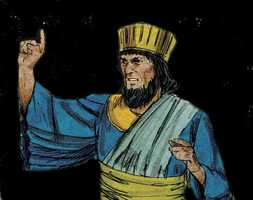
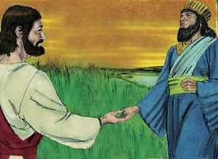
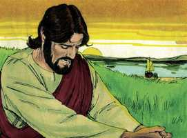
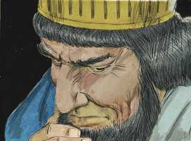

# João Cap 03

**1** 	E HAVIA entre os fariseus um homem, chamado Nicodemos, príncipe dos judeus.

 

**2** 	Este foi ter de noite com Jesus, e disse-lhe: Rabi, bem sabemos que és Mestre, vindo de Deus; porque ninguém pode fazer estes sinais que tu fazes, se Deus não for com ele.

 

**3** 	Jesus respondeu, e disse-lhe: Na verdade, na verdade te digo que aquele que não nascer de novo, não pode ver o reino de Deus.

 

**4** 	Disse-lhe Nicodemos: Como pode um homem nascer, sendo velho? Pode, porventura, tornar a entrar no ventre de sua mãe, e nascer?

 

**5** 	Jesus respondeu: Na verdade, na verdade te digo que aquele que não nascer da água e do Espírito, não pode entrar no reino de Deus.

**6** 	O que é nascido da carne é carne, e o que é nascido do Espírito é espírito.

**7** 	Não te maravilhes de te ter dito: Necessário vos é nascer de novo.

**8** 	O vento assopra onde quer, e ouves a sua voz, mas não sabes de onde vem, nem para onde vai; assim é todo aquele que é nascido do Espírito.

**9** 	Nicodemos respondeu, e disse-lhe: Como pode ser isso?

**10** 	Jesus respondeu, e disse-lhe: Tu és mestre de Israel, e não sabes isto?

**11** 	Na verdade, na verdade te digo que nós dizemos o que sabemos, e testificamos o que vimos; e não aceitais o nosso testemunho.

**12** 	Se vos falei de coisas terrestres, e não crestes, como crereis, se vos falar das celestiais?

**13** 	Ora, ninguém subiu ao céu, senão o que desceu do céu, o Filho do homem, que está no céu.

**14** 	E, como Moisés levantou a serpente no deserto, assim importa que o Filho do homem seja levantado;

**15** 	Para que todo aquele que nele crê não pereça, mas tenha a vida eterna.

**16** 	Porque Deus amou o mundo de tal maneira que deu o seu Filho unigênito, para que todo aquele que nele crê não pereça, mas tenha a vida eterna.

**17** 	Porque Deus enviou o seu Filho ao mundo, não para que condenasse o mundo, mas para que o mundo fosse salvo por ele.

**18** 	Quem crê nele não é condenado; mas quem não crê já está condenado, porquanto não crê no nome do unigênito Filho de Deus.

**19** 	E a condenação é esta: Que a luz veio ao mundo, e os homens amaram mais as trevas do que a luz, porque as suas obras eram más.

**20** 	Porque todo aquele que faz o mal odeia a luz, e não vem para a luz, para que as suas obras não sejam reprovadas.

**21** 	Mas quem pratica a verdade vem para a luz, a fim de que as suas obras sejam manifestas, porque são feitas em Deus.

**22** 	Depois disto foi Jesus com os seus discípulos para a terra da Judéia; e estava ali com eles, e batizava.

**23** 	Ora, João batizava também em Enom, junto a Salim, porque havia ali muitas águas; e vinham ali, e eram batizados.

**24** 	Porque ainda João não tinha sido lançado na prisão.

**25** 	Houve então uma questão entre os discípulos de João e os judeus acerca da purificação.

**26** 	E foram ter com João, e disseram-lhe: Rabi, aquele que estava contigo além do Jordão, do qual tu deste testemunho, ei-lo batizando, e todos vão ter com ele.

**27** 	João respondeu, e disse: O homem não pode receber coisa alguma, se não lhe for dada do céu.

**28** 	Vós mesmos me sois testemunhas de que disse: Eu não sou o Cristo, mas sou enviado adiante dele.

**29** 	Aquele que tem a esposa é o esposo; mas o amigo do esposo, que lhe assiste e o ouve, alegra-se muito com a voz do esposo. Assim, pois, já este meu gozo está cumprido.

**30** 	É necessário que ele cresça e que eu diminua.

**31** 	Aquele que vem de cima é sobre todos; aquele que vem da terra é da terra e fala da terra. Aquele que vem do céu é sobre todos.

**32** 	E aquilo que ele viu e ouviu isso testifica; e ninguém aceita o seu testemunho.

**33** 	Aquele que aceitou o seu testemunho, esse confirmou que Deus é verdadeiro.

**34** 	Porque aquele que Deus enviou fala as palavras de Deus; pois não lhe dá Deus o Espírito por medida.

**35** 	O Pai ama o Filho, e todas as coisas entregou nas suas mãos.

**36** 	Aquele que crê no Filho tem a vida eterna; mas aquele que não crê no Filho não verá a vida, mas a ira de Deus sobre ele permanece.

> **Cmt MHenry** Intro: João se satisfez por completo com o lugar e a obra designados, mas Jesus veio para uma obra mais importante. Ele sabia que Jesus cresceria em honra e influência, porque seu reino e sua paz não teriam fim, enquanto que a ele o seguiriam cada vez menos. João sabia que Jesus veio do céu como o Filho de Deus, enquanto ele era um homem mortal e pecador, que somente podia falar das coisas mais simples da religião. As palavras de Jesus eram a palavra de Deus; Ele tinha o Espírito, não segundo a medida como os profetas, senão em toda sua plenitude. A vida eterna pode ter-se somente pela fé nEle, e assim só pode ser obtida; mas não podem participar da salvação todos os que não crêem no Filho de Deus, e a ira de Deus está sobre eles para sempre.> " Quão grande é o pecado dos incrédulos! Deus enviou a Um que era o mais amado por Ele, por salvar-nos; e não será o mais amado para nós? Quão grande é a miséria dos incrédulos! Já foram condenados, o que fala de uma condenação *certa*; uma condenação *presente*. A ira de Deus agora se desata sobre eles; e os condenam seus próprios corações. Também existe uma condenação baseada em sua *culpa anterior*; eles estão expostos à lei por todos seus pecados; porque não estão interessados por fé no perdão do evangelho. A incredulidade é um pecado contra o remédio. Brota da inimizade do coração do homem para com Deus, do amor ao pecado em alguma forma. Leia-se também a condenação dos que não querem conhecer a Cristo. as obras pecadoras são as obras das trevas. O mundo ímpio se mantém longe desta luz como pode, não seja que suas obras sejam reprovadas. Cristo é odiado porque amam o pecado. se não odiassem o conhecimento da salvação, não ficariam contentes na ignorância condenadora. Por outro lado, os corações renovados dão as boas-vindas à luz. Um homem bom age verdadeiramente e sinceramente em todo o que faz. teve lugar uma mudança em todo seu caráter e conduta. O amor a Deus é derramado em seu coração pelo Espírito Santo, e chega a ser o princípio reitor de suas ações. Na medida em que continue sob uma carga de culpa não perdoada, somente pode ter um temor servil a Deus; porém, quando suas dúvidas se dissipam, quando vê a base justa sobre a qual se edifica seu perdão, o assume como se fosse próprio, e se une com Deus por um amor sem fingimento. Nossas obras são boas quando a vontade de Deus é a regra delas, e a glória de Deus, sua finalidade; quando se fazem em Seu poder e por amor a Ele; a Ele, e não aos homens. A regeneração, ou o novo nascimento, é um tema do qual o mundo tem aversão; contudo, é o grande ganho em comparação com o qual todo o resto não é senão ninharias. Que pode significar que tenhamos comida para comer em abundância, e uma variedade de roupas para usar, se não formos nascidos de novo? se depois de umas quantas manhãs e tardes passadas em alegria irracional, prazer carnal e desordem, morremos em nossos pecados e jazemos na dor? De que vale que sejamos capazes de desempenhar nossa parte na vida, em todo outro aspecto, se no final ouvimos de parte do Juiz Supremo: "Afastai-vos de mim, não vos conheço, operadores de maldade"? "> Jesus Cristo veio a salvar-nos curando-nos, como os filhos de Israel picados por serpentes ardentes foram curados e viveram ao olharem para a serpente de bronze ([Nm 21.6-9](../04A-Nm/21.md#6)). Observe-se nisto a natureza mortal e destruidora do pecado. pergunte-se a consciências vivificadas, pergunte-se a pecadores condenados, os que dirão que, por encantadoras que sejam as seduções do pecado, afinal mordem como serpentes. Veja-se o remédio poderoso contra esta doença fatal. Cristo nos é proposto claramente no evangelho. Aquele ao qual ofendemos é nossa Paz, e a maneira de solicitar a cura é acreditar. Se algum até agora toma levianamente a doença do pecado ou o método de cura de Cristo, e não O recebe nas condições que Ele propõe, sua ruína pende sobre sua cabeça. Ele disse: Olhem e sejam salvos, olhem e vivam; alcem os olhos da fé a Cristo crucificado. Enquanto não tenhamos a graça para fazer isto, não seremos curados, mas continuaremos feridos pelos aguilhoes de Satanás e em estado moribundo. Jesus Cristo veio a salvar-nos perdoando-nos, para que não morrêssemos pela sentença da lei. Eis aqui o evangelho, a verdade, a boa nova. Eis aqui o amor de Deus ao dar seu Filho pelo mundo. Tanto amou Deus o mundo, tão verdadeiramente, tão ricamente. Olhem e maravilhem-se de que o grande Deus ame um mundo tão indigno! Aqui, também, está o grande dever do evangelho: crer em Jesus Cristo. Tendo-o dado Deus para que fosse nosso Profeta, Sacerdote e Rei, nós devemos dar-nos para sermos governados e ensinados, e salvos por Ele. eis aqui o grande benefício do evangelho, que quem quiser que creia em Cristo não perecerá, mas terá a vida eterna. Deus estava em Cristo reconciliando o mundo consigo mesmo, e desse modo, o salvava. Não podia ser salvo senão por meio dEle; em nenhum outro há salvação. Disto tudo se mostra o prazer do crente verdadeiro: o que crê em Cristo não é condenado. Embora tenha sido um grande pecador, não é tratado segundo o merecem seus pecados.> " A exposição feita por Cristo da doutrina e a necessidade da regeneração parece não ter ficado clara para Nicodemos. Assim, as coisas do Espírito de Deus são tolice para o homem natural. Muitos pensam que não pode ser provado o que não podem crer. O discurso de Cristo sobre as verdades do evangelho, versículos 11-13, mostra a torpeza daqueles que fazem que estas coisas sejam estranhas para eles; e nos recomenda que as investiguemos. Jesus Cristo é capaz em toda forma de revelar-nos a vontade de Deus; porque desceu do céu, e ainda está no céu. Aqui temos uma nota das duas naturezas distintas de Cristo numa pessoa, de modo que é o Filho do Homem, apesar de estar no céu. Deus é "O QUE É", e o céu é a habitação de sua santidade. Este conhecimento deve vir do alto e somente pode ser recebido por fé. "> Nicodemos temia, ou se envergonhava, de ser visto com Cristo, portanto acudiu de noite. Quando a religião está fora de moda, há muitos Nicodemos, mas a despeito que veio de noite, Jesus o recebeu, e por isso nos ensina a animar os bons começos, embora fracos. Ainda que esta vez veio de noite, depois reconheceu publicamente a Cristo. Não falou com Cristo de assunto de estado, apesar de ser um governante, senão dos interesses de sua própria alma e de sua salvação, falando a esse respeito de uma vez só. Nosso Salvador fala da necessidade e natureza da regeneração ou novo nascimento e, de imediato levou a Nicodemos à fonte de santidade do coração. O nascimento é o começo da vida; nascer de novo é começar a viver de novo, como os que viveram muito errados ou com escasso sentido. Devemos ter uma nova natureza, novos princípios, novos afetos, novas miras. Por nosso primeiro nascimento somos corruptos, formados no pecado; portanto, devemos ser feitos novas criaturas. Não poderia ter-se escolhido uma expressão mais forte para significar uma mudança de estado e de caráter tão grande e notável. Devemos ser inteiramente diferente do que fomos antes, como aquilo que começa a ser em qualquer momento, não é, e não pode ser o mesmo que era antes. Este novo nascimento é bible_markdown.sh markdown2html.sh Notas Bíblia de Estudo NVI-out_images.txt céu (capítulo 1.13), e tende *para o* céu. É uma grande mudança realizada no coração do pecador pelo poder do Espírito Santo. Significa que algo é feito em nós e a favor de nós, que não podemos fazer por nós mesmos. Algo opera, pelo que começa uma vida que durará por sempre. De outra maneira, não podemos esperar um benefício de Cristo; é necessário para nossa felicidade aqui e no além. Nicodemos entendeu errado o que disse Cristo, como se não houvesse outra forma de regenerar e moldar de novo uma alma imortal que voltar a dar um marco ao corpo. Contudo, reconheceu sua ignorância, o que mostra o desejo de ser melhor informado. Então, o Senhor Jesus explica mais. Mostra o Autor desta bendita mudança. Não é obra de nossa sabedoria ou poder próprios, senão do poder do bendito Espírito. Somos formados em iniqüidade, o que faz necessário que nossa natureza seja mudada. Não temos que maravilhar-nos disso, pois quando consideramos a santidade de Deus, a depravação de nossa natureza, e a felicidade colocada diante de nós, não devemos pensar que é estranho que se faça tanto ênfase sobre isso. A obra regeneradora do Espírito Santo se compara com a água. Também é provável que Cristo tenha-se referido à ordenança do batismo. Não se trata de que sejam salvos todos aqueles batizados, e somente eles; porém, sem o novo nascimento operado pelo Espírito, e significado pelo batismo, ninguém será súbdito do Reino dos Céus. A mesma palavra significa vento e Espírito. O vento sopra de onde quer para nós; Deus o dirige. O Espírito envia suas influências ocultas aonde, e quando, e a quem, e na medida e grau que lhe apraz. Embora as causas sejam ocultas, os efeitos são evidentes, quando a alma é levada a lamentar-se pelo pecado e a respirar segundo Cristo.