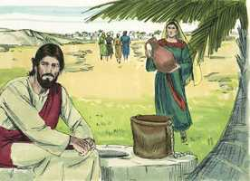
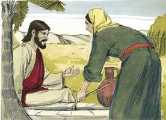
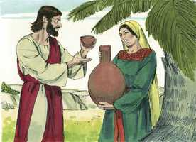
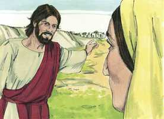
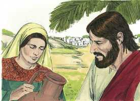
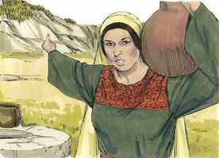
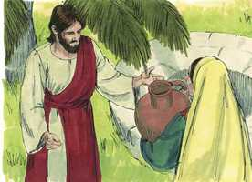
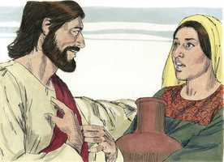
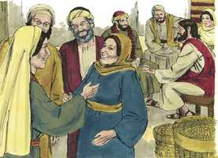

# João Cap 04

**1** 	E QUANDO o Senhor entendeu que os fariseus tinham ouvido que Jesus fazia e batizava mais discípulos do que João

**2** 	(Ainda que Jesus mesmo não batizava, mas os seus discípulos),

**3** 	Deixou a Judéia, e foi outra vez para a Galiléia.

**4** 	E era-lhe necessário passar por Samaria.

**5** 	Foi, pois, a uma cidade de Samaria, chamada Sicar, junto da herdade que Jacó tinha dado a seu filho José.

 

**6** 	E estava ali a fonte de Jacó. Jesus, pois, cansado do caminho, assentou-se assim junto da fonte. Era isto quase à hora sexta.

**7** 	Veio uma mulher de Samaria tirar água. Disse-lhe Jesus: Dá-me de beber.

 

**8** 	Porque os seus discípulos tinham ido à cidade comprar comida.

**9** 	Disse-lhe, pois, a mulher samaritana: Como, sendo tu judeu, me pedes de beber a mim, que sou mulher samaritana? (porque os judeus não se comunicam com os samaritanos).

**10** 	Jesus respondeu, e disse-lhe: Se tu conheceras o dom de Deus, e quem é o que te diz: Dá-me de beber, tu lhe pedirias, e ele te daria água viva.

 

**11** 	Disse-lhe a mulher: Senhor, tu não tens com que a tirar, e o poço é fundo; onde, pois, tens a água viva?

**12** 	És tu maior do que o nosso pai Jacó, que nos deu o poço, bebendo ele próprio dele, e os seus filhos, e o seu gado?

**13** 	Jesus respondeu, e disse-lhe: Qualquer que beber desta água tornará a ter sede;

 

**14** 	Mas aquele que beber da água que eu lhe der nunca terá sede, porque a água que eu lhe der se fará nele uma fonte de água que salte para a vida eterna.

**15** 	Disse-lhe a mulher: Senhor, dá-me dessa água, para que não mais tenha sede, e não venha aqui tirá-la.

**16** 	Disse-lhe Jesus: Vai, chama o teu marido, e vem cá.

 

**17** 	A mulher respondeu, e disse: Não tenho marido. Disse-lhe Jesus: Disseste bem: Não tenho marido;

 

**18** 	Porque tiveste cinco maridos, e o que agora tens não é teu marido; isto disseste com verdade.

**19** 	Disse-lhe a mulher: Senhor, vejo que és profeta.

 

**20** 	Nossos pais adoraram neste monte, e vós dizeis que é em Jerusalém o lugar onde se deve adorar.

**21** 	Disse-lhe Jesus: Mulher, crê-me que a hora vem, em que nem neste monte nem em Jerusalém adorareis o Pai.

 

**22** 	Vós adorais o que não sabeis; nós adoramos o que sabemos porque a salvação vem dos judeus.

**23** 	Mas a hora vem, e agora é, em que os verdadeiros adoradores adorarão o Pai em espírito e em verdade; porque o Pai procura a tais que assim o adorem.

**24** 	Deus é Espírito, e importa que os que o adoram o adorem em espírito e em verdade.

**25** 	A mulher disse-lhe: Eu sei que o Messias (que se chama o Cristo) vem; quando ele vier, nos anunciará tudo.

**26** 	Jesus disse-lhe: Eu o sou, eu que falo contigo.

 

**27** 	E nisto vieram os seus discípulos, e maravilharam-se de que estivesse falando com uma mulher; todavia nenhum lhe disse: Que perguntas? ou: Por que falas com ela?

**28** 	Deixou, pois, a mulher o seu cântaro, e foi à cidade, e disse àqueles homens:

 

**29** 	Vinde, vede um homem que me disse tudo quanto tenho feito. Porventura não é este o Cristo?

**30** 	Saíram, pois, da cidade, e foram ter com ele.

**31** 	E entretanto os seus discípulos lhe rogaram, dizendo: Rabi, come.

**32** 	Ele, porém, lhes disse: Uma comida tenho para comer, que vós não conheceis.

**33** 	Então os discípulos diziam uns aos outros: Trouxe-lhe, porventura, alguém algo de comer?

**34** 	Jesus disse-lhes: A minha comida é fazer a vontade daquele que me enviou, e realizar a sua obra.

**35** 	Não dizeis vós que ainda há quatro meses até que venha a ceifa? Eis que eu vos digo: Levantai os vossos olhos, e vede as terras, que já estão brancas para a ceifa.

**36** 	E o que ceifa recebe galardão, e ajunta fruto para a vida eterna; para que, assim o que semeia como o que ceifa, ambos se regozijem.

**37** 	Porque nisto é verdadeiro o ditado, que um é o que semeia, e outro o que ceifa.

**38** 	Eu vos enviei a ceifar onde vós não trabalhastes; outros trabalharam, e vós entrastes no seu trabalho.

**39** 	E muitos dos samaritanos daquela cidade creram nele, pela palavra da mulher, que testificou: Disse-me tudo quanto tenho feito.

 

**40** 	Indo, pois, ter com ele os samaritanos, rogaram-lhe que ficasse com eles; e ficou ali dois dias.

**41** 	E muitos mais creram nele, por causa da sua palavra.

**42** 	E diziam à mulher: Já não é pelo teu dito que nós cremos; porque nós mesmos o temos ouvido, e sabemos que este é verdadeiramente o Cristo, o Salvador do mundo.

**43** 	E dois dias depois partiu dali, e foi para a Galiléia.

**44** 	Porque Jesus mesmo testificou que um profeta não tem honra na sua própria pátria.

**45** 	Chegando, pois, à Galiléia, os galileus o receberam, vistas todas as coisas que fizera em Jerusalém, no dia da festa; porque também eles tinham ido à festa.

**46** 	Segunda vez foi Jesus a Caná da Galiléia, onde da água fizera vinho. E havia ali um nobre, cujo filho estava enfermo em Cafarnaum.

**47** 	Ouvindo este que Jesus vinha da Judéia para a Galiléia, foi ter com ele, e rogou-lhe que descesse, e curasse o seu filho, porque já estava à morte.

**48** 	Então Jesus lhe disse: Se não virdes sinais e milagres, não crereis.

**49** 	Disse-lhe o nobre: Senhor, desce, antes que meu filho morra.

**50** 	Disse-lhe Jesus: Vai, o teu filho vive. E o homem creu na palavra que Jesus lhe disse, e partiu.

**51** 	E descendo ele logo, saíram-lhe ao encontro os seus servos, e lhe anunciaram, dizendo: O teu filho vive.

**52** 	Perguntou-lhes, pois, a que hora se achara melhor. E disseram-lhe: Ontem às sete horas a febre o deixou.

**53** 	Entendeu, pois, o pai que era aquela hora a mesma em que Jesus lhe disse: O teu filho vive; e creu ele, e toda a sua casa.

**54** 	Jesus fez este segundo milagre, quando ia da Judéia para a Galiléia.

> **Cmt MHenry** Intro: O pai era um oficial do rei, mas o filho estava doente. As honras e os títulos não são garantia contra a doença e a morte. Os maiores homens devem ir a Deus, devem tornar-se mendigos. O nobre não se deteve em sua petição até que prevaleceu, mas primeiramente descobriu a fraqueza de sua fé no poder de Cristo. custa convencer-nos de que a distância de tempo e lugar não obstaculizam o conhecimento, a misericórdia nem o poder de só Senhor Jesus. Cristo deu uma resposta de paz. Se Cristo diz que a alma viva, viverá. O pai seguiu seu caminho, o que demonstrou a sinceridade de sua fé. Satisfeito, não se apressou a voltar a sua casa naquela noite; regressou como quem está em paz com sua consciência. Seus servos saíram a seu encontro com a notícia da recuperação de seu filho. A boa nova sairá ao encontro dos que esperam na palavra de Deus. confirma nossa fé que comparemos diligentemente as obras de Jesus com sua Palavra. E levar a cura à família trouxe a salvação. Assim, pois, experimentar o poder de uma palavra de Cristo pode estabelecer a autoridade de Cristo na alma. Toda a família creu igualmente. O milagre fez que desejassem a Jesus para eles. O conhecimento de Cristo ainda se difunde pelas famílias, e os homens acham saúde e salvação para suas almas.> Os discípulos se surpreenderam de que Cristo conversasse com uma samaritana, embora sabiam que era por uma boa razão e para um propósito bom. Assim, pois, quando aparecem dificuldades em detalhes na palavra e na providência de Deus, é bom que nos satisfaçamos com que todo o que Jesus Cristo diz e faz está certo. Duas coisas afetaram à mulher. A magnitude de seu conhecimento: Cristo conhece todos os pensamentos, palavras e ações de todos os filhos dos homens. E o poder de sua palavra: Ele falou com poder de seus pecados secretos. Ela se aferrou daquela parte do discurso de Cristo, que muitos poderiam pensar que ela seria resistente a repetir, porém o conhecimento de Cristo, ao qual somos guiados pela convicção do pecado, é muito provável que seja sadio e salvador. Eles foram a Ele: os que desejem conhecer a Cristo devem achá-lo onde Ele registre seu nome. Nosso Mestre nos deixou um exemplo para que aprendamos a fazer a vontade de Deus como Ele a fez; com diligência como os que fazem dela sua atividade; com deleite e prazer nela. Cristo compara sua obra com a sega. A sega está determinada e se cuida dela antes que chegue; assim foi com o evangelho. O tempo de colher é tempo de muito trabalho; então, todos devem estar nas lavouras. O tempo da sega é curto e a obra da colheita deve realizar-se então, ou não será feita; assim, pois, o tempo do evangelho é uma temporada que não pode recuperar-se se já passou. Às vezes Deus usa instrumentos muito fracos e improváveis para começar e continuar a boa obra. Nosso Salvador difunde conhecimento em todo um povo ensinando-lhe a uma coitada mulher. Benditos são os que não se ofendem com Cristo. desejam verdadeiramente aprender mais aqueles aos que Deus ensina. Muito agrega ao louvor de nosso amor por Cristo e sua palavra se vencer prejuízos. A fé deles cresceu. Enquanto a isso, eles creram que Ele era o Salvador não somente dos judeus, senão do mundo. Com essa certeza sabemos que Cristo é verdadeiramente Aquele, e sobre essa base, porque nós mesmos o ouvimos.> " Havia muito ódio entre samaritanos e judeus. o caminho de Cristo desde a Judéia até a Galiléia passava por Samaria. Não devemos meter-nos em lugares de tentação, senão quando devemos e, então, não devemos permanecer neles, mas apressar-nos a passar por eles. Aqui temos a nosso Senhor Jesus sujeito à fadiga normal dos viajantes. Assim vemos que era verdadeiro homem. O trabalho cansativo veio com o pecado; portanto Cristo, tendo-se feito maldição por nós, esteve sujeito a ele. Além disso, era pobre e realizou todas suas viagens a pé. Cansado, pois, sentou-se no poço; não tinha um travesseiro onde repousar. *Deste modo* se sentou, como senta alguém cansado de viajar. Com certeza devemos submeter-nos rapidamente a ser como o Filho de Deus em coisas como essas. Cristo pediu água à mulher. Ela se surpreendeu porque Ele não demonstrou a ira de sua nação contra os samaritanos. os homens moderados de todas partes são os homens que assombram. Cristo aproveitou a ocasião para ensinar-lhe coisas divinas: converteu a esta mulher demonstrando-lhe suas ignorância e concupiscência e sua necessidade de um Salvador. Se alude ao Espírito com a água viva. Com esta comparação tinha sido prometida a bênção do Messias no Antigo Testamento. As graças do Espírito e suas consolações satisfazem a alma sedenta que conhece sua própria natureza e necessidade. O que Jesus disse figuradamente, ela o entendeu literalmente. Cristo indica que a água do poço de Jacó dava uma satisfação de breve duração. Não importa quais sejam as águas de consolação que bebamos, teremos sede de novo. Mas o que participa do Espírito de graça, e do consolo do evangelho, nunca estará falto do que lhe dará stf a sua alma. Os corações carnais não olham mais alto que as metas carnais. Dá-me, disse ela, não para que eu tenha a vida eterna -proposta de Cristo-, senão para que não deva mais vir aqui a buscar água. A mente carnal é muito engenhosa para mudar as convicções e impedir que pressionem, porém nosso Senhor Jesus dirige muito certeiramente a convicção de pecado à consciência dela! A repreendeu severamente por seu presente estado de vida.\> \ A mulher reconheceu que Cristo era profeta. O poder de sua palavra para esquadrinhar o coração e convencer de coisas secretas a consciência é prova de autoridade divina. Pensar que desaparecem as coisas pelas quais lutamos deveria esfriar nossas contendas. O objeto de adoração continuará sendo o mesmo: Deus, como Pai; porém se dará fim a todas as diferenças sobre o lugar e adoração. A razão nos ensina a considerar a decência e a conveniência nos lugares de nosso serviço de adoração, mas a religião não dá preferência a um lugar a respeito de outro Enquanto à santidade e a aprovação de Deus. Os judeus tinham, certamente, a razão. Os que obtiveram um certo conhecimento de Deus pelas Escrituras, sabem 34A-Na 43N-Joa quem* adoram. A palavra de salvação era dos judeus. chegou a outras nações através deles. Cristo preferiu, com justiça, a adoração judaica antes que a samaritana, mas aqui fala do anterior como de algo que logo terminará. Deus estava a ponto de ser revelado como o Pai de todos os crentes de toda nação. O espírito ou alma do homem, influenciado pelo Espírito Santo, deve adorar a Deus e ter comunhão com Ele. os afetos espirituais, como demonstrados nas orações, súplicas e ações de graças fervorosas, constituem a adoração de um coração reto, no qual Deus se deleita e é glorificado. A mulher estava disposta a deixar a questão sem decidir até a vinda do Messias, porém Cristo disse: "Eu sou, o que fala contigo". Ela era uma samaritana estrangeira e hostil; o simples fato de falar com ela era considerado como desprestigio para nosso Senhor Jesus. contudo, Ele se revelou a esta mulher com mais plenitude do que tinha feito com qualquer de seus discípulos. nenhum pecado *passado* pode impedir que sejamos aceitos por Ele, se nos humilharmos diante dEle, crendo nEle como o Cristo, o Salvador do mundo. "> Jesus se dedicou mais a pregar, que era mais excelente, que a batizar ([1 Co 1.17](../46N-1Co/01.md#17)). Honraria a seus discípulos utilizando-os para batizar. Nos ensina que o benefício dos sacramentos não depende da mão de quem os ministra.