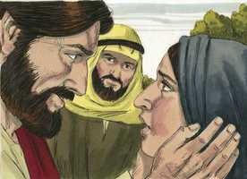
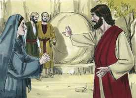

# João Cap 11

**1** 	ESTAVA, porém, enfermo um certo Lázaro, de Betânia, aldeia de Maria e de sua irmã Marta.

 

**2** 	E Maria era aquela que tinha ungido o Senhor com ungüento, e lhe tinha enxugado os pés com os seus cabelos, cujo irmão Lázaro estava enfermo.

**3** 	Mandaram-lhe, pois, suas irmãs dizer: Senhor, eis que está enfermo aquele que tu amas.

 

**4** 	E Jesus, ouvindo isto, disse: Esta enfermidade não é para morte, mas para glória de Deus, para que o Filho de Deus seja glorificado por ela.

**5** 	Ora, Jesus amava a Marta, e a sua irmã, e a Lázaro.

**6** 	Ouvindo, pois, que estava enfermo, ficou ainda dois dias no lugar onde estava.

**7** 	Depois disto, disse aos seus discípulos: Vamos outra vez para a Judéia.

**8** 	Disseram-lhe os discípulos: Rabi, ainda agora os judeus procuravam apedrejar-te, e tornas para lá?

**9** 	Jesus respondeu: Não há doze horas no dia? Se alguém andar de dia, não tropeça, porque vê a luz deste mundo;

**10** 	Mas, se andar de noite, tropeça, porque nele não há luz.

**11** 	Assim falou; e depois disse-lhes: Lázaro, o nosso amigo, dorme, mas vou despertá-lo do sono.

**12** 	Disseram, pois, os seus discípulos: Senhor, se dorme, estará salvo.

**13** 	Mas Jesus dizia isto da sua morte; eles, porém, cuidavam que falava do repouso do sono.

 

**14** 	Então Jesus disse-lhes claramente: Lázaro está morto;

**15** 	E folgo, por amor de vós, de que eu lá não estivesse, para que acrediteis; mas vamos ter com ele.

**16** 	Disse, pois, Tomé, chamado Dídimo, aos condiscípulos: Vamos nós também, para morrermos com ele.

**17** 	Chegando, pois, Jesus, achou que já havia quatro dias que estava na sepultura.

**18** 	(Ora Betânia distava de Jerusalém quase quinze estádios.)

**19** 	E muitos dos judeus tinham ido consolar a Marta e a Maria, acerca de seu irmão.

**20** 	Ouvindo, pois, Marta que Jesus vinha, saiu-lhe ao encontro; Maria, porém, ficou assentada em casa.

 

**21** 	Disse, pois, Marta a Jesus: Senhor, se tu estivesses aqui, meu irmão não teria morrido.

**22** 	Mas também agora sei que tudo quanto pedires a Deus, Deus to concederá.

**23** 	Disse-lhe Jesus: Teu irmão há de ressuscitar.

 

**24** 	Disse-lhe Marta: Eu sei que há de ressuscitar na ressurreição do último dia.

**25** 	Disse-lhe Jesus: Eu sou a ressurreição e a vida; quem crê em mim, ainda que esteja morto, viverá;

**26** 	E todo aquele que vive, e crê em mim, nunca morrerá. Crês tu isto?

**27** 	Disse-lhe ela: Sim, Senhor, creio que tu és o Cristo, o Filho de Deus, que havia de vir ao mundo.

**28** 	E, dito isto, partiu, e chamou em segredo a Maria, sua irmã, dizendo: O Mestre está cá, e chama-te.

**29** 	Ela, ouvindo isto, levantou-se logo, e foi ter com ele.

**30** 	(Pois, Jesus ainda não tinha chegado à aldeia, mas estava no lugar onde Marta o encontrara.)

**31** 	Vendo, pois, os judeus, que estavam com ela em casa e a consolavam, que Maria apressadamente se levantara e saíra, seguiram-na, dizendo: Vai ao sepulcro para chorar ali.

**32** 	Tendo, pois, Maria chegado aonde Jesus estava, e vendo-o, lançou-se aos seus pés, dizendo-lhe: Senhor, se tu estivesses aqui, meu irmão não teria morrido.

 

**33** 	Jesus pois, quando a viu chorar, e também chorando os judeus que com ela vinham, moveu-se muito em espírito, e perturbou-se.

**34** 	E disse: Onde o pusestes? Disseram-lhe: Senhor, vem, e vê.

**35** 	Jesus chorou.

**36** 	Disseram, pois, os judeus: Vede como o amava.

**37** 	E alguns deles disseram: Não podia ele, que abriu os olhos ao cego, fazer também com que este não morresse?

**38** 	Jesus, pois, movendo-se outra vez muito em si mesmo, veio ao sepulcro; e era uma caverna, e tinha uma pedra posta sobre ela.

**39** 	Disse Jesus: Tirai a pedra. Marta, irmã do defunto, disse-lhe: Senhor, já cheira mal, porque é já de quatro dias.

 

**40** 	Disse-lhe Jesus: Não te hei dito que, se creres, verás a glória de Deus?

 

**41** 	Tiraram, pois, a pedra de onde o defunto jazia. E Jesus, levantando os olhos para cima, disse: Pai, graças te dou, por me haveres ouvido.

 

**42** 	Eu bem sei que sempre me ouves, mas eu disse isto por causa da multidão que está em redor, para que creiam que tu me enviaste.

**43** 	E, tendo dito isto, clamou com grande voz: Lázaro, sai para fora.

 

**44** 	E o defunto saiu, tendo as mãos e os pés ligados com faixas, e o seu rosto envolto num lenço. Disse-lhes Jesus: Desligai-o, e deixai-o ir.

 

**45** 	Muitos, pois, dentre os judeus que tinham vindo a Maria, e que tinham visto o que Jesus fizera, creram nele.

**46** 	Mas alguns deles foram ter com os fariseus, e disseram-lhes o que Jesus tinha feito.

**47** 	Depois os principais dos sacerdotes e os fariseus formaram conselho, e diziam: Que faremos? porquanto este homem faz muitos sinais.

 

**48** 	Se o deixamos assim, todos crerão nele, e virão os romanos, e tirar-nos-ão o nosso lugar e a nação.

**49** 	E Caifás, um deles que era sumo sacerdote naquele ano, lhes disse: Vós nada sabeis,

**50** 	Nem considerais que nos convém que um homem morra pelo povo, e que não pereça toda a nação.

**51** 	Ora ele não disse isto de si mesmo, mas, sendo o sumo sacerdote naquele ano, profetizou que Jesus devia morrer pela nação.

**52** 	E não somente pela nação, mas também para reunir em um corpo os filhos de Deus que andavam dispersos.

**53** 	Desde aquele dia, pois, consultavam-se para o matarem.

**54** 	Jesus, pois, já não andava manifestamente entre os judeus, mas retirou-se dali para a terra junto do deserto, para uma cidade chamada Efraim; e ali ficou com os seus discípulos.

**55** 	E estava próxima a páscoa dos judeus, e muitos daquela região subiram a Jerusalém antes da páscoa para se purificarem.

**56** 	Buscavam, pois, a Jesus, e diziam uns aos outros, estando no templo: Que vos parece? Não virá à festa?

**57** 	Ora, os principais dos sacerdotes e os fariseus tinham dado ordem para que, se alguém soubesse onde ele estava, o denunciasse, para o prenderem.

> **Cmt MHenry** Intro: Devemos renovar nosso arrependimento antes da Páscoa do evangelho. Assim, por uma purificação voluntária e por exercícios religiosos, muitos, mais devotos que seu próximo, passam um tempo em Jerusalém antes da Páscoa. Quando esperamos reunir-nos com Deus devemos preparar-nos com solenidade. Nenhum artifício do homem pode alterar os propósitos de Deus, e ainda que os hipócritas se divirtam com formas e disputas, e os homens mundanos procurem seus próprios planos, Jesus continua ordenando todas as coisas para sua glória e para a salvação de seu povo.> Dificilmente haja um descobrimento mais claro da loucura do coração do homem e de sua inimizade acerbada contra Deus que o aqui registrado. As palavras da profecia na boca não são prova clara de um princípio de graça no coração. Pelo pecado tomamos o rumo ma eficaz para lançar-nos acima de nós a calamidade, da qual procuramos escapar, como fazem os que crêem que fomentam seu próprio interesse mundano opondo-se ao reino de Cristo. o que o ímpio teme, lhe sobrevirá. A conversão das almas é a reunião delas com Cristo como seu rei e refúgio; Ele morreu para efetuar isso. ao morrer as comprou para si mesmo, e adquiriu o dom do Espírito Santo para elas: Seu amor ao morrer pelos crentes deve uni-los estreitamente.> A tenra simpatia de Cristo por estes amigos aflitos se manifestou pela angústia de seu Espírito. Ele é afligido em todas as aflições dos crentes. Sua preocupação por eles é demonstrada em sua bondosa pergunta pelos restos de seu amigo falecido. Ele age na forma e do jeito dos filhos dos homens, ao ser achado a semelhança de homem. Isso o demonstrou por suas lágrimas. Era varão de dores e experimentado no quebranto. As lágrimas de compaixão se parecem às de Cristo, mas este nunca aprovou essa sensibilidade da qual se orgulham tantos dos que choram por simples relatos de problemas, e todavia se endurecem ante o ai de verdade. nos dá o exemplo ao afastar-se das cenas de hilaridade frívola, para que consolemos o aflito. Não temos um sumo sacerdote que não possa compadecer-se de nossas debilidades. É um bem passo para elevar uma alma para a vida espiritual, quando é tirada a pedra, quando se eliminam e superam os prejuízos, dando lugar para que a palavra entre ao coração. Se recebemos a palavra de Cristo, e confiamos em seu poder e fidelidade, veremos a glória de Deus e nos alegraremos de vê-la. Nosso Senhor Jesus nos ensina, com seu exemplo, a chamar Pai a Deus na oração e a aproximar-nos dEle como filhos ao pai, com reverência humilde, mas com santa ousadia. Falou diretamente a Deus com os olhos alçados e em voz alta, para que eles se convencessem de que o Pai o havia enviado ao mundo como seu Filho amado. Ele podia ressuscitar a Lázaro pelo exercício silencioso de seu poder e vontade, e a obra invisível do Espírito de vida, porém o fez em voz alta. Era um tipo do chamado do evangelho pelo qual se tiram as almas mortas do túmulo do pecado; tipo de som da trombeta do arcanjo do último dia, com que serão acordados todos os que dormem no pó, e serão convocados a comparecer ante o grande tribunal. O túmulo do pecado e este mundo não são lugar para aqueles que Cristo reviveu; eles devem sair. Lázaro foi revivido completamente e regressou, não só à vida, senão à saúde. O pecador não pode reviver sua própria alma, senão que deve usar os meios de graça; o crente não pode santificar a si mesmo, senão que deve deixar de lado todo peso e estorvo. Não podemos converter a nossos parentes e amigos, porém devemos instruí-los, precavê-los e convidá-los.> Aqui havia uma casa onde estava o temor de Deus e sobre a qual repousava sua bênção, mas foi feita casa de luto. A graça evita o luto no coração, mas não o da casa. Quando Deus, por sua graça e providência, vem a nós por caminhos de misericórdia e consolo, nós, como Marta, devemos sair pela fé, esperança e oração a encontrá-lo. quando Marta saiu a encontrar a Jesus, Maria ficou tranqüila em casa; anteriormente este temperamento foi vantajoso para ela, quando a colocou aos pés de Cristo para ouvir sua palavra, mas no dia da aflição, o mesmo temperamento a dispôs à melancolia. Sabedoria nossa é vigiar contra a tentação e usar as vantagens de nosso temperamento natural. Quando não sabemos que pedir ou esperar em particular, encomendemo-nos a Deus; deixemo-lo fazer o que lhe apraz. Para aumentar as expectativas de Marta, nosso Senhor declara que Ele é a Ressurreição e a Vida. É a ressurreição em todo sentido: fonte, substância, primícia e causa da ressurreição. A alma remida vive feliz depois da morte e, depois da ressurreição, o corpo e a alma são resguardados de todo mal para sempre. Quando leiamos ou ouçamos a palavra de Cristo sobre as grandes coisas do outro mundo, devemos perguntar-nos: acreditamos nesta verdade? As cruzes e os consolos desta época não nos impressionariam tão profundamente como o fazem, se acreditássemos como devemos nas coisas da eternidade.\> \ Quando Cristo, nosso Mestre, vem, nos chama. Ele vem em sua palavra e ordenança, e nos chama a elas, nos chama por elas, e nos chama a si mesmo. os que, num dia de paz, se põem aos pés de Cristo para que lhes ensine, podem, com consolo, lançar-se a seus pés para encontrar seu favor num dia de inquietude.> Já que estamos seguros de ressuscitar no final, por que a esperança que crê na ressurreição para a vida eterna não nos facilita o tirar-nos o corpo e morrer, como se fosse tirar a roupa e ir a dormir? Quando morre o cristão verdadeiro não faz senão dormir; descansa das lavouras do dia passado. Sim, daqui que a morte seja melhor que dormir, porque dormir é somente um descanso breve, mas a morte é o fim de todas as preocupações e esforços terrenos. Os discípulos pensavam que agora não era necessário que Cristo fosse onde Lázaro e expusesse a Ele junto com eles. Assim, freqüentemente esperamos que a boa obra a qual somos chamados a fazer seja feita por alguma outra mão, se houver riscos para fazê-la. Mas quando Cristo ressuscitou a Lázaro dentre os mortos, muitos foram levados a crer nEle; e se fez muito para aperfeiçoar a fé dos creram. Vamos a Ele; a morte não pode separar-nos do amor de Cristo nem colocar-nos fora do alcance de seu chamado. Como Tomás, os cristãos devem animar-se uns a outros em tempos difíceis. A morte do Senhor Jesus deve dar-nos a disposição de morrer quando Deus nos chame.> Cristo nunca põe em perigo a seu povo se não vai com eles. Somos dados a pensar que somos zelosos pelo Senhor quando, em realidade, somos zelosos somente pela nossa riqueza, crédito, comodidade e segurança; portanto, necessitamos provar nossos princípios. Nosso dia será prolongado até que nossa obra seja feita, e finalizado nosso testemunho. O homem tem consolo e satisfação enquanto vai no caminho de seu dever, segundo o estipule a palavra de Deus, e esteja determinado pela providência de Deus. Aonde quer que Cristo foi, andou no dia, e assim nós andaremos, se seguirmos seus passos. Se um homem anda no caminho de seu coração, conforme o rumo deste mundo, se considerar mais seus razoamentos carnais que a vontade e a glória de Deus, cai em tentações e armadilhas. Tropeça porque não há luz nele, porque a luz e*m* nós é a nossas ações morais como a luz *em torno a* nós é a nossas ações naturais.> Estar doentes não é nada novo para os que Cristo ama; as doenças corporais corrigem a corrupção e provam as graças do povo de Deus. Ele não veio a resguardar a seu povo destas aflições, senão a salvá-los de seus pecados, e da ira vindoura; não obstante, nos corresponde apelar a Ele por conta de nossos amigos e parentes quando estão doentes e afligidos. Que isto nos reconcilie com o lado mais escuro da Providência, que todo é para a glória de Deus: assim são doença, perda, desilusão; e devemos satisfazer-nos se Deus é glorificado. Jesus amava a Marta, a sua irmã e a Lázaro. Favorecidas grandemente são as famílias nas quais abundam o amor e a paz, mas são felizes até o sumo aquelas as quais Jesus ama, e pelas quais Ele é amado. Ai, este raras vezes é o caso das pessoas, ainda em famílias pequenas. Deus tem intenções boas ainda quando parece demorar. Quando tarda a obra de libertação temporal ou espiritual, pública ou pessoal, deve-se a que espera o momento oportuno.