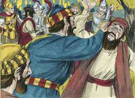
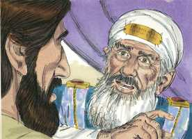

# João Cap 18

**1** 	TENDO Jesus dito isto, saiu com os seus discípulos para além do ribeiro de Cedrom, onde havia um horto, no qual ele entrou e seus discípulos.

 

**2** 	E Judas, que o traía, também conhecia aquele lugar, porque Jesus muitas vezes se ajuntava ali com os seus discípulos.

**3** 	Tendo, pois, Judas recebido a coorte e oficiais dos principais sacerdotes e fariseus, veio para ali com lanternas, e archotes e armas.

**4** 	Sabendo, pois, Jesus todas as coisas que sobre ele haviam de vir, adiantou-se, e disse-lhes: A quem buscais?

**5** 	Responderam-lhe: A Jesus Nazareno. Disse-lhes Jesus: Sou eu. E Judas, que o traía, estava com eles.

**6** 	Quando, pois, lhes disse: Sou eu, recuaram, e caíram por terra.

**7** 	Tornou-lhes, pois, a perguntar: A quem buscais? E eles disseram: A Jesus Nazareno.

**8** 	Jesus respondeu: Já vos disse que sou eu; se, pois, me buscais a mim, deixai ir estes;

**9** 	Para que se cumprisse a palavra que tinha dito: Dos que me deste nenhum deles perdi.

**10** 	Então Simão Pedro, que tinha espada, desembainhou-a, e feriu o servo do sumo sacerdote, cortando-lhe a orelha direita. E o nome do servo era Malco.

 

**11** 	Mas Jesus disse a Pedro: Põe a tua espada na bainha; não beberei eu o cálice que o Pai me deu?

**12** 	Então a coorte, e o tribuno, e os servos dos judeus prenderam a Jesus e o maniataram.

**13** 	E conduziram-no primeiramente a Anás, por ser sogro de Caifás, que era o sumo sacerdote daquele ano.

**14** 	Ora, Caifás era quem tinha aconselhado aos judeus que convinha que um homem morresse pelo povo.

**15** 	E Simão Pedro e outro discípulo seguiam a Jesus. E este discípulo era conhecido do sumo sacerdote, e entrou com Jesus na sala do sumo sacerdote.

**16** 	E Pedro estava da parte de fora, à porta. Saiu então o outro discípulo que era conhecido do sumo sacerdote, e falou à porteira, levando Pedro para dentro.

**17** 	Então a porteira disse a Pedro: Não és tu também dos discípulos deste homem? Disse ele: Não sou.

**18** 	Ora, estavam ali os servos e os servidores, que tinham feito brasas, e se aquentavam, porque fazia frio; e com eles estava Pedro, aquentando-se também.

 

**19** 	E o sumo sacerdote interrogou Jesus acerca dos seus discípulos e da sua doutrina.

 

**20** 	Jesus lhe respondeu: Eu falei abertamente ao mundo; eu sempre ensinei na sinagoga e no templo, onde os judeus sempre se ajuntam, e nada disse em oculto.

**21** 	Para que me perguntas a mim? Pergunta aos que ouviram o que é que lhes ensinei; eis que eles sabem o que eu lhes tenho dito.

**22** 	E, tendo dito isto, um dos servidores que ali estavam, deu uma bofetada em Jesus, dizendo: Assim respondes ao sumo sacerdote?

**23** 	Respondeu-lhe Jesus: Se falei mal, dá testemunho do mal; e, se bem, por que me feres?

**24** 	E Anás mandou-o, maniatado, ao sumo sacerdote Caifás.

**25** 	E Simão Pedro estava ali, e aquentava-se. Disseram-lhe, pois: Não és também tu um dos seus discípulos? Ele negou, e disse: Não sou.

 

**26** 	E um dos servos do sumo sacerdote, parente daquele a quem Pedro cortara a orelha, disse: Não te vi eu no horto com ele?

 

**27** 	E Pedro negou outra vez, e logo o galo cantou.

**28** 	Depois levaram Jesus da casa de Caifás para a audiência. E era pela manhã cedo. E não entraram na audiência, para não se contaminarem, mas poderem comer a páscoa.

 

**29** 	Então Pilatos saiu fora e disse-lhes: Que acusação trazeis contra este homem?

 

**30** 	Responderam, e disseram-lhe: Se este não fosse malfeitor, não to entregaríamos.

**31** 	Disse-lhes, pois, Pilatos: Levai-o vós, e julgai-o segundo a vossa lei. Disseram-lhe então os judeus: A nós não nos é lícito matar pessoa alguma.

**32** 	(Para que se cumprisse a palavra que Jesus tinha dito, significando de que morte havia de morrer).

**33** 	Tornou, pois, a entrar Pilatos na audiência, e chamou a Jesus, e disse-lhe: Tu és o Rei dos Judeus?

**34** 	Respondeu-lhe Jesus: Tu dizes isso de ti mesmo, ou disseram-to outros de mim?

**35** 	Pilatos respondeu: Porventura sou eu judeu? A tua nação e os principais dos sacerdotes entregaram-te a mim. Que fizeste?

**36** 	Respondeu Jesus: O meu reino não é deste mundo; se o meu reino fosse deste mundo, pelejariam os meus servos, para que eu não fosse entregue aos judeus; mas agora o meu reino não é daqui.

**37** 	Disse-lhe, pois, Pilatos: Logo tu és rei? Jesus respondeu: Tu dizes que eu sou rei. Eu para isso nasci, e para isso vim ao mundo, a fim de dar testemunho da verdade. Todo aquele que é da verdade ouve a minha voz.

 

**38** 	Disse-lhe Pilatos: Que é a verdade? E, dizendo isto, tornou a ir ter com os judeus, e disse-lhes: Não acho nele crime algum.

 

**39** 	Mas vós tendes por costume que eu vos solte alguém pela páscoa. Quereis, pois, que vos solte o Rei dos Judeus?

**40** 	Então todos tornaram a clamar, dizendo: Este não, mas Barrabás. E Barrabás era um salteador.

 

> **Cmt MHenry** Intro: Tu És o Rei dos judeus, esse Rei dos judeus que tem sido esperado tanto tempo? Messias, o Príncipe, és Tu? Te chamas assim e desejas que assim se pende de ti? Cristo respondeu esta pergunta com outra, não para evadi-la, senão para que Pilatos considerasse o que fez. Ele nunca assumira nenhum poder terreno; nunca houve princípios nem costumes traiçoeiros atribuídos a Ele. Cristo dá conta da natureza de seu reino. Sua natureza não é deste mundo; é um reino dentro dos homens, instalado em suas consciências e corações; suas riquezas são espirituais, seu poder é espiritual, e sua glória é interior. Seus sustentos não são mundanos; suas armas são espirituais; não necessita nem usa força para manter-se e avançar, nem se opõe a nenhum reino, senão ao do pecado e Satanás. Seu objetivo e desígnio não são deste mundo. Quando Cristo disse: Eu sou a Verdade, disse efetivamente: Eu sou o Rei. Ele vence pela evidência da verdade que convence; Ele reina pelo poder autoritário da verdade. Os súbditos deste reino são súbditos da verdade. Pilatos fez uma boa pergunta quando disse: Que é a verdade? Quando esquadrinhamos as Escrituras e atendemos ao ministério da Palavra, deve ser com esse interrogante, que é a verdade? e com esta oração: Guia-me a tua verdade; a toda a verdade. Contudo, muitos dos que formulam esta pergunta não têm paciência para perseverar na busca da verdade nem têm a humildade suficiente para recebê-la. Desta solene declaração da inocência de Cristo surge que, embora o Senhor Jesus foi tratado como o pior dos malfeitores, nunca mereceu esse tratamento. Mas isso mostra o objetivo de sua morte: que Ele morreu como Sacrifício por nossos pecados. Pilatos queria comprazer ambos os bandos e era governado mais pela sabedoria mundana que pelas regras da justiça. O pecado é um ladrão, mas é tolamente escolhido por muitos em vez de Cristo, que verdadeiramente nos enriquece. Vamos propor-nos envergonhar a nossos acusadores, como o fez Cristo, e cuidemos de não voltar a crucificar a Cristo.> Era injusto mandar à morte a um que tinha feito tanto bem, portanto, os judeus estavam dispostos a salvar-se de toda recriminação. Muitos temem mais o escândalo que o pecado de algo mau. Cristo tinha dito que seria entregue aos gentios e que eles o matariam; aqui vemos que isso se cumpriu. Tinha dito que seria crucificado, levantado. Se os judeus o tivessem julgado conforme a sua lei, o teriam lapidado; a crucifixão nunca foi usada pelos judeus. Embora não se nos tenha revelado, está determinado no que nós concerne, de que morte morreremos: isto deveria livrar-nos da inquietude relativa a esse assunto. Senhor, que seja quando e como tens designado.> Simão Pedro nega a seu Mestre. Os detalhes têm sido comentados nos outros evangelhos. o começo do pecado é como deixar correr a água. O pecado de mentir é um pecado fértil: uma mentira necessária de outra para apoiar-se, e essa, outra. Se o chamado a expor-nos a um perigo é claro, podemos esperar que Deus nos dê poder para honrá-lo; de não ser assim, podemos temer que Deus permitirá que sejamos envergonhados. Eles nada disseram acerca dos milagres de Jesus, pelos quais tinha realizado tanto bem, e que provavam sua doutrina. Desse modo, os inimigos de Cristo, ainda que pelejam contra a verdade, fecham voluntariamente seus olhos ante ela. Ele apela aos que lhe ouvem. A doutrina de Cristo pode apelar com certeza a todos os que a conhecem e os que julgam segundo verdade dão testemunho dela. Nunca deve ser apaixonado nosso ressentimento pelas injúrias. Ele arrazoou com o homem que o injuriou e nós também podemos.> O pecado começou no jardim do Éden, ali se pronunciou a maldição, ali se prometeu o Redentor; e num jardim essa Semente prometida entrou em conflito com a antiga serpente. Cristo foi sepultado também num jardim. Então, quando passemos por nossos jardins, meditemos nos sofrimentos de Cristo num jardim. Nosso Senhor Jesus, sabendo todas as coisas que lhe sobreviriam, se adiantou e perguntou: A quem buscam? Quando o povo quis obrigá-lo a levar uma coroa, Ele se retirou (capítulo 6.15), mas quando viram para obrigá-lo a levar a cruz, Ele se ofereceu, porque veio a este mundo a sofrer, e foi ao outro mundo a reinar. Ele demonstrou claramente o que poderia ter feito quando os derrubou; poderia tê-los deixado mortos, mas não fez assim. Deve de ter sido o efeito do poder divino que fez com que os oficiais e os soldados deixassem que os discípulos partissem tranqüilamente depois da resistência que ofereceram. Cristo nos dá o exemplo de mansidão nos sofrimentos e a pauta da submissão à vontade de Deus em toda coisa que nos concerna.\> \ É somente o *cálice*, coisa de pouca importância. É o cálice que *nos é dado*; os sofrimentos são dádivas. Nos é dado pelo *Pai* que tem a autoridade de pai e não nos faz mal; o afeto de um pai, e não tem intenção de ferir-nos. Do exemplo de nosso Salvador devemos aprender a receber nossas aflições mais leves e perguntar-nos se devemos resistir a vontade de nosso Pai ou desconfiar de seu amor. Estamos amarrados com a corda de nossas iniqüidades, com o jugo de nossas transgressões. Cristo, feito oferta do pecado por nós, para livrar-nos dessas amarras, se submeteu a ser amarrado por nós. Devemos nossa liberdade a suas ataduras: assim o Filho nos liberta.