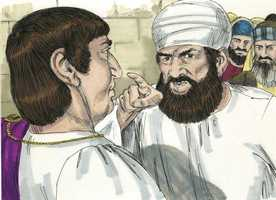
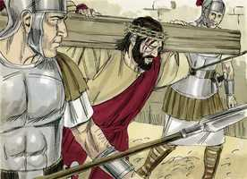
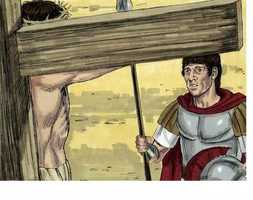

# João Cap 19

**1** 	PILATOS, pois, tomou então a Jesus, e o açoitou.

 

**2** 	E os soldados, tecendo uma coroa de espinhos, lha puseram sobre a cabeça, e lhe vestiram roupa de púrpura.

**3** 	E diziam: Salve, Rei dos Judeus. E davam-lhe bofetadas.

**4** 	Então Pilatos saiu outra vez fora, e disse-lhes: Eis aqui vo-lo trago fora, para que saibais que não acho nele crime algum.

**5** 	Saiu, pois, Jesus fora, levando a coroa de espinhos e roupa de púrpura. E disse-lhes Pilatos: Eis aqui o homem.

**6** 	Vendo-o, pois, os principais dos sacerdotes e os servos, clamaram, dizendo: Crucifica-o, crucifica-o. Disse-lhes Pilatos: Tomai-o vós, e crucificai-o; porque eu nenhum crime acho nele.

**7** 	Responderam-lhe os judeus: Nós temos uma lei e, segundo a nossa lei, deve morrer, porque se fez Filho de Deus.

**8** 	E Pilatos, quando ouviu esta palavra, mais atemorizado ficou.

**9** 	E entrou outra vez na audiência, e disse a Jesus: De onde és tu? Mas Jesus não lhe deu resposta.

**10** 	Disse-lhe, pois, Pilatos: Não me falas a mim? Não sabes tu que tenho poder para te crucificar e tenho poder para te soltar?

**11** 	Respondeu Jesus: Nenhum poder terias contra mim, se de cima não te fosse dado; mas aquele que me entregou a ti maior pecado tem.

**12** 	Desde então Pilatos procurava soltá-lo; mas os judeus clamavam, dizendo: Se soltas este, não és amigo de César; qualquer que se faz rei é contra César.

**13** 	Ouvindo, pois, Pilatos este dito, levou Jesus para fora, e assentou-se no tribunal, no lugar chamado Litóstrotos, e em hebraico Gabatá.

 

**14** 	E era a preparação da páscoa, e quase à hora sexta; e disse aos judeus: Eis aqui o vosso Rei.

**15** 	Mas eles bradaram: Tira, tira, crucifica-o. Disse-lhes Pilatos: Hei de crucificar o vosso Rei? Responderam os principais dos sacerdotes: Não temos rei, senão César.

 

**16** 	Então, conseqüentemente entregou-lho, para que fosse crucificado. E tomaram a Jesus, e o levaram.

 

**17** 	E, levando ele às costas a sua cruz, saiu para o lugar chamado Caveira, que em hebraico se chama Gólgota,

 

**18** 	Onde o crucificaram, e com ele outros dois, um de cada lado, e Jesus no meio.

 

**19** 	E Pilatos escreveu também um título, e pô-lo em cima da cruz; e nele estava escrito: JESUS NAZARENO, O REI DOS JUDEUS.

 

**20** 	E muitos dos judeus leram este título; porque o lugar onde Jesus estava crucificado era próximo da cidade; e estava escrito em hebraico, grego e latim.

**21** 	Diziam, pois, os principais sacerdotes dos judeus a Pilatos: Não escrevas, O Rei dos Judeus, mas que ele disse: Sou o Rei dos Judeus.

**22** 	Respondeu Pilatos: O que escrevi, escrevi.

**23** 	Tendo, pois, os soldados crucificado a Jesus, tomaram as suas vestes, e fizeram quatro partes, para cada soldado uma parte; e também a túnica. A túnica, porém, tecida toda de alto a baixo, não tinha costura.

 

**24** 	Disseram, pois, uns aos outros: Não a rasguemos, mas lancemos sortes sobre ela, para ver de quem será. Para que se cumprisse a Escritura que diz: Repartiram entre si as minhas vestes, e sobre a minha vestidura lançaram sortes. Os soldados, pois, fizeram estas coisas.

**25** 	E junto à cruz de Jesus estava sua mãe, e a irmã de sua mãe, Maria mulher de Clopas, e Maria Madalena.

**26** 	Ora Jesus, vendo ali sua mãe, e que o discípulo a quem ele amava estava presente, disse a sua mãe: Mulher, eis aí o teu filho.

**27** 	Depois disse ao discípulo: Eis aí tua mãe. E desde aquela hora o discípulo a recebeu em sua casa.

**28** 	Depois, sabendo Jesus que já todas as coisas estavam terminadas, para que a Escritura se cumprisse, disse: Tenho sede.

**29** 	Estava, pois, ali um vaso cheio de vinagre. E encheram de vinagre uma esponja, e, pondo-a num hissopo, lha chegaram à boca.

**30** 	E, quando Jesus tomou o vinagre, disse: Está consumado. E, inclinando a cabeça, entregou o espírito.

 

**31** 	Os judeus, pois, para que no sábado não ficassem os corpos na cruz, visto como era a preparação (pois era grande o dia de sábado), rogaram a Pilatos que se lhes quebrassem as pernas, e fossem tirados.

**32** 	Foram, pois, os soldados, e, na verdade, quebraram as pernas ao primeiro, e ao outro que como ele fora crucificado;

**33** 	Mas, vindo a Jesus, e vendo-o já morto, não lhe quebraram as pernas.

**34** 	Contudo um dos soldados lhe furou o lado com uma lança, e logo saiu sangue e água.

 

**35** 	E aquele que o viu testificou, e o seu testemunho é verdadeiro; e sabe que é verdade o que diz, para que também vós o creiais.

**36** 	Porque isto aconteceu para que se cumprisse a Escritura, que diz: Nenhum dos seus ossos será quebrado.

**37** 	E outra vez diz a Escritura: Verão aquele que traspassaram.

**38** 	Depois disto, José de Arimatéia (o que era discípulo de Jesus, mas oculto, por medo dos judeus) rogou a Pilatos que lhe permitisse tirar o corpo de Jesus. E Pilatos lho permitiu. Então foi e tirou o corpo de Jesus.

 

**39** 	E foi também Nicodemos (aquele que anteriormente se dirigira de noite a Jesus), levando quase cem arráteis de um composto de mirra e aloés.

**40** 	Tomaram, pois, o corpo de Jesus e o envolveram em lençóis com as especiarias, como os judeus costumam fazer, na preparação para o sepulcro.

 

**41** 	E havia um horto naquele lugar onde fora crucificado, e no horto um sepulcro novo, em que ainda ninguém havia sido posto.

**42** 	Ali, pois (por causa da preparação dos judeus, e por estar perto aquele sepulcro), puseram a Jesus.

> **Cmt MHenry** Intro: José de Arimatéia era discípulo secreto de Cristo. os discípulos deveriam reconhecer-se francamente como tais, porém, alguns que têm sido temerosos em provas menores, foram valorosos nas maiores. Quando Deus tem obra para fazer, pode achar os que são aptos para ela. O embalsamamento foi feito por Nicodemos, amigo secreto de Cristo, embora não um seguidor constante. Essa graça que primeiro é como caniço rachado, pode, mais adiante, lembrar um cedro firme. Eis aqui a estes dois ricos que mostraram o valor que davam à pessoa e doutrina de Cristo e que não foi diminuído pelo opróbrio da cruz. Devemos cumprir nosso dever conforme ao que sejam o dia e a oportunidade presentes, deixando a Deus que cumpra suas promessas a sua maneira e a seu devido tempo. tinha sido determinado que o sepultamento de Jesus fosse com os ímpios, como acontecia com os que sofriam como delinqüentes, mas com os ricos foi em sua morte, conforme o profetizado ([Isaias 53.9](../23A-Is/53.md#9)); era muito improvável que estas duas circunstâncias se juntassem na mesma pessoa. Foi sepultado num sepulcro novo, portanto, não se podia dizer que não era Ele, senão um outro, o que havia ressuscitado. Também aqui se nos ensina que não devemos ser melindrosos com referência ao lugar de nosso sepultamento. Ele foi enterrado no sepulcro que estava mais perto. Aqui está o Sol de Justiça, oculto por um tempo, para voltar a sair com maior glória e, então, não voltar a pôr-se.> Foi provado que Jesus estava morto. Morreu em menos tempo que o comum pelas pessoas crucificadas. Isso mostra que tinha entregado sua vida. A lança rompeu as fontes mesmas da vida: nenhum corpo humano teria podido sobreviver a essa ferida, porém o ter sido testemunhado solenemente demonstra que houve algo de peculiar nisso. O sangue e a água que brotaram representavam esses dois grandes benefícios dos quais participam todos os crentes através de Cristo: justificação e santificação: sangue para a expiação, água para a purificação. Ambos brotaram do lado traspassado de nosso Redentor. A Cristo crucificado devemos o mérito de nossa justificação, e o Espírito e a graça para nossa santificação. Que isto silencie os temores dos cristãos débeis e alente suas esperanças; do lado atravessado de Jesus brotaram água e sangue, ambas para justificá-los e santificá-los. A Escritura se cumpriu ao não permitir Pilatos que lhe quebrassem as pernas ([Salmo 34.20](../19A-Sl/34.md#20)). havia um tipo disso no cordeiro pascoal ([Êx 12.46](../02A-Ex/12.md#46)). Olhemos sempre para Aquele que traspassamos com nossos pecados, ignorantes e desconsiderados, sim, às vezes contra as convicções e as misericórdias; e que derramou água e sangue de seu lado ferido para que nós fossemos justificados e santificados em seu nome.> Eis aqui algumas circunstâncias notáveis da morte de Jesus narradas em forma mais completa que antes. Pilatos não satisfez os principais sacerdotes permitindo que se trocasse a placa; o que indubitavelmente se referia a um poder secreto de Deus em seu coração, para que esta declaração do caráter e autoridade de nosso Senhor continuasse. Muitas coisas feitas pelos soldados romanos foram cumprimento de profecias do Antigo Testamento. Todas as coisas ali escritas se cumprirão. Cristo proveu com ternura para sua mãe quando morria. Às vezes, quando Deus nos tira um consolo, levanta outro para nós onde não o procuramos. O exemplo de Cristo ensina aos homens a honrar seus pais na vida e na morte; a prover para suas necessidades, e a fomentar seu bem-estar por todos os meios a seu alcance. Note-se especialmente a palavra de moribundo com que Jesus entregou seu espírito: Consumado é; isto é, os conselhos do Pai Enquanto a seus sofrimentos estavam agora cumpridos. Consumado é: foram cumpridos todos os tipos e as profecias do Antigo Testamento que apontavam aos sofrimentos do Messias. Consumado é: a lei cerimonial é ab-rogada; agora veio a substância e todas as sombras se dissipam. Consumado é: se deu fim à transgressão e se introduziu a justiça eterna. Seus sofrimentos estavam agora terminados, tanto os de sua alma como os de seu corpo. Consumado é: a obra da redenção e salvação do homem está agora completada. Sua vida não lhe foi tirada pela força; livremente foi entregue.> Pilatos não imaginou com que santa consideração estes sofrimentos de Cristo seriam matéria de reflexão e conversação entre os melhores e mais grandes homens. nosso Senhor Jesus saiu adiante disposto a expor-se a sua zombaria. Bom para todos os que têm fé é contemplar a Jesus Cristo em seus sofrimentos. Contempla-o e ama-o; continua olhando a Jesus. seu ódio estimulou seus esforços em sua contra, e nosso amor por Ele não estimulará nossos esforços em favor dEle e seu reino? Parece que Pilatos pensou que Jesus podia ser uma pessoa superior à média. Até a consciência natural faz que os homens se assustem de serem encontrados pelejando contra Deus. Como nosso Senhor sofreu pelos pecados de judeus e gentios, foi uma parte especial do conselho da sabedoria divina que os judeus primeiro propusessem sua morte e que os gentios a executasse efetivamente. Se Cristo não tivesse sido rejeitado pelos homens, nós teríamos sido rejeitados para sempre por Deus. Agora era entregue o Filho do homem em mãos de homens malvados e irracionais. Foi levado em nosso lugar, para que escapássemos. Foi pregado na cruz como Sacrifício atado ao altar. A Escritura se cumpriu: Não morreu no altar entre os sacrifícios, senão entre delinqüentes sacrificados à justiça pública. Agora, façamos uma pausa e olhemos com fé a Jesus. tivemos alguma vez uma tristeza como a sua? Vejam-no sangrando, vejam-no morrendo, vejam-no e amem-no! Amem-no e vivam por Ele!