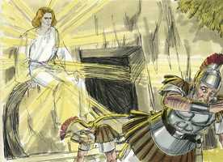
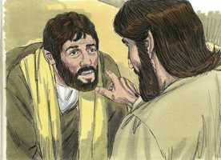

# João Cap 20

**1** 	E NO primeiro dia da semana, Maria Madalena foi ao sepulcro de madrugada, sendo ainda escuro, e viu a pedra tirada do sepulcro.

 

**2** 	Correu, pois, e foi a Simão Pedro, e ao outro discípulo, a quem Jesus amava, e disse-lhes: Levaram o Senhor do sepulcro, e não sabemos onde o puseram.

 

**3** 	Então Pedro saiu com o outro discípulo, e foram ao sepulcro.

**4** 	E os dois corriam juntos, mas o outro discípulo correu mais apressadamente do que Pedro, e chegou primeiro ao sepulcro.

**5** 	E, abaixando-se, viu no chão os lençóis; todavia não entrou.

**6** 	Chegou, pois, Simão Pedro, que o seguia, e entrou no sepulcro, e viu no chão os lençóis,

**7** 	E que o lenço, que tinha estado sobre a sua cabeça, não estava com os lençóis, mas enrolado num lugar à parte.

**8** 	Então entrou também o outro discípulo, que chegara primeiro ao sepulcro, e viu, e creu.

**9** 	Porque ainda não sabiam a Escritura, que era necessário que ressuscitasse dentre os mortos.

**10** 	Tornaram, pois, os discípulos para casa.

**11** 	E Maria estava chorando fora, junto ao sepulcro. Estando ela, pois, chorando, abaixou-se para o sepulcro.

**12** 	E viu dois anjos vestidos de branco, assentados onde jazera o corpo de Jesus, um à cabeceira e outro aos pés.

**13** 	E disseram-lhe eles: Mulher, por que choras? Ela lhes disse: Porque levaram o meu Senhor, e não sei onde o puseram.

**14** 	E, tendo dito isto, voltou-se para trás, e viu Jesus em pé, mas não sabia que era Jesus.

**15** 	Disse-lhe Jesus: Mulher, por que choras? Quem buscas? Ela, cuidando que era o hortelão, disse-lhe: Senhor, se tu o levaste, dize-me onde o puseste, e eu o levarei.

**16** 	Disse-lhe Jesus: Maria! Ela, voltando-se, disse-lhe: Raboni, que quer dizer: Mestre.

**17** 	Disse-lhe Jesus: Não me detenhas, porque ainda não subi para meu Pai, mas vai para meus irmãos, e dize-lhes que eu subo para meu Pai e vosso Pai, meu Deus e vosso Deus.

**18** 	Maria Madalena foi e anunciou aos discípulos que vira o Senhor, e que ele lhe dissera isto.

**19** 	Chegada, pois, a tarde daquele dia, o primeiro da semana, e cerradas as portas onde os discípulos, com medo dos judeus, se tinham ajuntado, chegou Jesus, e pôs-se no meio, e disse-lhes: Paz seja convosco.

**20** 	E, dizendo isto, mostrou-lhes as suas mãos e o lado. De sorte que os discípulos se alegraram, vendo o Senhor.

**21** 	Disse-lhes, pois, Jesus outra vez: Paz seja convosco; assim como o Pai me enviou, também eu vos envio a vós.

**22** 	E, havendo dito isto, assoprou sobre eles e disse-lhes: Recebei o Espírito Santo.

**23** 	Àqueles a quem perdoardes os pecados lhes são perdoados; e àqueles a quem os retiverdes lhes são retidos.

**24** 	Ora, Tomé, um dos doze, chamado Dídimo, não estava com eles quando veio Jesus.

**25** 	Disseram-lhe, pois, os outros discípulos: Vimos o Senhor. Mas ele disse-lhes: Se eu não vir o sinal dos cravos em suas mãos, e não puser o meu dedo no lugar dos cravos, e não puser a minha mão no seu lado, de maneira nenhuma o crerei.

 

**26** 	E oito dias depois estavam outra vez os seus discípulos dentro, e com eles Tomé. Chegou Jesus, estando as portas fechadas, e apresentou-se no meio, e disse: Paz seja convosco.

**27** 	Depois disse a Tomé: Põe aqui o teu dedo, e vê as minhas mãos; e chega a tua mão, e põe-na no meu lado; e não sejas incrédulo, mas crente.

 

**28** 	E Tomé respondeu, e disse-lhe: Senhor meu, e Deus meu!

 

**29** 	Disse-lhe Jesus: Porque me viste, Tomé, creste; bem-aventurados os que não viram e creram.

  

**30** 	Jesus, pois, operou também em presença de seus discípulos muitos outros sinais, que não estão escritos neste livro.

**31** 	Estes, porém, foram escritos para que creiais que Jesus é o Cristo, o Filho de Deus, e para que, crendo, tenhais vida em seu nome.

> **Cmt MHenry** Intro: Houve outros sinais e provas da ressurreição de nosso Senhor, mas estes foram escritos para que todos acreditem que Jesus era o Messias prometido, o Salvador de pecadores e o Filho de Deus; para que, por esta fé, recebam a vida eterna, por sua misericórdia, verdade e poder. Acreditemos que Jesus é o Cristo, e, crendo, tenhamos vida em seu nome.> Desde o princípio ficou estabelecido que um dos sete dias devia ser religiosamente observado. E que no reino do Messias o primeiro dia da semana seria esse dia solene, foi indicado em que nesse dia Cristo se reuniu com seus discípulos em assembléia religiosa. O cumprimento religioso desse dia nos tem chegado através de toda a era da Igreja. Não existe em nossa língua uma palavra de incredulidade nem pensamento em nossa mente que não sejam conhecidos pelo Senhor Jesus; e lhe aprouve acomodar-se ainda a Tomás em vez de deixá-lo em sua incredulidade. Devemos suportar assim ao fraco ([Rm 15.1-2](../45N-Rm/15.md#1)). Esta advertência é dada a todos. se formos infiéis, estamos sem Cristo, infelizes, sem esperanças e sem gozo. Tomás se envergonhou de sua incredulidade e clamou: Senhor meu e Deus meu! Os crentes sãos e sinceros serão aceitos de graça pelo Senhor Jesus apesar de serem lentos e fracos. Dever dos que lhe ouvem e lêem o evangelho é crer e aceitar a doutrina de Cristo e o testemunho acerca dEle ([1 Jo 2.11](../62N-1Jo/02.md#11)).> Este era o primeiro dia da semana e, depois, este dia é mencionado repetidas vezes pelos escritores sagrados, porque foi evidentemente separado como o dia de descanso cristão em memória da ressurreição de Cristo. Os discípulos tinham fechado as portas por medo aos judeus; e quando não tinham essa expectativa, o próprio Jesus veio e ficou em pé em meio deles, tendo aberto as portas em forma miraculosa, apesar de silenciosa. Consolo para os discípulos de Cristo é que nenhuma porta pode deixar fora a presença de Cristo, quando suas assembléias podem realizar-se somente em privado. Quando Ele manifesta seu amor pelos crentes por meio das consolações de seu Espírito, lhes assegura que, devido a que Ele vive, também eles viverão. Ver a Cristo alegrará o coração do discípulo em qualquer momento, e quanto mais vejamos a Cristo, mais nos regozijaremos. Ele disse: recebam o Espírito Santo, demonstrando assim que sua vida espiritual e sua habilidade para fazer a obra, derivará e dependerá dEle. Toda palavra de Cristo que seja recebida por fé no coração, vem acompanhada desse sopro divino; e sem Ele não há luz nem vida. Nada se vê, conhece, discerne nem sente de Deus, senão por meio deste. Cristo mandou, depois disso, aos apóstolos a que anunciassem o único método pelo qual será perdoado o pecado. Este poder não existia em absoluto nos apóstolos Enquanto a poder para emitir juízo, senão somente como poder para declarar o caráter daqueles aos que Deus aceitará ou rejeitará no dia do juízo. Eles assentaram claramente as características por meio das quais pode discernir-se um Filho de Deus e ser distinguido de um falso professante e, conforme ao que eles tenham declarado, cada caso será decidido no dia do juízo. Quando nos reunimos no nome de Cristo, especialmente em seu dia santo, Ele se encontrará conosco e nos falará de paz. Os discípulos de Cristo devem empreender a edificação de sua santíssima fé de uns a outros, repetindo aos que estiveram ausentes o que ouviram, e dando a conhecer o que experimentaram. Tomás limitou o Santo de Israel, quando queria ser convencido por seu próprio método, e não de outro jeito. Poderia ter sido deixado, cruz justiça, em sua incredulidade, depois de rejeitar tão abundantes provas. Os temores e as dores dos discípulos costumam ser prolongadas para castigar sua negligência.> Provavelmente busquemos e encontremos quando procuramos com afeto e buscamos com lágrimas. Contudo, muitos crentes se queixam das nuvens e trevas sob as quais estão, que são métodos da graça para humilhar suas almas, mortificar seus pecados e fazê-lhes amar a Cristo. não basta com ver anjos e seus sorrisos, sem ver a Jesus e o sorriso de Deus nEle. Ninguém, senão o que as têm saboreado, conhece as penas de uma alma abandonada, que teve as consoladoras provas do amor de Deus em Cristo, e esperanças de céu, porém que, agora, as perdeu e anda nas trevas; quem pode suportar esse espírito ferido? Ao manifestar-se aos que o buscam, Cristo ultrapassa freqüentemente suas expectativas. Veja-se como o coração de Maria anelava encontrar a Jesus. o modo de Cristo para dar-se a conhecer a seu povo é sua palavra que, aplicada a suas almas, lhes fala em particular. Poderia ler-se: É meu Mestre? Veja-se com quanto prazer os que amam a Jesus falam de sua autoridade sobre eles. Ele lhes impede esperar que sua presença corporal continue, não estando Ele mais neste mundo; ela deve olhar para acima e além do estado presente das coisas. Note-se a relação com Deus pela união com Cristo. Ao participar nós da natureza divina, o Pai de Cristo é nosso Pai; e, ao participar Ele da natureza humana, nosso Deus é seu Deus. a ascensão de Cristo ao céu para interceder por nós ali é como um consolo inexplicável. Que eles não pensem que esta terra será seu lar e repouso; seus olhares e suas miras e seus desejos anelantes devem estar em outro mundo e ainda até em seus corações: Eu ascendo, portanto, devo procurar as coisas que estão no alto. E que os que conhecem a palavra de Cristo se proponham que outros obtenham o benefício de seu conhecimento.> Se Cristo tivesse dado sua vida em resgate sem voltar a tomá-la, não se teria manifestado que sua oferta tinha sido aceita como satisfação.\> \ Foi uma grande prova para Maria que o corpo tivesse desaparecido. Os crentes fracos costumam fazer matéria de lamento precisamente daquilo que é fundamento justo de esperança, e matéria de gozo. está bem que os mais honrados que outros com os privilégios dos discípulos sejam mais ativos nos deveres dos discípulos: mais dispostos a aceitar dores e correr riscos em uma boa obra. Devemos fazer o melhor que pudermos sem invejar os que podem fazer melhor, nem desprezar os que, ainda fazendo o melhor que podem, ficam para trás. O discípulo a quem Jesus amava de maneira especial e que, portanto, amava de maneira especial a Jesus, chegou primeiro. O amor de Cristo nos fará abundar em todo dever mais que em qualquer outra coisa. O que ficou para trás foi Pedro, que tinha negado a Cristo. o sentido de culpa nos obstaculiza no serviço de Deus. Ainda os discípulos não conheciam a Escritura; não consideravam nem aplicavam o que conheciam da Escritura: que Cristo devia ressuscitar dentre os mortos.