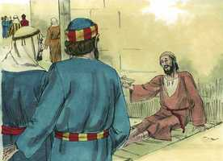

# Atos dos Apóstolos Cap 03

**1** 	E PEDRO e João subiam juntos ao templo à hora da oração, a nona.

**2** 	E era trazido um homem que desde o ventre de sua mãe era coxo, o qual todos os dias punham à porta do templo, chamada Formosa, para pedir esmola aos que entravam.

 

**3** 	O qual, vendo a Pedro e a João que iam entrando no templo, pediu que lhe dessem uma esmola.

 

**4** 	E Pedro, com João, fitando os olhos nele, disse: Olha para nós.

**5** 	E olhou para eles, esperando receber deles alguma coisa.

**6** 	E disse Pedro: Não tenho prata nem ouro; mas o que tenho isso te dou. Em nome de Jesus Cristo, o Nazareno, levanta-te e anda.

 

**7** 	E, tomando-o pela mão direita, o levantou, e logo os seus pés e artelhos se firmaram.

 

**8** 	E, saltando ele, pôs-se em pé, e andou, e entrou com eles no templo, andando, e saltando, e louvando a Deus.

 

**9** 	E todo o povo o viu andar e louvar a Deus;

**10** 	E conheciam-no, pois era ele o que se assentava a pedir esmola à porta Formosa do templo; e ficaram cheios de pasmo e assombro, pelo que lhe acontecera

**11** 	E, apegando-se o coxo, que fora curado, a Pedro e João, todo o povo correu atônito para junto deles, ao alpendre chamado de Salomão.

**12** 	E quando Pedro viu isto, disse ao povo: Homens israelitas, por que vos maravilhais disto? Ou, por que olhais tanto para nós, como se por nossa própria virtude ou santidade fizéssemos andar este homem?

 

**13** 	O Deus de Abraão, de Isaque e de Jacó, o Deus de nossos pais, glorificou a seu filho Jesus, a quem vós entregastes e perante a face de Pilatos negastes, tendo ele determinado que fosse solto.

**14** 	Mas vós negastes o Santo e o Justo, e pedistes que se vos desse um homem homicida.

**15** 	E matastes o Príncipe da vida, ao qual Deus ressuscitou dentre os mortos, do que nós somos testemunhas.

**16** 	E pela fé no seu nome fez o seu nome fortalecer a este que vedes e conheceis; sim, a fé que vem por ele, deu a este, na presença de todos vós, esta perfeita saúde.

**17** 	E agora, irmãos, eu sei que o fizestes por ignorância, como também os vossos príncipes.

 

**18** 	Mas Deus assim cumpriu o que já dantes pela boca de todos os seus profetas havia anunciado; que o Cristo havia de padecer.

**19** 	Arrependei-vos, pois, e convertei-vos, para que sejam apagados os vossos pecados, e venham assim os tempos do refrigério pela presença do Senhor,

 

**20** 	E envie ele a Jesus Cristo, que já dantes vos foi pregado.

**21** 	O qual convém que o céu contenha até aos tempos da restauração de tudo, dos quais Deus falou pela boca de todos os seus santos profetas, desde o princípio.

**22** 	Porque Moisés disse aos pais: O Senhor vosso Deus levantará de entre vossos irmãos um profeta semelhante a mim; a ele ouvireis em tudo quanto vos disser.

 

**23** 	E acontecerá que toda a alma que não escutar esse profeta será exterminada dentre o povo.

**24** 	Sim, e todos os profetas, desde Samuel, todos quantos depois falaram, também predisseram estes dias.

**25** 	Vós sois os filhos dos profetas e da aliança que Deus fez com nossos pais, dizendo a Abraão: Na tua descendência serão benditas todas as famílias da terra.

**26** 	Ressuscitando Deus a seu Filho Jesus, primeiro o enviou a vós, para que nisso vos abençoasse, no apartar, a cada um de vós, das vossas maldades.

> **Cmt MHenry** Intro: Eis aqui um discurso forte para advertir aos judeus das conseqüências temíveis de sua incredulidade, com as mesmas palavras de Moisés, seu profeta preferido, dado o zelo fingido dos que estavam prestes a rejeitar o cristianismo e tratar de destruí-lo. Cristo veio ao mundo a trazer uma bênção consigo e enviou a seu Espírito para que fosse a grande bênção. Cristo veio a abençoar-nos convertendo-nos de nossas iniqüidades e salvando-nos de nossos pecados. Por natureza, nós nos aferramos ao pecado; o desígnio da graça divina é fazer-nos tornar disso para que não só possamos abandoná-lo, senão odiá-lo. Que ninguém pense que pode ser feliz continuando em pecado quando Deus declara que a bênção está em afastar-se de toda a iniqüidade. Que ninguém pense que entende ou crê no evangelho se procura liberação do castigo do pecado, mas não espera felicidade ao ser liberado do pecado mesmo. Ninguém espere ser separado de seu pecado a não ser que creia em Cristo, o Filho de Deus, e o receba como sabedoria, justiça, santificação e redenção.> A absoluta necessidade do arrependimento deve carregar-se solenemente na consciência de todos os que desejam que seus pecados sejam apagados e que possam ter particular no refrigério que nada pode dar, senão o sentido do amor perdoador de Cristo. Bem-aventurados os que sentiram isso. não era necessário que o Espírito Santo desse a conhecer os tempos e as sazões desta dispensação. Estes temas ainda permanecem no escuro, todavia, quando os pecadores tenham convicção de seus pecados, clamarão perdão ao Senhor; e ao penitente convertido e crente chegarão tempos de refrigério da presença do Senhor. Num estado de tribulação e prova, o glorioso Redentor estará fora da vista, porque devemos viver pela fé nEle.> Note-se a diferença no modo de fazer os milagres. Nosso Senhor sempre fala como tendo poder onipotente, sem vacilar jamais para receber a honra maior que lhe foi conferida por seus milagres divinos. Porém, os apóstolos referiam tudo ao Senhor e se negavam a receber honra, salvo como seus instrumentos sem méritos. Isto mostra que Jesus era um com o Pai, e igual com Ele; enquanto os apóstolos sabiam que eram homens fracos e pecadores, dependentes em todo de Jesus, cujo poder era o que curava. Os homens úteis devem ser muito humildes. Não a nós, Senhor, não a nós, senão a teu nome dá glória. Toda coroa deve ser colocada aos pés de Cristo. O apóstolo mostra aos judeus a enormidade de seu delito, mas sem querer irritá-los nem desesperá-los. Com toda certeza os que rejeitam, recusam ou negam a Cristo o fazem por ignorância, mas isso não se pode apresentar como escusa em nenhum caso.> Os apóstolos e os primeiros crentes assistiam ao serviço de adoração no templo à hora da oração. Parece que Pedro e João foram levados por direção divina a operar um milagre em um homem de mais de quarenta anos, inválido de nascimento. Em nome de Jesus de Nazaré, Pedro lhe ordena levantar-se e andar. Assim, se tentarmos com bem propósito a sanidade das almas dos homens, devemos ir no nome e no poder de Jesus Cristo, chamando os pecadores incapacitados a que se levantem e andem no caminho da santidade pela fé nEle. Quão doce para nossa alma é pensar que o nome de Jesus Cristo de Nazaré pode fazer-nos íntegros, a despeito de todas as faculdades paralisadas de nossa natureza caída! Com quanto gozo e arrebatamento santos andaremos pelos átrios santos quando Deus Espírito nos faça entrar neles por seu poder!