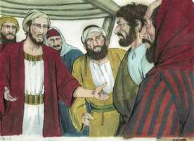
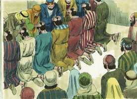
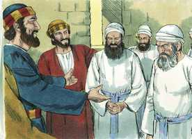
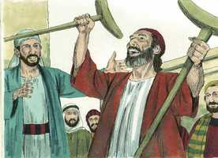
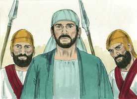
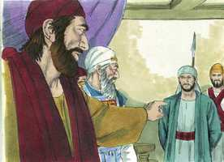

# Atos dos Apóstolos Cap 06

**1** 	ORA, naqueles dias, crescendo o número dos discípulos, houve uma murmuração dos gregos contra os hebreus, porque as suas viúvas eram desprezadas no ministério cotidiano.

 

**2** 	E os doze, convocando a multidão dos discípulos, disseram: Não é razoável que nós deixemos a palavra de Deus e sirvamos às mesas.

 

**3** 	Escolhei, pois, irmãos, dentre vós, sete homens de boa reputação, cheios do Espírito Santo e de sabedoria, aos quais constituamos sobre este importante negócio.

 

**4** 	Mas nós perseveraremos na oração e no ministério da palavra.

**5** 	E este parecer contentou a toda a multidão, e elegeram Estêvão, homem cheio de fé e do Espírito Santo, e Filipe, e Prócoro, e Nicanor, e Timão, e Parmenas e Nicolau, prosélito de Antioquia;

 

**6** 	E os apresentaram ante os apóstolos, e estes, orando, lhes impuseram as mãos.

**7** 	E crescia a palavra de Deus, e em Jerusalém se multiplicava muito o número dos discípulos, e grande parte dos sacerdotes obedecia à fé.

  

**8** 	E Estêvão, cheio de fé e de poder, fazia prodígios e grandes sinais entre o povo.

 

**9** 	E levantaram-se alguns que eram da sinagoga chamada dos libertinos, e dos cireneus e dos alexandrinos, e dos que eram da Cilícia e da Ásia, e disputavam com Estêvão.

 

**10** 	E não podiam resistir à sabedoria, e ao Espírito com que falava.

**11** 	Então subornaram uns homens, para que dissessem: Ouvimos-lhe proferir palavras blasfemas contra Moisés e contra Deus.

 

**12** 	E excitaram o povo, os anciãos e os escribas; e, investindo contra ele, o arrebataram e o levaram ao conselho.

 

**13** 	E apresentaram falsas testemunhas, que diziam: Este homem não cessa de proferir palavras blasfemas contra este santo lugar e a lei;

 

**14** 	Porque nós lhe ouvimos dizer que esse Jesus Nazareno há de destruir este lugar e mudar os costumes que Moisés nos deu.

**15** 	Então todos os que estavam assentados no conselho, fixando os olhos nele, viram o seu rosto como o rosto de um anjo.

 

> **Cmt MHenry** Intro: Quando não puderam contestar os argumentos de Estevão como polemista, o julgaram como delinqüente e trouxeram testemunhas falsas contra ele. quase é um milagre da providência que não tenha sido assassinado no mundo um maior número de pessoas religiosas por meio do perjúrio e os pretextos legais,quando tantos milhares as odeiam e não têm consciência de jurar em falso. A sabedoria e a santidade fazem que brilhe o rosto de um homem, embora não garanta aos homens que não serão maltratados. Que diremos do homem, um ser racional, mas que, ainda assim, tenta sustentar um sistema religioso por meio de falsos testemunhos e assassinatos! E isso tem sido feito em inúmeros casos. A culpa não reside tanto no entendimento como no com da criatura caída, que é enganoso sobre todas as coisas e perverso. Mas o servo do Senhor, que tem a consciência limpa, uma esperança jubilosa e os consolos divinos, pode sorrir em meio do perigo e da morte.> Ate agora os discípulos tinham sido unânimes; repetidas vezes isto tinha sido notado para honra deles, mas agora que estavam se multiplicando, começaram as reclamações. A palavra de Deus era suficiente para cativar todos os pensamentos, os interesses e o tempo dos apóstolos. As pessoas escolhidas para servir as mesas devem estar devidamente qualificadas. Devem estar cheias com dons e graças do Espírito, necessários para ministrar retamente este cometido; homens verazes que odeiem a cobiça. Todos os que estão ao serviço da Igreja, devem ser encomendados à graça divina pelas orações da igreja. Eles os abençoaram em nome do Senhor. A palavra e a graça de Deus se engrandecem enormemente quando trabalham nas pessoas que parecem menos prováveis para isso.