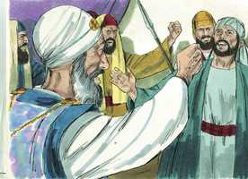
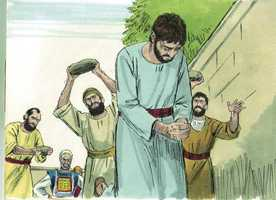
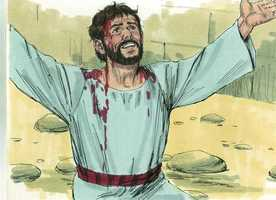
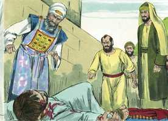

# Atos dos Apóstolos Cap 07

**1** 	E DISSE o sumo sacerdote: Porventura é isto assim?

**2** 	E ele disse: Homens, irmãos, e pais, ouvi. O Deus da glória apareceu a nosso pai Abraão, estando na Mesopotâmia, antes de habitar em Harã,

**3** 	E disse-lhe: Sai da tua terra e dentre a tua parentela, e dirige-te à terra que eu te mostrar.

**4** 	Então saiu da terra dos caldeus, e habitou em Harã. E dali, depois que seu pai faleceu, Deus o trouxe para esta terra em que habitais agora.

**5** 	E não lhe deu nela herança, nem ainda o espaço de um pé; mas prometeu que lhe daria a posse dela, e depois dele, à sua descendência, não tendo ele ainda filho.

**6** 	E falou Deus assim: Que a sua descendência seria peregrina em terra alheia, e a sujeitariam à escravidão, e a maltratariam por quatrocentos anos.

**7** 	E eu julgarei a nação que os tiver escravizado, disse Deus. E depois disto sairão e me servirão neste lugar.

**8** 	E deu-lhe a aliança da circuncisão; e assim gerou a Isaque, e o circuncidou ao oitavo dia; e Isaque a Jacó; e Jacó aos doze patriarcas.

**9** 	E os patriarcas, movidos de inveja, venderam José para o Egito; mas Deus era com ele.

**10** 	E livrou-o de todas as suas tribulações, e lhe deu graça e sabedoria ante Faraó, rei do Egito, que o constituiu governador sobre o Egito e toda a sua casa.

**11** 	Sobreveio então a todo o país do Egito e de Canaã fome e grande tribulação; e nossos pais não achavam alimentos.

**12** 	Mas tendo ouvido Jacó que no Egito havia trigo, enviou ali nossos pais, a primeira vez.

**13** 	E na segunda vez foi José conhecido por seus irmãos, e a sua linhagem foi manifesta a Faraó.

**14** 	E José mandou chamar a seu pai Jacó, e a toda a sua parentela, que era de setenta e cinco almas.

**15** 	E Jacó desceu ao Egito, e morreu, ele e nossos pais;

**16** 	E foram transportados para Siquém, e depositados na sepultura que Abraão comprara por certa soma de dinheiro aos filhos de Emor, pai de Siquém.

**17** 	Aproximando-se, porém, o tempo da promessa que Deus tinha feito a Abraão, o povo cresceu e se multiplicou no Egito;

**18** 	Até que se levantou outro rei, que não conhecia a José.

**19** 	Esse, usando de astúcia contra a nossa linhagem, maltratou nossos pais, a ponto de os fazer enjeitar as suas crianças, para que não se multiplicassem.

**20** 	Nesse tempo nasceu Moisés, e era mui formoso, e foi criado três meses em casa de seu pai.

**21** 	E, sendo enjeitado, tomou-o a filha de Faraó, e o criou como seu filho.

**22** 	E Moisés foi instruído em toda a ciência dos egípcios; e era poderoso em suas palavras e obras.

**23** 	E, quando completou a idade de quarenta anos, veio-lhe ao coração ir visitar seus irmãos, os filhos de Israel.

**24** 	E, vendo maltratado um deles, o defendeu, e vingou o ofendido, matando o egípcio.

**25** 	E ele cuidava que seus irmãos entenderiam que Deus lhes havia de dar a liberdade pela sua mão; mas eles não entenderam.

**26** 	E no dia seguinte, pelejando eles, foi por eles visto, e quis levá-los à paz, dizendo: Homens, sois irmãos; por que vos agravais um ao outro?

**27** 	E o que ofendia o seu próximo o repeliu, dizendo: Quem te constituiu príncipe e juiz sobre nós?

**28** 	Queres tu matar-me, como ontem mataste o egípcio?

**29** 	E a esta palavra fugiu Moisés, e esteve como estrangeiro na terra de Midiã, onde gerou dois filhos.

**30** 	E, completados quarenta anos, apareceu-lhe o anjo do Senhor no deserto do monte Sinai, numa chama de fogo no meio de uma sarça.

**31** 	Então Moisés, quando viu isto, se maravilhou da visão; e, aproximando-se para observar, foi-lhe dirigida a voz do Senhor,

**32** 	Dizendo: Eu sou o Deus de teus pais, o Deus de Abraão, e o Deus de Isaque, e o Deus de Jacó. E Moisés, todo trêmulo, não ousava olhar.

**33** 	E disse-lhe o Senhor: Tira as alparcas dos teus pés, porque o lugar em que estás é terra santa.

**34** 	Tenho visto atentamente a aflição do meu povo que está no Egito, e ouvi os seus gemidos, e desci a livrá-los. Agora, pois, vem, e enviar-te-ei ao Egito.

**35** 	A este Moisés, ao qual haviam negado, dizendo: Quem te constituiu príncipe e juiz? a este enviou Deus como príncipe e libertador, pela mão do anjo que lhe aparecera na sarça.

**36** 	Foi este que os conduziu para fora, fazendo prodígios e sinais na terra do Egito, e no Mar Vermelho, e no deserto, por quarenta anos.

**37** 	Este é aquele Moisés que disse aos filhos de Israel: O Senhor vosso Deus vos levantará dentre vossos irmãos um profeta como eu; a ele ouvireis.

**38** 	Este é o que esteve entre a congregação no deserto, com o anjo que lhe falava no monte Sinai, e com nossos pais, o qual recebeu as palavras de vida para no-las dar.

**39** 	Ao qual nossos pais não quiseram obedecer, antes o rejeitaram e em seu coração se tornaram ao Egito,

**40** 	Dizendo a Arão: Faze-nos deuses que vão adiante de nós; porque a esse Moisés, que nos tirou da terra do Egito, não sabemos o que lhe aconteceu.

**41** 	E naqueles dias fizeram o bezerro, e ofereceram sacrifícios ao ídolo, e se alegraram nas obras das suas mãos.

**42** 	Mas Deus se afastou, e os abandonou a que servissem ao exército do céu, como está escrito no livro dos profetas: Porventura me oferecestes vítimas e sacrifícios No deserto por quarenta anos, ó casa de Israel?

**43** 	Antes tomastes o tabernáculo de Moloque, E a estrela do vosso deus Renfã, Figuras que vós fizestes para as adorar. Transportar-vos-ei, pois, para além da Babilônia.

**44** 	Estava entre nossos pais no deserto o tabernáculo do testemunho, como ordenara aquele que disse a Moisés que o fizesse segundo o modelo que tinha visto.

**45** 	O qual, nossos pais, recebendo-o também, o levaram com Josué quando entraram na posse das nações que Deus lançou para fora da presença de nossos pais, até aos dias de Davi,

**46** 	Que achou graça diante de Deus, e pediu que pudesse achar tabernáculo para o Deus de Jacó.

**47** 	E Salomão lhe edificou casa;

**48** 	Mas o Altíssimo não habita em templos feitos por mãos de homens, como diz o profeta:

**49** 	O céu é o meu trono, E a terra o estrado dos meus pés. Que casa me edificareis? diz o Senhor, ou qual é o lugar do meu repouso?

**50** 	Porventura não fez a minha mão todas estas coisas?

**51** 	Homens de dura cerviz, e incircuncisos de coração e ouvido, vós sempre resistis ao Espírito Santo; assim vós sois como vossos pais.

**52** 	A qual dos profetas não perseguiram vossos pais? Até mataram os que anteriormente anunciaram a vinda do Justo, do qual vós agora fostes traidores e homicidas;

**53** 	Vós, que recebestes a lei por ordenação dos anjos, e não a guardastes.

**54** 	E, ouvindo eles isto, enfureciam-se em seus corações, e rangiam os dentes contra ele.

 

**55** 	Mas ele, estando cheio do Espírito Santo, fixando os olhos no céu, viu a glória de Deus, e Jesus, que estava à direita de Deus;

**56** 	E disse: Eis que vejo os céus abertos, e o Filho do homem, que está em pé à mão direita de Deus.

**57** 	Mas eles gritaram com grande voz, taparam os seus ouvidos, e arremeteram unânimes contra ele.

**58** 	E, expulsando-o da cidade, o apedrejavam. E as testemunhas depuseram as suas capas aos pés de um jovem chamado Saulo.

 

**59** 	E apedrejaram a Estêvão que em invocação dizia: Senhor Jesus, recebe o meu espírito.

 

**60** 	E, pondo-se de joelhos, clamou com grande voz: Senhor, não lhes imputes este pecado. E, tendo dito isto, adormeceu.

 

> **Cmt MHenry** Intro: Nada é tão consolador para os santos moribundos, ou tão animador para os santos que sofrem, que ver a Jesus à destra de Deus: bendito seja Deus, pela fé podemos vê-lo ali. Estevão ofereceu duas breves orações em seus momentos de agonia. Nosso Senhor Jesus é Deus, ao qual devemos buscar, e em quem devemos confiar e consolar-nos, vivendo e morrendo. Se isto tem sido nosso cuidado enquanto vivemos, será nosso consolo quando morrermos. Aqui há uma oração por seus perseguidores. Embora o pecado foi muito grande, se a eles lhes pesasse no coração, Deus não o colocaria na conta deles. Estevão morreu tão pressionado como nunca morreu homem algum, mas ao morrer, se diz que dormiu; ele se dedicou à tarefa de morrer com tanta compostura como se tivesse ido a dormir. Acordará de novo na manhã da ressurreição para ser recebido na presença do Senhor, onde há plenitude de gozo, e para compartir os prazeres que estão a sua destra para sempre.> Parece que Estevão prosseguiria demonstrando que o templo e o serviço do templo deviam chegar a seu fim, e que ceder o passo à adoração do Pai em espírito e em verdade seria para glória de ambos, mas percebeu que eles não o suportariam. Portanto, calou-se, e pelo Espírito de sabedoria, valor e poder, repreendeu fortemente a seus perseguidores. Quando argumentos e verdades claras provocam aos opositores do evangelho, deve mostrar-se a eles sua culpa e perigo. Eles, como seus pais, eram obcecados e soberbos. Em nossos corações pecaminosos há o que sempre resiste o Espírito Santo, uma carne cujo desejo é contra o Espírito, e batalha contra seus movimentos; todavia, no coração dos eleitos de Deus, essa resistência é vencida quando chega a plenitude do tempo. agora o evangelho era oferecido, não por anjos, senão pelo Espírito Santo, mas eles não o abraçaram porque estavam resolvidos a não cumprir com Deus, tanto fosse em sua lei ou em seu evangelho. A culpa deles lhes pregou o coração, e buscaram alivio assassinando a quem os repreendia, em lugar de chorar e pedir misericórdia.> Estevão recriminou aos judeus a idolatria de seus pais a qual Deus os entregou como castigo por tê-lo abandonado antes. Não foi uma desonra, senão honra para Deus que o tabernáculo cedesse passo ao templo; agora é assim, que o templo terreno dê passo ao espiritual; e assim será quando, finalmente, o templo espiritual ceda passo ao terreno. Todo o mundo é o templo de Deus, onde está presente em todas partes, e o enche com sua glória; então, que necessidade tem de um templo onde manifestar-se? Estas coisas mostram seu eterno poder e deidade. Mas como o céu é seu trono e a terra é estrado de seus pés, nenhum de nossos serviços beneficiam ao que fez todas as coisas. Depois da natureza humana de Cristo, o coração quebrantado e espiritual é o templo mais valioso para Ele.> Os homens se enganam se pensam que Deus não pode fazer o que vê que é bom em alguma parte; pode levar ao deserto a seu povo, e ali lhes falar de consolo. Se apareceu a Moisés numa chama de fogo, mas a sarça não se consumia, o qual representava o estado de Israel no Egito, onde, apesar de que estavam no fogo da aflição, não foram consumidos. Também pode olhar-se como tipo da assunção da natureza humana por Cristo, e da união da natureza divina e humana. A morte de Abraão, Isaque e Jacó não pôde romper a relação da aliança entre Deus e eles. Nosso Salvador prova, por isso, o estado futuro ([Mt 22.31](../40N-Mt/22.md#31)). Abraão morreu, mas Deus ainda é *seu* Deus; portanto, Abraão ainda vive. Agora bem, esta é a vida e a imortalidade que é tirada à luz pelo evangelho. Estevão mostra aqui que Moisés foi tipo eminente de Cristo, como libertador de Israel. Deus se compadece dos problemas de sua Igreja e dos gemidos de seu povo perseguido; e a liberação deles brota de sua compaixão. Essa liberação é tipo do que fez Cristo quando desceu desde o céu por nós, os homens, e para nossa salvação. Este Jesus, ao qual agora rejeitaram como seus pais rejeitaram a Moisés, é o mesmo que Deus levantou para ser Príncipe e Salvador. Nada resta da justa honra de Moisés ao dizer que ele foi só um instrumento e que é infinitamente escurecido por Jesus. Ao afirmar que Jesus devia mudar os costumes da lei cerimonial, Estevão distava tanto de blasfemar contra Moisés que, em realidade, o honrava, demonstrando como se cumprira a profecia de Moisés, que era tão clara. Deus, que lhes deu esses costumes mediante seu servo Moisés, podia sem dúvida mudar o costume por meio de seu Filho Jesus. Porém Israel desprezou a Moisés e desejava voltar à escravidão; desse modo, em geral os homens não obedecerão a Jesus porque amam este presente mundo mau e se regozijam em suas obras e invenções.> " Não desanimemos pela lentidão com que se cumprem as promessas de Deus. Os tempos de sofrimentos são volta e meia tempos de crescimento para a Igreja. Quando o momento deles é o mais escuro e mais profunda sua angústia, Deus está preparando a libertação de seu povo. Moisés era muito agradável "foi agradável a Deus"; é a beleza da santidade que tem grande preço aos olhos de Deus. foi preservado maravilhosamente em sua infância, porque Deus cuida em forma especial aos que tem destinado para um serviço especial; e se assim protegeu o menino Moisés, não assegurará muito mais os interesses de seu santo menino Jesus, contra os inimigos que se reúnem em sua contra? Eles perseguiram a Estevão por argumentar em defesa de Cristo e de seu evangelho: em sua contra levantaram a Moisés e sua lei. Poderiam entender, se não fechassem voluntariamente seus olhos à luz, que Deus os livrará por meio deste Jesus de uma escravidão pior que a do Egito. Embora os homens prolongam suas misérias, o Senhor cuidará, não obstante, de seus servos e concretizará seus desígnios de misericórdia. "> Estevão foi acusado de blasfemar contra Deus e de apóstata da igreja; em conseqüência, demonstra que é filho de Abraão e se valoriza a si mesmo como tal. Os passos lentos com que avançava a seu cumprimento a promessa feita a Abraão mostram claramente que tinha um significado espiritual e que a terra aludida era a celestial. Deus reconheceu a José em suas tribulações, e esteve com ele pelo poder de seu Espírito, dando-lhe consolo em sua mente, e dando-lhe favor ante os olhos das pessoas com que se relacionava. Estevão lembra aos judeus seu pequeno começo como um freio para seu orgulho pelas glórias deserta nação. Também os lembra das maldades dos patriarcas de suas tribos, ao terem inveja de seu irmão José; o mesmo espírito ainda operava neles acerca de Cristo e seu ministros. A fé dos patriarcas, ao desejar serem enterrados na terra de Canaã, demonstra claramente que eles tinham consideração pela pátria celestial. Bom é recorrer à primeira manifestação de costumes ou sentimentos, quando se perverteram. Se desejarmos conhecer a natureza e os efeitos da fé justificadora, devemos estudar o caráter do pai dos fiéis. Seu chamado mostra poder e a gratuidade da graça divina, e a natureza da conversão. Aqui também vemos que as formas e distinções externas são como nada comparadas com a separação do mundo e a consagração de Deus.