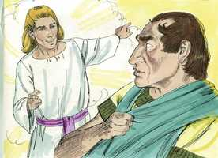
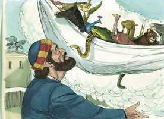
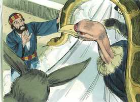
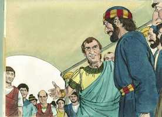
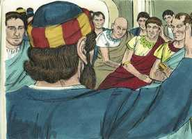
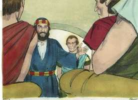
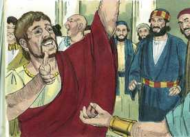
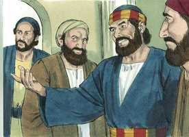

# Atos dos Apóstolos Cap 10

**1** 	E HAVIA em Cesaréia um homem por nome Cornélio, centurião da coorte chamada italiana,

**2** 	Piedoso e temente a Deus, com toda a sua casa, o qual fazia muitas esmolas ao povo, e de contínuo orava a Deus.

**3** 	Este, quase à hora nona do dia, viu claramente numa visão um anjo de Deus, que se dirigia para ele e dizia: Cornélio.

**4** 	O qual, fixando os olhos nele, e muito atemorizado, disse: Que é, Senhor? E disse-lhe: As tuas orações e as tuas esmolas têm subido para memória diante de Deus;

 

**5** 	Agora, pois, envia homens a Jope, e manda chamar a Simão, que tem por sobrenome Pedro.

**6** 	Este está hospedado com um certo Simão curtidor, que tem a sua casa junto do mar. Ele te dirá o que deves fazer.

**7** 	E, retirando-se o anjo que lhe falava, chamou dois dos seus criados, e a um piedoso soldado dos que estavam ao seu serviço.

**8** 	E, havendo-lhes contado tudo, os enviou a Jope.

**9** 	E no dia seguinte, indo eles seu caminho, e estando já perto da cidade, subiu Pedro ao terraço para orar, quase à hora sexta.

**10** 	E tendo fome, quis comer; e, enquanto lho preparavam, sobreveio-lhe um arrebatamento de sentidos,

**11** 	E viu o céu aberto, e que descia um vaso, como se fosse um grande lençol atado pelas quatro pontas, e vindo para a terra.

 

**12** 	No qual havia de todos os animais quadrúpedes e feras e répteis da terra, e aves do céu.

**13** 	E foi-lhe dirigida uma voz: Levanta-te, Pedro, mata e come.

**14** 	Mas Pedro disse: De modo nenhum, Senhor, porque nunca comi coisa alguma comum e imunda.

 

**15** 	E segunda vez lhe disse a voz: Não faças tu comum ao que Deus purificou.

**16** 	E aconteceu isto por três vezes; e o vaso tornou a recolher-se ao céu.

**17** 	E estando Pedro duvidando entre si acerca do que seria aquela visão que tinha visto, eis que os homens que foram enviados por Cornélio pararam à porta, perguntando pela casa de Simão.

**18** 	E, chamando, perguntaram se Simão, que tinha por sobrenome Pedro, morava ali.

**19** 	E, pensando Pedro naquela visão, disse-lhe o Espírito: Eis que três homens te buscam.

**20** 	Levanta-te pois, desce, e vai com eles, não duvidando; porque eu os enviei.

**21** 	E, descendo Pedro para junto dos homens que lhe foram enviados por Cornélio, disse: Eis que sou eu a quem procurais; qual é a causa por que estais aqui?

 

**22** 	E eles disseram: Cornélio, o centurião, homem justo e temente a Deus, e que tem bom testemunho de toda a nação dos judeus, foi avisado por um santo anjo para que te chamasse a sua casa, e ouvisse as tuas palavras.

**23** 	Então, chamando-os para dentro, os recebeu em casa. E no dia seguinte foi Pedro com eles, e foram com ele alguns irmãos de Jope.

**24** 	E no dia imediato chegaram a Cesaréia. E Cornélio os estava esperando, tendo já convidado os seus parentes e amigos mais íntimos.

 

**25** 	E aconteceu que, entrando Pedro, saiu Cornélio a recebê-lo, e, prostrando-se a seus pés o adorou.

**26** 	Mas Pedro o levantou, dizendo: Levanta-te, que eu também sou homem.

**27** 	E, falando com ele, entrou, e achou muitos que ali se haviam ajuntado.

**28** 	E disse-lhes: Vós bem sabeis que não é lícito a um homem judeu ajuntar-se ou chegar-se a estrangeiros; mas Deus mostrou-me que a nenhum homem chame comum ou imundo.

 

**29** 	Por isso, sendo chamado, vim sem contradizer. Pergunto, pois, por que razão mandastes chamar-me?

**30** 	E disse Cornélio: Há quatro dias estava eu em jejum até esta hora, orando em minha casa à hora nona.

**31** 	E eis que diante de mim se apresentou um homem com vestes resplandecentes, e disse: Cornélio, a tua oração foi ouvida, e as tuas esmolas estão em memória diante de Deus.

**32** 	Envia, pois, a Jope, e manda chamar Simão, o que tem por sobrenome Pedro; este está hospedado em casa de Simão o curtidor, junto do mar, e ele, vindo, te falará.

**33** 	E logo mandei chamar-te, e bem fizeste em vir. Agora, pois, estamos todos presentes diante de Deus, para ouvir tudo quanto por Deus te é mandado.

**34** 	E, abrindo Pedro a boca, disse: Reconheço por verdade que Deus não faz acepção de pessoas;

 

**35** 	Mas que lhe é agradável aquele que, em qualquer nação, o teme e faz o que é justo.

**36** 	A palavra que ele enviou aos filhos de Israel, anunciando a paz por Jesus Cristo (este é o Senhor de todos);

**37** 	Esta palavra, vós bem sabeis, veio por toda a Judéia, começando pela Galiléia, depois do batismo que João pregou;

**38** 	Como Deus ungiu a Jesus de Nazaré com o Espírito Santo e com virtude; o qual andou fazendo bem, e curando a todos os oprimidos do diabo, porque Deus era com ele.

**39** 	E nós somos testemunhas de todas as coisas que fez, tanto na terra da Judéia como em Jerusalém; ao qual mataram, pendurando-o num madeiro.

**40** 	A este ressuscitou Deus ao terceiro dia, e fez que se manifestasse,

**41** 	Não a todo o povo, mas às testemunhas que Deus antes ordenara; a nós, que comemos e bebemos juntamente com ele, depois que ressuscitou dentre os mortos.

**42** 	E nos mandou pregar ao povo, e testificar que ele é o que por Deus foi constituído juiz dos vivos e dos mortos.

**43** 	A este dão testemunho todos os profetas, de que todos os que nele crêem receberão o perdão dos pecados pelo seu nome.

**44** 	E, dizendo Pedro ainda estas palavras, caiu o Espírito Santo sobre todos os que ouviam a palavra.

 

**45** 	E os fiéis que eram da circuncisão, todos quantos tinham vindo com Pedro, maravilharam-se de que o dom do Espírito Santo se derramasse também sobre os gentios.

**46** 	Porque os ouviam falar línguas, e magnificar a Deus.

 

**47** 	Respondeu, então, Pedro: Pode alguém porventura recusar a água, para que não sejam batizados estes, que também receberam como nós o Espírito Santo?

**48** 	E mandou que fossem batizados em nome do Senhor. Então rogaram-lhe que ficasse com eles por alguns dias.

> **Cmt MHenry** Intro: O Espírito Santo caiu sobre outros depois que foram batizados, para confirmá-los na fé, mas sobre estes gentios desceu antes que fossem batizados para demonstrar que Deus não se limita a sinais externos. O Espírito Santo desceu sobre os que nem sequer estavam circuncidados nem batizados; o Espírito é o que vivifica, a carne de nada aproveita. Eles magnificaram a Deus, e falaram de Cristo e dos benefícios da redenção. Qualquer seja o dom com que sejamos dotados, devemos honrar a Deus com ele. Os judeus crentes que estavam presentes ficaram atônitos de que o dom do Espírito Santo fosse derramado também sobre os gentios. Devido a noções errôneas das coisas nos criamos dificuldades acerca dos métodos da providência e da graça divina.\ Como foram inegavelmente batizados com o Espírito Santo, Pedro concluiu que não deviam recusar-lhes o batismo de água, e a ordenança foi ministrada. O argumento é conclusivo: podemos negar o sinal aos que têm recebido as coisas significadas pelos sinal? Os que estão familiarizados com Cristo não podem senão desejar mais. Ainda os que receberam o Espírito Santo devem ver sua necessidade de aprender diariamente mais da verdade.> A aceitação não pode obter-se sobre outro fundamento que não seja o da aliança de misericórdia pela expiação feita por Cristo, porém onde quer que esteja a religião verdadeira, Deus a aceitará sem consideração de denominações ou seitas. O temor de Deus e as obras de justiça são a substância da religião verdadeira, os efeitos da graça especial. mesmo que estes não sejam a causa da aceitação do homem, no entanto, a indicam; e, falte-lhes o que lhes faltar em conhecimento ou fé, lhes será dado no momento devido por Aquele que a começou.\ Eles conheciam em geral a palavra, isto é, o evangelho que Deus enviou aos filhos de Israel. A intenção desta palavra era que Deus publicasse por seu intermédio a boa nova da paz por Jesus Cristo. eles conheciam os diversos fatos relacionados com o evangelho. Conheciam o batismo de arrependimento que João pregou. Saibam eles que este Jesus Cristo, por quem se faz a paz entre Deus e o homem, é Senhor de tudo; não somente sobre tudo, Deus bendito pelos séculos, senão como Mediador. Toda potestade no céu e na terra é colocada em sua mão, e todo juízo lhe foi encarregado. Deus irá com os que Ele ungir; estará com aqueles aos que tenha dado seu Espírito.\ Então, Pedro declara a ressurreição de Cristo dentre os mortos, e suas provas. A fé se refere a um testemunho, e a fé cristã está edificada sobre o fundamento dos apóstolos e profetas, sobre o testemunho dado por eles.\ Veja-se o que deve crer-se acerca dele: que todos são responsáveis de render contas a Cristo, Enquanto é nosso Juiz; assim cada um deve procurar seu favor e tê-lo como nosso Amigo. Se cremos nEle, todos seremos justificados por Ele como Justiça nossa. A remissão dos pecados coloca o fundamento para todos os outros favores e bênçãos, tirando do caminho todo o que obstaculizar sua concessão. Se o pecado é perdoado, tudo está bem e terminará bem para sempre.> Quando vemos claramente nosso chamado a um serviço. Não devemos confundir-nos com dúvidas e escrúpulos de prejuízos ou de idéias anteriores. Cornélio havia reunido a seus amigos para que participassem com ele da sabedoria celestial que esperava de Pedro. Não cobicemos comer a sós nossos bocados espirituais. Devemos considerá-los como dados e recebidos em sinal de bondade e respeito para com nossos parentes e amizades para convidá-los a unir-se conosco nos exercícios religiosos. Cornélio declara a ordem que Deus lhe deu de mandar a buscar a Pedro. Estamos no correto em nossos objetivos ao assistir a um ministério do evangelho, quando o fazemos com reverência pela cita divina, que nos pede que utilizemos essa ordenança. Com quão pouca freqüência se pede aos ministros que falem a estes grupos, por pequenos que sejam, dos que pode dizer-se que estão todos presentes, à vista de Deus, para ouvir todas as coisas que Deus manda! Contudo, estes estavam prontos para ouvir o que Deus mandou dizer a Pedro.> Os prejuízos de Pedro contra os gentios teriam lhe impedido ir à casa de Cornélio se o Senhor não o tivesse preparado para este serviço. Dizer a um judeu que Deus tinha ordenado que esses animais fossem reconhecidos como limpos, quando até então eram considerados imundos, era dizer efetivamente que a lei de Moisés estava terminada. Logo se deu a conhecer a Pedro seu significado. Deus sabe quais serviços temos por diante e sabe preparar-nos, e nós entenderemos o significado do que nos foi ensinado, quando achemos a ocasião para usá-lo.> Até agora ninguém tinha sido batizado na Igreja cristã salvo judeus, samaritanos e os prosélitos que tinham sido circuncidados, e observavam a lei cerimonial; apesar disso, agora, os gentios eram chamados a participar de todos os privilégios do povo de Deus sem ter que se fazer judeus primeiro.\ A religião pura e sem contaminação está, às vezes, onde menos a esperamos. Onde quer que o temor de reine no coração, se manifestará em obras de caridade e da piedade sem que uma seja escusa da outra. Sem dúvida, Cornélio tinha verdade fé na palavra de Deus, na medida que a entendia, embora ainda não tinha uma fé clara em Cristo. esta foi a obra do Espírito de Deus, pela mediação de Jesus, ainda antes que Cornélio o conhecesse, como acontece com todos nós, que antes estávamos mortos no pecado, quando somos vivificados. Por meio de Cristo também foram aceitas suas orações e esmolas que, de outro modo, teriam sido rejeitadas. Cornélio foi obediente, sem debate nem demora, à visão celestial. Não percamos tempo nos assuntos de nossas almas.