# Atos dos Apóstolos Cap 14

**1** 	E ACONTECEU que em Icônio entraram juntos na sinagoga dos judeus, e falaram de tal modo que creu uma grande multidão, não só de judeus mas de gregos.

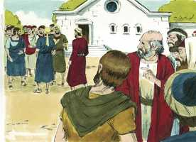 

**2** 	Mas os judeus incrédulos incitaram e irritaram, contra os irmãos, os ânimos dos gentios.

**3** 	Detiveram-se, pois, muito tempo, falando ousadamente acerca do Senhor, o qual dava testemunho à palavra da sua graça, permitindo que por suas mãos se fizessem sinais e prodígios.

**4** 	E dividiu-se a multidão da cidade; e uns eram pelos judeus, e outros pelos apóstolos.

**5** 	E havendo um motim, tanto dos judeus como dos gentios, com os seus principais, para os insultarem e apedrejarem,

**6** 	Sabendo-o eles, fugiram para Listra e Derbe, cidades de Licaônia, e para a província circunvizinha;

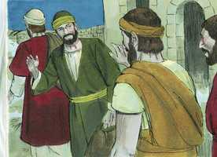 

**7** 	E ali pregavam o evangelho.

**8** 	E estava assentado em Listra certo homem leso dos pés, coxo desde o ventre de sua mãe, o qual nunca tinha andado.

**9** 	Este ouviu falar Paulo, que, fixando nele os olhos, e vendo que tinha fé para ser curado,

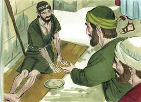 

**10** 	Disse em voz alta: Levanta-te direito sobre teus pés. E ele saltou e andou.

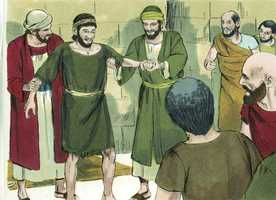 

**11** 	E as multidões, vendo o que Paulo fizera, levantaram a sua voz, dizendo em língua licaônica: Fizeram-se os deuses semelhantes aos homens, e desceram até nós.

**12** 	E chamavam Júpiter a Barnabé, e Mercúrio a Paulo; porque este era o que falava.

**13** 	E o sacerdote de Júpiter, cujo templo estava em frente da cidade, trazendo para a entrada da porta touros e grinaldas, queria com a multidão sacrificar-lhes.

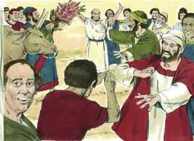 

**14** 	Ouvindo, porém, isto os apóstolos Barnabé e Paulo, rasgaram as suas vestes, e saltaram para o meio da multidão, clamando,

**15** 	E dizendo: Senhores, por que fazeis essas coisas? Nós também somos homens como vós, sujeitos às mesmas paixões, e vos anunciamos que vos convertais dessas vaidades ao Deus vivo, que fez o céu, e a terra, o mar, e tudo quanto há neles;

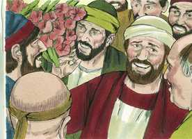 

**16** 	O qual nos tempos passados deixou andar todas as nações em seus próprios caminhos.

**17** 	E contudo, não se deixou a si mesmo sem testemunho, beneficiando-vos lá do céu, dando-vos chuvas e tempos frutíferos, enchendo de mantimento e de alegria os vossos corações.

**18** 	E, dizendo isto, com dificuldade impediram que as multidões lhes sacrificassem.

**19** 	Sobrevieram, porém, uns judeus de Antioquia e de Icônio que, tendo convencido a multidão, apedrejaram a Paulo e o arrastaram para fora da cidade, cuidando que estava morto.

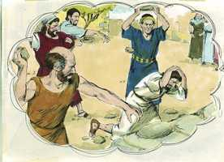 

**20** 	Mas, rodeando-o os discípulos, levantou-se, e entrou na cidade, e no dia seguinte saiu com Barnabé para Derbe.

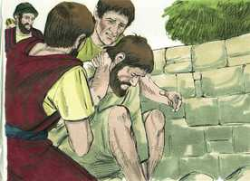 

**21** 	E, tendo anunciado o evangelho naquela cidade e feito muitos discípulos, voltaram para Listra, e Icônio e Antioquia,

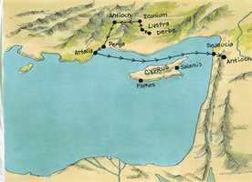 

**22** 	Confirmando os ânimos dos discípulos, exortando-os a permanecer na fé, pois que por muitas tribulações nos importa entrar no reino de Deus.

**23** 	E, havendo-lhes, por comum consentimento, eleito anciãos em cada igreja, orando com jejuns, os encomendaram ao Senhor em quem haviam crido.

**24** 	Passando depois por Pisídia, dirigiram-se a Panfília.

**25** 	E, tendo anunciado a palavra em Perge, desceram a Atália.

**26** 	E dali navegaram para Antioquia, de onde tinham sido encomendados à graça de Deus para a obra que já haviam cumprido.

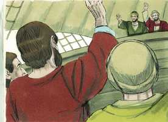 

**27** 	E, quando chegaram e reuniram a igreja, relataram quão grandes coisas Deus fizera por eles, e como abrira aos gentios a porta da fé.

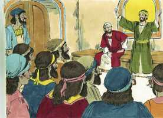 

**28** 	E ficaram ali não pouco tempo com os discípulos.

> **Cmt MHenry** Intro: " Note-se quão incansável era a fúria dos judeus contra o evangelho de Cristo. A gente apedrejou a Paulo num tumulto popular. Tão forte é a inclinação do coração corrupto e carnal, que com suma dificuldade os homens se refreiam do mal, por uma parte, assim como com grande facilidade são persuadidos a fazer o mal pela outra. Se Paulo tiver sido Mercúrio, poderia ter sido adorado, mas se for o ministro fiel de Cristo, será apedrejado e lançado fora da cidade. assim, pois, os homens que se submetem facilmente a fortes ilusões, detestam receber a verdade com amor.\ Todos os que são convertidos devem ser confirmados na fé; todos os que são plantados devem criar raízes. A obra dos ministros é estabelecer os santos e despertar os pecadores. A graça de Deus, e nada menos, estabelece eficazmente as almas dos discípulos. é verdade que podemos contar com muita tribulação, mas é estimulante que não estejamos perdidos nem pereçamos nela.\ A Pessoa a cujo poder e graça estão encomendados os convertidos e as igrejas recém estabelecidas, era claramente o Senhor Jesus, "em quem todos creram". Foi um ato de adoração.\ Todo o elogio do pouco bom que fazemos em qualquer momento deve ser atribuído a Deus, porque Ele é quem não só opera em nós o querer como o fazer, senão também opera conosco para que alcance o êxito. Todos os que amam o Senhor Jesus se regozijarão ao ouvir que tem aberto de par em par a porta da fé aos que eram alheios a Ele e a sua salvação. Como os apóstolos, habitemos com os que conhecem e amam o Senhor. "> Todas as coisas são possíveis para o que crê. Quando temos fé, dom tão precioso de Deus, seremos livrados da falta de defesa espiritual em que nascemos, e do domínio dos hábitos pecaminosos desde que se formaram; seremos capacitados para ficar em pé e andar jubilosos nos caminhos do Senhor.\ Quando Cristo, o Filho de Deus, se manifestou em semelhança de homens, e fez muitos milagres, os homens distavam tanto de fazer-lhe sacrifícios, que o fizeram sacrifício a Ele para a soberba e maldade deles. Contudo, Paulo e Barnabé foram tratados como deuses por terem feito um milagre. O mesmo poder do deus deste mundo, que fecha a mente carnal contra a verdade, faz que sejam facilmente admitidos os erros e os equívocos.\ Não lemos que tenham rasgado suas vestes quando o povo falou em lapidá-los, senão quando falaram em adorá-los; eles não puderam tolerá-lo, estando mais preocupados pela honra de Deus que pela própria. A verdade de Deus não necessita dos serviços da falsidade do homem. Os servos de Deus podem obter facilmente honras indevidas se cedem aos erros e os vícios dos homens, mas devem aborrecer e detestar esse respeito mais que toda repreensão.\ Quando os apóstolos pregaram aos judeus que odiavam a idolatria, somente tiveram que pregar a graça de Deus em Cristo, mas quando tiveram que pregar aos gentios, deveram corrigir os erros da religião natural. Compare-se a conduta e a declaração deles com opiniões dos que pensam falsamente que a adoração de Deus, sob qualquer nome ou de qualquer forma, é igualmente aceitável para o Senhor Todo Poderoso.\ Os argumentos de maior força, os discursos mais fervorosos e afetuosos, até com milagres, apenas bastam para resguardar aos homens de absurdos e abominações; muito menos podem, sem a graça especial, voltar os corações dos pecadores a Deus e à santidade.> Os apóstolos falavam com tanta simplicidade, com tanta demonstração e provas do Espírito e com tal poder, tão calidamente e com to interesse pelas almas dos homens, que os que os escutavam não podiam dizer senão que Deus estava com eles. Mas o êxito não devia atribuir-se a seu estilo de pregar, senão ao Espírito de Deus que usava esse médio. A perseverança para fazer o bem em meio de perigos e dificuldades é uma bendita mostra de graça. Onde quer que sejam levados os servos de Deus, devem tratar de dizer a verdade. Quando iam em nome e pelo poder de Cristo, Ele não deixava de dar testemunho da Palavra de sua graça. Nos assegura que é a Palavra de Deus e que podemos jogar nossas almas por ela. Os gentios e os judeus estavam inimizados uns com outros, porém unidos contra os cristãos. Se os inimigos da Igreja se unem para destruí-la, não se unirão seus amigos para preservá-la? Deus tem um refúgio em caso de tormenta: Ele é e será seu refúgio. Nas épocas de perseguição os crentes podem ter motivos para sair de um lugar, apesar que não deixem a obra de seu Mestre.