# Atos dos Apóstolos Cap 15

**1** 	ENTÃO alguns que tinham descido da Judéia ensinavam assim os irmãos: Se não vos circuncidardes conforme o uso de Moisés, não podeis salvar-vos.

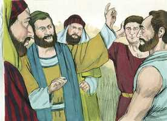 

**2** 	Tendo tido Paulo e Barnabé não pequena discussão e contenda contra eles, resolveu-se que Paulo e Barnabé, e alguns dentre eles, subissem a Jerusalém, aos apóstolos e aos anciãos, sobre aquela questão.

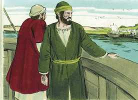 

**3** 	E eles, sendo acompanhados pela igreja, passavam pela Fenícia e por Samaria, contando a conversão dos gentios; e davam grande alegria a todos os irmãos.

**4** 	E, quando chegaram a Jerusalém, foram recebidos pela igreja e pelos apóstolos e anciãos, e lhes anunciaram quão grandes coisas Deus tinha feito com eles.

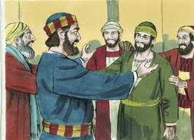 

**5** 	Alguns, porém, da seita dos fariseus, que tinham crido, se levantaram, dizendo que era mister circuncidá-los e mandar-lhes que guardassem a lei de Moisés.

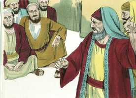 

**6** 	Congregaram-se, pois, os apóstolos e os anciãos para considerar este assunto.

**7** 	E, havendo grande contenda, levantou-se Pedro e disse-lhes: Homens irmãos, bem sabeis que já há muito tempo Deus me elegeu dentre nós, para que os gentios ouvissem da minha boca a palavra do evangelho, e cressem.

 

**8** 	E Deus, que conhece os corações, lhes deu testemunho, dando-lhes o Espírito Santo, assim como também a nós;

**9** 	E não fez diferença alguma entre eles e nós, purificando os seus corações pela fé.

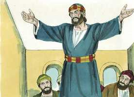 

**10** 	Agora, pois, por que tentais a Deus, pondo sobre a cerviz dos discípulos um jugo que nem nossos pais nem nós pudemos suportar?

**11** 	Mas cremos que seremos salvos pela graça do Senhor Jesus Cristo, como eles também.

**12** 	Então toda a multidão se calou e escutava a Barnabé e a Paulo, que contavam quão grandes sinais e prodígios Deus havia feito por meio deles entre os gentios.

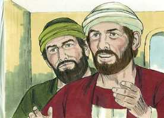 

**13** 	E, havendo-se eles calado, tomou Tiago a palavra, dizendo: Homens irmãos, ouvi-me:

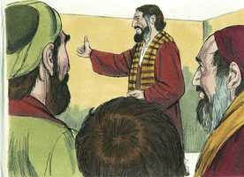 

**14** 	Simão relatou como primeiramente Deus visitou os gentios, para tomar deles um povo para o seu nome.

**15** 	E com isto concordam as palavras dos profetas; como está escrito:

 

**16** 	Depois disto voltarei, E reedificarei o tabernáculo de Davi, que está caído, Levantá-lo-ei das suas ruínas, E tornarei a edificá-lo.

**17** 	Para que o restante dos homens busque ao Senhor, E todos os gentios, sobre os quais o meu nome é invocado, Diz o Senhor, que faz todas estas coisas,

**18** 	Conhecidas são a Deus, desde o princípio do mundo, todas as suas obras.

**19** 	Por isso julgo que não se deve perturbar aqueles, dentre os gentios, que se convertem a Deus.

**20** 	Mas escrever-lhes que se abstenham das contaminações dos ídolos, da fornicação, do que é sufocado e do sangue.

**21** 	Porque Moisés, desde os tempos antigos, tem em cada cidade quem o pregue, e cada sábado é lido nas sinagogas.

**22** 	Então pareceu bem aos apóstolos e aos anciãos, com toda a igreja, eleger homens dentre eles e enviá-los com Paulo e Barnabé a Antioquia, a saber: Judas, chamado Barsabás, e Silas, homens distintos entre os irmãos.

**23** 	E por intermédio deles escreveram o seguinte: Os apóstolos, e os anciãos e os irmãos, aos irmãos dentre os gentios que estão em Antioquia, e Síria e Cilícia, saúde.

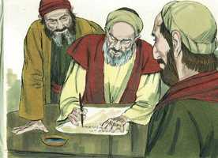 

**24** 	Porquanto ouvimos que alguns que saíram dentre nós vos perturbaram com palavras, e transtornaram as vossas almas, dizendo que deveis circuncidar-vos e guardar a lei, não lhes tendo nós dado mandamento,

**25** 	Pareceu-nos bem, reunidos concordemente, eleger alguns homens e enviá-los com os nossos amados Barnabé e Paulo,

**26** 	Homens que já expuseram as suas vidas pelo nome de nosso Senhor Jesus Cristo.

**27** 	Enviamos, portanto, Judas e Silas, os quais por palavra vos anunciarão também as mesmas coisas.

**28** 	Na verdade pareceu bem ao Espírito Santo e a nós, não vos impor mais encargo algum, senão estas coisas necessárias:

**29** 	Que vos abstenhais das coisas sacrificadas aos ídolos, e do sangue, e da carne sufocada, e da fornicação, das quais coisas bem fazeis se vos guardardes. Bem vos vá.

**30** 	Tendo eles então se despedido, partiram para Antioquia e, ajuntando a multidão, entregaram a carta.

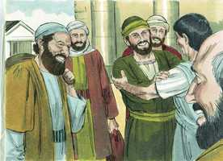 

**31** 	E, quando a leram, alegraram-se pela exortação.

**32** 	Depois Judas e Silas, que também eram profetas, exortaram e confirmaram os irmãos com muitas palavras.

**33** 	E, detendo-se ali algum tempo, os irmãos os deixaram voltar em paz para os apóstolos;

**34** 	Mas pareceu bem a Silas ficar ali.

**35** 	E Paulo e Barnabé ficaram em Antioquia, ensinando e pregando, com muitos outros, a palavra do Senhor.

**36** 	E alguns dias depois, disse Paulo a Barnabé: Tornemos a visitar nossos irmãos por todas as cidades em que já anunciamos a palavra do Senhor, para ver como estão.

**37** 	E Barnabé aconselhava que tomassem consigo a João, chamado Marcos.

**38** 	Mas a Paulo parecia razoável que não tomassem consigo aquele que desde a Panfília se tinha apartado deles e não os acompanhou naquela obra.

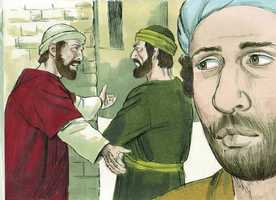 

**39** 	E tal contenda houve entre eles, que se apartaram um do outro. Barnabé, levando consigo a Marcos, navegou para Chipre.

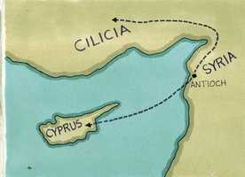 

**40** 	E Paulo, tendo escolhido a Silas, partiu, encomendado pelos irmãos à graça de Deus.

**41** 	E passou pela Síria e Cilícia, confirmando as igrejas.

> **Cmt MHenry** Intro: Aqui temos uma briga em privado de dois ministros, nada menos que Paulo e Barnabé, mas feita para terminar bem. Barnabé desejava que seu sobrinho João Marcos fosse com eles. Devemos suspeitar que somos parciais, e cuidar-nos disso, quando colocamos primeiro a nossos parentes. Paulo não pensava que era digno da honra nem apto para o serviço, quem tinha-se separado deles sem que o soubessem ou sem o consentimento deles (ver capítulo 13.13). Nenhum cedia, e assim sendo, não restou senão separar-se. Vemos que os melhores homens não são senão homens, sujeitos a paixões como nós. Talvez houve faltas de ambas as partes, como é costumeiro em tais contendas. Somente o exemplo de Cristo é imaculado. Mas não devemos pensar que é raro que existam diferenças ainda entre homens bons e sábios. Assim será enquanto estejamos neste estado imperfeito; nunca seremos todos unânimes até que cheguemos ao céu. Contudo, quanta maldade fazem no mundo, e na igreja, os remanescentes do orgulho e da paixão que se encontram ainda nos melhores homens! muitos dos que moravam na Antioquia, que pouco ou nada souberam da devoção e piedade de Paulo e Barnabé, souberam sim de sua disputa e separação; assim nos acontecerá se cedermos à discórdia. Os crentes devem orar constantemente que não sejam nunca conduzidos a comprometer a causa que realmente desejam servir pelos vestígios do temperamento ímpio. Paulo fala com estima e afeto de Barnabé e Marcos, em suas epístolas escritas depois deste acontecimento. Todos os que professam Teu nome, oh amante Senhor, sejam completamente reconciliados por esse amor derivado de Ti, que não se deixa provocar a facilidade e que esquece logo e enterra as injúrias.> Tendo a garantia de declarar-se dirigidos pelo poder imediato do Espírito Santo, os apóstolos e os discípulos tiveram a certeza de que parecia bem a Deus Espírito Santo, e a eles, impor aos convertidos, seja por conta própria ou pelas circunstâncias presentes, outra carga senão as coisas necessárias já mencionadas.\ Foi um consolo ouvir que já não lhes seriam impostas as ordenanças carnais, que confundiam suas consciências, sem poder purificá-las nem pacificá-las; e foram silenciados os que perturbavam suas mentes, de modo que foi restaurada a paz da igreja, e se suprimiu o que era ameaça de divisão. tudo isso foi consolo pelo qual abençoaram a Deus.\ Havia muitos mais na Antioquia. Onde muitos trabalham na palavra e na doutrina, pode ainda haver oportunidade para nós: o zelo e a utilidade do próximo deve estimular-nos, não adormecer-nos.> " Das palavras "purificando pela fé seus corações", do sermão de Pedro, entendemos que não se podem separar a justificação pela fé e a santificação pelo Espírito Santo, e que ambas são de Deus. temos muita razão para abençoar a Deus porque ouvimos o evangelho. Tenhamos essa fé que aprova o grande Esquadrinhador dos corações, e certifica o selo do Espírito Santo. Então, serão purificados da culpa do pecado nossos corações e nossas consciências, e seremos liberados das cargas que alguns tratam de lançar sobre os discípulos de Cristo.\ Paulo e Barnabé demonstraram por fatos comprovados que Deus reconhecera a pregação do puro evangelho aos gentios, sem a lei de Moisés; portanto, impor-lhes essa lei era desfazer o que Deus tinha feito. A opinião de Tiago era que os convertidos gentios não deviam ser incomodados pelos rituais judaicos, porém deviam abster-se de carnes oferecidas aos ídolos, para mostrar seu ódio pela idolatria. Além disso, que deviam ser advertidos contra a fornicação, que não era aborrecida pelos gentios como devia ser, e que até formava parte de alguns de seus rituais. Foram aconselhados de abster-se de comer animais afogados, e de comer sangue; isto era proibido pela lei de Moisés e também aqui, por reverência ao sangue dos sacrifícios, que sendo então oferecido, insultaria desnecessariamente aos convertidos judeus e a prejudicar ainda mais aos judeus inconversos. Porém, como faz muito tempo que cessou o motivo, nós somos livres disso, como em matérias semelhantes. Os convertidos sejam precavidos para evitar toda aparência dos males que antes praticavam ou pelos que, provavelmente, sejam tentados; e sejam advertidos que usem a liberdade cristã com moderação e prudência. "> Uns da Judéia ensinavam aos gentios convertidos da Antioquia que não poderiam ser salvos a menos que observassem toda a lei cerimonial, tal como fora dada por Moisés; deste modo procuravam destruir a liberdade cristã. Temos uma estranha tendência a pensar que os que não fazem como nós, fazem tudo errado. Sua doutrina era muito desalentadora. Os homens sábios e bons desejam evitar as contendas e os debates até onde possam, mas quando os falsos mestres se opõem às principais verdades do evangelho ou trazem doutrinas nocivas, não devemos deixar de resisti-lhes.