# Atos dos Apóstolos Cap 17

**1** 	E PASSANDO por Anfípolis e Apolônia, chegaram a Tessalônica, onde havia uma sinagoga de judeus.

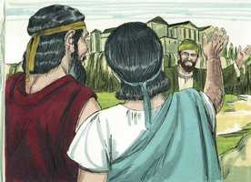 

**2** 	E Paulo, como tinha por costume, foi ter com eles; e por três sábados disputou com eles sobre as Escrituras,

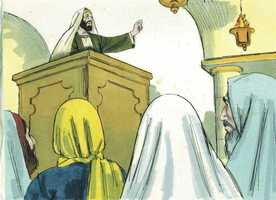 

**3** 	Expondo e demonstrando que convinha que Cristo padecesse e ressuscitasse dentre os mortos. E este Jesus, que vos anuncio, dizia ele, é o Cristo.

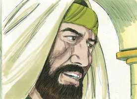 

**4** 	E alguns deles creram, e ajuntaram-se com Paulo e Silas; e também uma grande multidão de gregos religiosos, e não poucas mulheres principais.

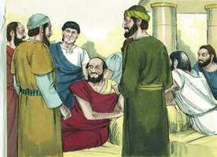 

**5** 	Mas os judeus desobedientes, movidos de inveja, tomaram consigo alguns homens perversos, dentre os vadios e, ajuntando o povo, alvoroçaram a cidade, e assaltando a casa de Jasom, procuravam trazê-los para junto do povo.

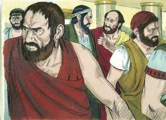 

**6** 	E, não os achando, trouxeram Jasom e alguns irmãos à presença dos magistrados da cidade, clamando: Estes que têm alvoroçado o mundo, chegaram também aqui;

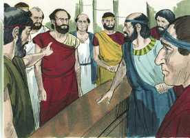 

**7** 	Os quais Jasom recolheu; e todos estes procedem contra os decretos de César, dizendo que há outro rei, Jesus.

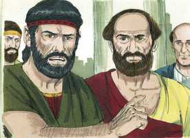 

**8** 	E alvoroçaram a multidão e os principais da cidade, que ouviram estas coisas.

**9** 	Tendo, porém, recebido satisfação de Jasom e dos demais, os soltaram.

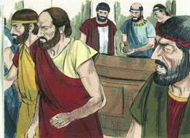 

**10** 	E logo os irmãos enviaram de noite Paulo e Silas a Beréia; e eles, chegando lá, foram à sinagoga dos judeus.

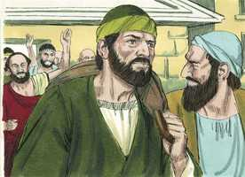 

**11** 	Ora, estes foram mais nobres do que os que estavam em Tessalônica, porque de bom grado receberam a palavra, examinando cada dia nas Escrituras se estas coisas eram assim.

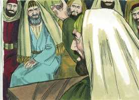 

**12** 	De sorte que creram muitos deles, e também mulheres gregas da classe nobre, e não poucos homens.

**13** 	Mas, logo que os judeus de Tessalônica souberam que a palavra de Deus também era anunciada por Paulo em Beréia, foram lá, e excitaram as multidões.

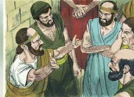 

**14** 	No mesmo instante os irmãos mandaram a Paulo que fosse até ao mar, mas Silas e Timóteo ficaram ali.

**15** 	E os que acompanhavam Paulo o levaram até Atenas, e, recebendo ordem para que Silas e Timóteo fossem ter com ele o mais depressa possível, partiram.

**16** 	E, enquanto Paulo os esperava em Atenas, o seu espírito se comovia em si mesmo, vendo a cidade tão entregue à idolatria.

 

**17** 	De sorte que disputava na sinagoga com os judeus e religiosos, e todos os dias na praça com os que se apresentavam.

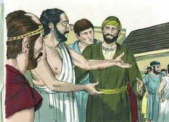 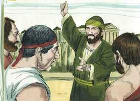 

**18** 	E alguns dos filósofos epicureus e estóicos contendiam com ele; e uns diziam: Que quer dizer este paroleiro? E outros: Parece que é pregador de deuses estranhos; porque lhes anunciava a Jesus e a ressurreição.

**19** 	E tomando-o, o levaram ao Areópago, dizendo: Poderemos nós saber que nova doutrina é essa de que falas?

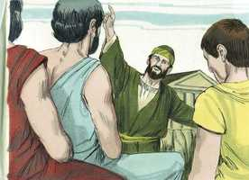 

**20** 	Pois coisas estranhas nos trazes aos ouvidos; queremos, pois, saber o que vem a ser isto

**21** 	(Pois todos os atenienses e estrangeiros residentes, de nenhuma outra coisa se ocupavam, senão de dizer e ouvir alguma novidade).

**22** 	E, estando Paulo no meio do Areópago, disse: Homens atenienses, em tudo vos vejo um tanto supersticiosos;

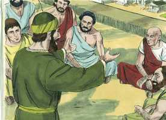 

**23** 	Porque, passando eu e vendo os vossos santuários, achei também um altar em que estava escrito: AO DEUS DESCONHECIDO. Esse, pois, que vós honrais, não o conhecendo, é o que eu vos anuncio.

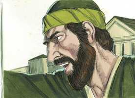 

**24** 	O Deus que fez o mundo e tudo que nele há, sendo Senhor do céu e da terra, não habita em templos feitos por mãos de homens;

**25** 	Nem tampouco é servido por mãos de homens, como que necessitando de alguma coisa; pois ele mesmo é quem dá a todos a vida, e a respiração, e todas as coisas;

**26** 	E de um só sangue fez toda a geração dos homens, para habitar sobre toda a face da terra, determinando os tempos já dantes ordenados, e os limites da sua habitação;

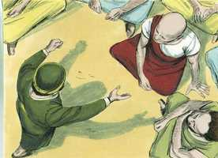 

**27** 	Para que buscassem ao Senhor, se porventura, tateando, o pudessem achar; ainda que não está longe de cada um de nós;

**28** 	Porque nele vivemos, e nos movemos, e existimos; como também alguns dos vossos poetas disseram: Pois somos também sua geração.

 

**29** 	Sendo nós, pois, geração de Deus, não havemos de cuidar que a Divindade seja semelhante ao ouro, ou à prata, ou à pedra esculpida por artifício e imaginação dos homens.

**30** 	Mas Deus, não tendo em conta os tempos da ignorância, anuncia agora a todos os homens, e em todo o lugar, que se arrependam;

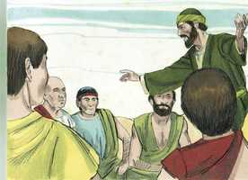 

**31** 	Porquanto tem determinado um dia em que com justiça há de julgar o mundo, por meio do homem que destinou; e disso deu certeza a todos, ressuscitando-o dentre os mortos.

**32** 	E, como ouviram falar da ressurreição dos mortos, uns escarneciam, e outros diziam: Acerca disso te ouviremos outra vez.

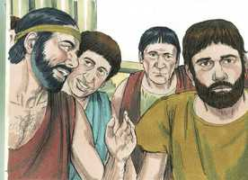 

**33** 	E assim Paulo saiu do meio deles.

**34** 	Todavia, chegando alguns homens a ele, creram; entre os quais foi Dionísio, areopagita, uma mulher por nome Dâmaris, e com eles outros.

 

> **Cmt MHenry** Intro: O apóstolo foi tratado com maior civismo externo em Atenas que em outras partes, mas ninguém desprezou mais sua doutrina ou a tratou com mais indiferença. O tema que mais merece a atenção, entre todos, é o que menos se atende. Os que se burlam, deverão sofrer as conseqüências, porque a palavra nunca voltará vazia. Se achará que alguns se aferram ao Senhor e escutam seus servos fiéis.\ Considerar o juízo vindouro, e a Cristo como nosso Juiz, deveria instar a todos a arrepender-se do pecado e a voltar-se a Ele. qualquer seja o tema tratado, todos os discursos devem levar a Ele, e mostrar sua autoridade: nossa salvação e ressurreição vem de e por Ele.> " Aqui temos um sermão para os pagãos que adoravam deuses falsos e estavam no mundo sem o Deus verdadeiro; e para eles o alcance deste discurso era diferente do que o apóstolo pregava aos judeus. Neste último caso, sua tarefa era guiar os ouvintes por profecias e milagres até o conhecimento do Redentor e a fé nEle; no anterior, era levá-los a conhecer o Criador pelas obras comuns da providência, e a que o adorassem.\ O apóstolo se referiu a um altar que tinha visto, o que tinha a inscrição: "Ao Deus desconhecido". Este fato está testemunhado por muitos escritores. Depois de multiplicar ao máximo seus ídolos, algumas pessoas de Atenas pensaram que havia um outro deus, do qual nada sabiam. E agora, não há muitos que se dizem cristãos, que são zelosos em suas devoções, embora o grande objeto de sua adoração é para eles um Deus desconhecido?\ Notem-se as coisas gloriosas que diz Paulo aqui desse Deus ao que servia, e desejava que eles servissem. O Senhor tinha tolerado por muito tempo a idolatria, porém agora estavam chegando a seu fim os tempos dessa ignorância, e por seus servos agora manda a todos os homens de todas partes que se arrependam de sua idolatria. Toda a seita dos homens doutos deve ter-se sentido sumamente afetada pelo discurso do apóstolo, que tendia a demonstrar o vazio ou a falsidade de suas doutrinas. "> Naquela época Atenas era famosa por sua refinada erudição, sua filosofia e as belas artes; porém ninguém é mais infantil e supersticioso, mais ímpio ou mais crédulo que algumas pessoas, consideradas eminentes por seu saber e habilidade. Estavam totalmente entregues à idolatria.\ O advogado zeloso da causa de Cristo está disposto a alegar em seu favor toda classe de companhia, segundo se ofereça a ocasião. A maioria destes homens doutos não prestaram atenção a Paulo, mas alguns, cujos princípios eram os que mais diretamente contrariavam o cristianismo, fizeram comentários sobre ele. O apóstolo sempre tratava dois pontos que, sem dúvida, são as doutrinas principais do cristianismo: Cristo e o estado futuro. Cristo, nosso caminho, e o céu, nosso destino final. Eles consideraram isto como muito diferente do conhecimento ensinado e professado em Atenas por muitos séculos; desejaram saber mais a respeito, mas só porque era novidadeiro e raro. O levaram ao lugar onde estavam os juízes que indagavam destas matérias. Perguntaram sobre a doutrina de Paulo, não porque fosse boa, senão porque era nova. Os grandes conversadores sempre são curiosos. Os que assim gastam o tempo em mais nada, têm uma conta muito desagradável que render pelo tempo que desse jeito desperdiçaram. O tempo é precioso e devemos utilizá-lo bem porque a eternidade depende disso, mas muito se desperdiça em conversações que não aproveitam.> Os judeus de Beréia se aplicaram seriamente ao estudo da palavra pregada a eles. Não somente ouviam pregar a Paulo o dia do repouso; diariamente esquadrinhavam as Escrituras, e comparavam o que liam com os fatos que lhes eram relatados. A doutrina de Cristo não teme a pesquisa; os advogados de sua causa não desejam mais que a gente examine completa e eqüitativamente se as coisas são ou não assim. São verdadeiramente nobres, e provavelmente o sejam mais e mais, os que fazem das Escrituras sua regra, e as consultam regularmente. Tomara que todos os ouvintes do evangelho chegassem a ser como os de Beréia, recebendo a Palavra com agilidade mental e investigando diariamente as Escrituras, para descobrir se as coisas que lhes são pregadas são assim em verdade.> A tendência e o âmbito da pregação e argumentos de Paulo eram provar que Jesus é o Cristo. Ele devia sofrer por nós, porque não pode adquirir de outro modo a ressurreição por nós, e devia ressuscitar, porque de outro modo não pode aplicar-nos a redenção a nós. Temos que pregar de Jesus que Ele é o Cristo; portanto, podemos esperar ser salvados por Ele e estamos ligados a sermos mandados por Ele. os judeus incrédulos estavam irados, porque os apóstolos pregavam aos gentios e estes podiam ser salvos. Que raro é que os homens invejem de outros o privilégio que eles mesmos não aceitam! Tampouco deveriam perturbar-se os governantes nem o povo pelo aumento dos cristãos verdadeiros, apesar de que os espíritos perturbadores farão da religião um pretexto para as más intenções. Dos tais devemos cuidar-nos, porque deles devemos distanciar-nos para demonstrar o desejo de agir retamente da sociedade, enquanto reclamamos nosso direito de adorar a Deus segundo nossa consciência.