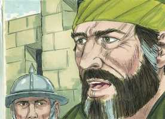

# Atos dos Apóstolos Cap 21

**1** 	E ACONTECEU que, separando-nos deles, navegamos e fomos correndo caminho direito, e chegamos a Cós, e no dia seguinte a Rodes, de onde passamos a Pátara.

**2** 	E, achando um navio, que ia para a Fenícia, embarcamos nele, e partimos.

**3** 	E, indo já à vista de Chipre, deixando-a à esquerda, navegamos para a Síria e chegamos a Tiro; porque o navio havia de ser descarregado ali.

**4** 	E, achando discípulos, ficamos ali sete dias; e eles pelo Espírito diziam a Paulo que não subisse a Jerusalém.

 

**5** 	E, havendo passado ali aqueles dias, saímos, e seguimos nosso caminho, acompanhando-nos todos, com suas mulheres e filhos até fora da cidade; e, postos de joelhos na praia, oramos.

 

**6** 	E, despedindo-nos uns dos outros, subimos ao navio; e eles voltaram para suas casas.

**7** 	E nós, concluída a navegação de Tiro, viemos a Ptolemaida; e, havendo saudado os irmãos, ficamos com eles um dia.

**8** 	E no dia seguinte, partindo dali Paulo, e nós que com ele estávamos, chegamos a Cesaréia; e, entrando em casa de Filipe, o evangelista, que era um dos sete, ficamos com ele.

**9** 	E tinha este quatro filhas virgens, que profetizavam.

**10** 	E, demorando-nos ali por muitos dias, chegou da Judéia um profeta, por nome Ágabo;

 

**11** 	E, vindo ter conosco, tomou a cinta de Paulo, e ligando-se os seus próprios pés e mãos, disse: Isto diz o Espírito Santo: Assim ligarão os judeus em Jerusalém o homem de quem é esta cinta, e o entregarão nas mãos dos gentios.

 

**12** 	E, ouvindo nós isto, rogamos-lhe, tanto nós como os que eram daquele lugar, que não subisse a Jerusalém.

**13** 	Mas Paulo respondeu: Que fazeis vós, chorando e magoando-me o coração? Porque eu estou pronto não só a ser ligado, mas ainda a morrer em Jerusalém pelo nome do Senhor Jesus.

 

**14** 	E, como não podíamos convencê-lo, nos aquietamos, dizendo: Faça-se a vontade do Senhor.

 

**15** 	E depois daqueles dias, havendo feito os nossos preparativos, subimos a Jerusalém.

**16** 	E foram também conosco alguns discípulos de Cesaréia, levando consigo um certo Mnasom, cíprio, discípulo antigo, com quem havíamos de hospedar-nos.

**17** 	E, logo que chegamos a Jerusalém, os irmãos nos receberam de muito boa vontade.

**18** 	E no dia seguinte, Paulo entrou conosco em casa de Tiago, e todos os anciãos vieram ali.

 

**19** 	E, havendo-os saudado, contou-lhes por miúdo o que por seu ministério Deus fizera entre os gentios.

**20** 	E, ouvindo-o eles, glorificaram ao Senhor, e disseram-lhe: Bem vês, irmão, quantos milhares de judeus há que crêem, e todos são zeladores da lei.

 

**21** 	E já acerca de ti foram informados de que ensinas todos os judeus que estão entre os gentios a apartarem-se de Moisés, dizendo que não devem circuncidar seus filhos, nem andar segundo o costume da lei.

**22** 	Que faremos pois? em todo o caso é necessário que a multidão se ajunte; porque terão ouvido que já és vindo.

**23** 	Faze, pois, isto que te dizemos: Temos quatro homens que fizeram voto.

  

**24** 	Toma estes contigo, e santifica-te com eles, e faze por eles os gastos para que rapem a cabeça, e todos ficarão sabendo que nada há daquilo de que foram informados acerca de ti, mas que também tu mesmo andas guardando a lei.

**25** 	Todavia, quanto aos que crêem dos gentios, já nós havemos escrito, e achado por bem, que nada disto observem; mas que só se guardem do que se sacrifica aos ídolos, e do sangue, e do sufocado e da fornicação.

**26** 	Então Paulo, tomando consigo aqueles homens, entrou no dia seguinte no templo, já santificado com eles, anunciando serem já cumpridos os dias da purificação; e ficou ali até se oferecer por cada um deles a oferta.

 

**27** 	E quando os sete dias estavam quase a terminar, os judeus da Ásia, vendo-o no templo, alvoroçaram todo o povo e lançaram mão dele,

 

**28** 	Clamando: Homens israelitas, acudi; este é o homem que por todas as partes ensina a todos contra o povo e contra a lei, e contra este lugar; e, demais disto, introduziu também no templo os gregos, e profanou este santo lugar.

**29** 	Porque tinham visto com ele na cidade a Trófimo de Éfeso, o qual pensavam que Paulo introduzira no templo.

**30** 	E alvoroçou-se toda a cidade, e houve grande concurso de povo; e, pegando Paulo, o arrastaram para fora do templo, e logo as portas se fecharam.

 

**31** 	E, procurando eles matá-lo, chegou ao tribuno da coorte o aviso de que Jerusalém estava toda em confusão;

 

**32** 	O qual, tomando logo consigo soldados e centuriões, correu para eles. E, quando viram o tribuno e os soldados, cessaram de ferir a Paulo.

**33** 	Então, aproximando-se o tribuno, o prendeu e o mandou atar com duas cadeias, e lhe perguntou quem era e o que tinha feito.

 

**34** 	E na multidão uns clamavam de uma maneira, outros de outra; mas, como nada podia saber ao certo, por causa do alvoroço, mandou conduzi-lo para a fortaleza.

**35** 	E sucedeu que, chegando às escadas, os soldados tiveram de lhe pegar por causa da violência da multidão.

**36** 	Porque a multidão do povo o seguia, clamando: Mata-o!

**37** 	E, quando iam a introduzir Paulo na fortaleza, disse Paulo ao tribuno: É-me permitido dizer-te alguma coisa? E ele disse: Sabes o grego?

**38** 	Não és tu porventura aquele egípcio que antes destes dias fez uma sedição e levou ao deserto quatro mil salteadores?

**39** 	Mas Paulo lhe disse: Na verdade que sou um homem judeu, cidadão de Tarso, cidade não pouco célebre na Cilícia; rogo-te, porém, que me permitas falar ao povo.

 

**40** 	E, havendo-lho permitido, Paulo, pondo-se em pé nas escadas, fez sinal com a mão ao povo; e, feito grande silêncio, falou-lhes em língua hebraica, dizendo:

 

> **Cmt MHenry** Intro: No templo, onde Paulo deveria ter estado protegido por ser lugar seguro, foi violentamente atacado. O acusaram falsamente de má doutrina e de mau costume contra as cerimônias mosaicas. Não era nada novo para os que não têm intenções honestas e agem conforme com a regra, que os acusem de coisas que não conhecem e nas que nunca pensaram. Comum é para o sábio e bom que a gente má o acuse daquilo com que acreditou agradá-los.\ Deus costuma fazer com que protejam seu povo os que não o querem, mas que somente se compadecem dos que sofrem e se preocupam pela paz pública. Veja-se aqui com que noções falsas e errôneas da gente boa e dos bons ministros muitos se afastam. Porém Deus intervém oportunamente para assegurar a seus servos contra os homens malvados e irracionais; e lhes dá oportunidades para que falem defendendo o Redentor e difundindo amplamente seu glorioso Evangelho.> Paulo atribui todo seu êxito a Deus e a Deus dá o louvor. Deus o havia honrado mais que a nenhum dos apóstolos, apesar de que eles não o invejavam, mas pelo contrário, glorificavam o Senhor. Eles não podiam fazer mais que exortar a Paulo para que seguisse alegremente em sua obra. Tiago e os anciãos da igreja de Jerusalém pediram a Paulo que satisfizesse os judeus crentes com o cumprimento de algum requisito da lei cerimônia. Eles pensaram que era prudente que se conformasse até esse ponto. Foi uma grande fraqueza querer tanto a sombra quando tinha chegado a substância.\ A religião que Paulo pregava não tendia a destruir a lei, senão a cumpri-la. Ele pregava a Cristo, o fim da lei pela justiça, o arrependimento e a fé, pelo que devemos usar muito a lei. A fraqueza e a maldade do com humano aparecem repetidas vezes, quando consideramos quantos, sendo discípulos de Cristo, não tiveram a devida consideração para com o ministro mas eminente que tenha vivido jamais. Nem a excelência de seu caráter, nem o êxito com que Deus abençoou suas tarefas puderam ganhar a estima e o afeto deles, que viam que ele não rendia o mesmo respeito que eles às observâncias cerimoniais. Quão cuidadosos devemos ser com os prejuízos! Os apóstolos não estiveram livres de culpa em tudo o que fizeram, e seria difícil defender a Paulo da acusação de ceder demasiado nesta matéria. Vão é tratar de conseguir o favor dos zelotes ou fanáticos de um partido. Este cumprimento de Paulo não serviu, pelo mesmo, no que esperava apaziguar os judeus, senão que os provocou e o encrencou, mas o Deus onisciente passou por alto o conselho deles e o cumprimento de Paulo, para servir a um propósito melhor do que se pensava. Era vão tratar de comprazer aos homens que não se agradariam com nada senão com a destruição do cristianismo. É mais provável que a integridade e a retidão nos preservem mais que os cumprimentos mentirosos. Isto deveria advertir-nos para não pressionar os homens para que façam o contrário a seu próprio juízo para comprazer-nos.> Paulo tinha sido expressamente advertido de seus problemas para que, quando chegassem, não fossem surpresa nem terror para ele. devemos dar o mesmo uso à notícia geral que se nos dá de que devemos entrar no Reino de Deus através de muita tribulação. O choro deles começou a enfraquecer e desanimar a resolução deles. Não nos disse nosso Mestre que tomemos nossa cruz? Para ele foi um problema que eles o pressionassem com tanta insistência para fazer aquilo com que não podia satisfazê-los sem prejudicar sua própria consciência. Quando vemos que se aproximam problemas, não somente nos corresponde dizer: *deve* cumprir-se a vontade do Senhor, e não há mais remédio, senão: *cumpra-se* a vontade do Senhor, porque sua vontade e sua sabedoria e Ele faz tudo conforme a seu conselho. Deve acalmar nosso pesar que *se cumpre* a vontade do Senhor quando chega um problema; deve silenciar nossos temores quando vemos vir o problema, que *se cumprirá* a vontade do Senhor, e devemos dizer: amém, seja *cumprida*. Honroso é ser um discípulo velho de Jesus Cristo, ter sido capacitado pela graça de Deus para seguir por longo tempo no curso do dever, constante na fé, crescendo mais, e mais experimentado numa boa velhice. A pessoa deveria optar por habitar com estes discípulos velhos, porque a multidão de seus anos ensinará sabedoria.\ Muitos irmãos de Jerusalém receberam alegremente a Paulo. Pensamos que, talvez se o tivermos conosco, o receberíamos com gozo, mas não faríamos assim se, tendo a sua doutrina, não a recebemos com gozo.> Devemos reconhecer a providência quando as coisas dão certo. Onde quer que for Paulo, perguntava quantos discípulos havia ali e os procurava. Prevendo seus problemas, por amor dele, e preocupação pela igreja, eles pensaram, erroneamente, que seria mais para a glória de Deus que continuasse livre, mas seu zelo para dissuadi-lo tornou mais ilustre sua santa resolução. Ele nos tem ensinado com o exemplo e pela regra, a orar sem cessar. O último adeus deles foi adoçado com oração.