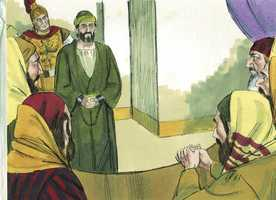
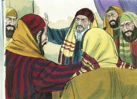
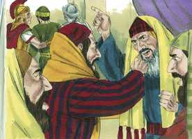
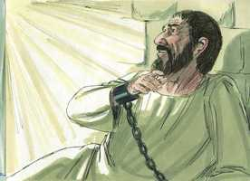
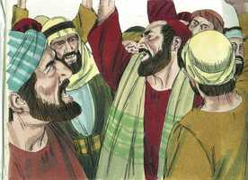
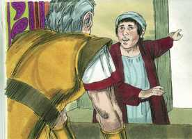
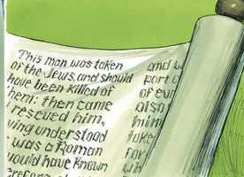
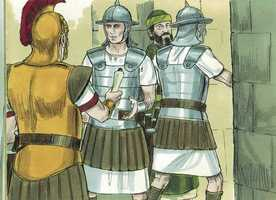
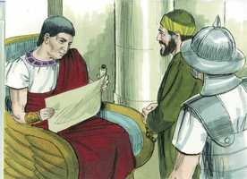

# Atos dos Apóstolos Cap 23

**1** 	E, PONDO Paulo os olhos no conselho, disse: Homens irmãos, até ao dia de hoje tenho andado diante de Deus com toda a boa consciência.

 

**2** 	Mas o sumo sacerdote, Ananias, mandou aos que estavam junto dele que o ferissem na boca.

**3** 	Então Paulo lhe disse: Deus te ferirá, parede branqueada; tu estás aqui assentado para julgar-me conforme a lei, e contra a lei me mandas ferir?

**4** 	E os que ali estavam disseram: Injurias o sumo sacerdote de Deus?

**5** 	E Paulo disse: Não sabia, irmãos, que era o sumo sacerdote; porque está escrito: Não dirás mal do príncipe do teu povo.

**6** 	E Paulo, sabendo que uma parte era de saduceus e outra de fariseus, clamou no conselho: Homens irmãos, eu sou fariseu, filho de fariseu; no tocante à esperança e ressurreição dos mortos sou julgado.

**7** 	E, havendo dito isto, houve dissensão entre os fariseus e saduceus; e a multidão se dividiu.

 

**8** 	Porque os saduceus dizem que não há ressurreição, nem anjo, nem espírito; mas os fariseus reconhecem uma e outra coisa.

**9** 	E originou-se um grande clamor; e, levantando-se os escribas da parte dos fariseus, contendiam, dizendo: Nenhum mal achamos neste homem, e, se algum espírito ou anjo lhe falou, não lutemos contra Deus.

 

**10** 	E, havendo grande dissensão, o tribuno, temendo que Paulo fosse despedaçado por eles, mandou descer a soldadesca, para que o tirassem do meio deles, e o levassem para a fortaleza.

 

**11** 	E na noite seguinte, apresentando-se-lhe o Senhor, disse: Paulo, tem ânimo; porque, como de mim testificaste em Jerusalém, assim importa que testifiques também em Roma.

 

**12** 	E, quando já era dia, alguns dos judeus fizeram uma conspiração, e juraram, dizendo que não comeriam nem beberiam enquanto não matassem a Paulo.

 

**13** 	E eram mais de quarenta os que fizeram esta conjuração.

**14** 	E estes foram ter com os principais dos sacerdotes e anciãos, e disseram: Conjuramo-nos, sob pena de maldição, a nada provarmos até que matemos a Paulo.

 

**15** 	Agora, pois, vós, com o conselho, rogai ao tribuno que vo-lo traga amanhã, como que querendo saber mais alguma coisa de seus negócios, e, antes que chegue, estaremos prontos para o matar.

**16** 	E o filho da irmã de Paulo, tendo ouvido acerca desta cilada, foi, e entrou na fortaleza, e o anunciou a Paulo.

**17** 	E Paulo, chamando a si um dos centuriões, disse: Leva este jovem ao tribuno, porque tem alguma coisa que lhe comunicar.

**18** 	Tomando-o ele, pois, o levou ao tribuno, e disse: O preso Paulo, chamando-me a si, rogou-me que trouxesse este jovem, que tem alguma coisa para dizer-te.

**19** 	E o tribuno, tomando-o pela mão, e pondo-se à parte, perguntou-lhe em particular: Que tens que me contar?

**20** 	E disse ele: Os judeus se concertaram rogar-te que amanhã leves Paulo ao conselho, como que tendo de inquirir dele mais alguma coisa ao certo.

 

**21** 	Mas tu não os creias; porque mais de quarenta homens de entre eles lhe andam armando ciladas; os quais se obrigaram, sob pena de maldição, a não comer nem beber até que o tenham morto; e já estão apercebidos, esperando de ti promessa.

**22** 	Então o tribuno despediu o jovem, mandando-lhe que a ninguém dissesse que lhe havia contado aquilo.

**23** 	E, chamando dois centuriões, lhes disse: Aprontai para as três horas da noite duzentos soldados, e setenta de cavalaria, e duzentos arqueiros para irem até Cesaréia;

**24** 	E aparelhai animais, para que, pondo nelas a Paulo, o levem salvo ao presidente Félix.

**25** 	E escreveu uma carta, que continha isto:

**26** 	Cláudio Lísias, a Félix, potentíssimo presidente, saúde.

**27** 	Esse homem foi preso pelos judeus; e, estando já a ponto de ser morto por eles, sobrevim eu com a soldadesca, e o livrei, informado de que era romano.

 

**28** 	E, querendo saber a causa por que o acusavam, o levei ao seu conselho.

**29** 	E achei que o acusavam de algumas questões da sua lei; mas que nenhum crime havia nele digno de morte ou de prisão.

**30** 	E, sendo-me notificado que os judeus haviam de armar ciladas a esse homem, logo to enviei, mandando também aos acusadores que perante ti digam o que tiverem contra ele. Passa bem.

**31** 	Tomando, pois, os soldados a Paulo, como lhe fora mandado, o trouxeram de noite a Antipátride.

 

**32** 	E no dia seguinte, deixando aos de cavalo irem com ele, tornaram à fortaleza.

**33** 	Os quais, logo que chegaram a Cesaréia, e entregaram a carta ao presidente, lhe apresentaram Paulo.

**34** 	E o presidente, lida a carta, perguntou de que província era; e, sabendo que era da Cilícia,

 

**35** 	Disse: Ouvir-te-ei, quando também aqui vierem os teus acusadores. E mandou que o guardassem no pretório de Herodes.

> **Cmt MHenry** Intro: Deus tem instrumentos para toda obra. As habilidades naturais e as virtudes morais do pagão têm sido freqüentemente utilizadas para proteger seus servos perseguidos. Até os homens do mundo podem discernir entre a conduta ciente dos crentes retos e o zelo dos falsos professantes, mesmo que rejeitem ou não entendam seus princípios doutrinários. Todos os corações estão na mão de Deus, e são abençoados os que depositam sua confiança nEle e lhe encomendam seus caminhos.> Os falsos princípios religiosos adotados pelos homens carnais instam a uma tal maldade, que dificilmente pode-se supor que a natureza humana seja capaz dela. Porém o Senhor desbarata prontamente os planos de iniqüidade melhor concertados. Paulo sabia que a providência divina age por meios razoáveis e prudentes e que, se ele descuidava o uso dos meios em seu poder, não podia esperar que a providência de Deus operasse por conta dele. Quem não se ajuda a si mesmo conforme com seus médios e poder, não tem razão nem revelação para assegurar-se que receberá ajuda de Deus. Crendo no Senhor seremos resguardados de toda má obra, nós e os nossos, e seremos guardados para seu reino. Pai celestial, dá-nos esta fé preciosa por teu Espírito Santo, por amor a Cristo.> Os fariseus estavam no certo acerca da fé da igreja judaica. Os saduceus não eram amigos da Escritura nem da revelação divina; eles negavam o estado futuro; não tinham a esperança da felicidade eterna, nem temor da miséria eterna. Quando Paulo foi questionado por ser cristão, pôde dizer sinceramente que tinha sido questionado pela esperança da ressurreição dos mortos. Nele foi justificável, por esta confissão de sua opinião sobre este ponto debatido, fazer que os fariseus cessassem de persegui-lo e levá-los a que o protegessem desta violência ilícita. Com quanta facilidade pode Deus defender sua própria causa! Embora os judeus pareciam estar perfeitamente de acordo em sua conspiração contra a religião, contudo, estavam influenciados por motivos muito diferentes. Não há amizade verdadeira entre os maus, e num instante e com grande facilidade Deus pode tornar sua união em inimizade declarada. As consolações divinas sustentaram a Paulo na maior paz; o capítulo chefe o resgatou das mãos dos homens cruéis, mas não pôde dizer o por quê. Não devemos temer quem esteja em contra de nós se o Senhor é conosco. A vontade de Cristo é que seus servos fiéis estejam sempre jubilosos. Podia pensar que nunca mais veria Roma, todavia Deus lhe diz que até nisso ele será satisfeito, já que deseja ir lá pela honra de Cristo e para fazer o bem.> Veja-se aqui o caráter de um homem honesto. Coloca a Deus perante si e vive como diante de sua vista. Toma consciência do que diz e faz, e se resguarda do ruim conforme ao melhor de seu discernimento, e se aferra ao bom. É ciente de todas suas palavras e de sua conduta. Os que vivem assim diante de Deus podem, como Paulo, ter confiança em Deus e no homem. Embora a resposta de Paulo continha uma justa repreensão e um anúncio, parece ter estado demasiado irado pelo tratamento que recebeu ao dá-la. Aos grandes homens pode-se falar de suas faltas, e podem ser feitas queixas públicas de uma maneira apropriada, mas a lei de Deus requer respeito pelos que estão na autoridade.