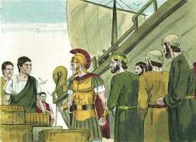
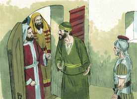
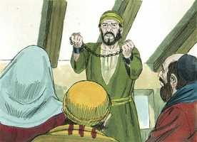
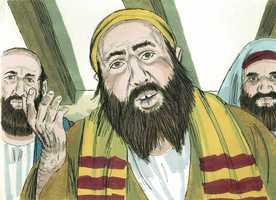
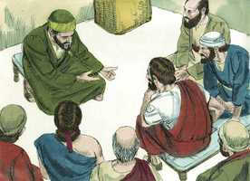

# Atos dos Apóstolos Cap 28

**1** 	E, HAVENDO escapado, então souberam que a ilha se chamava Malta.

**2** 	E os bárbaros usaram conosco de não pouca humanidade; porque, acendendo uma grande fogueira, nos recolheram a todos por causa da chuva que caía, e por causa do frio.

**3** 	E, havendo Paulo ajuntado uma quantidade de vides, e pondo-as no fogo, uma víbora, fugindo do calor, lhe acometeu a mão.

  

**4** 	E os bárbaros, vendo-lhe a víbora pendurada na mão, diziam uns aos outros: Certamente este homem é homicida, visto como, escapando do mar, a justiça não o deixa viver.

**5** 	Mas, sacudindo ele a víbora no fogo, não sofreu nenhum mal.

**6** 	E eles esperavam que viesse a inchar ou a cair morto de repente; mas tendo esperado já muito, e vendo que nenhum incômodo lhe sobrevinha, mudando de parecer, diziam que era um deus.

**7** 	E ali, próximo daquele lugar, havia umas herdades que pertenciam ao principal da ilha, por nome Públio, o qual nos recebeu e hospedou benignamente por três dias.

**8** 	E aconteceu estar de cama enfermo de febre e disenteria o pai de Públio, que Paulo foi ver, e, havendo orado, pôs as mãos sobre ele, e o curou.

 

**9** 	Feito, pois, isto, vieram também ter com ele os demais que na ilha tinham enfermidades, e sararam.

**10** 	Os quais nos distinguiram também com muitas honras; e, havendo de navegar, nos proveram das coisas necessárias.

**11** 	E três meses depois partimos num navio de Alexandria que invernara na ilha, o qual tinha por insígnia Castor e Pólux.

 

**12** 	E, chegando a Siracusa, ficamos ali três dias.

**13** 	De onde, indo costeando, viemos a Régio; e soprando, um dia depois, um vento do sul, chegamos no segundo dia a Potéoli.

**14** 	Onde, achando alguns irmãos, nos rogaram que por sete dias ficássemos com eles; e depois nos dirigimos a Roma.

**15** 	E de lá, ouvindo os irmãos novas de nós, nos saíram ao encontro à Praça de Ápio e às Três Vendas, e Paulo, vendo-os, deu graças a Deus e tomou ânimo.

**16** 	E, logo que chegamos a Roma, o centurião entregou os presos ao capitão da guarda; mas a Paulo se lhe permitiu morar por sua conta à parte, com o soldado que o guardava.

**17** 	E aconteceu que, três dias depois, Paulo convocou os principais dos judeus e, juntos eles, lhes disse: Homens irmãos, não havendo eu feito nada contra o povo, ou contra os ritos paternos, vim contudo preso desde Jerusalém, entregue nas mãos dos romanos;

 

**18** 	Os quais, havendo-me examinado, queriam soltar-me, por não haver em mim crime algum de morte.

 

**19** 	Mas, opondo-se os judeus, foi-me forçoso apelar para César, não tendo, contudo, de que acusar a minha nação.

**20** 	Por esta causa vos chamei, para vos ver e falar; porque pela esperança de Israel estou com esta cadeia.

 

**21** 	Então eles lhe disseram: Nós não recebemos acerca de ti carta alguma da Judéia, nem veio aqui algum dos irmãos, que nos anunciasse ou dissesse de ti mal algum.

 

**22** 	No entanto bem quiséramos ouvir de ti o que sentes; porque, quanto a esta seita, notório nos é que em toda a parte se fala contra ela.

**23** 	E, havendo-lhe eles assinalado um dia, muitos foram ter com ele à pousada, aos quais declarava com bom testemunho o reino de Deus, e procurava persuadi-los à fé em Jesus, tanto pela lei de Moisés como pelos profetas, desde a manhã até à tarde.

 

**24** 	E alguns criam no que se dizia; mas outros não criam.

**25** 	E, como ficaram entre si discordes, despediram-se, dizendo Paulo esta palavra: Bem falou o Espírito Santo a nossos pais pelo profeta Isaías,

**26** 	Dizendo: Vai a este povo, e dize: De ouvido ouvireis, e de maneira nenhuma entendereis; E, vendo vereis, e de maneira nenhuma percebereis.

**27** 	Porquanto o coração deste povo está endurecido, E com os ouvidos ouviram pesadamente, E fecharam os olhos, Para que nunca com os olhos vejam, Nem com os ouvidos ouçam, Nem do coração entendam, E se convertam, E eu os cure.

**28** 	Seja-vos, pois, notório que esta salvação de Deus é enviada aos gentios, e eles a ouvirão.

 

**29** 	E, havendo ele dito estas palavras, partiram os judeus, tendo entre si grande contenda.

**30** 	E Paulo ficou dois anos inteiros na sua própria habitação que alugara, e recebia todos quantos vinham vê-lo;

 

**31** 	Pregando o reino de Deus, e ensinando com toda a liberdade as coisas pertencentes ao Senhor Jesus Cristo, sem impedimento algum.

> **Cmt MHenry** Intro: " Paulo persuadiu os judeus acerca de Jesus. alguns foram trabalhados pela Palavra e outros, enfurecidos; alguns receberam a luz, e outros fecharam seus olhos a ela. Este tem sido sempre o efeito do Evangelho. Paulo se separou deles observando que o Espírito Santo tinha descrito bem o estado deles. Todos os que ouvem o evangelho, sem obedecê-lo, tremem perante sua sina, porque, quem os curará, sem Deus não o fizer?\ Os judeus arrazoaram muito entre eles, depois. Muitos dos que têm um grande razoamento não arrazoam corretamente. Acham defeituosas as opiniões de uns e outros, mas não se rendem à verdade. nem tampouco os convencerá o arrazoamento dos homens, se a graça de Deus não lhes abrir o entendimento. Enquanto nos doemos pelos desdenhosos, devemos regozijar-nos de que a salvação de Deus seja enviada a outros que a receberão; se formos desse grupo, devemos estar agradecidos Àquele que nos fez mudar. O apóstolo se aferrou a seu princípio de não conhecer nem pregar outra coisa senão a Cristo, e este crucificado. Quando os cristãos são tentados por sua ocupação principal, devem reagir com esta pergunta: "Que tem isto a ver com o Senhor Jesus? Que tendência há nisto que nos conduza a Ele e nos mantenha caminhando nEle?". O apóstolo não se pregava a si mesmo, senão a Cristo, e não se envergonhava do Evangelho de Cristo. Ainda que Paulo foi colocado numa condição muito estreita para ser útil, não se sentiu perturbado por isso. embora não era uma porta ampla a que lhe foi aberta, contudo, não tolerou que ninguém a fechasse; e para muitos era uma porta eficaz, de modo que houve santos até na casa de Nero ([Fp 4.22](../50N-Fp/04.md#22)). Também em [Fp 1.13](../50N-Fp/01.md#13) aprendemos como Deus passa por alto a prisão de Paulo para o avanço do evangelho. E não somente os residentes de Roma, senão toda a Igreja de Cristo, até o dia presente, e no canto mais remoto do planeta, têm muita razão para abençoar a Deus porque Paulo fora retido como prisioneiro durante o período mais maduro de sua vida cristã. Foi desde sua prisão, provavelmente acorrentado mão a mão com o soldado que o custodiava, que o apóstolo escrevei as epístolas aos Efésios, Filipenses, Colossenses e Hebreus; estas epístolas mostram, talvez mais que quaisquer outras, o amor cristão com que transbordava seu coração, e a experiência cristã com que estava cheia sua alma. O crente da época atual pode ter menos triunfo e menos gozo celestial que o apóstolo, mas todo seguidor do próprio Salvador está igualmente seguro de estar a salvo e em paz afinal. Procuremos viver mais e mais no amor do Salvador; trabalhar para glorificá-lo com toda a ação de nossa vida; e com toda seguridade por seu poder, estaremos entre os que agora vencem a Estados Unidos inimigos; e por sua graça gratuita e misericórdia, no além estaremos na companhia bendita que se assentara com Ele em seu trono, assim como Ele venceu e está sentado no trono de seu Pai, à destra de Deus, para sempre jamais. "> Foi para honra de Paulo que os que examinaram seu caso o exoneraram. Em sua apelação não procurou acusar a sua nação, senão somente aclarar sua condição.\ O cristianismo verdadeiro estabelece o que é de interesse comum para toda a humanidade, e não se edifica sobre as opiniões estreitas nem sobre os interesses privados. Não aponta a nenhum benefício ou vantagem mundana, e entretanto todos seus lucros são espirituais e eternos. A sorte da santa religião de Cristo é, e sempre foi, que falem em contra dela. Observe-se em toda cidade e povo onde se enalteça a Cristo como o eu Salvador da humanidade, e onde a gente é chamada a segui-lo à vida nova, e perceba-se como ainda são tratados de seita, de partido, e os que se entregam a Cristo são recriminados. E este é o tratamento que receberão com certeza, enquanto exista um homem ímpio sobre a face da terra.> Os acontecimentos comuns das viagens raramente são dignos de serem narrados, porém merece menção particular o consolo da comunhão com os santos, e a bondade mostrada pelos amigos. Os cristãos de Roma estavam tão longe de envergonhar-se de Paulo, ou de ter medo de reconhecê-lo porque ele era um prisioneiro, que tiveram muito mais cuidado em demonstrar-lhe respeito. Teve muito consolo nisso. E, se nossos amigos são bons conosco, Deus o tem colocado em seus corações e devemos dar a Ele a glória. Quando vemos, ainda no estrangeiro, aos que levam o nome de Cristo, temem a Deus e o servem, devemos elevar nossos corações ao céu em ação de graças. Quantos homens grandes têm feito sua entrada em Roma, coroados e levados em triunfo, sendo realmente pragas para o mundo! Mas eis aqui um homem bom que faz sua entrada em Roma acorrentado como pobre cativo, sendo para o mundo uma bênção maior que qualquer outro humano. Não basta isso para deixar de pavonear-nos pelo favor mundano?\ Isto pode animar aos prisioneiros de Deus, porque Ele pode dá-lhes favor ante os olhos dos que os levam presos. Quando Deus não liberta logo seu povo da escravidão, de todos modos a alivia e os acalma enquanto estão submetidos a ela, e têm razão para estarem agradecidos.> Deus pode fazer que os estranhos sejam amigos; amigos na angústia. Os que são desprezados por seus modos acolhedores, costumam ser mais amistosos que os mais educados; e a conduta dos pagãos, ou a das pessoas qualificadas de bárbaros, condena a muitos nas nações civilizadas, que professam ser cristãs.\ A gente pensou que Paulo era um assassino, e que a serpente fora enviada pela justiça divina para que fosse a vingadora do sangue. Sabiam que havia um Deus que governa o mundo, de modo que as coisas não acontecem por acaso, não, nem o sucesso mais mínimo, senão que todo é por direção divina; e que o mal persegue os pecadores; que há boas obras que Deus recompensará, e más obras que castigará. Além disso, que o assassinato é um delito horrível e que não passará muito tempo sem que seja punido. Porém, pensavam que todos os malvados eram castigados nesta vida. Embora alguns são feitos exemplo neste mundo para provar que há um Deus e uma providência, ainda muitos são deixados sem castigar para provar que há um juízo vindouro. Também pensavam que eram maus todos os que eram notavelmente afligidos nesta vida. A revelação divina coloca este assunto sob a luz verdadeira. Os homens bons costumam ser sumamente afligidos nesta vida para a provação e o aumento de sua fé e paciência.\ Atentem à liberação de Paulo diante do perigo. E, assim, no poder da graça de Cristo, os crentes se sacodem as tentações de Satanás com santa resolução. Quando desprezamos as censuras e as repreensões dos homens, e os olhamos com santo desprezo, tendo o testemunho de nossas consciências, então, como Paulo, sacudimos a serpente, lançando-a no fogo. Não nos faz dano exceto se por isso nos mantemos fora de nosso dever. Com isso Deus faz notável a Paulo para essa gente, e, assim, abriu o caminho para a recepção do Evangelho. O Senhor levanta amigos para seu povo em todo lugar aonde os leva, e os faz bênção para os aflitos.