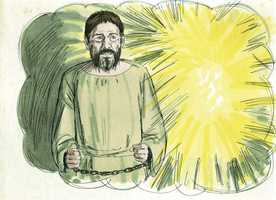

# 2 Timóteo Cap 04

**1** 	CONJURO-TE, pois, diante de Deus, e do Senhor Jesus Cristo, que há de julgar os vivos e os mortos, na sua vinda e no seu reino,

 

**2** 	Que pregues a palavra, instes a tempo e fora de tempo, redarguas, repreendas, exortes, com toda a longanimidade e doutrina.

**3** 	Porque virá tempo em que não suportarão a sã doutrina; mas, tendo comichão nos ouvidos, amontoarão para si doutores conforme as suas próprias concupiscências;

**4** 	E desviarão os ouvidos da verdade, voltando às fábulas.

**5** 	Mas tu, sê sóbrio em tudo, sofre as aflições, faze a obra de um evangelista, cumpre o teu ministério.

**6** 	Porque eu já estou sendo oferecido por aspersão de sacrifício, e o tempo da minha partida está próximo.

**7** 	Combati o bom combate, acabei a carreira, guardei a fé.

 

**8** 	Desde agora, a coroa da justiça me está guardada, a qual o Senhor, justo juiz, me dará naquele dia; e não somente a mim, mas também a todos os que amarem a sua vinda.

**9** 	Procura vir ter comigo depressa,

**10** 	Porque Demas me desamparou, amando o presente século, e foi para Tessalônica, Crescente para Galácia, Tito para Dalmácia.

**11** 	Só Lucas está comigo. Toma Marcos, e traze-o contigo, porque me é muito útil para o ministério.

**12** 	Também enviei Tíquico a Éfeso.

**13** 	Quando vieres, traze a capa que deixei em Trôade, em casa de Carpo, e os livros, principalmente os pergaminhos.

**14** 	Alexandre, o latoeiro, causou-me muitos males; o Senhor lhe pague segundo as suas obras.

**15** 	Tu, guarda-te também dele, porque resistiu muito às nossas palavras.

**16** 	Ninguém me assistiu na minha primeira defesa, antes todos me desampararam. Que isto lhes não seja imputado.

**17** 	Mas o Senhor assistiu-me e fortaleceu-me, para que por mim fosse cumprida a pregação, e todos os gentios a ouvissem; e fiquei livre da boca do leão.

 

**18** 	E o Senhor me livrará de toda a má obra, e guardar-me-á para o seu reino celestial; a quem seja glória para todo o sempre. Amém.

 

**19** 	Saúda a Prisca e a Áqüila, e à casa de Onesíforo.

**20** 	Erasto ficou em Corinto, e deixei Trófimo doente em Mileto.

**21** 	Procura vir antes do inverno. Êubulo, e Prudente, e Lino, e Cláudia, e todos os irmãos te saúdam.

**22** 	O Senhor Jesus Cristo seja com o teu espírito. A graça seja convosco. Amém.

> **Cmt MHenry** Intro: Para sermos felizes não necessitamos mais que termos o Senhor Jesus Cristo com nosso espírito, pois nEle se resumem todas as bênçãos espirituais. A melhor oração que podemos oferecer por nossos amigos é que o Senhor Jesus esteja com seus espíritos, que os santifique e os salve, e que no final os receba junto dEle. Muitos que acreditaram, como Paulo, estão agora diante do trono, dando glória a seu Senhor; sejamos seus seguidores.> Existe tanto perigo de parte dos falsos irmãos como dos inimigos declarados. Perigoso é ter que ver com os inimigos de um homem como Paulo. Os cristãos de toma foram a encontrá-lo ([At 28](../44N-At/28.md#0)), mas todos o abandonaram quando pareceu que havia perigo de sofrer por causa dele; então, Paulo pôde justamente irar-se contra eles, mas ele orou a Deus para que os perdoasse. O apóstolo foi livrado das fauces do leão, isto é, de Nero ou de alguns de seus juízes. Se o Senhor é por nós, nos fortalecerá nas dificuldades e nos perigos, e sua presença suprirá amplamente a ausência de cada um e de todos.> O amor deste mundo costuma ser a causa para apostatar das verdades e caminhos de Jesus Cristo.\ Paulo foi guiado por inspiração divina, mas ele tinha seus livros. Devemos seguir aprendendo enquanto vivamos. Os apóstolos não descuidaram os médios humanos ao procurarem as necessidades da vida ou sua própria instrução. Agradeçamos a bondade divina por ter-nos dado tantos escritos de homens sábios e piedosos de todas as épocas; e procuremos que seja nosso o proveito de sua leitura e isso se faça evidente para todos.> O sangue dos mártires, embora não era um sacrifício expiatório, contudo, foi um sacrifício de reconhecimento da graça de Deus e de sua verdade. a morte para o homem bom é sua liberação da prisão deste mundo, e sua partida a desfrutar do outro mundo. Como cristão e ministro, Paulo tinha guardado a fé, sustentado com firmeza as doutrinas do Evangelho. Que consolo é poder falar deste modo no final de nossos dias! A coroa dos crentes é uma coroa de justiça adquirida pela justiça de Cristo. Os crentes não a têm atualmente, mas é segura pois está colocada para eles. O crente, em meio da pobreza, da dor, a doença e as agonias da morte, pode regozijar-se; porém, se um homem descuida os deveres de seu cargo e lugar, se escurece a prova de seu interesse em Cristo, e pode esperar-se que a incerteza e a angústia escureçam e assediem suas últimas horas.> A gente se afastará da verdade, se cansarão do claro evangelho de Cristo, desejarão as fábulas e se comprazerão nelas. A gente faz isso quando não suporta a pregação penetrante, simples e que vai direto ao ponto. Os que amam as almas devem estar sempre alertas, arriscar, suportar todos os efeitos dolorosos de sua fidelidade, e aproveitar todas as oportunidades para dar a conhecer o puro evangelho.