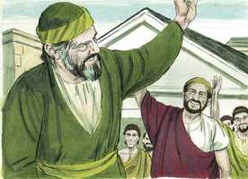

# Tito Cap 01

**1** 	PAULO, servo de Deus, e apóstolo de Jesus Cristo, segundo a fé dos eleitos de Deus, e o conhecimento da verdade, que é segundo a piedade,

**2** 	Em esperança da vida eterna, a qual Deus, que não pode mentir, prometeu antes dos tempos dos séculos;

**3** 	Mas a seu tempo manifestou a sua palavra pela pregação que me foi confiada segundo o mandamento de Deus, nosso Salvador;

**4** 	A Tito, meu verdadeiro filho, segundo a fé comum: Graça, misericórdia, e paz da parte de Deus Pai, e da do Senhor Jesus Cristo, nosso Salvador.

**5** 	Por esta causa te deixei em Creta, para que pusesses em boa ordem as coisas que ainda restam, e de cidade em cidade estabelecesses presbíteros, como já te mandei:

 

**6** 	Aquele que for irrepreensível, marido de uma mulher, que tenha filhos fiéis, que não possam ser acusados de dissolução nem são desobedientes.

**7** 	Porque convém que o bispo seja irrepreensível, como despenseiro da casa de Deus, não soberbo, nem iracundo, nem dado ao vinho, nem espancador, nem cobiçoso de torpe ganância;

**8** 	Mas dado à hospitalidade, amigo do bem, moderado, justo, santo, temperante;

**9** 	Retendo firme a fiel palavra, que é conforme a doutrina, para que seja poderoso, tanto para admoestar com a sã doutrina, como para convencer os contradizentes.

**10** 	Porque há muitos desordenados, faladores, vãos e enganadores, principalmente os da circuncisão,

**11** 	Aos quais convém tapar a boca; homens que transtornam casas inteiras ensinando o que não convém, por torpe ganância.

**12** 	Um deles, seu próprio profeta, disse: Os cretenses são sempre mentirosos, bestas ruins, ventres preguiçosos.

**13** 	Este testemunho é verdadeiro. Portanto, repreende-os severamente, para que sejam sãos na fé.

**14** 	Não dando ouvidos às fábulas judaicas, nem aos mandamentos de homens que se desviam da verdade.

**15** 	Todas as coisas são puras para os puros, mas nada é puro para os contaminados e infiéis; antes o seu entendimento e consciência estão contaminados.

**16** 	Confessam que conhecem a Deus, mas negam-no com as obras, sendo abomináveis, e desobedientes, e reprovados para toda a boa obra.

> **Cmt MHenry** Intro: Descrevem-se os falsos mestres. Os ministros fiéis devem opor-se a eles no momento oportuno para que a loucura deles seja manifesta, para que não sigam adiante. Tinham uma baixa finalidade no que faziam; servindo um interesse mundano sob pretexto da religião: porque o amor pelo dinheiro é a raiz de todo mal. Os tais devem ser resistidos e envergonhados, pela sã doutrina das Escrituras. As ações vergonhosas, a repreensão dos pagãos, devem estar longe dos cristãos; a falsidade e a mentira, a astúcia invejosa e a crueldade, os costumes brutais e sensuais, a ociosidade e a preguiça, são pecados condenados até pela luz da natureza. Mas a mansidão cristã dista tanto do dissimulo cobarde do pecado e do erro como da ira e da impaciência. Embora haja diferenças nacionais de caráter, contudo, o coração do homem de toda época e lugar é enganoso e perverso. Porém, as repreensões mais agudas devem apontar para o bem do repreendido; a fé sadia é muito desejável e necessária. Nada é puro para os que são corrompidos e incrédulos; eles abusam e fazem pecado das coisas boas e lícitas. Muitos professam conhecer a Deus, mas em suas vidas o negam e rejeitam. Note-se o miserável estado dos hipócritas, como os que têm uma forma de piedade, mas estão sem seu poder; de todos modos, não estejamos tão dispostos a acusar disto os outros, como cuidadosos de que não se aplique a nós.> O caráter e as qualidades dos pastores, aqui chamados anciãos e bispos, concordam com o que o apóstolo escreveu a Timóteo. Já que os bispos e inspetores do rebanho devem ser exemplo para eles, e os mordomos de Deus para cuidarem dos assuntos de sua casa, há muita razão para que sejam irrepreensíveis. Indica-se claramente o que não devem ser e o que devem ser como servos de Cristo e ministros eficientes da letra e a prática do evangelho. Aqui se descreve o espírito e o costume que corresponde aos tais, que devem ser exemplo de boas obras.> São servos de Deus todos os que não são servos do pecado e de Satanás. Toda a verdade do evangelho é conforme à piedade, e ensina o temor de Deus. A intenção do evangelho é produzir esperança e fé; tirar a mente e o coração do mundo e elevá-los ao céu e às coisas do alto. Quão excelente é, então, o evangelho que desde os primeiros tempos foi o tema da promessa divina e quanta gratidão lhe devemos por nossos privilégios! A fé vem pelo ouvir, e o ouvir pela palavra de Deus; e quem for assim chamado, deve pregar a palavra.\ A graça é o favor gratuito de Deus e a aceitação dEle; e a misericórdia, os frutos desse favor, são o perdão dos pecados, e a liberdade de todas as misérias, tanto aqui como no além. A paz é o efeito e fruto da misericórdia: a paz de Deus por meio de Cristo que é nossa Paz, e paz com as criaturas e com nós mesmos. A graça é a fonte de todas as bênçãos. A misericórdia, a paz, e todo o bom surgem dela.