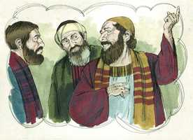

# Tiago Cap 01

**1** 	TIAGO, servo de Deus, e do Senhor Jesus Cristo, às doze tribos que andam dispersas, saúde.

 

**2** 	Meus irmãos, tende grande gozo quando cairdes em várias tentações;

 

**3** 	Sabendo que a prova da vossa fé opera a paciência.

**4** 	Tenha, porém, a paciência a sua obra perfeita, para que sejais perfeitos e completos, sem faltar em coisa alguma.

**5** 	E, se algum de vós tem falta de sabedoria, peça-a a Deus, que a todos dá liberalmente, e o não lança em rosto, e ser-lhe-á dada.

**6** 	Peça-a, porém, com fé, em nada duvidando; porque o que duvida é semelhante à onda do mar, que é levada pelo vento, e lançada de uma para outra parte.

**7** 	Não pense tal homem que receberá do Senhor alguma coisa.

**8** 	O homem de coração dobre é inconstante em todos os seus caminhos.

**9** 	Mas glorie-se o irmão abatido na sua exaltação,

**10** 	E o rico em seu abatimento; porque ele passará como a flor da erva.

**11** 	Porque sai o sol com ardor, e a erva seca, e a sua flor cai, e a formosa aparência do seu aspecto perece; assim se murchará também o rico em seus caminhos.

**12** 	Bem-aventurado o homem que suporta a tentação; porque, quando for provado, receberá a coroa da vida, a qual o Senhor tem prometido aos que o amam.

**13** 	Ninguém, sendo tentado, diga: De Deus sou tentado; porque Deus não pode ser tentado pelo mal, e a ninguém tenta.

**14** 	Mas cada um é tentado, quando atraído e engodado pela sua própria concupiscência.

**15** 	Depois, havendo a concupiscência concebido, dá à luz o pecado; e o pecado, sendo consumado, gera a morte.

**16** 	Não erreis, meus amados irmãos.

**17** 	Toda a boa dádiva e todo o dom perfeito vem do alto, descendo do Pai das luzes, em quem não há mudança nem sombra de variação.

**18** 	Segundo a sua vontade, ele nos gerou pela palavra da verdade, para que fôssemos como primícias das suas criaturas.

**19** 	Portanto, meus amados irmãos, todo o homem seja pronto para ouvir, tardio para falar, tardio para se irar.

**20** 	Porque a ira do homem não opera a justiça de Deus.

**21** 	Por isso, rejeitando toda a imundícia e superfluidade de malícia, recebei com mansidão a palavra em vós enxertada, a qual pode salvar as vossas almas.

**22** 	E sede cumpridores da palavra, e não somente ouvintes, enganando-vos a vós mesmos.

**23** 	Porque, se alguém é ouvinte da palavra, e não cumpridor, é semelhante ao homem que contempla ao espelho o seu rosto natural;

**24** 	Porque se contempla a si mesmo, e vai-se, e logo se esquece de como era.

**25** 	Aquele, porém, que atenta bem para a lei perfeita da liberdade, e nisso persevera, não sendo ouvinte esquecidiço, mas fazedor da obra, este tal será bem-aventurado no seu feito.

**26** 	Se alguém entre vós cuida ser religioso, e não refreia a sua língua, antes engana o seu coração, a religião desse é vã.

**27** 	A religião pura e imaculada para com Deus e Pai, é esta: Visitar os órfãos e as viúvas nas suas tribulações, e guardar-se da corrupção do mundo.

> **Cmt MHenry** Intro: Quando os homens se esforçam por parecer mais religiosos do que realmente são, é um sinal de que sua religião é vã. Não refrear a língua, a prontidão para falar das faltas do próximo, ou para diminuir sua sabedoria e piedade, são sinais de religião vã. O homem que tem uma língua caluniadora não pode ter um coração verdadeiramente humilde e bondoso.\ As religiões falsas podem conhecer-se por suas impurezas e falta de caridade. A religião verdadeira nos ensina a realizar cada coisa como estando na presença de Deus. uma vida imaculada deve ir unida ao amor e a caridade não fingidas. Nossa religião verdadeira é igual a medida em que estas coisas ganhem lugar em nosso coração e conduta. Lembremo-nos que nada presta em Cristo Jesus salvo a fé que opera pelo amor, que purifica o coração, que submete as luxúrias carnais e que obedece aos mandamentos de Deus.> Se ouvíssemos um sermão a cada dia da semana e um anjo do céu for o pregador, não nos conduziria nunca para o céu se nos apoiarmos somente no ouvir. Os que são somente ouvidores enganam-se a si mesmos; e o engano de si mesmo será achado, afinal, como o pior engano. Se nos elogiarmos a nós mesmos é nossa própria falta. A verdade não lisonjeia a ninguém, tal como está em Jesus. a palavra da verdade deve ser cuidadosamente ouvida, com atenção, e exporá diante de nós a corrupção de nossa natureza, os desordens de nossos corações e de nossa vida; nos dirá claramente o que somos. Nossos pecados são as manchas que a lei deixa ao descoberto; o sangue de Cristo é o lavamento que ensina o evangelho, mas ouvimos em vão a Palavra de Deus e em vão olhamos para o espelho do Evangelho se vamos embora e esquecemos nossas manchas em lugar de tirá-las lavando-as, e esquecemos nosso remédio em vez de recorrer a ele. isso acontece com os que não escutam a palavra como deveriam. Ao ouvir a palavra, olhamos dentro dela em procura de conselho e guia, e quando a estudamos, torna-se nossa vida espiritual. Os que se mantêm na lei e na palavra de Deus são e serão abençoados em todos seus caminhos. Sua recompensa de graça no além estará relacionada com sua paz e consolo presentes.\ Cada parte da revelação divina tem seu uso, levando o pecador a Cristo para salvação, e guindo-o e exortando-o a andar em liberdade pelo Espírito de adoção, conforme aos santos mandamentos de Deus. Note-se a distinção: o homem não é abençoado *por* suas obras, senão *em* sua obra. Não é falar senão andar o que nos levará ao céu. Cristo se tornará mais precioso para a alma do crente que, por Sua graça, se tornará mais idônea para a herança dos santos em luz.> Em lugar de inculpar a Deus quando sejamos submetidos a provações, abramos nossos ouvidos e corações para aprender o que nos ensina através delas. Se os homens desejam governar suas línguas, devem governar suas paixões. O pior que podemos aportar a qualquer disputa é a ira.\ Eis aqui uma exortação a separar e lançar fora como roupa suja todas as práticas pecaminosas. Isto deve alcançar os pecados do pensamento e do afeto, e os pecados do falar e do fazer; a toda coisa corrupta e pecaminosa. Devemos render-nos à palavra de Deus com mentes humildes e dóceis ao ensino. Devemos estar dispostos a ouvir de nossos defeitos, e a tomá-los não só com paciência, senão com gratidão. O objetivo da Palavra de Deus é fazer-nos sábios para salvação e os que se propõem qualquer finalidade malvada ou baixa ao prestar-lhe atenção desonram o Evangelho e desiludem suas próprias almas.> Não todo homem que sofre é o abençoado; porém, sim o que com Paixão e constância vai pelo caminho do dever, através de todas as dificuldades. As aflições não nos podem tornar miseráveis se não são por nossa própria falta. O cristão provado será um cristão coroado. A coroa da vida se promete a todos os que têm o amor de Deus reinando em seus corações. Toda alma que ama verdadeiramente a Deus terá suas provas deste mundo plenamente recompensadas nesse mundo do alto, onde o amor é aperfeiçoado.\ Os mandamentos de Deus e os tratos de sua providência provam os corações dos homens, e mostram a disposição que prevalece neles. Mas nada pecaminoso do coração e da conduta pode ser atribuído a Deus. Ele não é o autor da escoria, embora sua prova de fogo a deixa ao descoberto. Os que culpam do pecado a sua constituição ou a sua situação no mundo, ou pretendem que não podem evitá-lo, deixam mal a Deus como se Ele fosse o autor do pecado. as aflições, como enviados de Deus, estão concebidas para fazer reluzir nossas virtudes, e não nossas corrupções. A origem do mal e das tentações está em nossos próprios corações.\ Detenha os começos do pecado, ou todos os males que se segam serão totalmente carregados em sua conta. Deus não se compraz na morte dos homens, como que não tem parte no pecado deles, porém o pecado e a miséria devem-se a eles mesmos. Assim como o sol que influi na natureza é sempre o mesmo, apesar de que repetidas vezes se interpõem a terra e as nuvens, fazendo o que a nós parece variável, assim Deus é imutável e nossas mudanças e sombras não são mudanças nem alterações nEle. O que o sol é na natureza, Deus o é na graça, providência e glória, e infinitamente a mais. Como toda boa dádiva é de Deus, assim, em particular, é o fato de termos nascido de novo, e todas suas conseqüências santas e felizes provêm dEle. Um cristão verdadeiro chega a ser uma pessoa tão diferente da que era antes das influências renovadoras da graça divina, que é como se fosse formado de novo. devemos dedicar todas as nossas faculdades ao serviço de Deus, para que possamos ser uma espécie de primícias de suas criaturas.> " O cristianismo ensina aos homens a estar gozosos nas tribulações; tais exercícios vêm do amor de Deus; e as provações do caminho do dever darão brilho a nossas virtudes agora e a nossa coroa no final. Nos tempos de provações, preocupemo-nos de que a paciência atue em nós, e não a paixão; o que se diga ou faça, seja a paciência a que o diga e faça. Todo o necessário para a nossa carreira e guerra cristã será outorgado quando a obra da paciência for completada. Não devemos orar pedindo que a aflição seja eliminada, tanto como pedindo sabedoria para usá-la corretamente. E quem não quer sabedoria para que o conduza nas provas, regulando seu próprio espírito e administrando seus assuntos? Eis aqui algo como resposta a cada giro desalentador da mente, quando vamos a Deus experimentando nossa própria fraqueza e tolice. Depois de tudo, se alguém dizer "Isto pode acontecer a alguém, mas me temo que eu não triunfarei", a promessa é: a *todo aquele* que pedir, lhe será dado. Uma mente que se ocupe em considerar, de forma única e dominante, seu interesse espiritual eterno, e que se mantém firme em seus propósitos para Deus, crescerá sabiamente pelas aflições, continuará fervoroso em suas devoções e se levantará por acima das provas e das oposições. Quando nossa fé e espírito se levantam e caem com as causas secundárias, nossas palavras e ações serão instáveis. Isto nem sempre expõe aos homens ao desprezo do mundo, mas esses caminhos não podem agradar a Deus. Nenhuma situação da vida é tal que impeça regozijar-se em Deus. Os de baixa condição podem regozijar-se se são exaltados a serem ricos em fé e herdeiros do Reino de Deus; e os ricos podem regozijar-se com as providências humilhantes que os levam a uma disposição mental humilde e modesta.\ A riqueza mundana é coisa que se acaba. Então, que quem é rico se regozije na graça de Deus que o faz e mantém humilde; e nossa provas e exercícios que lhe ensinam a buscar a alegria de Deus e nEle, e não nos prazeres perecíveis. "