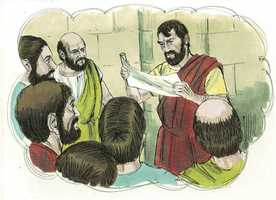

# 1 João Cap 04

**1** 	AMADOS, não creiais a todo o espírito, mas provai se os espíritos são de Deus, porque já muitos falsos profetas se têm levantado no mundo.

**2** 	Nisto conhecereis o Espírito de Deus: Todo o espírito que confessa que Jesus Cristo veio em carne é de Deus;

**3** 	E todo o espírito que não confessa que Jesus Cristo veio em carne não é de Deus; mas este é o espírito do anticristo, do qual já ouvistes que há de vir, e eis que já agora está no mundo.

**4** 	Filhinhos, sois de Deus, e já os tendes vencido; porque maior é o que está em vós do que o que está no mundo.

**5** 	Do mundo são, por isso falam do mundo, e o mundo os ouve.

**6** 	Nós somos de Deus; aquele que conhece a Deus ouve-nos; aquele que não é de Deus não nos ouve. Nisto conhecemos nós o espírito da verdade e o espírito do erro.

**7** 	Amados, amemo-nos uns aos outros; porque o amor é de Deus; e qualquer que ama é nascido de Deus e conhece a Deus.

 

**8** 	Aquele que não ama não conhece a Deus; porque Deus é amor.

**9** 	Nisto se manifestou o amor de Deus para conosco: que Deus enviou seu Filho unigênito ao mundo, para que por ele vivamos.

**10** 	Nisto está o amor, não em que nós tenhamos amado a Deus, mas em que ele nos amou a nós, e enviou seu Filho para propiciação pelos nossos pecados.

**11** 	Amados, se Deus assim nos amou, também nós devemos amar uns aos outros.

**12** 	Ninguém jamais viu a Deus; se nos amamos uns aos outros, Deus está em nós, e em nós é perfeito o seu amor.

**13** 	Nisto conhecemos que estamos nele, e ele em nós, pois que nos deu do seu Espírito.

**14** 	E vimos, e testificamos que o Pai enviou seu Filho para Salvador do mundo.

**15** 	Qualquer que confessar que Jesus é o Filho de Deus, Deus está nele, e ele em Deus.

**16** 	E nós conhecemos, e cremos no amor que Deus nos tem. Deus é amor; e quem está em amor está em Deus, e Deus nele.

**17** 	Nisto é perfeito o amor para conosco, para que no dia do juízo tenhamos confiança; porque, qual ele é, somos nós também neste mundo.

**18** 	No amor não há temor, antes o perfeito amor lança fora o temor; porque o temor tem consigo a pena, e o que teme não é perfeito em amor.

**19** 	Nós o amamos porque ele nos amou primeiro.

**20** 	Se alguém diz: Eu amo a Deus, e odeia a seu irmão, é mentiroso. Pois quem não ama a seu irmão, ao qual viu, como pode amar a Deus, a quem não viu?

**21** 	E dele temos este mandamento: que quem ama a Deus, ame também a seu irmão.

> **Cmt MHenry** Intro: O Pai enviou ao Filho, Ele desejou Sua vinda a este mundo. O apóstolo testemunha isto. E qualquer que confessar que Jesus é o Filho de Deus, nesse habita Deus e ele em Deus. esta confissão abrange a fé no coração como fundamento; reconhece com a boca a glória de Deus e Cristo, e confessa na vida e conduta contra as bajulações e caras fechadas do mundo. Deve haver um dia de juízo universal. Ditosos aqueles que terão ousadia santa ante o Juiz naquele dia, sabendo que Ele é seu Amigo e Advogado! Ditosos aqueles que terão ousadia santa na perspectiva daquele dia, que olham e esperam por isso e pela manifestação do Juiz. O verdadeiro amor de Deus assegura aos crentes do amor de Deus por eles. O amor nos ensina a sofrer por Ele e com Ele; portanto, podemos confiar que também seremos glorificados com Ele ([2 Tm 2.12](../55N-2Tm/02.md#12)). Devemos distinguir entre o temor de Deus e ter-lhe medo; o temor de Deus compreende alta consideração e veneração por Deus. a obediência e as boas obras feitas a partir do princípio do amor não são como o esforço servil de um que trabalha sem vontade por medo à ira do amo. São como as de um filho obediente que serve a um pai amado, que beneficia seus irmãos e as realiza voluntariamente. Sinal de que nosso amor dista muito de ser perfeito se são muitas as nossas dúvidas, temores e apreensões de Deus. Que o céu e a terra se surpreendam por Seu amor. Ele enviou Sua Palavra a convidar os pecadores a participarem desta grande salvação. Que eles tenham o consolo da mudança feliz operada neles enquanto lhe dão a Ele a glória.\ O amor de Deus em Cristo, nos corações dos cristãos pelo Espírito de adoção, é a grande prova de sua conversão. Esta deve ser provada por seus efeitos em seus temperamentos, e em suas condutas para com seus irmãos. Se um homem diz amar a Deus e, contudo, se permite ira ou vingança, ou mostra uma disposição egoísta, desmente sua confissão. Mas se for evidente que nossa inimizade natural é mudada em afeto e gratidão, abençoemos o nome de nosso Deus por este selo e primícia de gozo eterno. Então nos diferenciamos dos falsos professos que pretendem amar a Deus, a quem não viram, mas odeiam a seus irmãos, aos que viram.> O Espírito de Deus é o Espírito de amor. O que não ama a imagem de Deus em Seu povo, não tem conhecimento salvador de Deus. Pois ser bom e dar felicidade é a natureza de Deus. a lei de Deus é amor; e todos serão perfeitamente felizes se todos a obedecerem. A provisão do evangelho para o perdão do pecado e a salvação dos pecadores, consistente com a glória e a justiça de Deus, demonstra que Deus é amor. O mistério e as trevas ainda pendem sobre muitas coisas. Deus tem-se mostrado sendo amor para que não possamos deixar de alcançar a felicidade eterna, a menos que seja pela incredulidade e a impenitência, embora a justiça estrita nos condenará à miséria sem esperança por romper as leis de nosso Criador.\ Nenhuma palavra nem pensamento acerca de nós pode fazer justiça ao amor gratuito e assombroso do Santo Deus para com os pecadores, que não poderiam beneficiar-se dEle nem estragá-lo, aos que Ele poderia esmagar com justiça num instante, e aos que, sendo merecedores de Sua vingança, Ele mostra o método pelo qual foram salvos apesar de que Ele poderia ter criado, por Sua Palavra todo-poderosa, outros mundos com seres mais perfeitos se assim o tiver considerado com certo. Pesquisamos todo o universo procurando o amor em suas demonstrações mais gloriosas? Encontra-se na pessoa e na cruz de Cristo. Existe o amor entre Deus e os pecadores? Aqui estava a origem, não que nós amassemos a Deus, senão que Ele nos amou livremente. Seu amor não podia estar concebido para ser infrutífero em nós, e quando seu fim e tema apropriados se ganhem e produzam, pode dizer-se que está aperfeiçoado. Assim é aperfeiçoada a fé por suas obras. Assim se manifestará que Deus habita em nós por Seu Espírito que cria de novo.\ O cristão que ama é o cristão perfeito; coloque-o em qualquer dever bom e é perfeito para isso, é experto para isso. O amor aceita as rodas de seus afetos e o coloca nisso que é útil para seus irmãos. O homem que se ocupa de algo com má vontade, sempre o faz mal. Que Deus more em nós e nós nEle, eram palavras demasiado elevadas para que as usassem os mortais se Deus não as tiver colocado diante de nós. No entanto, como pode saber-se se o testemunho disto procede do Espírito Santo? Aqueles que estão verdadeiramente persuadidos de serem os filhos de Deus não podem senão chamá-lo Abba, Pai. Por amor a Ele, odeiam o pecado e todo o que não concorde com Sua vontade, e têm o são desejo, de todo coração, de realizar Sua vontade. Tal testemunho é o testemunho do Espírito Santo.> Os cristãos que estão bem familiarizados com as Escrituras podem discernir, em humilde dependência do ensino divino, aos que estabelecem doutrinas conforme com os apóstolos e aqueles que os contradizem. A suma da religião revelada está na doutrina referida a Cristo, Sua pessoa e ofício. Os falsos mestres falam ao mundo conforme com suas máximas e gostos, como para não ofender aos homens carnais. O mundo os aprova, progridem rapidamente e têm muitos seguidores como eles; o mundo amará aos seus e os seus o amarão.\ A doutrina verdadeira da pessoa do Salvador, que tira os homens deste mundo para Deus, é sinal do espírito de verdade que se opõe ao espírito do erro. Quanto mais pura e santa for uma doutrina, mais provável que seja de Deus; tampouco podemos provar os espíritos por nenhuma outra regra, para saber se são ou não de Deus. E, que maravilha é que a gente de espírito mundano se aferre a estes que são como eles, e que adequam suas estratagemas e discursos a seu gosto corrupto?