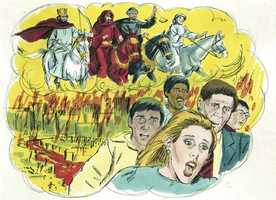

# Apocalipse Cap 06

**1** 	E, HAVENDO o Cordeiro aberto um dos selos, olhei, e ouvi um dos quatro animais, que dizia como em voz de trovão: Vem, e vê.

**2** 	E olhei, e eis um cavalo branco; e o que estava assentado sobre ele tinha um arco; e foi-lhe dada uma coroa, e saiu vitorioso, e para vencer.

 

**3** 	E, havendo aberto o segundo selo, ouvi o segundo animal, dizendo: Vem, e vê.

**4** 	E saiu outro cavalo, vermelho; e ao que estava assentado sobre ele foi dado que tirasse a paz da terra, e que se matassem uns aos outros; e foi-lhe dada uma grande espada.

**5** 	E, havendo aberto o terceiro selo, ouvi dizer o terceiro animal: Vem, e vê. E olhei, e eis um cavalo preto e o que sobre ele estava assentado tinha uma balança em sua mão.

**6** 	E ouvi uma voz no meio dos quatro animais, que dizia: Uma medida de trigo por um dinheiro, e três medidas de cevada por um dinheiro; e não danifiques o azeite e o vinho.

**7** 	E, havendo aberto o quarto selo, ouvi a voz do quarto animal, que dizia: Vem, e vê.

**8** 	E olhei, e eis um cavalo amarelo, e o que estava assentado sobre ele tinha por nome Morte; e o inferno o seguia; e foi-lhes dado poder para matar a quarta parte da terra, com espada, e com fome, e com peste, e com as feras da terra.

**9** 	E, havendo aberto o quinto selo, vi debaixo do altar as almas dos que foram mortos por amor da palavra de Deus e por amor do testemunho que deram.

**10** 	E clamavam com grande voz, dizendo: Até quando, ó verdadeiro e santo Dominador, não julgas e vingas o nosso sangue dos que habitam sobre a terra?

**11** 	E foram dadas a cada um compridas vestes brancas e foi-lhes dito que repousassem ainda um pouco de tempo, até que também se completasse o número de seus conservos e seus irmãos, que haviam de ser mortos como eles foram.

**12** 	E, havendo aberto o sexto selo, olhei, e eis que houve um grande tremor de terra; e o sol tornou-se negro como saco de cilício, e a lua tornou-se como sangue;

**13** 	E as estrelas do céu caíram sobre a terra, como quando a figueira lança de si os seus figos verdes, abalada por um vento forte.

**14** 	E o céu retirou-se como um livro que se enrola; e todos os montes e ilhas foram removidos dos seus lugares.

**15** 	E os reis da terra, e os grandes, e os ricos, e os tribunos, e os poderosos, e todo o servo, e todo o livre, se esconderam nas cavernas e nas rochas das montanhas;

**16** 	E diziam aos montes e aos rochedos: Caí sobre nós, e escondei-nos do rosto daquele que está assentado sobre o trono, e da ira do Cordeiro;

**17** 	Porque é vindo o grande dia da sua ira; e quem poderá subsistir?

> **Cmt MHenry** Intro: Quando se abriu o sexto selo houve um grande terremoto. Os fundamentos das igrejas e dos estados serão removidos em forma terrível. Tais descrições figuradas tão ousadas das grandes mudanças abundam nas profecias da Escritura, porque estes acontecimentos são emblemas e declaram o fim do mundo e o dia do juízo. O espanto e o terror colherão toda classe de homens. nem as grandes riquezas, o valor nem a força podem sustentar aos homens naquele momento. Eles estarão felizes de não serem mais vistos; sim, de não ter mais existência. Embora Cristo seja um Cordeiro, pode irar-se e a ira do Cordeiro é excessivamente espantosa; porque se o nosso inimigo é o próprio Redentor, que acalma a ira de Deus, onde acharemos um amigo que alegue por nós? Como os homens têm seus momentos de oportunidade e suas temporadas de graça, assim Deus tem seu dia de justa ira. Parece que aqui se representa o derrubamento do paganismo do império romano. Descrevem-se os idólatras ocultando-se em suas covas e cavernas secretas, buscando em vão escapar da destruição. Em tal dia, quando os sinais dos tempos se mostrem, aos que acreditam na Palavra de Deus, que o Rei dos reis se aproxima, os cristãos estão chamados a um rumo decidido e a confessar denodadamente a Cristo e sua verdade ante seus congêneres. Seja o que for que devam suportar, o desprezo do homem, de curta duração, deve suportar-se mais que a vingança que é eterna.> A visão do apóstolo ao abri-se o quinto selo foi muito impressionante. Viu as almas dos mártires embaixo do altar; ao pé do altar do céu, aos pés de Cristo. Os perseguidores só podem matar o corpo; depois disso, não há mais que possam fazer; a alma vive. Deus tem provido um bom lugar no mundo, melhor, para os que são fiéis até a morte. Não é sua própria morte, senão o sacrifício de Cristo o que lhes dá a entrada no céu. A causa pela que sofreram foi a palavra de Deus, e a confissão dessa fé que não é removida. Eles encomendam sua causa Àquele a quem pertence a vingança. O Senhor é o consolador de Seus servos entristecidos e precioso é o sangue deles ante seus olhos. Como a medida do pecado de seus perseguidores está enchendo-se, assim também o número dos servos perseguidos e martirizados de Cristo. quando esta medida ficar cheia, Deus enviará tribulação aos que os perturbam, e felicidade e repouso sem interrupção aos que são perturbados.> " Cristo, o Cordeiro, abre o primeiro selo. Note-se que sai um cavalheiro num cavalo branco. Ao sair este cavalo branco, parece que a intenção é um tempo de paz, ou o progresso precoce da religião cristã; sua saída com pureza no tempo em que seu Fundador celestial mandou seus apóstolos a ensinarem a todas as necessárias, agregando: "Eis aqui! Eu estou sempre convosco até o fim do mundo". A religião divina sai coroada, tendo o favor divino sobre ela, armada espiritualmente contra seus inimigos, e destinada a ser vitoriosa afinal.\ Ao abrir o segundo selo, aparece um cavalo vermelho que significa juízos que fazem estragos. A espada da guerra e a perseguição é um temível juízo; tira a paz da terra, uma das maiores bênçãos; e os homens que deveriam amar-se uns aos outros, e ajudar-se os uns aos outros, dedicam-se a matar-se os uns aos outros. tais cenas também seguiram à pura era do cristianismo primitivo, quando, deixando de lado a caridade e o vínculo da paz, os líderes cristãos se dividiram entre si, apelaram à espada e se enredaram na culpa. Ao abrir o terceiro selo, apareceu um cavalo preto: cor que denota luto e ais, trevas e ignorância. Quem o montava tinha um jugo (balança na versão 1960 da Bíblia) em sua mão. Foram feitas tentativas de colocar um jugo nas observâncias supersticiosas aos discípulos. ao ir fluindo a torrente do cristianismo e afastando-se de sua pura fonte, foi-se corrompendo mais e mais. Durante o avanço deste cavalo preto, as necessidades da vida estariam a preços exagerados e as coisas mais caras não deveriam ser danificadas. Conforme com a linguagem profética, estes artigos significavam o alimento do saber religioso, pelo qual se sustentam as almas dos homens para a vida eterna; tais como os que somos convidados a comprar ([Is 55.1](../23A-Is/55.md#1)). Todavia, quando se espalham sobre o mundo cristão as nuvens pretas da ignorância e da superstição, denotadas pelo cavalo preto, o conhecimento e a prática da religião verdadeira torna-se escasso. Quando a gente odeia seu alimento espiritual, Deus pode privá-los, com justiça, de seu pão diário. A fome de pão é um juízo terrível, mas a fome da Palavra o é mais ainda. Ao abrir o quarto selo, saiu um outro cavalo, de cor amarela pálida. O cavalheiro era a morte, o rei dos terrores. Os assistentes ou seguidores deste rei dos terrores, o inferno, o estado da miséria eterna para todos os que morrem em seus pecados; nas épocas da destruição geral, são multidões as que vão para a fossa sem estarem preparados. O período do quarto selo é um de grande carnificina e devastação, que destrói o que poda trazer felicidade à vida, assolando as vidas espirituais dos homens. Assim, pois, o mistério de iniqüidade foi completado, e seu poder, estendido sobre as vidas e as consciências dos homens. não se pode discernir as datas exatas destes quatro selos, porque as mudanças foram graduais.\ Deus lhes deu poder, isto é, os fez instrumentos de sua ira ou de juízos: todas as calamidades públicas estão sob seu comando; somente avançam quando Deus as manda e não vão além do que Ele permite. "