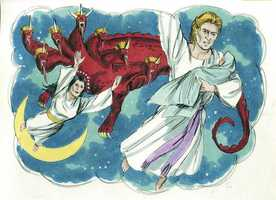
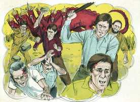

# Apocalipse Cap 12

**1** 	E VIU-SE um grande sinal no céu: uma mulher vestida do sol, tendo a lua debaixo dos seus pés, e uma coroa de doze estrelas sobre a sua cabeça.

**2** 	E estava grávida, e com dores de parto, e gritava com ânsias de dar à luz.

**3** 	E viu-se outro sinal no céu; e eis que era um grande dragão vermelho, que tinha sete cabeças e dez chifres, e sobre as suas cabeças sete diademas.

**4** 	E a sua cauda levou após si a terça parte das estrelas do céu, e lançou-as sobre a terra; e o dragão parou diante da mulher que havia de dar à luz, para que, dando ela à luz, lhe tragasse o filho.

**5** 	E deu à luz um filho homem que há de reger todas as nações com vara de ferro; e o seu filho foi arrebatado para Deus e para o seu trono.

 

**6** 	E a mulher fugiu para o deserto, onde já tinha lugar preparado por Deus, para que ali fosse alimentada durante mil duzentos e sessenta dias.

**7** 	E houve batalha no céu; Miguel e os seus anjos batalhavam contra o dragão, e batalhavam o dragão e os seus anjos;

**8** 	Mas não prevaleceram, nem mais o seu lugar se achou nos céus.

**9** 	E foi precipitado o grande dragão, a antiga serpente, chamada o Diabo, e Satanás, que engana todo o mundo; ele foi precipitado na terra, e os seus anjos foram lançados com ele.

**10** 	E ouvi uma grande voz no céu, que dizia: Agora é chegada a salvação, e a força, e o reino do nosso Deus, e o poder do seu Cristo; porque já o acusador de nossos irmãos é derrubado, o qual diante do nosso Deus os acusava de dia e de noite.

**11** 	E eles o venceram pelo sangue do Cordeiro e pela palavra do seu testemunho; e não amaram as suas vidas até à morte.

**12** 	Por isso alegrai-vos, ó céus, e vós que neles habitais. Ai dos que habitam na terra e no mar; porque o diabo desceu a vós, e tem grande ira, sabendo que já tem pouco tempo.

 

**13** 	E, quando o dragão viu que fora lançado na terra, perseguiu a mulher que dera à luz o filho homem.

**14** 	E foram dadas à mulher duas asas de grande águia, para que voasse para o deserto, ao seu lugar, onde é sustentada por um tempo, e tempos, e metade de um tempo, fora da vista da serpente.

**15** 	E a serpente lançou da sua boca, atrás da mulher, água como um rio, para que pela corrente a fizesse arrebatar.

**16** 	E a terra ajudou a mulher; e a terra abriu a sua boca, e tragou o rio que o dragão lançara da sua boca.

**17** 	E o dragão irou-se contra a mulher, e foi fazer guerra ao remanescente da sua semente, os que guardam os mandamentos de Deus, e têm o testemunho de Jesus Cristo.

> **Cmt MHenry** Intro: A igreja e todos seus amigos bem podem ser convocados para louvar a Deus por libertar da perseguição pagã, embora outras angústias lhes esperem. O deserto é um lugar desolado e cheio de serpentes e escorpiões, incômodo e sem provisões, mas é um lugar seguro onde alguém pode estar sozinho.\ Contudo, estar assim retirada, no é algo que protegesse a mulher. Muitos explicam a torrente de água como invasões dos bárbaros pelos quais foi derrotado o império ocidental, porque os pagãos animaram seus ataques, esperando destruir o cristianismo. Mas os homens ímpios protegeram a igreja em meio destes tumultos, devido a seus interesses mundanos, e a derrota do império não ajudou à causa da idolatria. Ou então, isto pode significar uma torrente de erro pela qual a Igreja de Deus esteve em perigo de ser derrubada e descaminhada. O sem embargo, derrotado em suas intenções contra a igreja, volta a sua fúria contra as pessoas e lugares. Ser fiel a Deus e a Cristo, a sua doutrina, adoração e prática, expõe à ira de Satanás e assim será até que o último inimigo seja destruído.> Os intentos do dragão resultaram infrutíferos contra a igreja, e fatais para seus próprios interesses. A sede desta guerra era o céu; na igreja de Cristo, o reino do céu na terra. As partes eram Cristo, o grande Anjo da aliança, e seus fiéis seguidores; e Satanás e seus instrumentos. A força da igreja está em ter o Senhor Jesus como Capitão da salvação deles.\ A idolatria pagã, que era a adoração dos demônios, foi lançada do império dela difusão do cristianismo. A salvação e a força da igreja somente devem atribuir-se ao Rei e Cabeça da igreja. O inimigo vencido Odeia a presença de Deus, mas está disposto a comparecer para acusar o Povo de Deus. cuidemos de não dar-lhe nenhuma causa da qual acusar-nos; quando tivermos pecado, apresentemo-nos diante do Senhor, a condenar a nós mos e encomendar nossa causa a Cristo como nosso Advogado. Os servos de Deus vencem a Satanás pelo sangue do Cordeiro, como sua causa. Pela palavra de seu testemunho: a pregação poderosa do evangelho é potente, por meio de Deus, para derrubar fortalezas. Por seu valor e paciência nos sofrimentos: eles não amaram tanto suas vidas, mas as renderam pela causa de Cristo. estes eram os guerreiros e as armas pelas quais o cristianismo derrocou o poder da idolatria pagã; se os cristãos tivessem continuado pelejando com estas armas, e com outras como estas, suas vitórias teriam sido mais numerosas e gloriosas, e seus efeitos, mais duradouros.\ Os remidos venceram por sua simples confiança no sangue de Cristo, como a única base de suas esperanças. Nisto devemos ser como eles. Nisto devemos ser como eles. Não devemos misturar nada mais com isto.> A igreja, representada por uma mulher, a mãe dos crentes, foi vista no céu pelo apóstolo em uma visão. Ela estava vestida de sol, justificada, santificada e brilhando pela união com Cristo, o Sol da Justiça. A lua estava embaixo dos seus pés; ela era superior à luz refletida e mais fraca que a revelação feita por Moisés. Tinha em sua cabeça uma coroa de doze estrelas; a doutrina do evangelho pregada pelos doze apóstolos é uma coroa de glória de todos os crentes verdadeiros. Estava com dor para dar a luz a uma santa família; desejosa de que a convicção dos pecadores possa terminar em sua conversão. O dragão é emblema conhecido de Satanás, e de seus agentes principais, ou dos que governam por ele na terra, como nessa época o império pagão de Roma, a cidade edificada sobre sete colinas. Tendo dez chifres, dividida em deserto reinos. Ter sete coroas representa sete formas de governo. Arrastava com sua causa a terceira parte das estrelas do céu, e as lançava na terra; perseguia e seduzia os ministros e mestres. Vigiando para esmagar a religião cristã, contudo, apesar da oposição dos inimigos, a igreja tirou adiante um grupo varonil de professantes fiéis e verdadeiros nos quais Cristo foi verdadeiramente formado de novo; o mistério de Cristo, o Filho de Deus que governará as nações e a cuja destra seus membros participam da mesma glória. Esta bendita semente foi protegida por Deus.