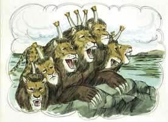

# Apocalipse Cap 13

**1** 	E EU pus-me sobre a areia do mar, e vi subir do mar uma besta que tinha sete cabeças e dez chifres, e sobre os seus chifres dez diademas, e sobre as suas cabeças um nome de blasfêmia.

 

**2** 	E a besta que vi era semelhante ao leopardo, e os seus pés como os de urso, e a sua boca como a de leão; e o dragão deu-lhe o seu poder, e o seu trono, e grande poderio.

**3** 	E vi uma das suas cabeças como ferida de morte, e a sua chaga mortal foi curada; e toda a terra se maravilhou após a besta.

**4** 	E adoraram o dragão que deu à besta o seu poder; e adoraram a besta, dizendo: Quem é semelhante à besta? Quem poderá batalhar contra ela?

**5** 	E foi-lhe dada uma boca, para proferir grandes coisas e blasfêmias; e deu-se-lhe poder para agir por quarenta e dois meses.

**6** 	E abriu a sua boca em blasfêmias contra Deus, para blasfemar do seu nome, e do seu tabernáculo, e dos que habitam no céu.

**7** 	E foi-lhe permitido fazer guerra aos santos, e vencê-los; e deu-se-lhe poder sobre toda a tribo, e língua, e nação.

**8** 	E adoraram-na todos os que habitam sobre a terra, esses cujos nomes não estão escritos no livro da vida do Cordeiro que foi morto desde a fundação do mundo.

**9** 	Se alguém tem ouvidos, ouça.

**10** 	Se alguém leva em cativeiro, em cativeiro irá; se alguém matar à espada, necessário é que à espada seja morto. Aqui está a paciência e a fé dos santos.

**11** 	E vi subir da terra outra besta, e tinha dois chifres semelhantes aos de um cordeiro; e falava como o dragão.

**12** 	E exerce todo o poder da primeira besta na sua presença, e faz que a terra e os que nela habitam adorem a primeira besta, cuja chaga mortal fora curada.

**13** 	E faz grandes sinais, de maneira que até fogo faz descer do céu à terra, à vista dos homens.

**14** 	E engana os que habitam na terra com sinais que lhe foi permitido que fizesse em presença da besta, dizendo aos que habitam na terra que fizessem uma imagem à besta que recebera a ferida da espada e vivia.

**15** 	E foi-lhe concedido que desse espírito à imagem da besta, para que também a imagem da besta falasse, e fizesse que fossem mortos todos os que não adorassem a imagem da besta.

**16** 	E faz que a todos, pequenos e grandes, ricos e pobres, livres e servos, lhes seja posto um sinal na sua mão direita, ou nas suas testas,

**17** 	Para que ninguém possa comprar ou vender, senão aquele que tiver o sinal, ou o nome da besta, ou o número do seu nome.

**18** 	Aqui há sabedoria. Aquele que tem entendimento, calcule o número da besta; porque é o número de um homem, e o seu número é seiscentos e sessenta e seis.

> **Cmt MHenry** Intro: Os que entendem que a primeira besta significa uma potencia mundial, tomam a segunda também como poder perseguidor e usurpador que age com o disfarce da religião e da caridade para com as almas dos homens. é um domínio espiritual que professa derivar de Cristo e se exerce, primeiramente, em forma suave, porém depois fala como dragão. Sua fala o trai, porque estabelece doutrinas falsas e decretos cruéis que mostram que pertence ao dragão e não ao Cordeiro. Exerceu todo o poder da besta anterior. Persegue o mesmo objetivo: afastar os homens da adoração do Deus verdadeiro e submeter as almas dos homens à vontade e o controle de homens. a segunda besta tem executado suas intenções com métodos que enganam aos homens para que adorem a primeira besta na nova forma ou semelhança feita para isto, com prodígios mentirosos, milagres pretendidos, e por censuras severas. Também, sem permitir o gozo de direitos naturais ou civis por parte dos que não adores a essa besta, que é a imagem da besta pagã. Faz-se algo que dá autorização para comprar e vender, e para lucro e confiança, o que os obriga a usar todo seu interesse, poder e trabalho no fomento do domínio da besta, o qual é significado por receber sua marca. Fazer uma imagem da besta, cuja ferida mortal foi sarada, seria dar forma e poder a sua adoração, ou requerer obediência a suas ordens. Adorar a imagem da besta implica submeter-se às coisas que estampam o caráter da marca e a tornam imagem da besta.\ O número da besta é dado como para mostrar a sabedoria infinita de Deus e exercitar a sabedoria dos homens. O número é número de homem, calculado da forma habitual dos homens, e é 666. Permanece como mistério que ou quem está representado com isto. Este número tem sido aplicado quase em cada disputa religiosa e pode duvidar-se, razoavelmente, se tem sido descoberto já seu significado. Porém, quem tem sabedoria e entendimento, verá que todos os inimigos de Deus estão numerados e marcados para destruição; que o termo de seu poder logo expirará e que todas as nações se submeterão a nosso Rei de justiça e paz.> O apóstolo, estando na praia, viu uma besta selvagem sair do mar; um poder tirânico, idólatra, perseguidor, que surge dos transtornos que tiveram lugar. Era um monstro aterrador! Parece significar o domínio mundano opressor que, por muitas eras, desde os tempos do cativeiro babilônico, tinha sido hostil à igreja. Então, a primeira besta começou a perseguir e oprimir aos justos por amor da justiça, mas eles sofreram mais sob a quarta besta de Daniel (o império romano), que tem afligido os santos com muitas perseguições cruéis.\ A fonte deste poder foi o dragão. Foi estabelecido pelo diabo e apoiado por ele. a ferida da cabeça pode ser a abolição da idolatria pagã; e a sanidade da ferida seria a introdução da idolatria papista, a mesma em substância, somente que com nova roupagem, mas que responde tão efetivamente ao desígnio do diabo. O mundo admirou seu poder, política e êxito. Eles renderam honras e sujeição ao diabo e a seus instrumentos. Exerceu um poder e uma política infernal, exigindo que os homens rendessem às criaturas a honra que somente pertence a Deus. mas o poder e o êxito do diabo são limitados. Cristo tem um remanescente escolhido, redimido por seu sangue, registrado em seu livro, selado por seu Espírito; e, apesar de que o diabo e o anticristo possam vencer o corpo, e tirar a vida natural, não podem vencer a alma, nem prevalecer contra os crentes verdadeiros para que abandonem a seu Salvador e se unam a seus inimigos. A perseverança na fé do evangelho e a verdadeira adoração de Deus, nesta grande hora de prova e tentação, que enganariam a todos exceto ao escolhido, é o caráter dos registrados no livro da vida. Este motivo e ânimo poderosos à constância é o grande objetivo de todo o Livro de Apocalipse.